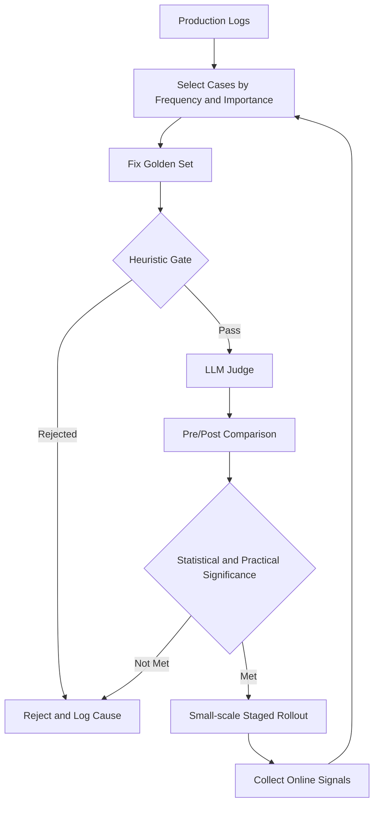

If you've ever been asked "is this model actually any good?", this post is for you. If you're an engineer who has shipped an LLM feature and owns its quality, you need to know why "I tested it and it worked fine" doesn't count as verification, and what should fill that gap instead. This post covers how to answer that question systematically, which is to say, evaluation engineering.

A unit test in ordinary software has a clear pass or fail. An LLM is different. A prompt that worked fine yesterday returns a subtly different answer today, and it's not even clear-cut that the new answer is wrong. So if you leave the "is this okay" judgment to a person's impression, that impression gets trapped inside whichever handful of inputs the evaluator happened to try, with confirmation bias layered on top. See a few successes and you believe the whole thing will work; see a few failures and you believe the whole thing is shaky. Both judgments repeat regardless of sample size.

This post doesn't cover retries or circuit breakers that stabilize the API call itself, or observability that tracks metrics after deployment. It focuses on the step before that: defining what "good" means, and how to prove that definition with data.

## Three Questions Evaluation Has to Answer

Turning evaluation into a system ultimately means setting up a loop. Pick which inputs from production logs are worth keeping as evaluation targets, filter the outputs for those inputs through fast rules and precise judgment, compare against the previous version to check whether it actually improved, and feed that result back as the basis for the next round of case selection. The full picture looks like this.



The most important part of this diagram is the arrow at the bottom. If signals observed online never flow back into case selection, evaluation stays a one-time snapshot. A genuinely trustworthy evaluation system is one where this loop keeps turning without stopping.

Before you can run this loop, there's something you have to decide first: what counts as good. That comes down to three questions. Is the output factually correct? Does that output actually solve the user's problem? And can you trust the result when the same input is repeated? For convenience, I'll call these precision, impact, and stability.

It's a common mistake to measure only precision and leave the other two out. If an answer is factually accurate but not in the shape the user wanted, or if it answers with a different nuance every time, the system loses trust regardless of its precision score. Even if a chatbot quotes product specs without a single error, if the response comes back in a different tone every time, users feel like they can't predict the answer. That's why the three layers need to be tracked side by side.

There's one more trap worth naming here. The impression itself, that an evaluator feels "this answer is good", is biased. A person only judges the handful of inputs they happened to test, and those inputs don't represent the full distribution to begin with. On top of that, scoring the same text twice often produces different scores. So evaluation has to be built not on an individual person's judgment, but on a structured procedure built around that judgment.

## How to Build a Golden Set Without Bias

To answer those three questions, you first have to decide what to test. This fixed set of test cases is called a golden set. The problem is that if you build a golden set carelessly, it becomes a source of bias in itself.

The most common mistake is filling a golden set with cases the developer imagined. Guessing "this is the kind of question that will come in" often doesn't match real traffic. A subtler mistake is adaptive bias. When a model fails on a certain type of input, you add more test cases of that type, and when the score on that type goes up in the next evaluation, you conclude the model got better. In reality, it's more likely the model just overfit to that one type.

A practical way to avoid this is to split real traffic along two axes: frequency and importance.

|  | Frequent | Rare |
|---|---|---|
| **High Impact** | Top-priority evaluation target | Must be included regardless |
| **Low Impact** | Light spot-check only | Lowest priority |

Inputs that are both frequent and high impact should be the central axis of evaluation. Inputs that are rare but high impact, cases like refunds or contract cancellations where one wrong answer causes real damage, must go into the golden set regardless of how often they occur. Building this matrix requires first classifying past production logs into categories and estimating how much each category actually influenced the user's next action.

A golden set isn't something you build once and finish. Every time a new failure case turns up in production, it needs to go into the regression test suite, or the same failure quietly repeats in the next deployment. That said, it's better to avoid a policy where a regression test only counts as passed when every single metric passes at once. Demanding both faster response times and better content quality in the same deployment piles unnecessary pressure on the team. It's more realistic to separate metrics into must-hold ones and nice-to-improve-gradually ones and manage them differently.

Once you've selected cases by frequency and importance, it also helps to assign each case a priority score.

```python
def golden_set_priority(frequency, impact_score, is_recent_failure):
    # frequency and impact_score are normalized to a 0-1 range
    base = frequency * 0.4 + impact_score * 0.6
    if is_recent_failure:
        base += 0.3  # weight recent failure cases so they're included first
    return min(base, 1.0)
```

Filling the golden set from the highest score down means that even under a limited budget, you secure coverage of the most important cases first.

## How to Use an LLM Judge, and How Not to Trust It

Once the golden set is ready, what's left is deciding what scores the outputs. Two tools get mixed here: a rule-based heuristic gate and an LLM judge.

Heuristics are fast and reproducible. Whether the response length falls outside a given range, whether banned words appear, whether a required field is missing, all of that can be judged with plain string checks. But these rules can only cover a slice of the full evaluation. Items that are hard to express as rules, like whether an answer sounds natural or whether tone stays consistent across multiple turns, get judged by an LLM.

The problem is that an LLM judge shares similar weaknesses with a human evaluator. Judging the same output twice can produce different scores, and simply knowing which model produced the output can shift the score on its own. So it's safer to default to a blind evaluation, one where the judge is never told which model generated the output.

There's also a cost problem. Sending every output to an LLM judge inflates both evaluation time and cost together. That's why a two-stage structure is common in practice: filter out most cases with heuristics first, and only pass the cases that survive on to the LLM judge.

```python
def evaluate_output(output, context):
    verdict = heuristic_gate(output)  # length, banned words, required fields
    if verdict.rejected:
        return verdict

    # only pass surviving cases to the judge, to cut call cost
    judge_result = llm_judge(
        output=output,
        context=context,
        criteria="Did the response actually resolve the user's question?",
        reveal_model_identity=False,  # blind evaluation
    )
    return judge_result
```

Asking for relative comparison instead of an absolute score is another way to raise a judge's consistency. Asking "which of these two answers is better" instead of "how many out of five is this answer" reduces the error that comes from different judges using different scales. The same principle applies when using human evaluators too. But since human evaluation is the most expensive option, it's more budget-efficient to bring in people only for cases where the judge's confidence is low, meaning cases where the score gap between two candidates is nearly zero. Having a person re-review a case the judge is already confident about carries almost no informational value.

## Separate Offline Signals From Online Signals

Evaluation built from a golden set and a judge runs offline. It executes before deployment, and it's fine if the results take time to come back. The problem is that no matter how tightly built an offline evaluation is, it can never fully mimic the diversity of real traffic. That's why signals also need to be collected online separately, and here two distinct methods get used.

Shadow mode runs the new version side by side with the existing one, sending the same input through both, but the new version's output is never shown to users, only logged. This lets you see how the new version behaves under real traffic without touching the user experience at all.

An A/B test exposes the new version directly to a slice of real users. It produces results closer to reality than shadow mode, but since the new version actually affects the user experience, the risk grows along with it. In practice, I'd recommend confirming stability with shadow mode first and only moving to an A/B test afterward.

The reason to view these two signals separately from the offline golden set is clear. A golden set is a tool for repeatedly verifying failure patterns we already know about, while online signals are a tool for discovering failure patterns we don't yet know about. New failure cases discovered online have to feed directly into the next golden set update cycle, that's what actually makes the arrow at the bottom of the earlier diagram work.

## The Procedure for Proving an Improvement

Even if a new version passes both the golden set and the online signals, the claim that it "improved" only becomes trustworthy once you have a procedure behind it. That procedure is a pre/post comparison.

First, metrics need to be locked down before deployment. "Got more accurate" is a statement you can't judge; "factual accuracy went from 85 to 89" is one you can. Second, the pre and post tests must be run on the exact same golden set. If the inputs differ, you can't tell whether the difference came from the model or from the input. Third, the measurement environment, things like temperature, seed, and hardware, needs to match too, or you risk mistaking a variance caused by environment for an actual improvement.

When reading results, distinguish between two kinds of significance. Statistical significance means the probability this difference happened by chance is low. Practical significance means the difference is large enough to actually affect user experience or business outcomes. If click-through rate rose from 2.10 percent to 2.15 percent, that could be statistically significant, but whether that 0.05 percentage point is enough to move an annual target is a separate question. It's safer to set a team rule in advance that a deployment decision requires both kinds of significance to be met.

```python
def is_real_improvement(pre_scores, post_scores, min_effect_size):
    diff = mean(post_scores) - mean(pre_scores)
    ci_low, ci_high = bootstrap_ci(post_scores, pre_scores)
    statistically_significant = ci_low > 0  # the confidence interval doesn't cross zero
    practically_significant = diff >= min_effect_size
    return statistically_significant and practically_significant
```

Last, and easy to miss, is unintended regression. If you only check the target metric and skip the rest, you can miss a tradeoff like boosting fluency while quietly eating into factual accuracy. So set a pre-deployment baseline not just for the target metric but for the whole set of related metrics, and re-measure that whole set after deployment too. And rather than rolling out to all traffic the moment an improvement is confirmed, it's safer to widen the rollout in stages, say 1 percent, 10 percent, 50 percent, moving to the next stage only after each one clears a predefined bar. This staged rollout is the last link in the loop shown earlier, and the gate where a hypothesis built offline finally gets confirmed against real traffic.

## From ThakiCloud's Perspective

We serve a K8s-based AI platform inside customer on-premise environments. In this setting, we've confirmed repeatedly that bolting evaluation on after the fact doesn't work well.

The biggest friction point is golden set ownership. Traffic distribution and high-risk cases differ from customer to customer, so a single shared golden set can't verify every deployment. That's why we're moving toward standardizing, at the platform level, a procedure that re-estimates frequency and importance from each environment's own production logs and keeps a golden set dedicated to that environment as the result.

Shadow mode is the same story. On-premise, we often have to verify a new version without ever sending real traffic outside the perimeter, so a structure that runs the existing and new versions side by side within the same cluster and compares only the results is the realistic answer.

Turning LLM evaluation into a system, in the end, comes down to repeating three things: define what to measure in advance, pick the cases that back up that definition without bias, and prove improvement through a procedure. Instead of judging by gut feeling, the team that keeps this loop turning ends up building trust faster.

This post is a blog rewrite of part of our internal ebook, *LLM Evaluation Engineering*, compiled while operating our internal automation pipelines.
