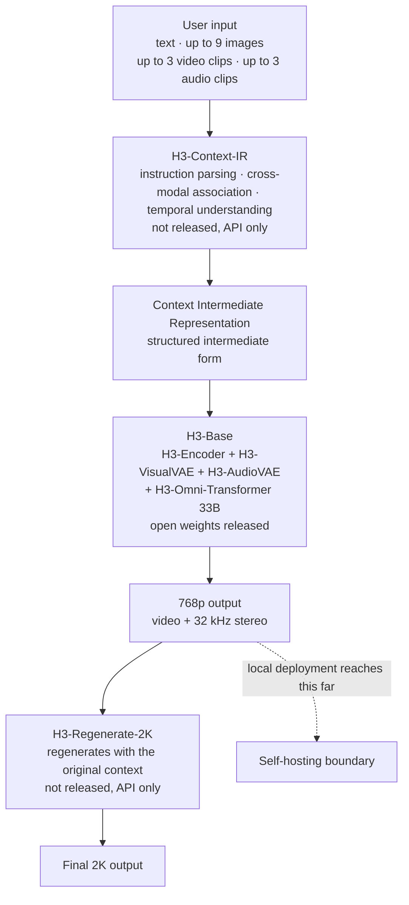

When an open-weight model ships, the first sentence going around is usually some version of this: now anyone can run it on their own servers. MiniMax H3, released on 31 July 2026, got the same sentence. It understands text, images, video, and audio in one context, and generates video up to 2K resolution for as long as 15 seconds with native stereo audio. But between the fact that weights are public and the fact that it runs on your cluster lies a distance you only learn by opening the file listing and doing the arithmetic.


*Producing picture and sound from one sequence rather than making them separately and stitching them is where H3's design starts.*

## Why This Matters

This is for people running an in-house GPU cluster who must decide whether to self-host a video generation model or call an API. The conclusion first: H3-Base is a 33B-parameter single-stream transformer, so on paper it resembles LLM serving, but the real bottleneck is not the weights, it is sequence length. A single 15-second 2K clip produces a sequence of over 325,000 tokens, and the initial release ships without the sparse attention implementation that would make it affordable.

## Overview

MiniMax H3 is a general-purpose omni-modal generative system. It jointly understands multimodal context made of text, images, video, and audio, and generates video with stereo audio from it. Output specifications are 4 to 15 seconds, 24 FPS, 32 kHz stereo audio, with a default short side of 768 pixels. It supports aspect ratios from 21:9 through 9:16, and dialogue in 11 languages with stable support, including Arabic and Korean.

What separates it from earlier video generators is that there is no seam where the modalities were sewn together. Text, vision, and audio tokens do not sit in separate silos and merge at the end; they share one transformer stream. In the model card's phrasing, neither the attention layers nor the FFN layers contain modality-specific structures, and modality-specific parameters live only in the input and output layers and the AdaLN branches.

The license is the MiniMax H3 Community License. It is not a standard open-source license like Apache or MIT but a bespoke community license, so read the clauses first if you are considering commercial distribution.

## What the System Is

H3 is not one model but a system of three modules. This distinction is the first thing to know when planning self-hosting, because only the middle one is open source.



H3-Context-IR is a hosted preprocessing and orchestration system for free-form multimodal input. Because it relies on a multi-stage workflow and multiple hosted models and services, it was not part of this release. MiniMax provides an API that reproduces the official workflow, plus prompting guidance for building your own preprocessing system. But as the model card states explicitly, H3-Context-IR is critical to final output quality, so running H3-Base without it will not match the official demos.

H3-Regenerate-2K is also unreleased. The interesting part is that it is not a separate super-resolution module. It feeds the 768p result back into H3 along with the original multimodal context and regenerates at 2K. The advantage is that small text and fine detail, which conventional super-resolution has to guess at, can be recovered from the original context.

The middle piece, H3-Base, is what was released. Text is encoded by the H3-Encoder, which uses the full pretrained weights of Qwen3-VL-32B and passes hidden states from its 50th layer to the transformer. Visual inputs go through both the H3-Encoder and the H3-VisualVAE; audio goes through the H3-AudioVAE alone. The H3-Omni-Transformer then jointly predicts video and audio latents.

The VAE specifications matter for the arithmetic later. H3-VisualVAE is a temporally causal video autoencoder with 16x spatial compression, 4x temporal compression, and 24 latent channels. Patchification of 1x2x2 along time, height, and width is applied on top, so visual tokens entering the transformer have an effective spatial downsampling factor of 32x. The temporal factor stays at 4x. H3-AudioVAE uses the same encoder and decoder for the left and right channels while processing each independently, compressing 32 kHz audio into latent tokens at 40 Hz per channel.

## Installation and Integration

Total weight first. We pulled the file manifest from the HuggingFace API and summed only the safetensors.

```bash
curl -s "https://huggingface.co/api/models/MiniMaxAI/MiniMax-H3?blobs=true" \
  | jq '[.siblings[] | select(.rfilename|endswith(".safetensors"))
         | {f:.rfilename, b:(.lfs.size // .size)}]'
```

The calculation script lives in the ThakiCloud repository. It sums bytes per module and derives sequence lengths in the same run.

```bash
.venv/bin/python scripts/experiments/minimax_h3_serving_budget.py
```

The minimal Diffusers path is in the model card.

```bash
pip install -U diffusers transformers accelerate
```

```python
import torch
from diffusers import DiffusionPipeline

pipe = DiffusionPipeline.from_pretrained(
    "MiniMaxAI/MiniMax-H3", dtype=torch.bfloat16, device_map="cuda"
)
```

To be straightforward about it: we did not load H3-Base and run inference for this piece. We computed the resources it requires below, but we did not attach a node of that size to this task. So there are no numbers here on generation quality or measured latency. What there is comes entirely from published file sizes and published compression factors, derived deterministically.

## Measured Results

The safetensors across the whole repository total 464 GiB. Do not read that as the required capacity, though, because the same weights are laid out under FL2VA, Ref2VA, and the repository root. Deploying one variant actually requires this much.

| Module | bf16 weights | Parameters (derived) |
|---|---|---|
| H3-Omni-Transformer (H3-Base) | 61.73 GiB | 33.14B |
| H3-Encoder (Qwen3-VL-32B) | 62.13 GiB | 33.36B |
| H3-VisualVAE | 9.70 GiB | 5.21B |
| H3-AudioVAE | 0.56 GiB | 0.30B |
| **Single variant total** | **134.12 GiB** | 71.9B |

The 33.14B derived from bytes matches the 33B the model card states, which confirms the calculation path.

One sentence in the model card becomes important here. Of the transformer's 33B, roughly 13B sits in AdaLN-related branches, and because AdaLN modulation outputs can be precomputed and cached, those parameters do not need to be loaded for inference-only deployment. The full weights were released to support downstream development including fine-tuning. So if you only plan to run inference, the transformer side drops to about 20B, or 37.5 GiB in bf16.


*Left is per-module weights summed from the file manifest; right is sequence length derived from the VAE compression factors.*

But the real problem is not the weights. It is the sequence. Applying the compression factors above:

| Clip configuration | Latent frames | Video tokens | Audio tokens | Total |
|---|---|---|---|---|
| 768p 16:9, 4s | 24 | 24,768 | 320 | 25,088 |
| 768p 16:9, 15s | 90 | 92,880 | 1,200 | 94,080 |
| 2K 16:9, 15s | 90 | 324,000 | 1,200 | 325,200 |

Here is how to read it. A 15-second clip is 360 source frames, which 4x temporal compression turns into 90 latent frames. Taking 768p 16:9 as 1376 by 768, the effective 32x spatial compression gives 43 by 24, or 1,032 tokens per latent frame. Multiplied by 90 latent frames that is 92,880, plus 1,200 audio tokens. Going to 2K pushes tokens per latent frame to 3,600, for a total of 325,200.

Token count grew 3.5x, but full attention cost grows quadratically, roughly 12x. And here the model card states something important. Native sparse attention was introduced in the final stage of training to cut the cost of long sequences, but **the initial open-source release provides inference with full attention only**, with the sparse-attention implementation to be published separately later.

That is the single most important sentence for a self-hosting plan. The gap between what the official API produces and what you can produce locally with the weights you just downloaded is not only a quality gap but a compute-cost gap. Processing a 94,000-token sequence with full attention is a completely different budget from having the sparse implementation.

## What This Means for ThakiCloud Products

ThakiCloud's ai-platform schedules GPU workloads on K8s and Kueue and runs multi-tenant vLLM-based serving. A model like H3 makes several concrete demands of that structure.

First, the deployment unit changes. At 134 GiB, a single variant nearly fills one H200's 141 GB with weights alone. Once you account for activations and attention workspace for a 94,000-token sequence, one card is not enough, and even dropping AdaLN for inference-only leaves little headroom. A realistic configuration is two or more H200s, and serving both the FL2VA and Ref2VA variants costs proportionally more. Expressed as a Kueue workload, this model is hard to place in the same queue as LLM serving pods. Per-request occupancy is long and the memory profile differs, so a separate resource flavor is the better split.

Second, queue design changes. LLM serving streams token by token, so requests pass through in short bursts, whereas video generation holds a GPU for a long stretch on a single request. On top of that, the 2K workflow adds a regeneration pass after the 768p generation. Since user-visible response time is the sum of both stages, the queueing policy should be designed around completion time rather than throughput.

Third, it fits on-premise demand well. Video generation material is often sensitive by nature. Raw footage, product imagery, and video containing in-house individuals are assets that are hard to send to an external API. Being able to run an open-weight model inside the customer's boundary satisfies that requirement on its own. That said, with H3-Context-IR and H3-Regenerate-2K unreleased, a fully on-premise configuration is not currently possible. You must build your own preprocessing system following the prompting guidance, and 2K either goes through the API or you settle for 768p. Explaining that gap accurately to customers is the most honest thing to do at this stage.

There is one thing to add from the Paxis lens. What H3-Context-IR does, namely parsing free-form multimodal input, interpreting cross-modal relationships, and serializing them into a structured intermediate representation, is really an agent orchestration problem. Its being unreleased means, conversely, that the slot is open for you to fill. Using Paxis's DAG multi-agent composition and policy gates, you can make the input refinement pipeline auditable and trace which prompt enrichment led to which output. For an organization that must answer for generated results, that traceability is a prerequisite ahead of image quality.

## Limits and Counterarguments

The numbers here have clear boundaries. We did not load the model and produce video, so generation quality, real latency, and real peak memory are absent. Weight sizes come exactly from the file manifest, but activations and attention workspace vary greatly with implementation. The 134 GiB above is therefore a floor on required VRAM, not the actual requirement.

The sequence length calculation also rests on an assumption. We took 768p 16:9 as 1376 by 768 pixels, but the model card states only that the short side is 768, so the long side may differ slightly by implementation. The effective 32x spatial and 4x temporal compression are published values, however, so the order of magnitude does not move.

The license deserves a note as well. The MiniMax H3 Community License is not a standard open-source license and includes use restrictions. The model card states that user-submitted text, images, and videos, as well as enhanced prompts, are subject to automated moderation, and content suspected of being unlawful, pornographic, or infringing third-party rights may be blocked. It also states explicitly that these guardrails do not replace the licensee's obligations. If you are planning a commercial service, legal review comes before technical review.

Finally, self-hosting does not always win. Without sparse attention, the cost of producing a 15-second 2K clip locally may not compare favorably to API pricing. If generation is infrequent and the material is not sensitive, the API is the reasonable choice. The case for self-hosting is usually about the data boundary, not unit price.

## Conclusion

MiniMax H3 is an omni-modal model that produces picture and sound in one stream, and its core, H3-Base at 33B, has been released with open weights. Three numbers matter when you evaluate self-hosting: 134 GiB of weights for a single variant, 94,000 tokens for a 15-second 768p clip, and 325,000 tokens when you go to 2K. One condition attaches to all of them: the initial release has no sparse attention, so those sequences must be processed with full attention.

If you take one action, take this one. Rather than deciding whether to adopt H3 now, first confirm whether the material you need video generation for genuinely cannot leave your boundary. If it cannot, a local H3-Base 768p deployment with your own preprocessing pipeline is something you can start today. If it can, you are better off waiting for the sparse attention implementation and the other two modules, then running the numbers again. When that time comes, just rerun the script from this post.

## Sources

- Model card: [MiniMaxAI/MiniMax-H3 on HuggingFace](https://huggingface.co/MiniMaxAI/MiniMax-H3)
- Official announcement: [MiniMax H3: An Open Model Breaking the Boundaries Between Tasks and Modalities](https://www.minimax.io/blog/minimax-h3)
- File manifest API: `https://huggingface.co/api/models/MiniMaxAI/MiniMax-H3?blobs=true`
- Calculation script for this post: `scripts/experiments/minimax_h3_serving_budget.py` (ThakiCloud internal repository)
