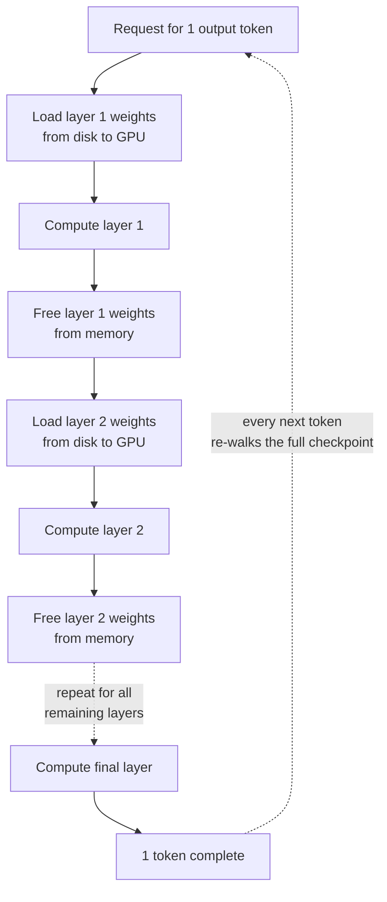

When a sentence like this crosses your timeline, you click. Someone ran Kimi K3, all 2.8 trillion parameters of it, on a 4GB GPU, for free. It was true. AirLLM added support for the largest open-weight model in existence, and the published measurement log shows 3.72GB of VRAM. The same log also shows that producing a single token takes about 292 seconds. You have to read both numbers together to understand what this technique actually is.


*Instead of pushing everything through at once, layer offloading feeds one slab at a time through a narrow door.*

## Why This Matters to You

This is written for infrastructure engineers who have to decide whether to self-host a large open-weight model, buy API access, or expand the cluster. The conclusion first: layer-wise offloading converts a GPU memory constraint into a disk bandwidth constraint. It does not remove the constraint. That makes it genuinely useful for evaluation and useless for serving, and if you blend those two cases in a capacity plan your budget will be wrong by an order of magnitude.

## Overview

Moonshot AI released the Kimi K3 weights in July 2026. It is a 2.8-trillion-parameter sparse mixture-of-experts model that activates 16 of 896 experts per token. It introduces two architectural pieces, Kimi Delta Attention and Attention Residuals, supports a one-million-token context window, and handles vision natively. At release it was the largest open-weight model available.

The problem is scale. The full checkpoint is 1.56TB. The official serving path, vLLM, calls for a minimum of 16 B200 or GB200 GPUs on that hardware generation, with an eight-GPU tensor-parallel node as the realistic floor. This is not something an individual or a small team gets to touch.

AirLLM does not break through that wall. It walks around it. Because a transformer passes through its layers sequentially, AirLLM keeps exactly one layer on the GPU at a time. Once that layer finishes computing, it is unloaded and the next one is loaded. The whole model never needs to be resident, so VRAM demand is set by the size of the largest single layer rather than by the size of the model. The same approach has already run a 405B Llama and DeepSeek-V3 at 671B, and it brought a 70B model's 140GB requirement down under 4GB. The license is MIT.

Kimi K3 support was added after a user opened an issue asking for it. The result is the 3.72GB VRAM figure measured on a single RTX 6000 Ada.

## What the Technique Actually Is

The logic behind layer-wise inference is simple. Transformer layers do not run in parallel; each one consumes the output of the one before it. Which means that at the moment you are computing layer 40, there is no reason for layer 1's weights to still be in memory.



*Loading and unloading one layer at a time pins VRAM to the largest single layer. The cost is re-reading the disk for every token.*

What matters here is that the approach uses no quantization, no distillation, and no pruning. It does not shrink the model. It keeps the original weights and only changes the loading order, so output quality is identical to the original. Given that every compression-based approach shaves quality somewhere, that is a real advantage.

The disk preparation step shows some practical thought too. Splitting the checkpoint into per-layer files would normally mean copying 1.56TB a second time. AirLLM detects when hardlinking is possible and hardlinks instead of copying. The split layer files point at the original bytes, so disk usage stays at 1.56TB and a preparation step that would have taken hours finishes in seconds.

This is not the first time the approach has been stretched. AirLLM has already run 405B Llama and 671B DeepSeek-V3 the same way, and K3 simply pushes that trajectory one size class further. It is also natural that the technique becomes relatively more attractive as models grow. The GPU count needed for official serving climbs steeply with model size, while the VRAM needed for layer offloading is pinned to a single layer and barely moves. The higher the barrier, the more valuable the detour.

For scale reference: 2.8 trillion parameters is roughly 2.8 times its predecessor K2.6, against DeepSeek V4 Pro at 1.6 trillion and Zhipu AI's GLM 5 series at 744 billion in the same period. A new weight class opened up in the open-weight world, and the serving infrastructure requirement moved up with it.

The price is explicit. Every single token requires reading every layer again from the beginning. The second token cannot reuse what the first token loaded, because it was already freed. The bottleneck moves from compute to disk I/O.

## Installation and Integration

The package itself is an ordinary Python library.

```bash
pip install airllm
```

The basic usage pattern is to load a HuggingFace model as you normally would and let the library handle layer splitting and sequential loading internally.

```python
from airllm import AutoModel

model = AutoModel.from_pretrained("<repository or local path>")
```

That said, the K3 path was added recently, so the model loading arguments and layer-splitting options are safest taken from the repository documentation. Check the README in `lyogavin/airllm` for the exact snippet. Pinning one here would drift out of date with the next release.

Actually running K3 depends less on the library than on the storage side. You need room for a 1.56TB checkpoint and enough bandwidth to stream it sequentially for every token. Put it on network storage and the latency multiplies straight through. Local NVMe is effectively a prerequisite.

## Measured Results

We did not download the 1.56TB checkpoint and reproduce this ourselves. Neither the storage nor the time was realistic, so every number below is cited from published measurements. These are not our own measurements, and we are saying so explicitly.

The measurement was taken end to end on a single RTX 6000 Ada 48GB against the full 1.56TB checkpoint, generating real tokens.

| Metric | Measured value |
|---|---|
| Peak VRAM usage | 3.72GB |
| Time per generated token | ~292 seconds (~5 minutes) |
| Time for a 500-token answer | ~42 hours |
| Checkpoint size | 1.56TB |
| Measurement hardware | 1x RTX 6000 Ada 48GB |

Working a few of these out yourself sharpens the picture. 292 seconds per token is about 0.205 tokens per second, or roughly twelve tokens an hour. At 500 tokens that comes to about 40.6 hours, which lines up closely with the cited 42.

The bandwidth arithmetic is more interesting. If each token walks 1.56TB, then over 292 seconds you are reading roughly 5.3GB per second. That is almost exactly the sequential read bandwidth of a high-end NVMe SSD. In other words, this configuration has the GPU idling while the SSD works flat out. It matches the measurer's own summary: the bottleneck is not compute but disk, and no amount of clever memory management changes how fast an SSD reads.

Placing a comparison next to it makes the gap plain. vLLM announced day-0 support for K3 with hybrid KDA prefix caching, DSpark speculative decoding, and production-scale disaggregation, and reported that throughput above 100 tokens per second is achievable on B200-class hardware.

| Path | GPU requirement | Throughput | Purpose |
|---|---|---|---|
| AirLLM layer offloading | 1x 4GB-class | ~0.2 tokens/s | Feasibility evaluation |
| vLLM official serving | 16x B200-class (8-GPU node floor) | 100+ tokens/s | Production serving |

The throughput gap is roughly 500x. The hardware cost gap is far larger, and it runs the other way. That table is the point of this article.

One more detail worth noting from the vLLM side is the parallelism tradeoff. Tensor parallelism is good for interactivity but caps overall throughput because effective KV cache size is limited, while large-scale expert parallelism runs into network bandwidth limits that reduce per-user output speed. At 2.8 trillion parameters, how you split the model matters as much as how many GPUs you attach. That question does not even exist in a single-card configuration, which is itself evidence that the two paths are solving different problems.

The economics close the argument. Moonshot priced the K3 API at three dollars per million input tokens and fifteen per million output tokens, the highest among Chinese labs but roughly half the per-task cost of Claude Opus 4.8. If you are evaluating self-hosting, that price is your break-even baseline. Divide the depreciation, power, and staffing of a 16-GPU B200 node by that rate and work out what monthly token volume makes self-hosting cheaper. Skipping that calculation and jumping from the weights are open to we self-host usually ends in regret.

## What This Means for ThakiCloud

ThakiCloud's ai-platform is multi-tenant infrastructure that queues GPU resources with Kueue on Kubernetes and serves models through vLLM. When a customer wants to run a large model in an on-premises or sovereign environment, the first question they hit is exactly this article's subject. Will this model run on our GPUs?

There are two answers, and the honest thing is to keep them separate.

First, at the feasibility evaluation stage, layer offloading is a practical tool. When a new open-weight model lands, you can verify tokenizer behavior, prompt format, output quality, and license fit on a single card without tying up the cluster. That stage needs accuracy, not throughput, and the fact that no compression is applied means the quality you see is the real quality. It beats occupying sixteen cards for days only to conclude that the model does not fit your use case.

Second, at the capacity planning stage, these numbers must not be cited. That it ran in 4GB is not evidence that serving nodes can be smaller. Real serving still demands eight to sixteen GPUs and the interconnect to match. Blur that line and the budget is off by a double-digit multiple. As the 4GB headlines land in more customer meetings, separating feasibility from serviceability becomes part of the infrastructure team's day job.

Third, the observation that the bottleneck moves to disk feeds directly into platform design. In a cluster handling large MoE models, the storage tier and model cache placement matter as much as GPU count. Where the checkpoint lives and how it is pre-staged onto nodes directly determines cold start time. With 1.56TB models becoming normal, that turns into routine operational work.

## Limits and Counterarguments

Fairness requires addressing the opposite misreading too.

The 42-hour figure assumes interactive use. For batch work, say an offline evaluation on a small set of hard problems that can run overnight, this throughput is still meaningful. Queue it in the evening, read the results in the morning: that workflow is real.

It also matters that the measurement hardware was an RTX 6000 Ada 48GB. The claim is that only 3.72GB of VRAM was used, not that the run happened on a 4GB card. Plug this into an actual 4GB-class card and different PCIe bandwidth and system memory characteristics mean the same numbers are not guaranteed. The 4GB in the headline points at a VRAM ceiling, not at a verified end-to-end environment.

An open question remains around the MoE structure. K3 activates only 16 of 896 experts per token, so in principle there is room to read only the active experts. The cited measurement shows timing consistent with traversing essentially the whole checkpoint, and how far routing-aware selective loading has been implemented would require reading the repository code directly. We did not verify that, so we will not assert it. If more selective expert loading is present or added, there is headroom for throughput to improve.

Finally, do not misread what this technique is aiming at. AirLLM is not a vLLM competitor. vLLM is a serving engine optimizing throughput and concurrency; AirLLM is an accessibility tool that trades memory constraints for time. Put them on the same axis and you will misjudge both.

## Wrapping Up

The sentence 2.8 trillion parameters run on a 4GB GPU is true. But the question it answers is not can we serve this model, it is can we get our hands on this model. The two answers sit about 500x apart in throughput, and that distance is produced by a physical law called disk bandwidth.

The practical guidance for an infrastructure owner fits in one line: adopt layer offloading as a zero-budget evaluation tool during the review stage, and use only vLLM-based numbers for capacity planning. Check every new large model on a single card first, and attach the cluster only to the ones that pass. That order is the cheapest. And the next time a 4GB headline crosses your timeline, check the per-token time in the same log.

## Sources

- [Unbelievable! Run Kimi K3, 2.8 Trillion Parameters, on a Single 4GB GPU (Gavin Li, AI Advances)](https://ai.gopubby.com/unbelievable-run-kimi-k3-2-8-trillion-parameters-on-a-single-4gb-gpu-23590e7a16c2)
- [Kimi K3 Really Does Run on a 4GB GPU. A 500-Token Answer Takes 42 Hours. (CodeToDeploy)](https://medium.com/codetodeploy/kimi-k3-really-does-run-on-a-4gb-gpu-a-500-token-answer-takes-42-hours-ace78fcc665d)
- [lyogavin/airllm (GitHub, MIT)](https://github.com/lyogavin/airllm)
- [Kimi K3 Is Here: Efficient Day-0 Support on vLLM (vLLM Blog)](https://vllm.ai/blog/2026-07-27-k3)
- [China's Moonshot AI releases Kimi K3, the largest open-source model ever (VentureBeat)](https://venturebeat.com/technology/chinas-moonshot-ai-releases-kimi-k3-the-largest-open-source-model-ever-rivaling-top-us-systems)
- [Original tweet](https://x.com/hjguyhan/status/2084763811740111283)
