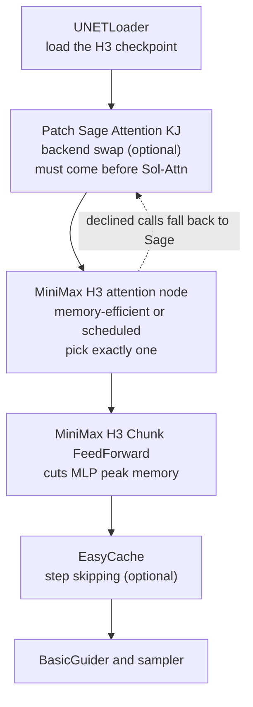

If you use video generation models, you have seen this shape of tip in the community. Add a few nodes and generation time drops. The same tip is circulating for MiniMax-H3: add EasyCache, Patch Sol-Attn, and Patch Sage Attention KJ to your workflow. The tip is correct. What a one-line tip cannot carry is how the three nodes relate to each other and how much faster they actually make things. So we opened the source code of each node and the published benchmarks and checked.


*The measured range is shorter than you think, and the real work happens outside it.*

## Why read this

This is for people running MiniMax-H3 in ComfyUI who want shorter generation times, and for people deciding whether to put a video generation workload on their own GPUs. The conclusion first: the real gain from this acceleration stack is not the 1.44x the kernel benchmark shows but 1.11x at the pipeline level, and even that is measured at a sequence length shorter than what you actually render. Wiring the nodes takes five minutes, but if you get the order wrong, nothing happens at all.

## Overview

MiniMax-H3 is an omni-modal video generation model MiniMax released in early August 2026. It handles text, images, video and audio in one context and generates video with stereo audio attached. In an earlier post we calculated the weight capacity and sequence length needed to host it on our own infrastructure. That post concluded the bottleneck is not the weights but the sequence length.

This post looks at the tools that actually attack that bottleneck. The combination the community settled on has three branches: replacing the attention computation with a faster kernel, reducing how much attention has to look at, and skipping sampling steps entirely. EasyCache is the third, Sol-Attn is the first and second, Sage Attention is the first. They are not competitors. They operate at different layers, so they compose. There are rules for composing them, and those rules are missing from the tip.

Two kinds of numbers appear here. Some are measurements published by the upstream repository, and some are values we derived from public specifications. We label which is which every time. There are no measurements of our own from running H3 on our GPUs.

## What this technology is

First, where the three nodes sit in the pipeline.



The bottom layer is the attention kernel. SageAttention swaps the attention computation for a quantized kernel. In ComfyUI, KJNodes' Patch Sage Attention node does this, and all it does is set sage as the backend.

Sol-Attn goes one step deeper. It builds on NVIDIA's Sol-Attn Triton reference kernel, but the repository modified it to run on consumer Blackwell (SM120, RTX 50 series), which NVIDIA's public dispatcher does not enable. The kernel source is vendored under Apache 2.0 and the repository states explicitly that the SM120 enablement is its own change, not NVIDIA's. Support spans SM89 through SM120. SM90, SM100 and SM120 take the TMA descriptor kernel path, while SM89 (RTX 40 series) runs pointer kernel twins. Only SM120 has been validated on actual hardware, and the repository says the SM89 path was verified by forced dispatch rather than on an SM89 GPU.

What separates Sol-Attn from a plain kernel swap is sparsity. A parameter called `tau` sets how many standard deviations above the mean block score get routed to the approximate path. Higher values send more KV blocks down the approximate path and run faster. On top of that there is a schedule that ramps tau as sampling progresses, so you can compute sparsely early and densely late. The H3-specific node feeds the kernel strided views of the fused qkv projection, eliminating q, k and v copies, and keeps an exact KV sink for the conditioning rows H3 packs in.

The top layer is caching. EasyCache is a node in the ComfyUI core, under the `advanced/debug` category. Its mechanism is clear from the source. It subsamples the previous step's input, accumulates the rate of change against the current input, and when that cumulative change rate falls below `reuse_threshold`, it skips the model evaluation entirely and reuses the cached output difference. The defaults are `reuse_threshold` 0.2, `start_percent` 0.15, `end_percent` 0.95, with a subsample factor of 8. In other words, the cache does not intervene during the first 15 percent or the last 5 percent of sampling.

The same file contains a sibling node called LazyCache. Its own docstring describes it as a homebrew version of EasyCache that works worse overall but is better in rare cases and is universally compatible with everything in ComfyUI. If EasyCache will not attach to a particular model, this is worth trying.

## Installation and integration

The Sol-Attn node installs by cloning into the custom nodes directory.

```bash
cd ComfyUI/custom_nodes
git clone https://github.com/Saganaki22/ComfyUI-sol-attn
```

The requirements are an NVIDIA GPU of SM89 or later, plus Triton. matplotlib is needed only for the tau schedule preview image and is optional. To use the H3-specific nodes you need an H3 checkpoint in `ComfyUI/models/diffusion_models/`. These are the H3 checkpoints the official ComfyUI tutorial distributes.

```text
minimax_h3_fl2va_pruned_int8_convrot.safetensors   # text-driven generation, INT8 ConvRot
minimax_h3_ref2va_pruned_int8_convrot.safetensors  # reference-driven generation, INT8 ConvRot
minimax_h3_nvfp4_awq.safetensors                   # NVFP4 AWQ variant
minimax_h3_video_vae_fp16.safetensors
minimax_h3_audio_vae_fp32.safetensors
```

So far this is an ordinary install. What actually matters is the wiring order, and that does not fit in a tweet. The repository documents three rules.

First, the two H3 attention nodes are alternatives, not companions. The scheduled node is a superset of the memory-efficient one, and setting `tau_start` equal to `tau_end` makes them identical. Do not wire both.

Second, Sage goes in front, not behind. KJNodes' Patch Sage Attention only swaps the backend, so any call the Sol-Attn node declines (early dense steps, short sequences, ineligible shapes) runs through the stock forward and reaches sage. Placed after Sol-Attn it does nothing.

Third, when using the zero-copy variant, KJNodes' MiniMax H3 Memory Efficient Sage Attention Patch is adopted as the fallback forward if placed before, but shadows the Sol-Attn node entirely if placed after. Order decides whether the node works at all, not just how fast it is.

The FeedForward chunking node operates independently of the attention backend. It splits H3's token-local FFN along the packed sequence dimension while preserving ComfyUI's implementation inside each chunk. The default chunk count is 2 and `min_tokens` is 8192. Below that sequence length it does nothing.

## Measured results

This is the core of the post. We look at the kernel benchmark the repository published, and at what we calculated by placing real render settings on top of it.


*Left is the measured curve the repository published; right is the controlled pair the same repository recorded.*

First the kernel-level measurements. Taken on an RTX 5090 (SM120) with torch 2.10.0 and Triton 3.6.0, at H3's attention shape (batch 1, 56 heads, head dim 128, bf16), median of 20 iterations.

| tokens | PyTorch SDPA | SageAttention | Sol-Attn strided | vs Sage |
|---:|---:|---:|---:|---:|
| 2,048 | 1.45 ms | 0.60 ms | 0.89 ms | 0.67x |
| 8,192 | 23.96 ms | 3.72 ms | 3.25 ms | 1.14x |
| 16,384 | 84.95 ms | 13.94 ms | 10.08 ms | 1.38x |
| 32,768 | 352.15 ms | 55.90 ms | 38.73 ms | 1.44x |
| 65,536 | 1,350.54 ms | 221.06 ms | 153.56 ms | 1.44x |

The 0.67x at 2,048 tokens deserves attention: Sage is faster there. The repository notes that below roughly 4K tokens Sage wins outright, which is why the node's `min_tokens` default is 4,096. It even recommends raising that toward 8,192 if you want only the measured wins.

Now our calculation. The published H3-VisualVAE spec is 16x spatial and 4x temporal compression with 24 latent channels, and 1x2x2 patchification brings the effective spatial compression at the transformer input to 32x. Audio is 40Hz latent tokens per channel, doubled for stereo. Using that spec we computed the packed sequence length for each render setting.

| render setting | packed tokens | benchmark range | FF chunking saving |
|---|---:|---|---:|
| 480x864, 15 s (repository control) | 37,650 | inside 32K-65K | 1.01 GiB |
| 1344x768, 4 s (ComfyUI default) | 24,512 | inside 16K-32K | 0.65 GiB |
| 1344x768, 15 s (ComfyUI default) | 91,920 | beyond measured range | 2.45 GiB |
| 1080p, 15 s | 179,400 | beyond measured range | 4.79 GiB |
| 2K, 15 s (Regenerate-2K) | 325,200 | beyond measured range | 8.68 GiB |

Applying the same formula to a 2K 15-second clip gives 325,200 tokens, which matches the 320 thousand we calculated separately in our earlier post. The formula holds.

Two things to read from that table. First, the moment you render 15 seconds at ComfyUI's default resolution, the sequence becomes 91,920 tokens and passes the benchmark's top point of 65,536. The 1.44x figure has never been measured there. The repository's table ends at 65,536, and the honest answer for anything longer is that nobody knows. Attention cost scales with the square of sequence length, so the gap could widen, or memory bandwidth could become the binding constraint first and shrink the gain. Which one happens has not been measured.

Second, the FF chunking saving grows linearly with sequence length in the opposite direction. The intermediate tensor is 56KB per token, so with two chunks the repository measured savings of roughly 238MiB at 8K tokens and roughly 1.9GiB at 65K. Applying the same coefficient to a 2K 15-second render gives 8.68GiB. Exactly where attention acceleration becomes uncertain, the memory saving becomes more certain. On long renders this node may help more than the attention node does.

That leaves the number in this post's title. The same repository recorded one controlled pair: MiniMax H3, 15 seconds, 480x864, 20 steps, `res_multistep`, fixed seed, same input image, with Sage at 9.91 seconds per iteration and Sol-Attn at 8.92. That is 1.11x. But this setting's sequence length is 37,650 tokens, and the kernel table puts the speedup there at 1.44x.

The kernel got 1.44x faster and the pipeline got 1.11x faster. About 75 percent of the kernel gain vanished outside attention. This should not be surprising. A diffusion sampling step contains FFN, normalization, VAE encoding and decoding, and conditioning work on top of attention, and making attention faster leaves all of that untouched. What is worth stating plainly is that if you wire the nodes expecting the kernel benchmark's number, you will be disappointed.

Some accuracy figures for the record. On the INT8 path the repository quantizes only K's per-block residual and keeps the mean term exact in bf16, reporting a relative L2 error of 0.008 against the exact path, roughly 3.7 times closer than full-key int8 designs at 0.030. Enabling `int8_qk` measures 0.97x at 8,192, 1.30x at 16,384, 1.21x at 32,768 and 1.18x at 65,536 relative to the bf16 numbers, at about 1 percent additional numerical error. At 8,192 tokens it is actually slower, so this is not an option to leave on unconditionally.

## What this means for ThakiCloud products

This result touches directly on how we handle inference optimization in Metis. Metis is ThakiCloud's inference serving layer, hosting models as Dedicated Endpoints or Serverless and routing between GPUs and NPUs. Kernel swaps, sparse attention and step caching are all dials Metis has to manage, and what this analysis says is that advertising those dials one by one is risky. The number that matters to a customer is not the kernel speedup but the time it took to produce one clip and the GPU time it consumed. That is why Metis benchmarks have to be anchored at the pipeline level.

The GPU generation question is practical too. Sol-Attn supports SM89 through SM120, and SM90 and SM100 take the TMA kernel path. The H200 clusters we offer through Telox are SM90, so they fall on that path. But since the repository states that only SM120 was validated on hardware, using this on H200 means validating it ourselves. We are leaving that as our next task. It is safer not to assume an optimization validated on consumer GPUs transfers unchanged to datacenter GPUs.

One layer up this becomes a Paxis story. Paxis is our Enterprise Agent Platform, and video generation is consumed inside it as one workflow step, for instance producing marketing assets or generating product explainer videos automatically. Here the unit Paxis has to manage is not the attention kernel but one completed piece of work. How many minutes and how much money a 15-second clip costs is what determines the workflow design. This case, where 1.44x at the kernel becomes 1.11x in the pipeline, shows exactly why you need a procedure that converts lower-layer improvements into business-unit metrics before reporting them. Paxis execution traces and cost measurement handle that conversion.

For customers who must run long renders in house, Aegis enters the picture. Video assets often mix unreleased product imagery and licensed source material, which is hard to send to an external API. Hosting H3 on premises with these optimizations applied addresses data sovereignty and cost at the same time.

## Limitations and counterarguments

Every kernel figure this post relies on comes from a single machine. The repository itself says to treat it as a smoke test with real numbers attached. One RTX 5090 and one kernel build offer no guarantee of reproducing on other GPUs, drivers or Triton versions.

The sequence length calculation is derived from published VAE compression coefficients, not instrumented at runtime. If the actual implementation adds padding or extra conditioning tokens, real values will be higher. The direction is right; the exact digits are not something to bank on.

The point about the measured range cuts both ways. This post did not claim the gain shrinks past 65,536 tokens. It said nobody knows. Since attention cost grows with the square of sequence length, the relative advantage of sparse attention could well be larger on longer sequences. What is needed is measurement in that range, not speculation.

Finally, caching is not free. EasyCache buys time by skipping steps, and the output differs by exactly the steps it skipped. Raising `reuse_threshold` makes it faster and moves it further from the original. That is a different character from an attention kernel swap, which largely preserves output. The repository states that FF chunking is bit-identical, but caching carries no such guarantee. Without a way to watch for quality regression, there is no reason to turn caching on first.

## Wrapping up

The tip that adding three nodes makes it faster is true. What we confirmed is three things. First, the three nodes work at different layers, and the wiring order decides whether they work at all rather than how fast they are. Sage must sit before Sol-Attn, and the two H3 attention nodes must not be used together. Second, the 1.44x at the kernel level becomes 1.11x in the same repository's controlled end-to-end pair. Third, the 15-second render you actually run is 91,920 tokens, outside the range the kernel benchmark measured.

So the next actions look like this. If you mostly render short clips, raise `min_tokens` to 8,192 so Sol-Attn only engages in the measured winning range. If you render long clips, FeedForward chunking offers a more certain gain than the attention node. Either way, A/B test with the wall-clock time to produce one clip, not with kernel latency. Our own next step is validating this path directly on SM90 H200s, and we will write that up after we measure it.

## Sources

- [Saganaki22/ComfyUI-sol-attn](https://github.com/Saganaki22/ComfyUI-sol-attn) (kernel benchmarks, node parameters, wiring rules)
- [ComfyUI MiniMax H3 tutorial](https://docs.comfy.org/tutorials/video/minimax/minimax-h3) (official workflows, checkpoint list, default resolution)
- [ComfyUI core `comfy_extras/nodes_easycache.py`](https://github.com/comfyanonymous/ComfyUI) (EasyCache and LazyCache implementation and defaults)
- [MiniMaxAI/MiniMax-H3](https://huggingface.co/MiniMaxAI/MiniMax-H3) (VAE compression coefficients, model specification)
- [kijai/ComfyUI-KJNodes](https://github.com/kijai/ComfyUI-KJNodes) (Patch Sage Attention node)
- Original tweet: [@SD_Tutorial](https://x.com/SD_Tutorial/status/2084696987107229868)
