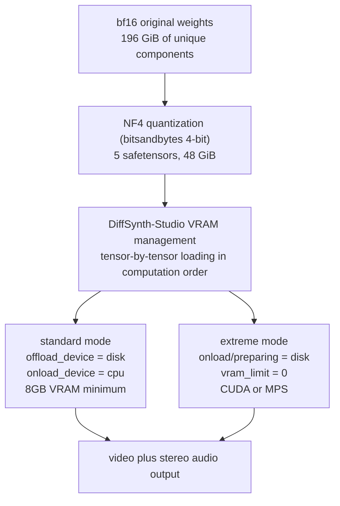

When an open-weight model ships, a quantized version follows within days. MiniMax-H3 was no exception. ModelScope published a 4-bit version bundled with DiffSynth-Studio, announced that a minimum of 8GB VRAM is enough, and added that it works on a Mac too. A video generation model fitting on a gaming graphics card is worth a look. So we opened the file listing and measured the actual sizes. Once the numbers lined up, it turned out quantization is not the protagonist of this story.


*Compression is half the story. The other half is in feeding it through one piece at a time.*

> **License note (added 2026-08-09).** The MiniMax H3 Community License, effective
> 2026-08-02, excludes the Republic of Korea, the United States, the European Union
> and the United Kingdom from its Applicable Territory. In those regions the license
> does not grant the right to download and run the open weights locally, to modify
> them, or to use or distribute their outputs. This post was written before we
> confirmed that. Please read the installation and execution steps below as applying
> to readers inside the Applicable Territory; elsewhere, consider the vendor's hosted
> API or a separate license request to MiniMax. The clause-by-clause comparison is in
> [our open video model license audit](/tech-blog/en/llmops/open-video-model-license-territory-audit/).

## Why read this

This is for people who want to run a video generation model on a consumer GPU or a Mac, and for people evaluating quantized builds as serving candidates. The conclusion first: NF4 quantization takes the deduplicated 196GiB of unique weights down to 48GiB, and that 48GiB is still six times the 8GB of VRAM. The reason it runs in 8GB is not quantization but DiffSynth-Studio's VRAM management, which loads tensors from disk one at a time in computation order. Miss that distinction and you will get both your capacity plan and your performance expectations wrong.

## Overview

MiniMax-H3 is an omni-modal video generation model released as open weights in early August 2026. It handles a mixed context of text, images, video and audio in a single transformer stream and produces video with stereo audio. Right after release, DiffSynth-Studio added the model to its support list along with low-VRAM inference and NF4 quantized inference.

NF4 is the 4-bit quantization scheme from bitsandbytes. Three questions are worth checking here. How much did it actually shrink, does the result fit in 8GB, and if it does not, what closes the gap. The answer to the third is the most practical part of this post.

The size figures in this post are byte sums taken directly from the HuggingFace file manifest API. There are no performance or quality numbers. We did not run this model locally and instrument it, and we judged it better not to manufacture numbers we do not have.

## What this technology is

Breaking down how a quantized build reaches an 8GB machine gives you layers.



The lower layer is quantization. NF4 stores weights in a 4-bit normal-float representation and restores them at computation time. The goal is reducing storage footprint and memory bandwidth.

The upper layer, the protagonist of this post, is VRAM management. DiffSynth-Studio controls model loading with five dials: `offload_dtype`, `offload_device`, `onload_device`, `preparing_device` and `computation_device`. The default the model card presents sets the offload target to disk, onload to CPU, and computation to CUDA. The framework watches available VRAM and adjusts parameter loading automatically, and this is the state in which the minimum requirement is 8GB.

There is a separate configuration for extremely constrained machines. The model card calls it extreme hardware optimization: it pushes `onload_device` and `preparing_device` down to disk as well and sets `vram_limit` to 0. In this mode the model's tensors are loaded from disk into VRAM one by one in computation order. The model never fully resides in memory, so the VRAM requirement effectively disappears. And in that same extreme configuration block there is a variant with `computation_device` set to `mps` and `device` set to `mps`. That is where the claim about Macs comes from.

In other words, the 8GB figure does not mean the model fits in 8GB. It means the framework streams weights so that whatever is resident in VRAM at any moment stays under 8GB.

## Installation and integration

Installation is a source build of DiffSynth-Studio.

```bash
git clone https://github.com/modelscope/DiffSynth-Studio
cd DiffSynth-Studio
pip install -e ".[all]"
```

The inference code follows the form the model card gives. Below is the FL2VA path that produces video and audio from text.

```python
import torch
from diffsynth.pipelines.minimax_h3_audio_video import MiniMaxH3Pipeline, ModelConfig

vram_config = {
    "offload_dtype": "disk",
    "offload_device": "disk",
    "onload_device": "cpu",
    "preparing_device": "cuda",
    "computation_device": "cuda",
}

pipe = MiniMaxH3Pipeline.from_pretrained(
    torch_dtype=torch.bfloat16,
    device="cuda",
    model_configs=[
        ModelConfig(model_id="DiffSynth-Studio/MiniMax-H3-NF4",
                    origin_file_pattern="minimax-h3-fl2va-nf4.safetensors", **vram_config),
        ModelConfig(model_id="DiffSynth-Studio/MiniMax-H3-NF4",
                    origin_file_pattern="minimax-h3-text-encoder-nf4.safetensors", **vram_config),
        ModelConfig(model_id="DiffSynth-Studio/MiniMax-H3-NF4",
                    origin_file_pattern="video_vae_nf4.safetensors", **vram_config),
        ModelConfig(model_id="DiffSynth-Studio/MiniMax-H3-NF4",
                    origin_file_pattern="audio_vae_nf4.safetensors", **vram_config),
    ],
    processor_config=ModelConfig(model_id="MiniMax/MiniMax-H3",
                                 origin_file_pattern="FL2VA/processor/"),
)
pipe.enable_vram_management(vram_limit=torch.cuda.mem_get_info("cuda")[1] / (1024 ** 3) - 4)
```

The subtraction of 4 from total VRAM in the `vram_limit` calculation is worth noticing. It reserves headroom for activations and intermediate tensors. The Ref2VA path for reference-driven generation subtracts 5 in the same place, meaning it needs more headroom.

On a Mac or an extremely low-spec machine, the `vram_config` changes to this.

```python
vram_config = {
    "offload_dtype": "disk",
    "offload_device": "disk",
    "onload_device": "disk",
    "preparing_device": "disk",
    "computation_device": "mps",   # "cuda" on a CUDA machine
}
# from_pretrained(device="mps", ...) and enable_vram_management(vram_limit=0)
```

Fine-tuning is possible too. The model card presents a datacenter configuration running LoRA on an H20 with 48GB VRAM, and a consumer configuration running on an RTX 4090 with 24GB. The latter splits into two stages with gradient checkpointing offload enabled: stage one builds a cache with the text encoder and the two VAEs, and stage two trains only the FL2VA transformer.

## Measured results

We summed every safetensors byte in both repositories through the HuggingFace file manifest API. These are not estimates but the file sizes themselves.

The original repository `MiniMaxAI/MiniMax-H3` holds 464.11GiB across 104 safetensors files. By directory:

| directory | size |
|---|---:|
| FL2VA | 134.13 GiB |
| Ref2VA | 134.13 GiB |
| text_encoder | 62.13 GiB |
| transformer | 61.73 GiB |
| transformer_ref | 61.73 GiB |
| vae | 9.70 GiB |
| audio_vae | 0.56 GiB |

One number in that table caught our eye. Adding `transformer`, `text_encoder`, `vae` and `audio_vae` gives 134.13GiB, which equals the size of the `FL2VA` directory alone. Matching them byte for byte in a script gave a difference of 0.0MiB, an error of 0.000 percent. That is hard to write off as coincidence.

The most natural reading is that `FL2VA` and `Ref2VA` are self-contained bundles, packing the transformer, the text encoder and both VAEs into one directory so that downloading that folder alone is enough. If so, a substantial share of the 464.11GiB the repository displays consists of copies of the same weights. Strip the duplication and 195.85GiB of unique weights remain. That means you do not need to plan for a 464GiB download, and that alone is worth opening the manifest for.

The quantized repository `DiffSynth-Studio/MiniMax-H3-NF4` holds 48.01GiB across 5 safetensors, and the file names show it maps to the individual components rather than the bundles.


*Left is deduplicated per-role measured size; right is the distance remaining between the quantized build and the required VRAM.*

| role | bf16 component | NF4 | ratio |
|---|---:|---:|---:|
| FL2VA transformer | 61.73 GiB | 15.98 GiB | 3.86x |
| Ref2VA transformer | 61.73 GiB | 15.98 GiB | 3.86x |
| text encoder | 62.13 GiB | 14.27 GiB | 4.35x |
| VisualVAE | 9.70 GiB | 1.50 GiB | 6.46x |
| AudioVAE | 0.56 GiB | 0.26 GiB | 2.13x |
| total | 195.85 GiB | 48.01 GiB | 4.08x |

How you compute the compression ratio changes the number substantially. Dividing the repository's stated 464.11 by 48.01 gives an impressive 9.67x. That figure keeps duplicate copies in the numerator, so it is better not to use it. Against the deduplicated 195.85 the ratio is 4.08x.

And 4.08x is what you would expect from 4-bit quantization. bf16 is 16 bits per weight, so pure 4-bit storage gives a theoretical 4x, with per-block scale values and unquantized layers pushing the real figure slightly below or above that. The two transformers landing at 3.86x looks like scale overhead pulling it under the theoretical value, while VisualVAE at 6.46x hints that the original may hold copies at several precisions. AudioVAE is lowest at 2.13x, plausibly because it is a small 0.56GiB module where scales and metadata weigh relatively more. Both of those readings are inferences from file sizes, not established facts.

Now the core point. 48.01GiB is 6.0 times 8GB. Even after dropping to 4 bits, the weights remain six times the required VRAM. The FL2VA transformer alone is 15.98GiB, still twice over. Add the 14.27GiB text encoder that a single generation also needs, and quantization by itself simply does not get the model loaded on this machine.

What closes the gap is the VRAM management described earlier. To quote the model card directly, in this configuration the model's tensors are loaded from disk to VRAM one by one according to computation order. Put another way, the 8GB figure is not a function of model size but of the working space the largest single computation step demands. Quantization shrinks that working space and the transfer volume, making the approach fast enough to be practical. It is a supporting actor, not the lead.

One practical implication follows. In this configuration performance is governed by storage bandwidth, not GPU compute. Tens of gigabytes must be read from disk every step, so the difference between NVMe and a SATA SSD lands directly in generation time. Getting hold of an 8GB graphics card is not the end of it; you need a fast disk with generous free space beside it.

By the same logic, the real value of quantization gets redefined. In a streaming-load configuration, 4-bit weights do not let you hold more in memory. They cut the bytes you must read each step to a quarter. When the bottleneck is the disk, cutting transfer volume to a quarter means cutting time to something near a quarter, so quantization functions here as a bandwidth technique rather than a capacity technique. The two are not equal contributors but ordered: streaming makes execution possible, and quantization makes it fast enough to tolerate.

The `vram_limit` setting reads easily from this angle too. Subtracting 4 or 5 from total VRAM tells the framework the budget it may spend on weight streaming. What you leave behind belongs to activations and intermediate tensors, and on a long-sequence model like H3, too little headroom means you overflow mid-computation even after all the weights arrive. Leave too much and fewer weights can stay resident, increasing disk round trips. That is why this value is worth tuning once per machine.

## What this means for ThakiCloud products

For how we serve models in Metis, this case is a reminder of two things. First, a minimum requirement figure means nothing on its own. It has to be published alongside the loading strategy it assumes. That is why Metis endpoint specifications need to separate weight size, resident memory and whether streaming is in play. Second, streaming loads trade latency into storage. In configurations with cold starts, like Metis Serverless and Scale-to-Zero, the cost of that trade shows up directly in time to first response, so GPU memory alone is not enough to decide model placement.

The Maxis implication lies in the fine-tuning path. That the model card presents a two-stage split with gradient checkpointing offload for LoRA on a 24GB RTX 4090 signals that customer-specific training of video generation models is coming down from datacenter-only territory. Maxis owns training and distillation, so absorbing these low-spec training recipes as standard templates would let us offer style adaptation on customer footage far more cheaply.

All of this meets in Paxis. Paxis is our Enterprise Agent Platform, and video generation is one workflow step inside it. From a business automation standpoint the important question is not which GPU the model sits on but what one asset costs to produce. NF4 quantization and streaming loads add one more option for lowering that unit cost. Bulk processing can run on Telox GPU clusters while low-spec sites or air-gapped environments run the same workflow on a small Aegis deployment. One Paxis workflow moving across execution environments is the shape we are aiming for.

## Limitations and counterarguments

This post contains no quality comparison. We did not measure how 4-bit quantization affects video quality, and the model card gives no figures either. For reference, the same DiffSynth-Studio documentation explicitly states for another model that FP8 quantization degrades image quality significantly and is not recommended. Results clearly vary by quantization scheme and model, and no published quality evidence exists yet for H3 NF4. Compare it yourself before production use.

There are no speed figures either. How slow it is to load tensors from disk one at a time varies by machine, and running in 8GB is not the same statement as finishing in a practical amount of time. The difference between minutes and hours is very large.

Mac support should be read carefully as well. It is a fact that an MPS configuration block appears in the model card, but it does not come with validated performance figures. We could not find wording in MiniMax's official documentation confirming Apple Silicon or MPS support. A framework offering a path and that path being usable in practice are separate matters.

The bundle duplication reading is not settled either. All we verified is that the `FL2VA` directory size matches the sum of four components byte for byte. We did not compare tensor names or hashes, so we cannot fully rule out different weights that happen to be the same size. Still, the odds of a coincidental 0.000 percent match are low, and the bundle explanation fits the file naming. If you plan to build an important decision on this reading, download and compare the tensor listings.

Finally, the compression ratios here are on-disk figures. Actual memory occupancy during inference includes activations, KV state and intermediate tensors, so it differs from weight size. H3 in particular has long sequences, which weights the activation side heavily. In our earlier post we calculated that a single 2K 15-second clip produces a sequence of over 320 thousand tokens. Drawing a capacity conclusion from this table alone is not enough.

## Wrapping up

The numbers, summarized. The 464.11GiB the original repository displays contains bundle duplication, and stripping it leaves 195.85GiB of unique weights. NF4 quantization brings that to 48.01GiB, a 4.08x reduction. That is an honest figure close to the theoretical ceiling of 4-bit quantization, not the 9.67x commonly quoted. And 48GiB is still six times the 8GB of VRAM. The reason it runs in 8GB is DiffSynth-Studio's VRAM management loading tensors from disk one at a time in computation order, with quantization as the supporting act that cuts the bytes each round trip must read.

So if you are evaluating this combination, the three things to check are not the graphics card. They are how fast your storage is, whether you have roughly 200GiB of free disk, and whether the quality after dropping to 4 bits suits your use case. The first two you can read off a spec sheet; the last one you have to render yourself. Asking what assumptions a minimum requirement figure rests on, and opening the manifest instead of trusting a repository's stated total, are the two habits this case leaves behind.

## Sources

- [DiffSynth-Studio/MiniMax-H3-NF4 model card](https://huggingface.co/DiffSynth-Studio/MiniMax-H3-NF4) (VRAM configuration, MPS path, training recipes)
- [modelscope/DiffSynth-Studio](https://github.com/modelscope/DiffSynth-Studio) (installation, VRAM management, H3 support announcement)
- [HuggingFace model file manifest API](https://huggingface.co/api/models/MiniMaxAI/MiniMax-H3?blobs=true) (basis for the size measurements)
- [MiniMaxAI/MiniMax-H3](https://huggingface.co/MiniMaxAI/MiniMax-H3) (original weights, model specification)
- Original tweet: [@ModelScope2022](https://x.com/ModelScope2022/status/2084625441940279770)
