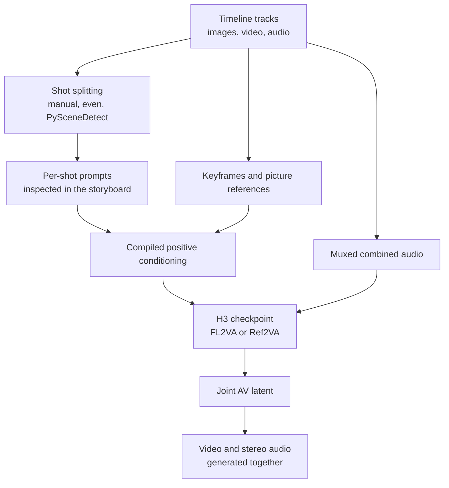

## Why This Matters

This is for teams evaluating whether to bring a video generation model onto their own infrastructure, and for anyone operating a ComfyUI pipeline. The short version: MiniMax H3 is a rare release that opened the weights and the audio path together, and the Director node lifts multi-shot authoring to a practical level, but Korea is excluded from the applicable territory of the community license, so the route where a domestic team downloads these weights and self-hosts is currently closed. This is something where the technical review and the legal review need to start in the same week.

*A depiction of shots forming a sequence while audio flows along the same axis.*

## Overview

What caught the eye on the timeline last week was a custom node called [ComfyUI-MiniMaxH3-Director](https://github.com/seesee75-commits/ComfyUI-MiniMaxH3-Director). It transplants a video editor's timeline wholesale into ComfyUI and lets you write prompts shot by shot on top of it. On the surface it looks like a convenience feature, but what it really shows is the point where the unit of a video generation workflow shifts from the clip to the sequence.

To understand the node, though, you first have to look at the model underneath it. MiniMax open-sourced H3, the omni-modal video model behind the Hailuo line, on August 3. It takes text, images, video and audio as input and produces video with genuine stereo sound, where the audio is generated in the same pass rather than bolted on afterwards. The released H3-Base is a 33.1B omni transformer with native 768p output. Native ComfyUI support landed the same day through [PR #15224](https://github.com/Comfy-Org/ComfyUI/pull/15224), adding four nodes and six official workflow templates.

So far, good news. The problem is in the license.

## What the Tooling Is

The public release splits into two task-specific checkpoints with different input conditions.

| Checkpoint | Purpose | Input conditions |
|---|---|---|
| FL2VA | Text-to-video, first-frame or last-frame conditioning | Zero images gives text-to-video, one image gives first- or last-frame conditioning, two images give simultaneous first-and-last-frame conditioning |
| Ref2VA | Reference-based generation | Up to 9 reference images, 3 reference videos and 3 reference audio clips. Videos and audio run 2 to 15 seconds each within a 15 second total, and audio is always used alongside an image or video |

Shipping with these are the H3 video VAE, the audio VAE and a Qwen3-VL-32B text encoder. The encoder checkpoint filename, `qwen3vl_32b_minimax_h3_nvfp4_awq.safetensors`, is worth noticing. By quantizing a 32B encoder with NVFP4 and AWQ before distribution, they removed the scenario where the size of the text encoder alone blocks entry. The full weights come to roughly 42.5GB.

The Director node adds an authoring layer on top. You drag images, video and music onto tracks and trim their length against a ruler, and each segment on a track becomes a shot carrying a timestamp. Images placed on a track are interpreted as keyframes or picture references, and you write a separate prompt for each shot. The key point is that the storyboard view shows the exact prompt the model will receive while you continue editing it. Feeding in a long video and splitting it evenly, or auto-detecting scene boundaries with PySceneDetect, is also handled inside the node.

What the node finally emits is a patched model, compiled positive conditioning, an empty joint AV latent, muxed combined audio, and the fps, resolution, length, prompt and retake information.

Summed up in one line, the declarative result of editing a timeline gets compiled into conditioning. Instead of a person hand-concatenating prompt strings, the editing state becomes the specification. For context, this node is a port of the LTX Director timeline editor built by WhatDreamsCost onto H3, keeping the editing interface and swapping the backend. Several branches implementing the same idea now coexist, including an [AIMixer version](https://github.com/AIMixer/ComfyUI_MiniMaxH3_Director).

## On Installing and Running It

This article contains no numbers we obtained by running it ourselves. Let me state the reason plainly.

The MiniMax H3 Community License Agreement took effect on August 2, 2026, and its definition of applicable territory excludes the United States, the European Union, the United Kingdom and the Republic of Korea. In those four regions, downloading the open weights to use locally, modifying them, or distributing their outputs is not licensed. The hosted API remains available worldwide. According to MiniMax, the US restriction stems from ongoing copyright litigation with Hollywood studios, while the other regions reflect the state of regulatory development around likeness generation, copyright and content safety. US users are pointed to a path for applying for separate authorization on condition of establishing a content compliance mechanism.

We are in Korea. So we did not download the weights and did not reproduce anything locally. Benchmark numbers obtained by working around license conditions are not worth publishing. Every specification described in this article rests on public documentation and repository descriptions, and nothing unmeasured is presented as though we verified it.

If you need to work with H3 domestically, the current option is going through the hosted API. The Director node itself is designed around local weights, so achieving similar multi-shot authoring on an API basis means looking at a different branch, such as [node implementations that wrap the API](https://github.com/Anil-matcha/minimax-h3-comfyui).

## Implications for ThakiCloud Products

Three things from this release carry over into our practice.

First, from the Metis angle, the decision to ship a quantized text encoder alongside the model is notable. Metis handles the inference serving and token factory layer, taking per-model serving through Dedicated Endpoints. When serving a multimodal video model the bottleneck is usually not the main body but the periphery. Loading a 32B text encoder in fp16 consumes a GPU by itself, whereas shipping it with NVFP4 and AWQ applied allows a far wider batch on the same hardware. We expect the pattern of open-weight publishers packaging with serving economics already calculated to become more pronounced.

Second, from the Aegis angle, this license is a textbook case. Aegis covers closed-network and on-premises deployment and data sovereignty, and sovereign AI discussions usually concentrate on where the data sits. This case touches a layer further upstream. Even with everything ready to keep data domestically and deploy on a closed network, nothing can begin if the region is excluded from the license's applicable territory. If your model adoption checklist has performance and VRAM requirements but no line for territorial clauses, that checklist needs updating now.

Third, from the Paxis angle, Director's own design is worth studying. Paxis is ThakiCloud's Enterprise Agent Platform, retrieving skills, executing them in isolated sandboxes and assembling multi-agent workflows as a DAG. What Director does is compile a human-edited timeline state into executable conditioning, which is the same shape as how we handle workflows. A person edits declarative state, the system translates it into an execution specification, and the editing surface lets you inspect the specification that will actually run. In agent workflows, a step where a human inspects the specification just before execution is another name for an approval gate.

## Limitations and Counterarguments

First, the gap between the marketing copy and the actual open release deserves attention. H3's 2K resolution appears in API pricing and promotional material, but the H3-Regenerate-2K module that produces it was not included in the open-source release and is offered only through the API. Running H3-Base locally, the native output is 768 pixels on the short edge. Expecting API-equivalent results purely on the strength of the phrase "open weights" will not match reality.

Clip length is also a constraint. A single clip runs to a maximum of 15 seconds, and reference video and audio are likewise bounded at 15 seconds in total. Director's shot chaining is a workaround for building longer sequences on top of that limit, not an indication that the model generates long form in a single pass. Consistency between shots is still the user's responsibility to manage through keyframes and references.

Ecosystem fragmentation is a practical risk too. At least three branches coexist under the Director name, and multiple community quantizations have been published. Custom nodes break easily on ComfyUI core updates, and in a fragmented state it is hard to predict which branch will keep being maintained. If you plan to put this into a production pipeline, pinning to a specific commit and planning upgrades deliberately is the safer path.

Finally, the counterargument in the other direction. There is no basis for asserting that the license restriction is permanent. If litigation and regulatory development are the background, the applicable territory may be adjusted once those settle, and the fact that an application path is already open for the US points the same way. The conclusion today is not that adoption is impossible but that adoption is on hold, and the right response is to check the license document for revisions periodically.

## Wrapping Up

What Director demonstrates is that the working unit of video generation has moved up from a single line of prompt to an edited timeline. Shots, keyframes and audio sit on one axis, and that editing state compiles directly into an execution specification. This is the shape that every workflow where humans review and systems execute is heading toward, not just video.

For domestic teams, though, the more important sentence today sits underneath. The phrase "open weights" does not automatically mean you can self-host. The task for this week is not running benchmarks but finding and reading the territorial clause in the licenses of your candidate models, then adding a column for it to your model selection document. Performance comparison comes after that.

## Sources

- [MiniMax H3 Day-0 Support in ComfyUI, ComfyUI blog](https://blog.comfy.org/p/minimax-h3-day-0-support-in-comfyui)
- [feat: Support MiniMax-H3 (CORE-375), Comfy-Org/ComfyUI PR #15224](https://github.com/Comfy-Org/ComfyUI/pull/15224)
- [ComfyUI-MiniMaxH3-Director, GitHub](https://github.com/seesee75-commits/ComfyUI-MiniMaxH3-Director)
- [MiniMax H3 license QA document, Hugging Face](https://huggingface.co/MiniMaxAI/MiniMax-H3/blob/main/docs/QA-about-License.md)
- [MiniMax H3 ComfyUI workflow examples, ComfyUI docs](https://docs.comfy.org/tutorials/video/minimax/minimax-h3)
- [China's MiniMax curbs overseas access to new AI video model over copyright disputes, SCMP](https://www.scmp.com/tech/tech-trends/article/3362951/chinas-minimax-curbs-overseas-access-new-ai-video-model-over-copyright-disputes)
