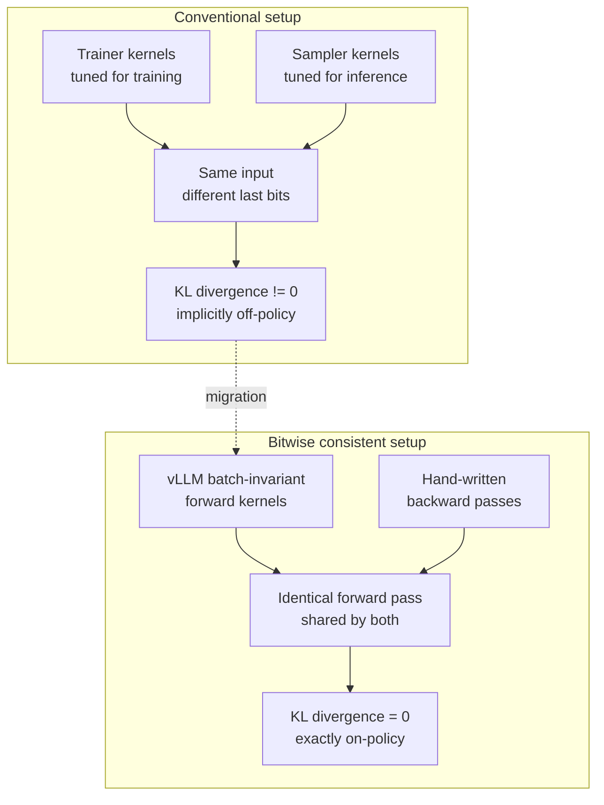

## Why read this

This is for anyone running on-policy RL post-training whose reward curve moves differently across runs of the same configuration, and for platform owners who need to know what picking a training stack and a serving stack separately will bill them later. The conclusion first: a large share of that instability comes not from hyperparameters but from the fact that **your training kernels and your inference kernels emit different bits for the same input**. The vLLM and TorchTitan teams audited every kernel invocation in the forward pass and closed that gap, and once KL divergence was always zero the model reached a higher total reward in fewer steps. That parity does not yet cover every architecture. It is still blocked on linear attention families like Gated DeltaNet, and the reason is not neglect. It is the recurrent state itself.


*Two paths, training and inference, converging on the same numerics. One is smooth, the other is broken into chunks.*

## Overview

RL post-training has an old nuisance. The tokens the sampler produced and the probabilities the trainer assigns to those tokens drift slightly apart. What is on-policy in theory becomes very slightly off-policy in practice. Reinforcement learning is known to amplify such tiny numerical mismatches, and the result shows up as non-deterministic and unstable training behaviour.

The cause is not a bug. Training and inference frameworks use different kernels in the first place because their workload properties differ, and even within one inference framework different kernels get selected for different scenarios. Kernels for high batch sizes parallelise aggressively on the batch dimension, while kernels for low batch sizes split more finely within a single instance to keep the GPU's parallel cores busy. Floating point addition is not associative, so changing the accumulation order changes the last bit.

This property is unusually good at misleading people in practice. The error itself is minute, a few last bits on one token's log probability. But RL amplifies it twice. Once along the sequence, as per-token ratios multiply. Once along training, as a policy updated from that contaminated signal produces the next round of samples. So the symptom appears a long way from the cause. Kernel selection is the problem and the divergence surfaces hundreds of steps later in the reward curve. If you are chasing an instability that no hyperparameter reproduces, this path is worth suspecting.

[No More Train-Inference Mismatch](https://blog.vllm.ai/2025/11/10/bitwise-consistent-train-inference.html), published by the vLLM and TorchTitan teams last November, is the record of removing that problem head on. With TorchTitan as the training engine and vLLM as the inference engine, they secured invariance across the two frameworks and demonstrated an open-source on-policy RL run where training and inference numerics match bit for bit. That work has kept expanding since, and the most visible remaining gap is linear attention. This post covers what the parity work actually did and why linear attention is uniquely hard, checked against the public repositories and issues.

## What bitwise parity actually did

The approach is simple and tedious. Audit every invocation of every kernel during the forward pass to confirm bitwise equivalence across the two frameworks.

What made this possible was vLLM's earlier batch-invariant inference work. Batch invariance means the same sequence always produces the same output regardless of what else is batched alongside it. Having secured forward pass kernels with that property, the team carried those exact kernels over to the training side.



*Sharing the forward kernels and attaching backward passes separately is the core of the work.*

The complication was that vLLM contains many heavily optimised fused operations, such as SiLU MLPs and RMSNorms with added residuals. Preserving bitwise equivalence meant importing those exact operations into the forward pass, and those operations have no backward. So the team registered custom backward passes for them, written in the same vanilla PyTorch that TorchTitan uses.

The RL demo is a generic script built on GSM8K with a correctness reward. The trainer uses TorchTitan's utilities and the generator is a thin new wrapper called `VLLMRolloutEngine` that covers only the generate call and weight updates. Everything runs synchronously on a single host, alternating between trainer and generator. The authors note this is demonstrative of exactly on-policy execution and is not very common in large scale runs.

## What the numbers said

The result splits into two.

Running the sampler with different kernels than the trainer, meaning batch invariance off, showed a reduced reward over 100 steps. Enabling bitwise exact training makes KL divergence always equal 0.0, and the model both trained in fewer steps and reached a higher total reward.

Zero KL divergence here does not mean a metric improved. It means **the algorithm's premise actually holds**. On-policy algorithms are derived assuming the policy that produced the sample and the policy being updated are the same. When the kernels differ that assumption is quietly broken, and we end up chasing it by adjusting learning rates and clipping coefficients.

The price is explicit. The bitwise RL run is currently 2.4x slower than the non-bitwise case. Batch-invariant kernels give up the optimisation of switching strategy by batch size, so they start at a deficit. The setup also does not use `torch.compile` yet: because compilation was not applied to the TorchTitan side model, vLLM is forced into eager mode. vLLM itself leverages compilation heavily while maintaining batch invariance, but preserving cross-framework compatibility would require changing the trained version of the model too.

The structural debt is stated by the authors themselves. Model code currently exists in two copies, one for training and one for inference. That is easy for a first integration and fragile for long-term maintenance, since any slight change to either breaks the equivalence. The follow-up direction is a model definition shared by both frameworks, tracked in RFCs [#28326](https://github.com/vllm-project/vllm/issues/28326) and [#27433](https://github.com/vllm-project/vllm/issues/27433).

## Why linear attention is the next wall

Everything so far assumes softmax attention. Recent models are not pure attention. The Qwen3-Next family interleaves Gated DeltaNet, a linear attention, with full attention across layers, with linear attention carrying long-context efficiency and full attention carrying high-fidelity reasoning. To support this, vLLM integrated Triton kernels from Flash Linear Attention and adopted a hybrid KV cache manager that handles linear and full attention layers together.

This is where batch invariance catches. Issue [#42960](https://github.com/vllm-project/vllm/issues/42960), filed in May, records the situation precisely. Setting `VLLM_BATCH_INVARIANT=1` on a model containing GDN layers aborts engine startup.

```text
RuntimeError: VLLM batch_invariant mode is not supported for GDN_ATTN.
```

The check fires in `_cached_get_mamba_attn_backend` in `vllm/v1/attention/selector.py` the moment the backend is selected. The reporter reproduced it on an A100 80GB with an AWQ 4-bit build of Qwen3.6-35B-A3B and confirmed the same error on both 0.21.0 and the nightly at the time. The issue describes it as a hard incompatibility with no fallback and no partial mode. The regular attention path received SM80 support in [#42456](https://github.com/vllm-project/vllm/issues/42456), while the linear attention path had no equivalent.

In June, Yuval Luria of Red Hat opened PR [#45819](https://github.com/vllm-project/vllm/pull/45819) against that issue. It is a four-line change adding `supports_batch_invariance()` to `GDNAttentionBackend` so it follows the pattern of the other backends, on the grounds that the GDN implementation already uses `torch.argsort` with `stable=True` and therefore supports deterministic behaviour. As of writing, that PR is still open.

The reason a single flag does not settle this lies in how GDN is computed. Linear attention rolls a recurrent state along the sequence. Getting throughput means splitting that recurrence into chunks and running them in parallel, and an ordering dependency remains between chunks. There is a concrete illustration of how slippery this is. PR [#25393](https://github.com/vllm-project/vllm/pull/25393), which parallelises `chunk_gated_delta_rule_fwd_h` further along the sequence dimension and reports a 2.80x speedup at vLLM's default chunked prefill size of 8192, drew a review flagging a critical correctness problem. Each thread block reads the state left by the previous block from global memory, but thread blocks in a Triton grid have no guaranteed ordering or synchronisation, so a read-after-write hazard is possible. Worse, what had been stored was the state at the **start** of processing the previous chunk, not the state **after** it. The review adds that the PR's benchmark measured only performance and did not validate correctness, which is likely why the issue went uncaught.

The lesson is clear. In a linear attention state recurrence, changing the parallelisation strategy can change the result. Where batch invariance in softmax attention was a problem of fixing accumulation order, here a second problem is stacked on top: **fixing the state propagation boundary**. Turning on a support flag in the backend and guaranteeing identical bits under a different chunk split are two different pieces of work.

What makes it harder still is that the chunk boundary is not a fixed constant. The serving engine splits prefill, and that split depends on whatever else is scheduled at that moment and on the remaining budget. With full attention you can absorb a shifting split by fixing the final accumulation. A recurrent state cannot. Where you cut and how far you rolled carries directly into the next chunk's initial state, so the split becomes part of the computation graph. In a hybrid architecture this property alternates layer by layer, with a cache manager handling linear and full attention layers in between. Guaranteeing parity therefore requires the scheduler's split to be reproducible too, which is a property of the whole execution path rather than of one kernel.

## What this means for the ThakiCloud platform

The topic is not academic for us. RL post-training is a core path on the [Maxis](https://thakicloud.com/tech-blog/en/llmops/) axis where we build customer-specific models, and the same organisation runs training and serving.

The first implication is that stack selection gained a criterion. Until now, training frameworks and serving engines were chosen on their individual performance. If you intend to run on-policy RL seriously, the feasibility of numeric parity between the two engines joins that list. Give up on parity and you end up covering training instability with hyperparameters, and that cost is billed in experiment count.

The second is where to spend the 2.4x. Not every run needs bitwise parity. The configuration we find practical is keeping parity mode as a baseline instrument. When building a new recipe, capture a reward curve under KL equals zero with a short parity run, then run at scale in fast mode while watching the gap against that baseline. What needs to be reproducible is not every run, but the runs a decision rests on.

The third is a condition attached to model selection. Hybrid linear attention models are attractive for long-context serving and push [Metis](https://thakicloud.com/tech-blog/en/llmops/) token costs down. But if you plan to post-train that family with on-policy RL, the premise has to include the fact that a reproducible parity path is not yet open. Serving efficiency and training reproducibility pull in opposite directions on the same architectural choice. That balance is settled by your own benchmark, not by a default.

What all of this ultimately serves is the reliability of the work [Paxis](https://thakicloud.com/tech-blog/en/agentops/) executes. When an agent automating internal work is repeatedly wrong on a given task, our structure is to feed that task's execution record back as a training signal. If training lands somewhere different each run, you cannot attribute what caused the improvement. Bitwise parity is less a performance technique than **an instrumentation condition that makes improvement attributable**. And the pipeline must not care where it sits. Reproducibility becomes an organisational asset only when the same training and serving configuration runs identically on Telox GPU clusters and on Aegis inside a customer's air-gapped network.

## Limits and counterarguments

The scope of our evidence should be stated plainly. We did not reproduce this experiment. The figures here are the values published by the vLLM and TorchTitan teams, and the linear attention status is what we confirmed from public issues and pull requests. The GDN parity work in particular is still moving, so the state of the PR cited above may differ by the time you read this.

Technically the demonstration is narrow. It covers one model, Qwen3 1.7B, in a synchronous single-host setup alternating trainer and generator. Real large-scale RL often overlaps generation and training asynchronously, and in that configuration the run is not exactly on-policy to begin with, which changes the character of the benefit. The two-copy model code problem also remains, so factoring in maintenance cost this is not something to move into production as is.

An honest counterargument is worth setting up. Instead of removing the numeric mismatch, you can acknowledge it and correct for it algorithmically. Approaches that handle off-policyness explicitly with importance weighting are already mature and do not pay a 2.4x throughput bill. If that buys more samples in the same wall clock, it may produce the better model. The real value of bitwise parity is more accurately located in debuggability than in final performance. When runs are deterministic you can ask what changed what, and the team that can answer that question moves faster in the end.

## Wrapping up

When training and inference use different kernels, the premise of on-policy RL is quietly broken. vLLM and TorchTitan closed that gap by sharing the forward kernels and attaching backward passes by hand, and under zero KL divergence training reached a higher reward in fewer steps. The price is a 2.4x slowdown and model code split into two copies. That parity does not yet cover linear attention. GDN's state recurrence is a structure where the chunk parallelisation strategy can change the result, so it does not end with flipping a backend flag.

If you are running RL post-training today, one thing is worth checking first: whether you record, per step, the difference between the log probability the trainer computed and the one the sampler reported. If that value is non-zero while training wobbles, the next thing to adjust is not the learning rate. It is the kernels. And if a hybrid linear attention model is on your shortlist, check the current state of the issue above before committing your training plan to that architecture on serving efficiency alone.

## Sources

- vLLM and TorchTitan Teams, [No More Train-Inference Mismatch: Bitwise Consistent On-Policy Reinforcement Learning with vLLM and TorchTitan](https://blog.vllm.ai/2025/11/10/bitwise-consistent-train-inference.html), 2025-11-10
- vLLM, [vLLM Now Supports Qwen3-Next: Hybrid Architecture with Extreme Efficiency](https://vllm.ai/blog/2025-09-11-qwen3-next), 2025-09-11
- [Issue #42960: Batch-invariant support for GDN_ATTN](https://github.com/vllm-project/vllm/issues/42960)
- [PR #45819: Add batch invariance support to GDN_ATTN backend](https://github.com/vllm-project/vllm/pull/45819)
- [PR #25393: Speedup chunk_gated_delta_rule_fwd_h](https://github.com/vllm-project/vllm/pull/25393)
- RFC [#28326](https://github.com/vllm-project/vllm/issues/28326), RFC [#27433](https://github.com/vllm-project/vllm/issues/27433)
