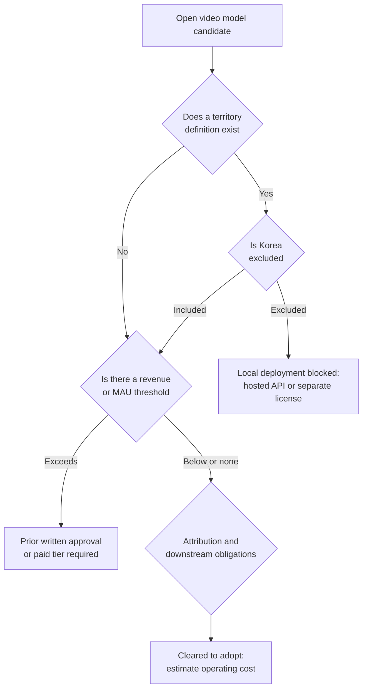

This is for engineering leads and technical decision makers in Korea who need to decide whether an open video model belongs in a product. By the end, you should understand why the license clause deserves a read before the benchmark score does, and in what order to check that clause the next time a candidate model comes up.

Here is the conclusion up front. Excluding Korea from a model's licensed territory is not a new habit that started this month. It has been going on since December 2024, and among the open video models in wide use today, very few clear both the territory restriction and the scale restriction at once. What follows walks through six license files we opened directly, and closes with a seven question checklist you can reuse the next time you evaluate a model.

*Being able to download a model and being allowed to use it turned out to be two different things.*

## Tencent Has Been Excluding Korea Since December 2024

HunyuanVideo's license file settles its scope before the document even gets going. Right at the top, in capital letters, it states that the agreement does not apply in the European Union, the United Kingdom, or Korea, and that the rights it grants are limited to the territory defined below. The release date attached to that sentence is December 3, 2024.

The same wording carries through every release after that. The image-to-video version from March 2025 and the 1.5 version from November 2025 both contain the identical paragraph, word for word. Three releases, spanning roughly a year, and the same exclusion clause held in place the whole time.

This clause has barely come up in Korean developer communities in that time. The model card lists only the license name, the actual wording sits in a separate file, and most people never open that file. There is real distance between clicking a download button and reading the contract behind it.

## What MiniMax H3 Added Was the United States and Output Clauses

The MiniMax H3 community license, effective August 2, 2026, defines its excluded territory as the European Union, the United Kingdom, Korea, and the United States. Compared with Tencent's earlier clause, the change is the addition of the United States. That is likely why this one made news. Korea being excluded was nothing new, but the United States being excluded was.

The clause itself is also tighter than the earlier examples. Its usage restriction section covers not just the weights but their outputs, prohibiting both from being used, distributed, or displayed outside the licensed territory. Organizations with annual revenue over USD 20 million need separate prior written approval, and any commercial product built on the model has to display the model's name visibly on the user-facing screen. Using outputs to improve another AI model is banned globally, regardless of territory. Anyone offering a hosting service takes on an additional obligation to build, maintain, and periodically review technical safeguards for downstream users. Disputes fall under the exclusive jurisdiction of courts in Hong Kong.

What is worth noticing here is not how strict the clause is, but which direction it is moving. When the phrase open weights first spread, what people pictured was a state where getting the model meant you could use it. The documents circulating now separate getting from using, and split the conditions for using across territory, revenue, and purpose.

## The License Never Actually Defines Where You Are

The first question that comes up in practice is this: our legal entity is in Korea, but what happens if the GPU sits in an overseas region? What if we take delivery under a Singapore subsidiary's name? Does it change anything if the engineer downloading it happens to be traveling?

We looked through the H3 license text for wording that would answer this. Terms like domicile, residence, place of incorporation, or principal place of business, the kind of language you would need to determine jurisdiction, do not appear anywhere in the document. The excluded territories are defined, but the rule for deciding which entities belong to those territories is simply absent.

That gap is not a minor one. The point where contract interpretation is most likely to diverge is exactly the point a practitioner hits first. And with governing law and jurisdiction set to Hong Kong, it is hard to assume a Korean court would fill that gap the way we are used to.

One more detail worth adding: the definition of output extends to results obtained through a hosted service. Industry practice treats a provider's hosted API as the accepted route for users in an excluded territory, and that reading has become common, but the two clauses do not mesh cleanly on the text alone. We will only say that ambiguity remains here and stop short of a conclusion. This piece is a record of reading the clauses, not legal advice, and the actual determination needs to go through each company's own legal review.

## We Read Six Models Through the Same Seven Questions

Every license uses different structure and different wording, so comparing them at face value turns into an exercise in impression rather than fact. We asked the same seven questions of each one instead and collected only the answers. The table below reflects license files downloaded directly from each model's repository and cross-checked on August 9, 2026.

| Model | License Date | Territory Exclusion | Scale Gate | Output Restriction | Distillation Ban | Governing Law |
|---|---|---|---|---|---|---|
| Wan 2.2 (Alibaba) | Apache 2.0 | None | None | None | None | Apache 2.0 |
| HunyuanVideo (Tencent) | 2024-12-03 | EU, UK, Korea | MAU 100 million | Yes | Yes | Separately specified |
| HunyuanVideo-I2V | 2025-03-05 | EU, UK, Korea | MAU 100 million | Yes | Yes | Separately specified |
| HunyuanVideo 1.5 | 2025-11-21 | EU, UK, Korea | MAU 100 million | Yes | Yes | Separately specified |
| LTX-2.3 (Lightricks) | 2026-01-05 | None | USD 10 million annual revenue | Yes | Yes | New York state law |
| MiniMax H3 | 2026-08-02 | EU, UK, Korea, United States | USD 20 million annual revenue | Yes | Yes | Hong Kong |

Check the next model you evaluate in the same order. Is there a territory definition. Does that restriction also cover outputs. Is there a revenue or user count threshold. Is there an attribution or disclosure obligation. Is training another model on the outputs prohibited. Do downstream obligations kick in when you offer the model as a service. Where does a dispute get resolved. The first three questions decide whether adoption is even possible; the remaining four decide what it costs to operate.

*The first three questions decide whether adoption is possible at all; the rest decide what it costs to run.*

*The chart labels are in Korean, so here is what the two panels show. The left panel plots when each license began excluding Korea from its territory: Tencent's HunyuanVideo excluded Korea from December 2024 onward, and MiniMax H3 added the United States to that same exclusion in August 2026. The right panel plots the revenue or user threshold that triggers a paid tier or requires prior written approval, and LTX-2.3's USD 10 million threshold sits below MiniMax H3's USD 20 million.*

## No Territory Restriction Does Not Mean No Restriction

There is an assumption worth checking here. Because territory exclusion clauses tend to come out of Chinese labs, it is easy to assume Western models are comparatively lenient. The numbers do not support that.

LTX-2.3, distributed by Israel and US based Lightricks, carries no territory restriction, but requires a paid commercial license for any organization with annual revenue over USD 10 million, a lower bar than MiniMax H3's USD 20 million threshold. That means a mid-size or larger Korean company could hit a cost wall with LTX before it ever gets to MiniMax. Zhipu's CogVideoX is free for academic research, but commercial use requires registration and comes with a separate cap of one million monthly visitors.

So there are two axes at play, not one: territory and scale. Clear one axis and assume you are safe, and the other one catches you. The models that clear both axes are the ones released under standard open source licenses, and once you narrow that down further to models with real production-scale usage behind them, the Wan 2.2 line, distributed under Apache 2.0, is currently the most realistic option. No territory clause, no revenue or user count threshold, and no separate restriction on outputs or distillation. Open-Sora v2 uses the same Apache 2.0 license, so Wan 2.2 is not the only option if you go by terms alone, but the gap in download volume and ecosystem support between them is large enough to change the actual integration cost once you put either one into a product.

## So What Should a Korean Team Actually Choose

If the plan is to download the weights and serve the model in house, defaulting to Wan 2.2 is the reasonable call, not because its quality tops every benchmark, but because it carries the lowest probability of a license problem showing up after adoption. Model quality gets overturned by the next release. Contract clauses do not change nearly that fast.

If your organization sits in an excluded territory and a specific model is genuinely required, two paths remain. One is using the provider's hosted API, in which case what applies is not the open weights license but a separate set of API terms of service. The other is requesting an individual license. Both MiniMax and Tencent leave a documented path for users in excluded territories to request a separate agreement, and MiniMax specifically states it will review such requests conditioned on controls and guardrails. For an organization with real scale, that path is worth actually knocking on.

What we would not recommend is working around it. Routing through an overseas subsidiary or switching regions to dodge a clause is riskier than it looks precisely because no determination rule exists in the document. The absence of a defined standard cuts both ways: it could be read in your favor, but it could just as easily be read in the other side's favor.

## The Catalog Needs to Know the License

The practical lesson we took from this audit has less to do with the content of any single clause and more to do with how licenses get managed. Up to now, a license has been a display field on a model card, not operational data. Once conditions start splitting by territory, revenue, and purpose, deciding which model a given tenant can serve in a given region turns into a runtime decision.

That is why we think Metis's model catalog should treat license as first class metadata rather than a display string. Territory scope, scale thresholds, output restrictions, and attribution obligations need to live as structured fields so deployment can be filtered automatically at the moment it happens. Having a person open the license file every time does not scale with how fast the model count grows.

For customers with strict air gap and data sovereignty requirements, this problem moves one step earlier. In an on premise environment like Aegis, which weights can be brought in stops being an architecture decision and becomes a procurement requirement. The license has to clear before a model ever makes it onto a proposal list.

## Where This Leaves Us

Being able to download a model and being allowed to use it have split apart. Tencent started this in December 2024; MiniMax just made it widely known by adding the United States in August 2026. This trend does not look like it is reversing. Likeness rights, copyright, and content safety regulation around generative video are tightening at different speeds in different regions, and the cheapest response for a provider is simply to drop the heavily regulated markets from the license scope.

That means the order in which you evaluate a model needs to change too. Narrow candidates down by benchmark first and check the license last, and you end up reviewing every good candidate only to find you cannot use any of them. Filtering by license first and comparing quality among what is left saves time.

The table and clause citations in this piece come from license files downloaded directly from each model's repository and cross-checked on August 9, 2026. Wherever a clause required interpretation, we reproduced the wording as written rather than offering our own reading.
