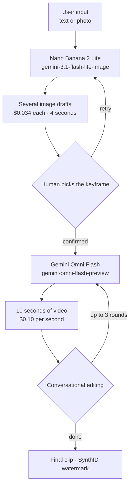

## Why read this

This is for product engineers putting generative media into a product, and for the platform people who have to build the cost table behind it. The conclusion up front: image generation in this pipeline is close to free and the cost sits almost entirely in video seconds. One 10-second clip costs the same as 29 image drafts, so optimizations that cut down on iteration are mostly wasted effort, and what you have to economize is the seconds of finished video you ship. By the end you will know exactly where money leaves the pipeline and at what point you have grounds to evaluate self-hosting.

## Overview

Google opened two models to developers together on June 30, 2026. One is Nano Banana 2 Lite, model ID `gemini-3.1-flash-lite-image`, the fastest and cheapest image model in the Nano Banana family. The other is Gemini Omni Flash, model ID `gemini-omni-flash-preview`, which handles video generation and conversational editing. Both are reachable through Google AI Studio, the Gemini API, and the Gemini Enterprise Agent Platform.

The part of the announcement worth reading closely is not either model's spec sheet but the closing paragraph. Google states plainly that the real value shows up when you chain the two, generating images quickly with Nano Banana 2 Lite and then passing that image as a reference for Omni Flash to bring to life. The three demo apps released alongside are all the same shape: one drops your photo at famous landmarks and animates the scene when you click it, one reimagines a room photo across design aesthetics and turns the chosen one into video, and one converts still images into cinematic e-commerce clips.

This pattern is interesting because the two models have completely different pricing structures. One charges per image, the other per second. And that difference decides where your workflow design has to push.

Teams working with generative media always run into the same thing. This work is iteration by nature. You rarely get the shot you want on the first try, and the quality of the output comes from the process of picking among candidates. The catch is that the shape of your bill changes entirely depending on which stage the iteration happens in. Iterating in the cheap stage is exploration; iterating in the expensive stage is waste. The real reason the chained design is recommended is not the quality pairing, it is that it lets you push iteration onto the cheap side.

## What This Technology Is

Nano Banana 2 Lite is built for places where speed and cost come first. The figures Google published are 4 seconds from text to image and $0.034 per 1K-resolution image. If you are on the first-generation `gemini-2.5-flash-image`, they recommend swapping it out now. Within the family, Lite covers speed, `gemini-3.1-flash-image` (Nano Banana 2) is the balanced generalist, and `gemini-3-pro-image` (Nano Banana Pro) takes the professional work where accuracy matters more than speed.

Gemini Omni Flash is the video side. It accepts text, images, and video mixed together as input, and lets you revise the result in natural language. Pricing is $0.10 per second of output video, which Google notes matches Veo 3.1 Fast. Current generation length is 10 seconds per call, with longer durations described as coming soon.

The four strengths Google highlights are conversational editing in natural language, multimodal referencing that combines images, text, and video to hold a scene consistent, real-world knowledge drawn from Gemini across areas like history and biology, and synchronization that ties text and graphics to actions in the video. The first two bear directly on workflow. Conversational editing means you do not have to start over when the result is off, and multimodal referencing means the image chosen in the previous stage can serve as the reference. That second item is precisely what makes chaining work.

The part that makes chaining practical is the Interactions API. It maintains session history and context so a user can revise in sequence, and the number of edits that can be stacked is three. That limit looks like a constraint but it actually helps workflow design. An interface with unlimited revisions leaves users unsure when to stop, and under per-second billing an interface where people cannot stop is simply cost.

## Pipeline Unit Economics

A disclosure first. This article did not call either model. It makes no claim about latency or quality. We took the two prices Google published in the announcement and did multiplication and division. The calculation script and the resulting JSON are kept in the repository.

The first thing that stands out is the ratio between the two prices. A second of video is $0.10 and an image is $0.034, so one 10-second clip is worth 29.4 image drafts. That single sentence sets nearly the whole optimization priority for this pipeline.

Vary the draft count and per-clip cost looks like this. Take one draft and go straight to video and it is $1.034, with images at 3.3% of the total. Take five and choose among them and it is $1.17 with images at 14.5%. Twenty drafts is $1.68 at 40.5%, and burning fifty gets you to $2.70 at 63.0%, which is finally where images pass video.

A practical conclusion falls out of that. Economizing on image drafts is mostly pointless. Cutting from five drafts to one saves 13.6 cents per clip, and if that costs you a keyframe you actually liked, one extra video call spends a dollar. Design it the other way around. Open the image stage up so people can choose with confidence, and gate the video call so it fires exactly once on a confirmed keyframe. The 4-second image generation time is what makes that generosity affordable inside the user experience.

There is one item you must verify before building on this. How are the three conversational edits billed? Google's announcement says only that you can stack up to three edits and does not say whether each one is billed as new output. If every edit produces a fresh 10-second result counted as output, a clip where the user spends all three costs $4.00 in video alone, four times the first calculation. A cost table built on $1 per clip and one built on $4 per clip are different businesses, so until you have confirmed against actual billing, do not expose an unlimited edit count to users.

Length works the same simple way. Video is billed per second, so stretching a clip from 10 to 20 seconds doubles the video cost to $2.00 with the image spend unchanged on top. Put another way, cutting seconds is the only reliable saving in this pipeline. If you are shipping 10 seconds where 8 would do, those 2 seconds are a fifth of the bill.

Scale makes it plainer. For 1,000 clips it is $1,034 at one draft each, $1,170 at five, and $2,700 at fifty. Loosening the draft policy tenfold, from five to fifty, roughly doubles the total. Doubling clip length doubles the video line exactly.

The baseline for comparing against self-hosting comes from the same division. Whatever hourly rate you pay for a card, the length of Omni output equal to one hour of it is that rate divided by 0.10. At $1 per hour that is 10 seconds, at $2 it is 20, at $5 it is 50, at $10 it is 100, and at $20 it is 200. The hourly rates here are illustrative and the real one comes from your own contract. The direction is clear enough: if a card can produce more than 200 seconds of video in an hour, self-hosting starts to win, and if it cannot, hosted is cheaper. And that comparison still has no line item for the people who keep the model running.

## What This Means for ThakiCloud Products

Paxis is ThakiCloud's Enterprise Agent Platform: it retrieves skills, runs them in an isolated sandbox, and puts every action through a policy gate and an audit log. The reason that structure is needed when generative media enters work automation is not quality, it is per-second billing. A skill that writes documents wastes a few tokens when it misbehaves; a video skill stuck in a loop spends six dollars a minute. Media calls an agent makes need budget ceilings and call-count ceilings written into the skill contract, and they need a human approval point before anything is confirmed. Omni Flash capping edits at three is the provider's answer to the same problem, and the ceiling we put in our workflows should be no looser.

Ceilings alone are not enough; you also have to be able to trace what was actually spent. Under per-second billing, if you cannot identify after the fact which workflow generated the cost, there is no way to reduce next month's bill. The execution traces and cost measurement Paxis records belong here, and media calls in particular are worth annotating down to which skill produced how many seconds in which clip.

Metis takes the other side of this calculation. The break-even above ultimately reduces to what our own token factory can do the same work for, per second. Whether an open video model is held on a Dedicated Endpoint or allowed to ride Serverless with Scale-to-Zero changes the effective per-second cost, and the moment that figure drops below $0.10 there is a reason to bring the workload in. As the [Wan-Animate-2 analysis](/en/llmops/wan-animate-2-onprem-avatar-serving/) we published the same day shows, one open model takes 46.29 GiB in weights alone, so this comparison has to put per-second cost and residency in the same table.

The nature of the assets is another fork. In organizations that cannot send photos containing people's faces or unreleased product imagery to an external API, the decision is made before the price comparison starts. Aegis, the on-premises private cloud, answers there, and in practice a mixed shape is common: run publicly shareable material fast on hosted models and process only the restricted material inside. Keeping both paths behind the same skill interface is what Paxis does.

## Limitations and Counterarguments

Reasons not to decide on price alone are already written into the announcement. Omni Flash is in public preview and the limitation list is not short. Uploading audio references and scene extension are not yet supported in the Gemini API. Video references of three seconds or less are accepted by the API schema but explicitly stated not to be processed correctly by the model, which means the schema admits input that does not actually work, and items like that easily become silent bugs during integration. Character consistency when scenes change or the camera pans is also described as still being improved.

This article's calculation leaves things out too. Retries, failed calls, and requests blocked by safety filters are not in the cost table. In a real service that share may not be small, and under per-second billing one failed video call is worth thirty discarded image drafts. Regional restrictions and the possibility of price changes during preview also remain.

The break-even calculation itself leans one way, and that should be admitted. Dividing an hourly rate by 0.10 assumes the card is busy for the whole hour. Real internal cluster utilization is lower than that, and model loading, idle time, and operator hours appear on neither side of the equation. The point where self-hosting wins is likely further to the right than these numbers suggest.

The narrowness of the comparison is a fair criticism as well. This article calculated only the two models Google opened in the same announcement, and did not put other providers' image and video models in the same table. Where $0.10 per second sits in the market is not something this article answers, and Google's note that it matches Veo 3.1 Fast is a comparison inside its own lineup. Before an actual decision, measure at least two or three providers on per-second cost, maximum length, editing model, and watermark policy on the same axis.

Finally, SynthID watermarking reads both ways. Provenance labeling by default is a clear advantage for enterprise adoption, but it also means the provider owns the watermark. An organization moving to self-hosting has to build that control itself, and that cost does not show up in a per-second comparison.

## Wrapping Up

The money in this pipeline is in the seconds. An image is $0.034 and a second of video is $0.10, so one 10-second clip matches 29 drafts. Burning fifty drafts still lands at $2.70 per clip; economizing to five gets you $1.17. What you lose by picking wrong and rendering again is larger than what you save.

So shape the workflow this way. Leave the image stage open so people can choose with confidence, then gate the video call to fire exactly once on the confirmed keyframe. If an agent makes that call, write budget and call-count ceilings into the skill contract.

Whether to bring it in-house can start with one number: your hourly rate divided by 0.10. Measure whether a card produces that much video in that hour, then add operator time and real utilization to what you measured. Until that table exists, treat hosted as the default.

## Sources

- [Start building with Nano Banana 2 Lite and Gemini Omni Flash (Google announcement)](https://blog.google/innovation-and-ai/models-and-research/gemini-models/gemini-omni-flash-nano-banana-2-lite/)
- [Gemini API image generation docs](https://ai.google.dev/gemini-api/docs/image-generation)
- [Gemini 3.1 Flash Image, Google DeepMind](https://deepmind.google/models/gemini-image/flash/)
