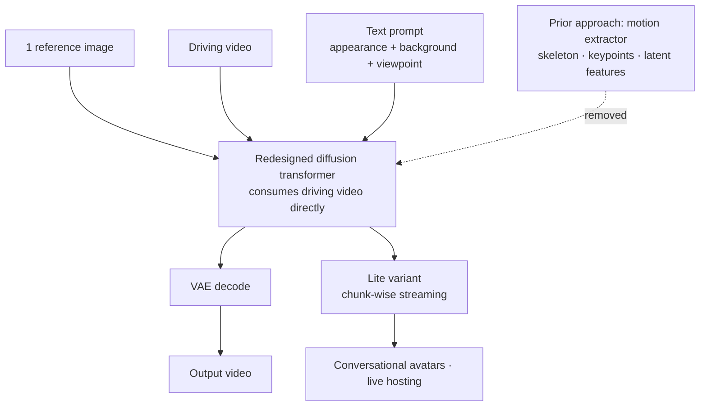

## Why read this

This is for platform engineers and media architects deciding whether to bring digital humans or live avatars onto in-house GPUs. The conclusion up front: the real achievement here is not image quality, it is that a stage was deleted from the pipeline, and that deletion moved character animation from offline rendering into streaming territory. But the weights alone take 46.29 GiB, so "real time" and "one card" are not yet the same sentence, and by the end you will be able to convert that gap into concurrent sessions.

## Overview

Alibaba's Wan team released the Wan-Animate-2 inference scripts, the Base weights, and the distilled weights all on August 7, 2026. The paper landed on arXiv one day earlier, on August 6. The license is Apache 2.0, so nothing in it blocks commercial deployment, and that is a notable choice next to the recent pattern of video models shipping under bespoke licenses with territorial or use-case restrictions.

Character animation takes one reference image and one driving video, and makes the person in the image perform the motion in the video. Ad creative, virtual show hosts, internal training video, and customer-facing avatars all sit on top of that single capability. The problem has been that all of it was offline. You cannot build a talking avatar on a system where you submit a request and wait minutes for a result.

Comparing this with the team's previous generation makes the direction clear. Wan2.2-Animate, released in September 2025, built on the Animate Anyone lineage and offered a mode for transferring motion and a mode for swapping the character. Its focus was on what the model could do. Less than a year later, this generation did not extend that list. It changed when the work can finish. That is why the paper's title talks about pushing application boundaries. Read it as a signal that the competition has moved from image quality to deployment shape.

## What This Technology Is

The paper sorts existing work into three families and points out where each one breaks. The first extracts explicit motion representations such as skeletons or keypoints, where errors introduced during extraction flow straight into the output and the subject's identity drifts frame by frame. The second treats motion as compressed implicit features, and the compression loses fine-grained dynamics like fingertips and facial expression. The third avoids intermediate representations through in-context learning, and pays a prohibitive computational cost.

It is worth noting that all three break in the same place. The problem is not which representation is better, it is that an intermediate stage exists at all. The moment you extract a skeleton, every piece of the source video that the skeleton cannot express is discarded. Among the discarded signal is the way clothing moves and the small habitual drift of a gaze, exactly the things that make a person recognizable as that person. The generation stage cannot restore information that is gone, so it fills in something plausible. Fill in something slightly different on every frame and a few seconds later the person has gradually become someone else. That is usually how identity drift happens.

Wan-Animate-2's answer is not to improve the intermediate representation but to remove it. A redesigned diffusion transformer takes the driving video directly as input. If the motion extractor is gone, so is the error the extractor produced, and the paper reports that this structure raises motion fidelity and identity preservation together. The cost moves inside the model instead. The transformer now has to ingest whole video frames rather than a handful of compressed keypoints, and the residency and hardware requirements we get to below are the bill for that choice.

Text-driven viewpoint control comes with it. In prior approaches, camera information was tangled up in the explicit motion representation, so the output viewpoint was locked to the driving video's viewpoint. Wan-Animate-2 decouples the two, which means a driving video shot head-on can produce a result seen from the side. You can change the camera work without reshooting, and in production that may land harder than any quality gain.

Real time is the job of Wan-Animate-2-Lite. Three-stage training brought latency down to real-time thresholds: teacher forcing pretraining with an error buffer mechanism, then Self-Forcing distillation with chunk-wise backpropagation. Because training is chunked, inference can be streamed in chunks too, and that is what makes streaming character animation possible.



## Installation and Integration

The repository ships submodules so the clone has to be recursive, and the environment pins Python 3.11 with PyTorch 2.7.0 built for CUDA 12.6. Attention comes from flash-attn installed without build isolation.

```bash
git clone --recursive https://github.com/Wan-Video/Wan-Animate-2.git
conda create -n wan_animate_2 python==3.11 -y
pip install torch==2.7.0 torchvision==0.22.0 torchaudio==2.7.0 \
  --index-url https://download.pytorch.org/whl/cu126
pip install -r requirements.txt
pip install flash-attn --no-build-isolation
pip install -e .
```

Weights come down whole from Hugging Face or ModelScope.

```bash
pip install "huggingface_hub[cli]"
huggingface-cli download Wan-AI/Wan2.2-Animate-2-14B --local-dir ./ckpts/
```

One convention in the inference path is worth flagging. Instead of writing the prompt yourself, the docs tell you to caption the reference image with a separate LLM and feed that in. The caption format is pinned too: describe appearance and background only, and leave out actions and any guess at emotion. The reading is that motion already lives in the driving video, so a prompt that duplicates that role would fight with it. The repository examples use Chinese captions.

The distilled model uses different step and guidance settings. Base follows the defaults while the distilled variant runs at 10 steps with classifier-free guidance turned off.

```bash
export PYTHONPATH="$(pwd)"
cd infer
python wan_animate_2_demo.py \
  --prompt "<image caption>" \
  --refer-img-file ../examples/demo1/reference.png \
  --refer-video-file ../examples/demo1/template.mp4 \
  --config ./wan_animate_2_distillation.yaml \
  --sample_guide_scale 1.0 \
  --step 10
```

Check the parallel configuration as well. The repository's default YAML assumes eight A800s, so it will not run as-is on a different card count or card type, and the docs say plainly to adjust the parallel settings in the YAML when your hardware differs. The first wall teams hit when moving this onto an internal cluster is often that config file rather than the model, so put it at the top of your evaluation checklist. If you want to see results before pulling weights, the ModelScope studio demo runs the same model.

You also do not have to use the repository directly. diffusers absorbed the model as `WanAnimate2Pipeline`, and DiffSynth-Studio and ComfyUI integrations were both checked off at release. On the diffusers path the distilled variant wants 10 steps, guidance 1.0, and the euler solver.

```python
from diffusers import WanAnimate2Pipeline

pipe = WanAnimate2Pipeline.from_pretrained(
    "Wan-AI/Wan2.2-Animate-2-14B-Distilled-Diffusers",
    torch_dtype=torch.bfloat16,
).to("cuda")
output = pipe(
    image=load_image("reference.png"),
    driving_video="template.mp4",
    prompt="<image caption>",
    num_inference_steps=10,
    guidance_scale=1.0,
    flow_solver="euler",
)
```

## Measured Results

Let us be straightforward first. We did not run this model. The repository states its defaults are tuned for eight A800s at 720P and that 480P was tested on two A800s, which is not something a laptop reproduces. So we measured what could be measured with certainty instead. We pulled the actual file sizes the Hugging Face API reports, broke the checkpoint down by component, and divided by card capacity. Every number below comes out of that arithmetic, and none of it claims anything about speed or quality.


The DiT itself is 30.54 GiB. Add the umT5-XXL text encoder at 10.58 GiB, the CLIP vision encoder at 4.44 GiB, and the VAE at 0.73 GiB, and one working copy needs 46.29 GiB of weights. Notice that the three encoders account for 15.76 GiB, a third of the total. If you plan to run multiple instances, sharing the encoder stack pays off immediately at that size.

On disk it is larger still. Base and distilled are both 30.54 GiB, so pulling both plus the encoders means 76.83 GiB, and that is the number to check first if you bake weights into a node image.

Seated on a card, it looks like this. On one H200 NVL the weights take 32.8% and leave 94.7 GiB. On an H100 or A800 80GB they take 57.9% and leave 33.7 GiB. On an L40S 48GB they fill 96.4% and leave 1.7 GiB, which cannot cover activations and frame buffers, so treat it as not fitting. This explains why the repository used two A800s even at 480P: once weights eat half the card, everything generation actually consumes has to fit in the other half.

The encoder third turns into a design variable as soon as you think about concurrent sessions. The text encoder, vision encoder, and VAE are read-only, so there is no reason for each session to hold its own. Two sessions naively cost 92.59 GiB, but sharing the encoders brings that to 76.83 GiB and saves 15.76 GiB. Four sessions go from 185.18 GiB to 137.91 GiB, saving 47.27 GiB, and that lands just inside a single H200's 141 GiB. Just inside applies to weights only, though, with nothing left for generation, so two concurrent sessions is the realistic target on one card. At eight sessions even the shared layout reaches 260.06 GiB and stops being a one-card question.

This is where the phrase "real time" needs rereading. What Lite lowered is latency, not residency. Streaming becoming possible also means attaching this much card per concurrent session, so the cost of an avatar service is set by concurrency rather than by image quality.

## What This Means for ThakiCloud Products

This model is interesting not because it is video technology but because it adds a kind of artifact that work automation can produce. Paxis is ThakiCloud's Enterprise Agent Platform: it retrieves skills, runs them in an isolated sandbox, and puts every action through a policy gate and an audit log. Until now the artifacts agents produced were documents, tables, and code. Once character animation becomes a streamable workload, video with a human face on it joins that list. Turning an internal announcement into an avatar reading it, or generating a response clip from a support history, used to be a batch job in the offline rendering era. Now it can run inside a conversation.

The shape of the workflow changes too. With offline rendering it was natural for a person to review the result and ask again. With streaming, you cannot take it back once generation starts. So the approval point moves from behind the output to in front of the input. Which face may be used, whether consent is attached to that asset, and how far it may be made to speak all have to be decided by a policy gate before the render. The human approval and audit logging Paxis places around skill execution fit exactly there.

Metis answers the execution economics. A model with 46.29 GiB of residency is expensive to keep warm and slow to wake on demand. Whether you hold it on a Dedicated Endpoint or let it ride Serverless with Scale-to-Zero is the cost decision, and arranging for many sessions to share those 15.76 GiB of encoders is settled at the same layer. The execution infrastructure bursts onto Telox GPU clusters or runs on Velox bare metal with the virtualization overhead stripped out, depending on what the workload needs.

What really divides this workload, though, is data rather than performance. The reference image is usually a real person's face, and the driving video carries voice and movement together. Many organizations cannot send assets entangled with likeness rights and personal data to an external API, and in finance, public sector, defense, and manufacturing it is effectively impossible. Aegis is the on-premises private cloud that meets that requirement head-on, and Apache 2.0 weights are the precondition that lets the same model run inside a closed network. Cleanly licensed open weights carry more weight in an on-premises proposal than a benchmark score does.

## Limitations and Counterarguments

The first thing to flag is the nature of the performance claims quoted here. The paper says its results are supported by qualitative evaluation and user studies, and it does not present a table of quantitative numbers on widely used character animation benchmarks. The statements about improved motion fidelity and identity preservation should be read inside the authors' own evaluation framing, and comparing against another model means measuring on your own assets.

Real time is conditional too. The paper says Lite brought latency to real-time thresholds, but this article did not measure that latency, and the repository documentation alone does not pin down at what resolution and on what hardware. Given the residency above, that threshold likely assumes several A800s.

There is operational friction as well. Being told to caption the prompt with a separate LLM means adding another model to the pipeline, and since the repository examples use Chinese captions, whether other languages reach the same quality needs checking. The caption rule that forbids describing motion also demands a validation step from anyone automating this.

Finally there is the risk in the capability itself. A function that puts arbitrary motion onto a real person's face is an impersonation tool as it stands. Open weights place controls such as watermarking outside the model, so any organization putting this into a service has to own consent management, provenance labeling, and audit trails at the platform layer. This is the area where the identity and audit events Signum handles stop being optional and become a precondition.

## Wrapping Up

Wan-Animate-2 removed the intermediate motion extractor from character animation, and that structural change delivered a shift in deployment shape before it delivered a shift in quality. Work that was an offline batch became a streaming workload, which opens up conversational avatars and live hosting as new uses.

At the same time, the numbers we actually measured put a price tag on that possibility. Weights alone are 46.29 GiB, already 32.8% of one H200 and 57.9% of an 80GB card. They do not fit on a 48GB card. When you carry the word "real time" into service design, convert it into cards per concurrent session rather than milliseconds.

Two things to do now. If you are evaluating avatars or video-based support, pull the Apache 2.0 weights and measure at 480P with your own reference images and driving video, then multiply that result by your concurrency target to build a cost table. That table decides whether you use an external API or bring the workload in-house by arithmetic rather than by preference.

## Sources

- [Wan-Animate-2 GitHub repository](https://github.com/Wan-Video/Wan-Animate-2)
- [Wan-AI/Wan2.2-Animate-2-14B model card](https://huggingface.co/Wan-AI/Wan2.2-Animate-2-14B)
- [Wan-Animate-2: Pushing the Application Boundaries of Character Animation (arXiv:2608.06009)](https://arxiv.org/abs/2608.06009)
- [Project page](https://humanaigc.github.io/wan-animate-2)
