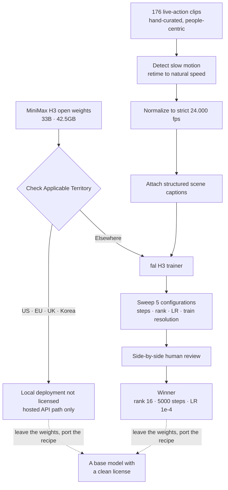

*A line has appeared between what you can download and what you can learn.*

## Why read this

This is for ML engineers and technical leads weighing whether to fine-tune a video generation model on their own domain data, particularly outside the territories these licenses cover. The conclusion up front: the transferable asset in this week's H3 LoRA release is not the weights, it is the training recipe, and that recipe survives a change of base model.

Fine-tuning discussions usually start with which base to pick. This case gives you a reason to invert that order. What went public alongside the adapter was a record of how the data was gathered and how the configuration was chosen, and that second half is not governed by the license. Below we take the record apart item by item, then work out how a team outside the Applicable Territory can transplant it into their own stack.

## Overview

MiniMax shipped H3 on July 31 and opened the base weights on August 3. It is a 33B transformer, published on Hugging Face and ModelScope, with a minimum download of 42.5 GB. Structurally what sets it apart is that it understands text, images, video, and audio in a single context and generates stereo audio in the same forward pass. A single generation accepts up to 9 reference images, 3 reference video clips, and 3 reference audio clips.

What happened next is the interesting part. Less than a week after the weights landed, the adapter training stack was in place. fal shipped a dedicated H3 trainer, ostris's AI-Toolkit gained H3 LoRA support with a one-click launch path through pinokio, and guidance appeared for training an H3 LoRA on a single 24 GB card. Gaps this short between a base model release and a working adapter ecosystem have not been common on the video side.

One product of that wave is `fal/MiniMax-H3-Realism-People-LoRA`. It is an adapter specialized in realistic people, and what makes its model card unusual is that it does not just post the result. It describes, in some detail, how the result was made.

## What was actually released

The adapter's target is specific: faces that hold up in close-up, skin that keeps its texture instead of smoothing out, expressions and hand gestures that do not read as wrong. On top of that sits light that behaves like a film set and the subtle handheld quality of documentary camera work. H3's native synchronized audio generation survives the adapter.

As the name suggests, this is not the first attempt. It succeeds `MiniMax-H3-Realism-LoRA` and was retrained on a larger dataset focused on people. That also means the same team went around the same base a second time and left a record of what they changed.

## Taking the recipe apart

The most valuable part of what was published is not the final configuration. It is how the data was handled.

Training used 176 live-action clips. Not tens of thousands scraped together, but 176 chosen by hand, all centered on people: portraits and faces, workers, athletes, everyday characters. Video fine-tuning carries a folk belief that dataset size is quality, and this case argues the other way. When the target behavior is narrowly defined, 176 clips get you there.

Two preprocessing steps stand out. The first is slow motion. Slow-motion footage that had made it into the set was detected and retimed back to natural speed. Skip that step and the model learns slow movement as the default for footage of people. The second is frame rate normalization, and the card says strictly 24.000 fps rather than simply 24. Spelling out the decimals reads as someone who knew what happens to the time axis when 23.976 and 24 get mixed together. Each clip then received a structured scene caption.

The configuration search is on the record too. Five configurations were trained across variations in steps, rank, learning rate, and training resolution, and the final pick came from a human comparing the results side by side. The winner was rank 16, 5000 steps, learning rate 1e-4.

What matters more than those numbers is the selection method. The final judge was human comparison, not an automated metric. That is a design that accepts a real constraint, namely that quality in photoreal human footage resists numeric definition, and a sweep of five is a realistic width. Fine-tuning projects commonly sink their time into building a metric first. This one built a small set of candidates and had a person choose.

## Except you cannot run these weights here

That was the good news. Now the condition that applies to teams in the excluded regions.

The MiniMax H3 Community License took effect on August 2, and its definition of Applicable Territory excludes the United States, the European Union, the United Kingdom, and South Korea. The exclusion is not narrow. In those regions you are not licensed to use, run, modify, or distribute locally-run H3 weights, nor to distribute their Outputs. The hosted API, by contrast, remains available worldwide. What is restricted is not access to the model but the local open-weight path.

MiniMax has given different reasons by region. Its Head of Developer Relations confirmed that the US restriction stems from active copyright litigation with Hollywood studios. For the EU, the UK, and South Korea, the company cites a shifting regulatory environment around synthetic video, likeness generation, copyright, content safety, and responsible deployment. US developers have a route to individual authorization, and MiniMax has said it will issue licenses to applicants who commit to content compliance mechanisms meeting US legal requirements. No equivalent route has been described for Korea in the same terms.

When we opened six open video model licenses side by side last week, we found that excluding Korea from the Applicable Territory is not a new practice. That comparison is written up in [our audit of territory restrictions in open video model licenses](/en/llmops/open-video-model-license-territory-audit/). This H3 case is closer to one more entry in an existing pattern than a departure from it.

Put that condition next to the recipe above and the two separate cleanly. Adapter weights only mean something on top of a base, and if that base cannot legally run locally here, the adapter is pinned in the same place. But the sense of scale that 176 conveys, the ordering of slow-motion retiming and 24.000 fps normalization, the practice of narrowing to five candidates and letting a person choose, and rank 16 as a starting point are none of them bound to a particular set of weights.

## What we verified and what we did not

We want to be explicit that we did not download the weights and reproduce any of this. We operate from Korea, and running H3 locally from outside the Applicable Territory is not something the license permits. We did not skip the reproduction because we could not do it. We skipped it because not doing it is the correct answer.

Every number in this article therefore comes from public documentation, and none of it was measured by us. That covers the 176-clip dataset size, rank 16 and 5000 steps, the 1e-4 learning rate, 33B and 42.5 GB, and the August 2 effective date. How good this adapter's output actually is, and how long training takes on a single 24 GB card, are things we did not measure and therefore do not claim here.

One more thing stays open: whether this recipe holds when carried to a different base. The number 176 was almost certainly produced against H3's pretraining distribution. Change the base and the data volume you need may change with it, and that is something you only learn after transplanting it.

## What this means for ThakiCloud

Read through a Paxis lens, this case gets large. Paxis is our enterprise agent platform: it retrieves skills, runs them in an isolated sandbox, and puts every action through a policy gate and an audit log. The moment video asset generation enters a business workflow, which model runs in which region under which license becomes an execution policy question. While model choice stays a developer preference, a license clause is a document. Once that model is invoked hundreds of times a day inside an automated workflow, a clause violation repeats at the same rate. Enforcing territory and Outputs clauses in code at the policy gate and recording that judgment in an audit log is what Signum covers, and the more licenses look like this one, the closer that moves to a precondition rather than an option.

On the training side, Maxis takes this recipe directly. Curating 176 clips, normalizing frame rate, attaching structured captions, sweeping a small candidate set, and closing with human comparison is a pipeline shape that holds regardless of base model. Maxis is the layer that feeds execution results back as training data to build customer-specific models, and what that needs is not somebody else's adapter weights but the ability to run the same procedure over your own assets. That procedure is exactly what this release makes available.

Execution economics split between Metis and Telox. A workload that attaches and detaches several rank 16 adapters keeps the base weights resident and swaps only the adapter, which puts you in the region where choosing between a Dedicated Endpoint and Serverless is the cost decision. Training itself is not a steady load, so bursting it onto a Telox GPU cluster is the natural shape.

And securing a cleanly licensed base becomes an asset in its own right for on-premises work. Putting video generation inside a customer's air-gapped network on Aegis requires the model to run legally inside that network, and this case demonstrates that bases failing that condition genuinely exist. As we confirmed last week, Apache 2.0 options remain, and this recipe can be transplanted onto them.

## Limitations and counterarguments

The strongest objection first: taking only the recipe may not be worth much. The hard part of fine-tuning is not the unknown configuration value, it is gathering and cleaning the data, and the labor of hand-picking 176 clips does not shrink because you know the number 16. That is fair. But the configuration was not the only thing this release disclosed. Knowing that 176 is enough is information that decides whether a project starts at all, and for a team that had assumed tens of thousands of clips, that is worth more than the hyperparameters.

Second, this article contains no independent evidence that the adapter's quality is actually good. The characteristics the model card describes are claims by the people who built it, and the humans who compared the five candidates were on the same team. In a domain as subjective as photoreal human footage, self-evaluation alone deserves careful reading.

Third, the licensing situation is not fixed. Just as a route to individual authorization opened for the US, conditional routes may appear elsewhere, or the regulatory climate may tighten and widen the restriction. The judgment here is based on a document effective August 2, and any team actually deciding to adopt should reread the original text at that time.

Finally there is the risk inherent in what the model does. The ability to realistically generate a real person's face and expressions is not distinguishable from an impersonation tool. That the regulatory environment was named as grounds for the territory restriction is unlikely to be unrelated. Organizations putting this kind of capability into a product carry consent management and provenance disclosure themselves, outside the model.

## Wrapping up

The H3 adapter ecosystem assembled itself in a week, and along the way the methods for gathering data and choosing configurations were published with it. That one photoreal human adapter took 176 hand-picked clips, five sweeps, and human comparison is the core of this release.

For teams in the excluded regions, the news arrives half-delivered. Korea sits outside the Applicable Territory, so the weights stay behind. The remaining half is not small. The sense of scale, the preprocessing order, and the practice of narrowing candidates for a human to judge all transplant independently of the license, and those are the parts that actually consume time in a fine-tuning project.

Two things to do now. If you are considering video fine-tuning, open the territory and Outputs clauses of your candidate bases first, then run this recipe's sequence once on a base that passes. How long it takes you to gather 176 clips is the real difficulty of the project, and knowing that number first helps the decision more than knowing the hyperparameters first.

## Sources

- [fal/MiniMax-H3-Realism-People-LoRA model card](https://huggingface.co/fal/MiniMax-H3-Realism-People-LoRA)
- [MiniMaxAI/MiniMax-H3 open weights](https://huggingface.co/MiniMaxAI/MiniMax-H3)
- [MiniMax-AI/MiniMax-H3 official repository](https://github.com/MiniMax-AI/MiniMax-H3)
- [Reporting on the territory restrictions in the H3 open weights](https://www.techtimes.com/articles/322904/20260804/minimax-h3-open-weights-exclude-us-eu-uk-korea-local-deployment.htm)
- [Background on the H3 license restrictions](https://www.kucoin.com/news/flash/minimax-restricts-h3-license-in-u-s-eu-uk-and-south-korea-due-to-hollywood-copyright-lawsuit)
- [Overview of the MiniMax H3 open weights](https://huggingface.co/blog/ResterChed/minimax-h3-hailuo-3-0)
- [awesome-minimax-H3 community resource list](https://github.com/wildminder/awesome-minimax-H3)
