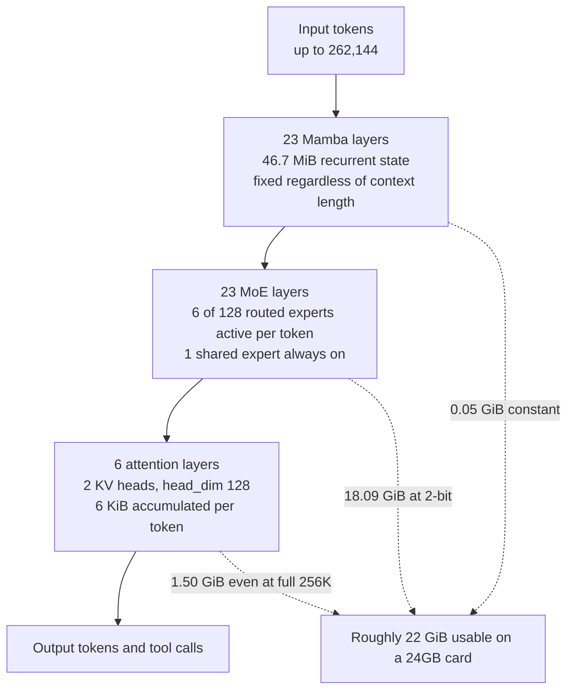

*The question was never what you compressed. It was what you put in the space you freed.*

## Why read this

This is for ML engineers and infrastructure owners deciding whether to self-host a long-running tool-calling agent on a single-GPU budget. The conclusion first: when you put Nemotron 3.5 Lightning on a 24GB card, the thing that stops you is the weights, not the long context, which means picking a quantization tier is the whole deployment decision.

Long-context agents usually start a conversation about KV cache. Call a few dozen tools, pull in a few dozen web pages, and the context balloons. This model inverts that instinct. Below we measure all 17 published quant files, read the upstream config, and show why it inverts and which tier you should actually pick.

## Overview

On 12 August, Unsloth reported that their 2-bit quantization of NVIDIA Nemotron 3.5 Lightning ran tool calls nonstop for ten minutes on just 22GB of VRAM, citing more than 80 websites, executing code, and searching for ten real-world locations. That report is Unsloth's own demo result, not a number we reproduced, and we want to be clear about that up front.

What interested us was the precondition. Squeezing a 30B model into 22GB is explained by aggressive quantization. But calling tools for ten minutes and citing 80 sources demands a lot of context, and long context usually eats VRAM through the KV cache. If the weights barely fit in 22GB, there should be no room left for the cache.

So we measured it. We have no local GPU runtime, so we could not run the model itself. Instead we collected every published GGUF file size and the full upstream config, then worked out the memory budget. The result did not match our expectation, and the gap turned out to be the whole design story.

## What this model is

Nemotron 3.5 Lightning 30B-A3B is, as the name says, a Mixture-of-Experts model with 30B total parameters and 3B active. It is not an ordinary MoE transformer, though. The model card describes the architecture as a "Mixture-of-Experts Hybrid (Mamba + Transformer)", and the upstream `config.json` shows exactly what that phrase means.

The 52 layers break down like this: 23 Mamba layers, 23 MoE layers, and only **6 attention layers**. There are 128 routed experts with 6 selected per token, plus 1 shared expert always on. The attention side runs aggressive GQA with 2 KV heads and a head_dim of 128.

That arrangement changes the memory character completely. Only the attention layers accumulate a KV cache that scales with token count. The Mamba layers carry a fixed-size recurrent state that does not grow with context at all. Compared with a model where all 52 layers attend, the per-token cache burden lands in a different class entirely.



Pretraining ran on more than 20 trillion tokens using an NVFP4 recipe. The model includes Multi-Token Prediction layers, and two separate draft models named DSpark and DFlash ship alongside it for speculative decoding. The card states context support up to 1M tokens while noting that a single-H100 deployment uses 256K, and `max_position_embeddings` in `config.json` is 262,144. The calculations below use 262,144 as the ceiling.

## Installation and integration

As of 13 August the Unsloth GGUF repository holds 19 GGUF files. Pull only the tier you need. Downloading everything costs more than 400GB.

```bash
# Fetch just one 2-bit tier
hf download unsloth/NVIDIA-Nemotron-3.5-Lightning-30B-A3B-GGUF \
  --include "*UD-IQ2_XXS*" \
  --local-dir nemotron-lightning
```

Serve it with a llama.cpp-family server. Tool calling needs the `--jinja` flag so the chat template is applied.

```bash
llama-server \
  -m nemotron-lightning/NVIDIA-Nemotron-3.5-Lightning-30B-A3B-UD-IQ2_XXS.gguf \
  --ctx-size 262144 \
  --jinja \
  --host 0.0.0.0 --port 8080
```

One caveat matters here. The `model_type` is `nemotron_h` and the model uses a Mamba hybrid stack, so you need a recent build that supports that architecture. Older llama.cpp binaries fail at load time. For sampling, start from the card's recommended temperature 1.0 and top_p 0.95.

What we actually ran was not the model but a measurement script. It pulls file sizes from the HuggingFace tree API, sums them per tier, and reads the layer composition from the upstream config to compute the KV cache.

```python
# Only attention layers accumulate a KV cache
blocks = Counter(config["layers_block_type"])
# {'mamba': 23, 'moe': 23, 'attention': 6}

kv_per_token = 2 * blocks["attention"] * config["num_key_value_heads"] \
                 * config["head_dim"] * 2   # K and V, fp16
# 2 * 6 * 2 * 128 * 2 = 6,144 bytes

# The Mamba recurrent state is constant per sequence
ssm = config["mamba_num_heads"] * config["mamba_head_dim"] \
        * config["ssm_state_size"] * 4
```

## Measured results

File sizes first. Sorting 17 tiers by size surfaced a range we did not expect.

| Tier | Weights | Tier | Weights |
|---|---|---|---|
| UD-IQ1_M | 18.09 GiB | UD-Q4_K_M | 23.53 GiB |
| UD-IQ2_XXS | 18.09 GiB | UD-Q5_K_S | 24.42 GiB |
| UD-IQ2_M | 18.10 GiB | UD-Q5_K_M | 28.14 GiB |
| UD-IQ3_XXS | 18.40 GiB | Q8_0 | 32.60 GiB |
| UD-IQ3_S | 19.70 GiB | UD-Q8_K_XL | 35.96 GiB |
| UD-Q3_K_XL | 19.78 GiB | BF16 | 61.33 GiB |

The 1-bit tier UD-IQ1_M and the 2-bit tier UD-IQ2_XXS are **both 18.09 GiB**, identical to two decimal places. Checking the filenames confirms they are genuinely separate files. Unsloth's Dynamic scheme keeps quality-critical layers at higher precision, so no matter how hard you crush the routed experts there is a floor sitting around 18GB. The practical takeaway is blunt: **there is no reason to pick the 1-bit tier.** Same footprint, worse quality.

Second, the KV cache. Assume all 52 layers attend and you get 52.0 KiB per token. Compute it against the real hybrid structure and you get 6.0 KiB per token. That is an **8.7x difference**. Filling all 262,144 tokens costs only 1.50 GiB of KV cache, and the Mamba recurrent state totals 46.7 MiB across all 23 layers regardless of context length.


*Left: total VRAM per tier. Right: the per-token KV cache difference the hybrid structure creates.*

Put the two together and, against the 22 GiB a 24GB card realistically exposes, the table looks like this.

| Tier | Weights | 256K KV | Mamba state | Total | Verdict |
|---|---|---|---|---|---|
| UD-IQ2_XXS | 18.09 | 1.50 | 0.05 | 19.64 GiB | comfortable |
| UD-IQ3_XXS | 18.40 | 1.50 | 0.05 | 19.95 GiB | comfortable |
| UD-IQ3_S | 19.70 | 1.50 | 0.05 | 21.25 GiB | fits |
| UD-Q3_K_XL | 19.78 | 1.50 | 0.05 | 21.33 GiB | fits |
| UD-Q4_K_S | 22.79 | 1.50 | 0.05 | 24.34 GiB | over budget |
| UD-Q4_K_M | 23.53 | 1.50 | 0.05 | 25.08 GiB | over budget |

Here is the point. All 7 tiers that fit inside 22 GiB can run the **full 262,144-token maximum**. You never have to shorten the context to make room. Conversely, every tier at 4-bit and above blows the budget on weights alone, even with the context set to zero. On this card the only variable you can actually turn is the quantization tier.

Unsloth's report of ten minutes of continuous tool calling at 22GB is consistent with this structure. Load 2-bit weights and you still have more than 2 GiB spare, and that headroom holds well over a hundred thousand tokens of conversation history and page text. Citing 80 sources requires those pages to stay resident, and at 6 KiB per token that is affordable.

We should be equally clear about what we did not measure. **We did not reproduce throughput or quality.** With no local GPU runtime we could not measure tokens per second, and how much 2-bit quantization degrades tool-calling accuracy is outside this measurement. Every number above is memory arithmetic derived from file sizes and config values. Real inference speed and accuracy need separate verification.

## What this means for ThakiCloud

This measurement lands squarely on a problem we hit repeatedly running Metis and Paxis together.

**Through the Metis lens**, it shows that judging placement by parameter count alone is dangerous. Two 30B models can differ by more than 8x in their long-context VRAM curve depending on whether the stack is hybrid or pure transformer. If the Metis serving layer read layer composition at registration time, alongside parameter count and quant tier, it could precompute the memory curve per context length and answer "does this fit on that card" before anything is scheduled. The formula we used here is exactly that calculation. The tighter the environment, as with on-premise customers who cannot simply add GPUs, the more that judgment has to be right the first time.

**Through the Paxis lens** a different angle appears. Paxis is our Agent-Native Cloud control plane, treating skills, tools, policies, and audit logs as first-class resources, and context accumulates as agents call tools over long horizons. Yet much of that agent work needs no frontier reasoning: tool invocation, result validation, formatting, classification. Pushing that layer onto a model that fits on one card changes the token cost structure. What this measurement says is that the option now fits inside a single 24GB budget. Which skills you actually demote is a decision that comes after accuracy testing, and the Paxis policy gate is where that boundary gets enforced.

The two connect. Serving has to get cheap before you can run agents long, and agents have to run long before automation covers real work.

## Limits and counterarguments

The 22 GiB budget is itself an assumption. Actual available VRAM shifts with driver, runtime, and whether the card is also driving a display, and we did not account for activation buffers or fragmentation. In practice, assume another 1 to 2 GiB disappears.

Computing the KV cache at fp16 is the conservative choice. Quantizing the cache to 8-bit halves it, but on this model the space you save does not matter much, because context was never the bottleneck. The 0.75 GiB you recover does not move you up a tier.

The biggest unverified area is quality. That an 18.09 GiB floor exists means Unsloth protected the important layers, but it does not mean the 2-bit model matches 4-bit. Tool calling in particular produces structured output, which can be sensitive to quantization damage, and one wrong argument name fails the whole call. Before adopting this you need a stage that measures call success rate against your own tool schemas.

Finally, this arithmetic assumes a single concurrent request. Serving multiple sessions multiplies the KV cache and Mamba state by session count. The per-session burden stays small, though, so the structure remains favourable for concurrency too.

## Wrapping up

Putting Nemotron 3.5 Lightning on a 24GB card leaves you one variable: the quantization tier. Context costs only 1.50 GiB even at maximum, because 6 of 52 layers use attention. Avoid the mistake of worrying about long context, reaching for a higher tier, and ending up unable to load the model at all.

Two things to do now. First, drop the 1-bit tier from your shortlist. It is the same size as 2-bit and only costs you quality. Second, pull UD-IQ2_XXS or UD-Q3_K_XL and measure call success rate against your own tool schemas. This post settled whether it fits in memory, so quality is the one question left.

More broadly, when you evaluate a model, write the layer composition next to the parameter count. Cases where that gap is 8.7x are going to get more common.

## Sources

- [Original Unsloth AI post (X)](https://x.com/UnslothAI/status/2087598047589196052)
- [unsloth/NVIDIA-Nemotron-3.5-Lightning-30B-A3B-GGUF (HuggingFace)](https://huggingface.co/unsloth/NVIDIA-Nemotron-3.5-Lightning-30B-A3B-GGUF)
- [NVIDIA Nemotron 3.5 Lightning run guide (Unsloth Docs)](https://unsloth.ai/docs/models/nemotron-3.5)
- [ggml-org/NVIDIA-Nemotron-3.5-Lightning-30B-A3B-GGUF (HuggingFace)](https://huggingface.co/ggml-org/NVIDIA-Nemotron-3.5-Lightning-30B-A3B-GGUF)

Measurements were taken on 13 August 2026 against the HuggingFace tree API and the upstream `config.json`. All file sizes and config values were read directly from API responses.
