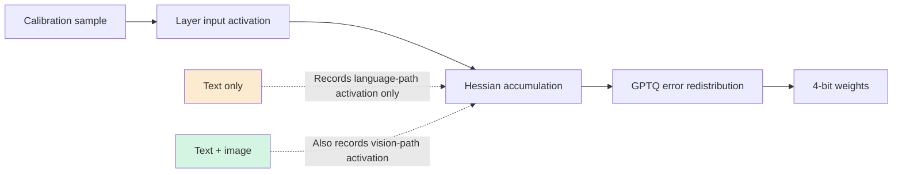
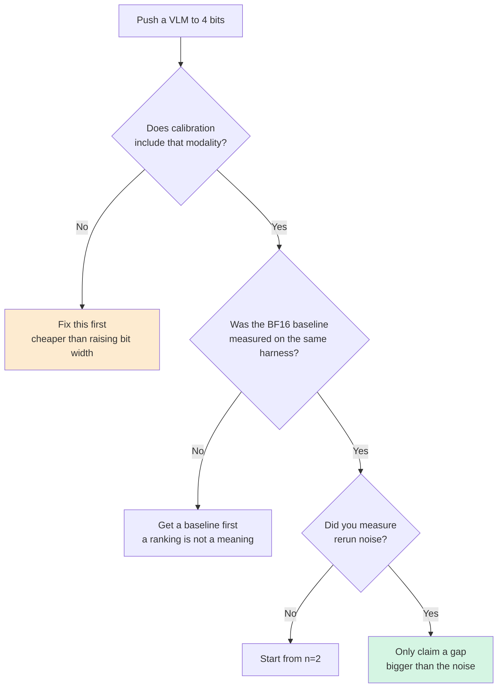

If you're pushing a vision-language model down to 4 bits to serve on-prem, check the calibration set before you worry about bit width. We applied the same quantization recipe to the same model twice and only changed the calibration data, and the MMMU score moved by 1.89 points. That's more than five times the rerun noise we measured.

*Visualizing the core idea of this piece.*

## The result of changing only the calibration set

The target is Muse-Glimmer-30B, a dense 30B-scale image-text model with an existing public NVFP4 variant, giving us a clear point of comparison. We fixed a GPTQ-based NVFP4 recipe and split the calibration set into two versions: one of 1,024 text-chat corpus samples, and another where 512 of those same 1,024 were swapped for VQA samples with images attached.

| Build | Calibration | MMMU-val | Size |
|---|---|---|---|
| BF16 original | N/A | 0.4922 | 55.49 GB |
| Image-mixed calibration | Text + image | 0.4878 | 23.41 GB |
| Public NVFP4 baseline | Text only | 0.4800 | 21.80 GB |
| Text-only calibration | Text | 0.4689 | 23.41 GB |

We ran each candidate twice on a single B200 and evaluated all 900 MMMU-val questions. The spread between reruns was only 0.36 points.

Here's how to read it. The same recipe, calibrated on text only, scores 1.11 points below the public baseline, while the image-mixed build scores 0.78 points above it. And the image-mixed build sits within 0.44 points of the BF16 original. That means visual reasoning survives essentially intact even after shrinking the weights 2.37x, on the condition that images are included in calibration.

## Why calibration data reaches this far

This result may seem puzzling at first, because in NVFP4 the activation scale is set dynamically, per group, at runtime. So calibration data doesn't determine the activation scale.

Where calibration actually acts is on the weights. GPTQ streams calibration samples through and accumulates second-order statistics, the Hessian, for each layer's input, then uses that to redistribute the error from rounding one weight onto the remaining weights. So what calibration data does is tell the model which direction of error actually hurts.

This is where the problem with text-only calibration shows up. The activation pattern that image tokens create when they pass through the language head never appears in the Hessian. That direction of error was never flagged as hurting, so it gets left out of the correction, and the vision path's quantization error survives intact.

Figure 1. Calibration data influences weight correction through the Hessian, not the activation scale.

This explanation fits the data, but we haven't proven it directly. We didn't run a control that isolates the vision path's Hessian contribution alone, so here we're leaving it as a hypothesis consistent with what we observed, not a proven claim.

## On the text axis, the algorithm is what pays off

In the same campaign, we also worked with a text-only MoE model, Qwen3-30B-A3B. This time we fixed the calibration set and only changed the weight-update algorithm: GPTQ, which corrects using the Hessian, versus RTN, which only observes.

The BF16 original scored 77.79 on MMLU; the GPTQ build scored 76.43, and the RTN build scored 76.19. GPTQ leads RTN by 0.24 points, but both drop more than a point from the original. What the extra 5.4 hours GPTQ took buys you is that 0.24-point edge over RTN.

⚠️ **Correction (2026-08-13).** This spot originally reported 77.43 / 76.76 measured on H200, with the claim that "GPTQ is statistically indistinguishable from BF16." But **Hopper has no FP4 tensor cores.** That measurement came from a path that unpacks the 4-bit weights and computes in higher precision, not from actual NVFP4 arithmetic. Re-measuring the same files on a B200, where native FP4 actually runs, widened the BF16 gap from 0.36 points to 1.36 points, four times the sampling error the harness reports (±0.34 points). **"Indistinguishable" does not hold on the hardware NVFP4 will actually be deployed on.** That's why which GPU a 4-bit model's score was measured on is part of the spec, not a footnote.

There's one more thing this confirmed. Our RTN build reproduced the public NVFP4 baseline within 0.01 points. That matches our earlier finding that the public checkpoint was built with RTN, not GPTQ, and it also shows we can faithfully replicate someone else's recipe.

## One baseline flipped the sign of the conclusion

This part is a lesson that will outlast the numbers, so it gets its own section.

While the BF16 baseline row was empty, the table above read completely differently. Comparing candidates against each other alone, GPTQ looked like it won on MMLU and lost on gsm8k, and we had even written up a conclusion along the lines of "which benchmark you pick decides the winner." Once the BF16 number came in, the structure changed. On gsm8k, all three candidates scored above the original. The sign was consistent, but the margin was indistinguishable from sampling noise, meaning nobody actually lost anything on that axis. The only axis that genuinely split was MMLU.

An A/B comparison without a reference point gives you a ranking. It doesn't tell you what that ranking means. If you push the original-model measurement to the back of your quantization-comparison plan, you can end up, like we did, stuck on a wrong sentence for hours.

## A number you should not cite

In the same run, the ChartQA metric split three ways. exact_match came in at 0.053, while relaxed hit 0.405 and anywhere hit 0.414. One metric collapsing to an eighth of the others isn't a sign of model capability, it's a sign that answer extraction failed. This model reasons, and it emits chain-of-thought around the answer, which exact_match fails to strip out.

Relaxed and anywhere agree within 0.9 points, so they're usable for comparing candidates on the same harness. But you shouldn't cite a number like "this model scores in the 40s on ChartQA" as absolute performance. That number is measuring the harness's extraction limits along with the model.

## Taking this to production

Figure 2. The order for judging 4-bit VLM quality. The top two branches are where we actually got tripped up.

Here's the summary. When you quantize a multimodal model, calibration-set composition isn't a per-deployment judgment call, it's something to fix during preparation. Raising the bit width or changing the algorithm comes after that. Including the relevant modality in calibration is far cheaper, and in our measurements it paid off more.

And when you claim a quality result, keep three things together: the original baseline, a noise floor measured by rerunning, and a gate where code, not a person, makes the call. Thanks to that last item, we didn't release the text-only build. A gate is only a gate if it actually drops something.

## What we released and what we didn't

The gate-passing image-mixed calibration build is released as [ThakiCloud/Muse-Glimmer-30B-NVFP4-GPTQ-mm](https://huggingface.co/ThakiCloud/Muse-Glimmer-30B-NVFP4-GPTQ-mm). It carries forward the original apache-2.0 license, and the model card documents the recipe, calibration composition, benchmark protocol, noise floor, and the axes we didn't measure. The text-only build failed the gate, so we didn't release it.

We're also stating the limits. The conclusions come from two benchmarks, MMMU and ChartQA, and a single quantization seed. We measured evaluation noise by rerunning, but not the variance from redrawing the calibration sample. We didn't touch safety, OCR, long-context, or multilingual axes, so we make no BF16-equivalence claim on those.

The numbers above are not from simulation or vendor citation. They were measured directly on a single B200 in our own cluster.

## References

- [ThakiCloud/Muse-Glimmer-30B-NVFP4-GPTQ-mm (Hugging Face)](https://huggingface.co/ThakiCloud/Muse-Glimmer-30B-NVFP4-GPTQ-mm)
- [RedHatAI/Muse-Glimmer-30B-NVFP4 (Hugging Face)](https://huggingface.co/RedHatAI/Muse-Glimmer-30B-NVFP4)
- [llm-compressor (GitHub)](https://github.com/vllm-project/llm-compressor)
- [GPTQ: Accurate Post-Training Quantization for Generative Pre-trained Transformers (arXiv)](https://arxiv.org/abs/2210.17323)
- [MMMU: A Massive Multi-discipline Multimodal Understanding Benchmark (arXiv)](https://arxiv.org/abs/2311.16502)
