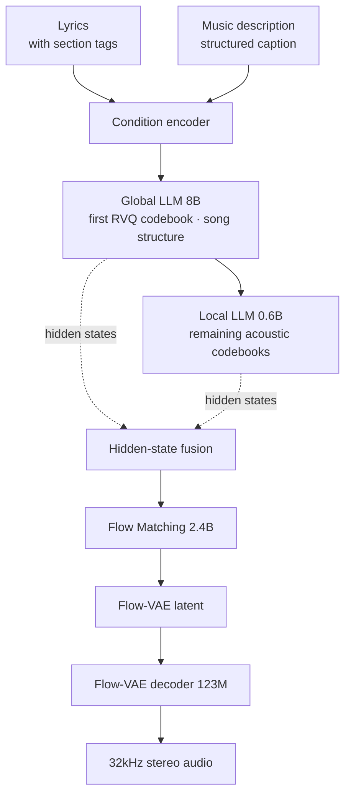

This post is for infrastructure engineers and technical decision makers who have to judge whether an open-weights music generation model belongs on their own GPUs or in a customer's on-premises environment. By the end you will know how the resources MiniMax Music 3 actually needs differ from the VRAM number printed on the model card, and what to check in the contract first.

Here is the conclusion up front. What determines how hard this model is to serve is not VRAM but storage and the distribution pipeline. The model card tells you a single 24GB card will run it, yet pulling the repository as published costs 53.35GiB in weights alone. Below I explain where that gap comes from, using numbers aggregated directly from Hugging Face repository metadata, and list what an on-premises serving operator has to prepare.


*A layer that carries long-range structure and a layer that carries fine acoustic detail move separately.*

## Overview

MiniMax has released the weights for MiniMax Music 3. Give it lyrics and a music description and it generates a finished song up to five minutes long, output as 32kHz 16-bit stereo WAV. What the model claims is the ability to hold a song structure together, running from intro through verse, pre-chorus, chorus, bridge, instrumental break and outro, while keeping vocal identity and arrangement progression intact to the end.

Music generation models have mostly lived behind commercial APIs. Open models that produce short clips existed, but full-length models that sing lyrics while sustaining song structure have rarely shipped as weights. That makes this release a real option for any organization with its own GPUs. You no longer have to send every generation request to an external API, and you can build a setup where lyrics and audio never leave the organization.

Having an option and being able to operate it are different things. Music models have a different resource profile from text models. The output is audio, so generation takes a long time, the pipeline does not end at a single language model, and there are several components to store. So this post looks at what makes up the serving cost rather than at benchmark scores.

## What this model is

MiniMax Music 3 uses a hierarchical autoregressive architecture. The core idea is splitting the model that handles long-range flow from the model that handles fine acoustic detail.

The Global LLM is 8B and predicts the first RVQ codebook frame by frame. The long-range semantic and structural progression of the song is this layer's responsibility. The Local LLM is 0.6B and predicts the remaining acoustic codebooks within each frame, restoring fine-grained acoustic information. According to the model card the Global LLM is initialized from Qwen3-8B, its embedding and output layers are then adapted to semantic music tokens, and the two models are trained jointly to model all RVQ codebooks.

The tokenizer uses eight layers of residual vector quantization. The first semantic codebook holds 16,384 entries and carries the core musical semantics and structure, while the remaining seven acoustic codebooks hold 1,024 entries each for residual acoustic detail. Training optimizes the semantic codebook first, then trains all eight together.

The synthesis path is the interesting part. Rather than decoding from discrete RVQ tokens alone, the model fuses the final hidden states of the Global and Local LLMs. The stated reason is that continuous representations preserve more of the acoustic information needed for vocal articulation, instrumental texture and temporal continuity. The fused hidden states pass through a 2.4B Flow Matching stage into a Flow-VAE latent, and a 123M Flow-VAE decoder produces the final audio. That Flow-VAE is adapted from MiniMax Speech and retrained for the dynamic range and spectral characteristics of music. At inference time the discrete tokenizer decoder is not required.



Input comes in two parts. Lyrics can carry explicit section tags such as `[Intro]`, `[Verse]`, `[Pre-Chorus]`, `[Chorus]`, `[Post-Chorus]`, `[Bridge]`, `[Instrumental]`, `[Solo]` and `[Outro]`. The music description defines style, emotional progression, vocal performance, instrumentation, arrangement and production profile. For precise control the model card recommends a structured caption split into three parts: global metadata, vocal details and arrangement. Global metadata covers genre, subgenre, BPM, key, scale, emotional progression, listening scenario and production profile.

## Installation and integration

The serving path the model card presents is SGLang-Omni. Fetching the weights and starting the service is straightforward.

```bash
hf download MiniMaxAI/MiniMax-Music3 --local-dir /path/to/minimax_ttm
sgl-omni serve --model-path MiniMaxAI/MiniMax-Music3 --port 8000
```

Generation requests reuse the speech API shape. Lyrics go in `input`, the music description goes in `instructions`, and section tags sit on their own lines.

```bash
curl http://127.0.0.1:8000/v1/audio/speech \
  -H 'Content-Type: application/json' \
  -d '{
    "model": "MiniMaxAI/MiniMax-Music3",
    "input": "[Verse]\nMorning light filtering through the pine\n[Chorus]\nSoftly the world begins to breathe",
    "instructions": "A warm acoustic pop song with intimate female vocals, fingerpicked guitar, soft piano, and a gradual emotional build into a wide final chorus.",
    "response_format": "wav",
    "seed": 7,
    "max_new_tokens": 750,
    "stream": false
  }'
```

Reusing the existing speech API schema is welcome from an integration standpoint. If you already run a gateway that handles OpenAI-compatible audio endpoints, you add a routing rule and stop there, with no new client SDK to build.

A diffusers path is supported too. You build the pipeline with `ModularPipeline.from_pretrained`, load components in bfloat16, then pass lyrics, prompt and duration. Guidance for tight VRAM ships alongside it. The model card states that full precision fits under 24GB of VRAM, that generation takes roughly 22GB with automatic CPU offloading enabled, and that streaming the language model layer by layer makes it fit even 8GB cards.

A tool for improving prompt quality ships as well. The `music-caption-rewriter` skill, which expands a short natural language description into a structured caption, installs with `npx skills add MiniMax-AI/MiniMax-Music3 --skill music-caption-rewriter`.

## Measured results

One thing to state honestly first. I did not run actual music generation inference for this post. As the model card notes, inference requires CUDA, and the working environment had no local GPU. So there are no generation quality or latency numbers here. Rather than invent them, I measured something that can be determined exactly without a GPU and that feeds directly into serving cost: how many bytes the repository actually is.

The Hugging Face repository metadata API returns the real byte size of every file. I aggregated those values by component.

```python
API = "https://huggingface.co/api/models/MiniMaxAI/MiniMax-Music3?blobs=true"
WEIGHT_SUFFIXES = (".safetensors", ".pth", ".bin")
```

The measurement came out as follows.

| Component | Size | Files | Serving layout |
|---|---|---|---|
| Qwen3-8B caption encoder | 17.19 GiB | 47 | shared |
| Hybrid-LM (Global 8B + Local 0.6B) | 15.99 GiB | 4 | shared |
| flowmatching_vae.pth | 9.15 GiB | 1 | raw |
| Flow Matching transformer | 9.06 GiB | 2 | diffusers |
| RVQ depth decoder | 1.20 GiB | 1 | diffusers |
| dav.pth | 0.46 GiB | 1 | raw |
| Vocoder | 0.20 GiB | 1 | diffusers |
| Condition encoder | 0.09 GiB | 1 | diffusers |

Fifty-eight weight files total 53.35GiB, and adding thirty config and asset files brings the whole repository to 53.41GiB.


*The dashed line is the 24GB VRAM ceiling from the model card. Disk usage is more than twice that.*

Two things surface here.

First, the repository carries two different serving layouts side by side. Component directories meant for diffusers coexist with raw checkpoint files. A single runtime needs the shared components plus one of the two. Working it out, shared plus the diffusers layout is 43.74GiB and shared plus the raw layout is 42.79GiB. Decide which one you will use, fetch partially, and you save roughly 10GiB.

Second, even after that reduction a wide gap remains between 43GiB on disk and 24GB of VRAM. Much of it comes from precision. The repository tensor type is F32 while the loading example on the card uses bfloat16. Halving the 43.74GiB runtime set gives about 21.9GiB, and about 21.4GiB for the raw layout. That lines up well with the roughly 22GB the card describes.

The practical rule is simple. **Plan for disk at about twice VRAM, and for more than that if you pull the whole repository.** For this model, reserving around 60GiB of free space per node is safe.

## What this means for ThakiCloud

Why this measurement matters becomes clear once you operate a GPU cluster. ThakiCloud's ai-platform is AI/ML infrastructure that handles GPU workloads on Kubernetes and Kueue, and it also deploys into customer on-premises and sovereign environments. In that setting a 53GiB model shows up not as a VRAM problem but as these three.

The first is the image and weight distribution path. If every pod start pulls 53GiB from outside, node storage and external bandwidth collapse together. That is why ai-platform keeps a model registry on internal object storage and supplies weights from inside the network. In an air-gapped customer environment that path is not a choice but a precondition.

The second is partial synchronization. The measurement above shows that fixing the serving layout saves 10GiB. For one model that looks small, but in a multi-tenant environment running many models across many nodes it is a cost repeated per node. Settle at the registry stage which components are actually needed and the saving lands directly.

The third is the scheduling profile. Music generation takes tens of seconds to several minutes per request, and per the card only non-streaming generation is supported today. One request occupies a GPU for a long time with no intermediate response. Put that in the same queue as interactive text inference and two workloads with completely different latency characteristics push each other out. Priority classes need separating, with batch size and concurrency set independently.

There is an angle for agents as well. Paxis is the Agent-Native Cloud control plane that runs on top of ai-platform, treating skills, tools, policies and audit logs as first-class resources. The way MiniMax shipped its prompt rewriter as a separate skill fits that structure directly. If you put music generation requests inside an agent workflow, the natural arrangement is caption rewriting at the skill layer, the generation call in an isolated sandbox, and a record of who generated what from which lyrics in the audit log. As we will see next, this model's license effectively requires that record.

## Limits and counterarguments

The license deserves attention first. Some secondary outlets reported that this model was released under Apache 2.0, but opening the `LICENSE` file in the repository shows otherwise. Its actual name is the MiniMax-Music3 Community License, and it is not a standard open source license.

Three conditions stand out. If you use it in a commercial product or service, you must prominently display "MiniMax-Music3" on the user interface. If aggregate yearly revenue from those products and services, across you and your affiliates, exceeds twenty million US dollars, you must obtain separate prior written authorization through a designated email address. And if you provide a third party with a product or hosted service that permits generation using the model, you must implement, maintain, test and periodically review reasonable and proportionate technical and organizational safeguards designed to prevent and mitigate infringing or violating uses, both before making the service available and throughout its operation. You must not knowingly disable those safeguards or permit their circumvention, and you are responsible for enforcing these requirements down to downstream recipients.

That last clause weighs particularly heavily on serving operators. Standing the model up and opening an API is not sufficient. Filtering, monitoring, record keeping and periodic review become contractual obligations, and the copyright sensitivity of the music domain sharpens the point. Regional restrictions and revenue gates on open-weights models are not unique to this release, and the same pattern showed up when we [read through the licenses of open video models](https://thakicloud.com/tech-blog/en/llmops/open-video-model-license-territory-audit/). Reading only the license label on the model card misses all of it.

The technical constraints are clear too. Inference requires CUDA, so other accelerator environments are not an option today. Only non-streaming generation is supported, so a user hears nothing until the whole generation finishes. Tokenized text prompts are capped at 5,000 tokens and audio generation at 9,000 acoustic frames. And as the model card itself states, section tags and music descriptions offer generative control rather than strict symbolic guarantees. Requested tempo, key, instrumentation, lyrics and song structure are not always reflected exactly. For uses that need score-level precision this model alone is not enough.

The limits of this post are worth restating. As noted above, I could not measure actual generation quality or latency. The conclusions about disk and VRAM rest on repository metadata and model card documentation, and real throughput has to be measured on a GPU to be settled.

## Wrapping up

MiniMax Music 3 is a meaningful release that makes full-length music generation possible on your own infrastructure. The architecture is clear and the serving path is well documented. But if you have decided to actually operate it, two things come before the GPU spec sheet.

One is storage. Weights run to 53.35GiB, and even after tidying the layout you are at roughly 43GiB, more than double the VRAM requirement. Without node storage and an internal distribution path prepared first, you stall at the very first pod. The other is the license. It is a community license rather than Apache 2.0, and it carries a revenue gate, an attribution obligation, and safeguard duties imposed on hosting operators.

The order of the next steps is fixed. Pick your serving layout, diffusers or raw. Build the partial download list to match and load it into an internal registry. Run a legal review of the revenue threshold and safeguard requirements. Then allocate the GPU. Do it in the reverse order and you will secure the GPU only to be stopped by the contract.

## Sources

- [MiniMaxAI/MiniMax-Music3 model card](https://huggingface.co/MiniMaxAI/MiniMax-Music3)
- [MiniMax-Music3 Community License, full text](https://huggingface.co/MiniMaxAI/MiniMax-Music3/raw/main/LICENSE)
- [MiniMax official blog: MiniMax Music 3.0](https://www.minimax.io/blog/minimax-music-3-0-next-generation-open-weights-production-ready-versatile-music-model)
- Measurement scripts and logs: `scripts/experiments/minimax-music3-footprint/`, `outputs/blog-impl/minimax-music3-open-weights-serving/run-2.log`
