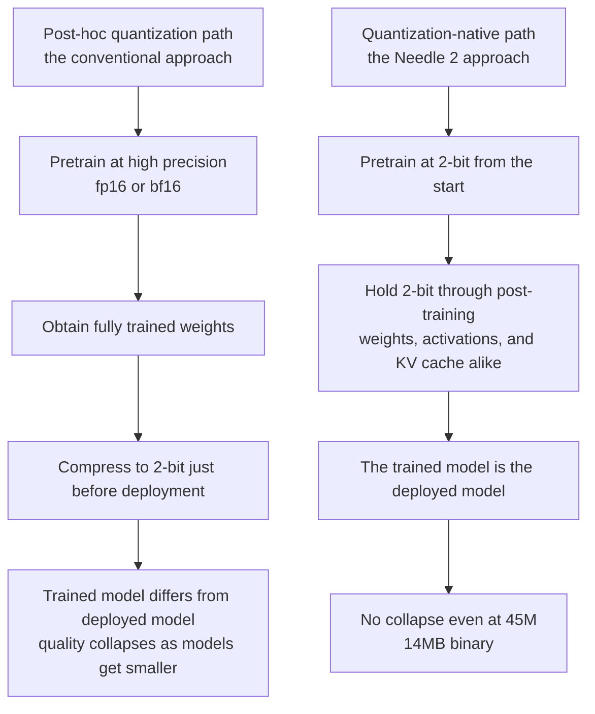

*Compression succeeded here not because of how much was removed, but because of when the removing started.*

## Why This Matters to You

This is for edge engineers weighing whether to run tool-calling agents on sensors, wearables, and robots where neither bandwidth nor power is plentiful, and for infrastructure teams deciding at which stage a quantization tier gets locked in. The short version: what breaks small models at two bits is not the precision itself but the practice of bolting it on after training ends, and Needle 2 reversed that order to fit 45M parameters into 14MB.

The distinction matters in practice because it moves ownership. If quantization is post-processing applied just before deployment, it belongs to the serving team. If quantization is a precondition of pretraining, it becomes a training pipeline decision, and by deployment time there is nothing left to choose. What follows walks through the published structure and numbers, and what that shift changes.

## Overview

Cactus Compute released Needle 2 on August 11. It is a 45M-parameter model built for tool calling, shipped as a single 14MB binary, and it runs a full session in 28MB of RAM. It decoded at over 500 tokens per second on a Raspberry Pi 5, and the company reports it running on ESP32-S3 microcontrollers, the Meta Quest 3S, and sub-$200 Android handsets.

Read as numbers alone, this looks like one more very small model. The same team's first-generation Needle was a 26M distilled model, so even the lineage is familiar. What deserves attention in this release is not the parameter count but the treatment of precision.

Just yesterday we covered Nemotron 3.5 Lightning quantized to two bits by Unsloth. That was a story about fitting a 30B MoE model onto a single 24GB card, and there two bits meant compression applied after training to finished weights. On large models this works well, because abundant parameters leave representational slack even after precision is cut. The problem is that this slack disappears as models shrink, and applying post-hoc two-bit quantization at 45M simply collapses quality. Needle 2 went around that wall rather than through it.

## What the Model Is

Needle 2 is not a general conversational model. It targets three tasks: tool calling, device control, and structured extraction. That narrowing is the first condition that makes 45M viable. In exchange for giving up open-ended conversation, capacity concentrates on reliably emitting function calls that match a declared schema.

Structurally it belongs to the Simple Attention Network family. A Hadamard MLP takes the place of the usual transformer FFN, and attention uses GQA. On top of that sit a key-value memory the team calls engram and multi-lane hyper-connections. Both the attention and MLP residuals are sandwich-normed and gated, and the engram sites fire at two layers.

These components look unfamiliar, but they point in one direction: securing representational power without adding parameters. The FFN is the single largest parameter consumer in a transformer and cannot be left intact on a 45M budget, while a separate key-value store like engram pulls facts out into something retrievable instead of memorizing them diffusely across weights. Placing normalization and gating on every residual path follows the same logic, working to suppress magnitude blowup during low-precision training. Making two-bit training viable requires the architecture itself to stay inside a stable numeric range, and this model's structural choices are hard to read apart from that constraint.

The most consequential design sits on the decoding side. Needle 2 constrains decoding with a byte-level grammar compiled from the declared schemas, narrowing the output space so the model can only produce syntactically valid function calls. The familiar failure of small models on structured output is getting the intent right while breaking the format, and when the runtime enforces this constraint that entire failure class disappears. The difficulty the model must absorb drops accordingly.

## Why Post-Hoc Quantization Breaks Small Models

Evaluating Cactus Compute's claim requires first understanding where post-hoc quantization breaks. This part is less a company claim than shared understanding in quantization research.

Moving a trained model to lower precision is fundamentally an approximation. The continuous value space the original weights occupied gets divided into a handful of bins, and each weight moves to its nearest bin representative. The resulting error is, from the model's perspective, a perturbation it never trained against. At eight or four bits the bins are dense enough that the perturbation stays small, and large models carry enough redundancy across parameters that other paths hold up a function when some weights wobble. That is the background to two bits working practically on the 30B model we covered yesterday.

Two bits is a different situation. A single weight can take only four values, so approximation error grows sharply. Activation distributions also tend to contain a small number of extreme values, and widening the bin range to accommodate those extremes destroys resolution exactly where the bulk of values cluster. This error accumulates layer by layer, and a model with few parameters and no alternate paths has no capacity to absorb the accumulation. Saying post-hoc two-bit collapses at 45M is saying that capacity has run out.

Assuming two bits during training breaks this logic. Because the model learns to minimize loss on a four-value space from the beginning, it finds representations suited to that space on its own. There is no approximation error to speak of. Cactus Compute's description of the trained model and the deployed model being physically the same file points at exactly this.

Reflecting low precision during training is not itself new. Quantization-aware training is an old technique. Conventionally, though, pretraining finished at high precision and quantization was simulated only during a final fine-tuning window, so the bulk of pretraining still happened in a high-precision space. What Needle 2 claims as its difference is pulling the application point back to the start of pretraining and widening the scope beyond weights to activations and the KV cache. That the KV cache is included matters especially in practice. Running a full session in 28MB of RAM does not follow from shrinking weights alone; it requires pressing the cache that grows with conversation length into the same precision.

## Installation and Integration

Needle 2 ships through the `Cactus-Compute/needle2` repository on Hugging Face, with the inference engine and kernels published alongside it at `cactus-compute/cactus`. The model repository itself is `cactus-compute/needle`. The unit of distribution being a single binary baked into an engine rather than a weights file is what sets this apart from a typical GGUF release.

One caveat belongs here up front. The first-generation Needle was released under MIT, but we were unable to confirm the license designation for Needle 2 itself at the time of writing. If you are planning to ship this in a commercial product, check the model card directly. Context length likewise could not be confirmed in public materials and is therefore not covered here.

## Measured Results

The reproduction attempt comes first, stated plainly. The working environment for this piece blocked outbound package installation and model downloads, so we could not pull Needle 2 down and run it. The figures below are therefore Cactus Compute's published values rather than measurements of our own, and should be read on that basis. We have not mixed in numbers of our own making.

Evaluation ran on five public function-calling benchmarks: Google's Mobile Actions, DroidCall, the in-domain and out-of-domain tests from Seal-Tools, and BFCL v4 single-turn. This is a common bundle for evaluating tool-calling models, and the inclusion of an out-of-domain test filters overfitting to training data to some degree.

The Mobile Actions result shows this model's character most clearly.

| Model | Mobile Actions score |
|---|---|
| LFM2.5 | 69.1% |
| FunctionGemma | 64.0% |
| **Needle 2** | **63.7%** |

Needle 2 does not come first on this item. It trails FunctionGemma by 0.3 points and LFM2.5 by 5.4 points. Dressing that up as a win would make this article a lie, so it stands as written. Set alongside the condition that every comparison model is 5 to 70 times larger and running at full f16 precision, however, the reading changes. In Cactus Compute's phrasing, Needle 2 sits in a position where it trades wins with these models despite that gap in scale. Whether losing 0.3 points to cut footprint by tens of times is a good trade is decided by the deployment environment.

Individual scores for the remaining four items were not confirmed in public materials and are not reproduced here. Even so, the composition of the evaluation bundle says something. Seal-Tools was measured separately in-domain and out-of-domain. Tool-calling models overfit easily to the tool inventory seen during training, and when that happens benchmark scores look strong while the model falls apart on the first unfamiliar function signature it meets in a real product. Publishing the out-of-domain test separately reads as a signal that this failure mode was not hidden. If you are evaluating adoption, check that item first, because your tool inventory is not in the training data either way.

The speed figures are more intuitive. A Raspberry Pi 5 decodes at over 500 tokens per second. Given that a single tool call typically produces a few dozen tokens, that speed falls inside the range where users do not perceive latency. Running on an ESP32-S3, where RAM is measured in hundreds of kilobytes, is the more dramatic claim. Devices in that class have until now not been targets for language models but endpoints that shipped data up to them.

## What This Means for ThakiCloud

ThakiCloud puts Paxis at the center, automating enterprise work with agents, and supplies the inference, training, and infrastructure that execution rests on. The question Needle 2 raises touches the lowest boundary line of that structure.

Seen from Paxis, this model is not a candidate to replace an agent wholesale but a candidate to relocate the agent's last mile. Paxis treats skills, tools, and policies as first-class resources, deciding which skill to select, running it in an isolated environment, and passing every action through a policy gate and audit log. Judgment and policy need to stay central in that flow, but there is a weak case for keeping the final step of turning a settled schema into a call string central as well. Producing the call on the device removes round-trip latency and network cost, and above all keeps things working while the network is down. In field equipment or vehicles where connectivity is unreliable, that difference decides whether a feature exists at all.

From Metis, this amounts to one more rung at the bottom of the serving ladder. Metis handles inference and token production while managing unit cost through model routing and quantization. Until now the floor of that routing was the smallest server model. Once Needle-class models enter practical range, traffic that is low in difficulty and high in volume, like repeated calls against a fixed schema, can leave the data center entirely. That kind of traffic tends to be low value per call and high in count, which makes its share of total token cost larger than expected.

The implication for Maxis is the most structural. Once quantization moves into pretraining, producing a deployable small model becomes an output of the training pipeline rather than a serving optimization. Maxis is the layer that handles fine-tuning and distillation, and the direction Needle 2 demonstrates redefines the goal of distillation: not shrinking a large model, but training at the target precision from the outset so that the deployed model and the trained model coincide. When a customer asks for a small domain-specific tool-calling model, that difference sets the quality ceiling of what comes back.

From Aegis, air-gapped conditions get considerably easier. A 14MB binary drops without strain into equipment that has no external connectivity at all, and updating it amounts to swapping a single file. As ways to confine inference inside a device in environments where data export is prohibited, this is among the simplest.

## Limits and Counterarguments

Here are the points where this model is easy to overrate.

First, Needle 2 is tool-calling only. Do not expect summarization, reasoning, or conversation. The 45M figure holds because the scope was narrowed, not because general capability was compressed. The moment any task outside tool calling enters the picture, a separate model is required, and then the decision of whether to put two on the device or fall back to the center has to be made again.

Second, the benchmark result should be taken at face value: it is not first place. On Mobile Actions, Needle 2 ranks last of the three. Remove the efficiency-per-scale axis and look only at absolute accuracy, and larger models are better. If accuracy matters even slightly more for your use case, this model is not the answer.

Third, we could not reproduce any of it ourselves. Every figure above is a vendor-published value that has not passed independent verification. Microcontroller operation and Raspberry Pi throughput in particular vary widely with measurement conditions, so measure on your target hardware before committing.

Fourth, the byte-level grammar constraint cuts both ways. It eliminates format errors while categorically blocking any output that departs from the schema. If your tool inventory changes often or is assembled dynamically at runtime, the grammar compilation cost and the update procedure have to be designed alongside it.

Fifth, the license is unconfirmed. The first generation being MIT does not guarantee the second. If you are evaluating this for commercial deployment, that item is the safest place to start.

## Wrapping Up

What to take from Needle 2 is not the number 14MB but the ordering that produced it. The received wisdom that two bits ruins small models held only under the assumption of post-hoc quantization, and this release argues that carrying precision from pretraining onward avoids collapse even at 45M. When the trained model and the deployed model become the same thing, the interval where quality used to leak between them stops existing.

So the shift in ownership described at the top actually happens. Once quantization moves from a deployment problem to a training problem, small-model strategy stops being a variable the serving team tunes later and becomes a constant that has to be fixed while the training plan is drawn.

If you pick one next action, count the calls you currently route to a central model that have a fixed schema and high frequency. A long list is your candidate set for pushing to the edge, and grounds for seriously evaluating a Needle-class model. A short list means this technology is not yet your problem, and that judgment is also better made with numbers.

## Sources

- [Needle 2 official introduction, Cactus Compute](https://cactuscompute.com/needle)
- [Cactus-Compute/needle2, Hugging Face](https://huggingface.co/Cactus-Compute/needle2)
- [cactus-compute/needle, GitHub](https://github.com/cactus-compute/needle)
- [cactus-compute/cactus runtime and kernels, GitHub](https://github.com/cactus-compute/cactus)
- [Show HN: Needle2 discussion thread](https://news.ycombinator.com/item?id=49246804)
