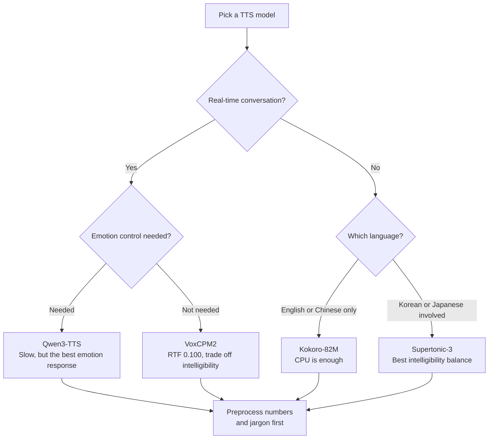

*We measured four text-to-speech models under the same conditions.*

When you're picking a TTS model for voice prompts, audiobooks, or a conversational agent, the
first thing you probably look at is the naturalness score on the model card. That score doesn't
tell you much about what breaks once the model is actually serving traffic. We ran four models
through the same harness across Korean, English, Chinese, and Japanese, and **the fastest model
came in lowest on intelligibility.** A 12x speed gap turned out not to be free.

This post walks through what we measured and what it means for picking a model per language.
Numbers only get you so far, so we've included audio samples throughout: listening is faster
than reading a table.

## Listen first

Three models read the same Korean sentence. Same text, same conditions, same harness.

> 오늘 회의는 오후에 삼층 회의실에서 시작합니다. (Today's meeting starts this afternoon in the third-floor conference room.)

<strong>Qwen3-TTS</strong> 
<audio controls preload="none" src="/assets/audio/posts/tts-comparison-showcase/a-ko-qwen3-tts-1.7b.mp3"></audio>

<strong>VoxCPM2</strong> 
<audio controls preload="none" src="/assets/audio/posts/tts-comparison-showcase/a-ko-voxcpm2.mp3"></audio>

<strong>Supertonic-3</strong> 
<audio controls preload="none" src="/assets/audio/posts/tts-comparison-showcase/a-ko-supertonic-3.mp3"></audio>

If those three left a different impression on you, the next section shows how that difference
shows up in the numbers.

## What we measured, and how

We split the measurement into five axes: how fast the model runs (RTF), how much power it burns
per second of audio produced, how closely a transcript of the synthesized speech matches the
original text, how natural the audio sounds to a listener, and whether an emotion instruction
actually changes the output.

The script itself covers six categories. Alongside ordinary declaratives, questions, and
compound sentences, we deliberately mixed in numbers, loanwords, and technical jargon, because
that's usually where production TTS breaks in practice.

Naturalness was scored with TTSDS2, which compares the distribution of a set of synthesized
utterances against a set of real human utterances rather than scoring each utterance against a
predicted MOS, so it's less language-sensitive than a per-utterance MOS predictor. As the
reference, we used 120 utterances per language from Google FLEURS's validation split.

### Why we break the naturalness score into sub-scores

TTSDS2 doesn't give you one aggregate number; it reports four sub-axes, and that distinction
turned out to be decisive here.

The **SPEAKER** axis measures how close the synthesized timbre sits to the real-voice
distribution: does the voice itself sound human. The **PROSODY** axis looks at the distribution
of intonation, rhythm, and stress: does the sentence get read naturally. The
**INTELLIGIBILITY** axis checks whether phonemes stay distinct: does the pronunciation stay
crisp instead of blurring together. The last, **GENERIC**, axis captures statistical properties
of the acoustic signal itself.

Which axis matters depends on what you're serving. For an audiobook or narration, speaker and
prosody matter most; for a voice prompt or alert where the job is conveying information,
intelligibility comes first. Judging by the aggregate score alone erases that distinction.

## Speed and intelligibility don't come together

This is the single clearest result from the whole measurement.

*Left: naturalness by language. Right: the relationship between speed and intelligibility.*

| Model | Hardware | Languages | RTF | Naturalness (English) | Intelligibility (Korean) |
|---|---|---|---|---|---|
| VoxCPM2 | B200 | 4 | 0.100 | 76.45 | 48.63 |
| Kokoro-82M | 32-core CPU | 2 | 0.640 | 73.87 | n/a |
| Qwen3-TTS | B200 | 4 | 1.196 | 75.76 | 61.46 |
| Supertonic-3 | 32-core CPU | 3 | 2.498 | 70.09 | 63.84 |

Lower RTF means faster. An RTF of 1.0 means it takes one second to generate one second of audio,
so a real-time conversational service needs to stay below that. VoxCPM2 sits at 0.100, handling
ten concurrent streams on a single B200, while Qwen3-TTS sits at 1.196, and it can't keep up with
real time even for a single stream.

Look only at the aggregate naturalness score, though, and the two models look about the same:
76.45 for VoxCPM2 in English versus 75.76 for Qwen3-TTS. Stop there and you'd conclude they're
just as good, and one happens to be faster.

**Open the sub-scores and the story changes.** TTSDS2 splits the aggregate into speaker
similarity, prosody, and intelligibility, and on intelligibility VoxCPM2 falls well behind: 48.63
in Korean, 44.48 in Japanese. Qwen3-TTS scores 61.46 and 51.57 on the same languages, not a
small gap.

VoxCPM2 produces a plausible-sounding voice, but pays for it in pronunciation clarity. The
aggregate score looks even because VoxCPM2 makes it back on the speaker and prosody axes.

## An ASR gate alone won't catch this

We missed it at first, too. We ran a gate that transcribes the synthesized audio with Whisper and
compares it to the source text, and all four models came back with a median error rate of zero
in Korean and English. By the median, everything looks flawless.

The problem is that errors aren't spread evenly. Look at the 90th percentile and Japanese jumps
to 0.413 for Qwen3-TTS and 0.438 for VoxCPM2. Break it down by category and the cause is obvious:
declaratives, questions, and compound sentences come back nearly perfect, and the model falls
apart **only on numbers and technical terms.**

Here's an actual failed utterance. Compare the source text to what you hear and it'll be obvious
where it breaks.

> 자세한 내용은 docs.thakicloud.net 문서를 참고해 주세요. (For details, please refer to the docs.thakicloud.net documentation.)

<strong>Qwen3-TTS (Korean, technical term)</strong> 
<audio controls preload="none" src="/assets/audio/posts/tts-comparison-showcase/b-ko-qwen3-tts-1.7b.mp3"></audio>

For reading news articles aloud, this is harmless. But if your service has to read out amounts,
dates, or product codes, these two categories are exactly where things go wrong. Rather than
swapping models, the more reliable fix is a preprocessing step that spells numbers out before
they ever reach the model.

## Emotion control is a dial, not a switch

We synthesized the same sentence across six emotions and measured how much the audio actually
changed between conditions. Below are the model with the strongest emotional response and the
model with no emotion control at all.

> 그 사람이 방금 문을 열고 들어왔어요. (That person just opened the door and walked in.)

<strong>Qwen3-TTS · Neutral</strong> 
<audio controls preload="none" src="/assets/audio/posts/tts-comparison-showcase/c-ko-qwen3-tts-1.7b-neutral.mp3"></audio>

<strong>Qwen3-TTS · Happy</strong> 
<audio controls preload="none" src="/assets/audio/posts/tts-comparison-showcase/c-ko-qwen3-tts-1.7b-happy.mp3"></audio>

<strong>Qwen3-TTS · Angry</strong> 
<audio controls preload="none" src="/assets/audio/posts/tts-comparison-showcase/c-ko-qwen3-tts-1.7b-angry.mp3"></audio>

Kokoro-82M comes out effectively identical across all six conditions, because the model has no
emotion control at all: every one of the six prompts is the same input under the hood. That
makes it a useful **floor** for the metric. On the measure of prosodic variance across
conditions it scores 0.024, and on the measure of how often an emotion classifier matches the
requested emotion it scores 0.167, which is exactly chance if you're guessing uniformly across
six emotions.

Once you know where the floor sits, the rest of the numbers read differently. Qwen3-TTS scores
17x the floor on prosodic variance and 2.4x chance on emotion-classification accuracy. There's a
real response there.

At the same time, keep the absolute level in perspective. Even the best model doesn't get the
requested emotion through to the classifier more than half the time. Emotion instructions aren't
a switch that flips the output into that emotion; they're closer to a dial that nudges it in
that direction. If tone matters for your service, a contact-center prompt being the obvious
case, set expectations with that in mind.

We measured emotion along two separate questions: does the audio actually change when you change
the condition, and does that change sound like the requested emotion. The first we measured as
variance in prosodic features across conditions; the second with an emotion classifier.

The fact that both metrics produced the same ranking matters. Two different measurement methods
converging on the same conclusion makes that conclusion more trustworthy. Had they diverged,
that would have been a signal that one of the two was measuring something wrong.

## How to pick, language by language

**Korean** splits on whether you need real time. For a conversational use case, VoxCPM2's RTF of
0.100 is tempting, but its intelligibility of 48.63 is the lowest of the four, so number
preprocessing is mandatory. For pre-generated voice prompts, Supertonic-3 is the most reliable
choice at an intelligibility score of 63.84. Kokoro-82M doesn't support Korean at all.

**English** is tight: all four models land within a 70-to-76 naturalness band, so quality alone
won't separate them. That pushes the decision to speed and power: on GPU, VoxCPM2 leads; on CPU,
Kokoro-82M does. Kokoro in particular hits an RTF of 0.640 on 32 CPU cores, faster than real
time, making it **a genuine no-GPU option**. If your service only needs English and Chinese,
it's worth serious consideration.

**Chinese** favors Qwen3-TTS. Its intelligibility of 56.89 beats VoxCPM2's 50.0, and its 90th
percentile transcription error of 0.289 has a shorter tail than VoxCPM2's 0.435.

**Japanese** is the language where you should budget for review regardless of which model you
pick. Supertonic-3 leads on aggregate naturalness at 68.08 and has the best-balanced
intelligibility at 62.99, and even that is lower than its scores in other languages. Both GPU
models drop as low as 51.57 and 44.48 on intelligibility.

### The reference corpus you choose changes the result

Because TTSDS2 measures the distance between a set of synthesized utterances and a set of real
human utterances, whatever you set as the human reference drives the score. We used Google
FLEURS's validation split. It records the same sentence set across 102 languages, so conditions
stay reasonably matched across languages, and it's CC BY 4.0, so reproducing this measurement
has no licensing friction.

FLEURS is read-aloud speech, though. The sentences are read crisply, with much less of the
hesitation and intonation shift you'd get in conversational speech. Read these scores accurately
as **how well each model produces read-aloud-style speech.** If your target is a conversational
agent, the more useful move is to point the same harness at a conversational corpus and re-run
it. We built the harness so that swapping the reference directory is the only change required.

Setting the reference at 120 utterances per language was also a choice. Because it's a
distribution comparison, too few samples makes the score unstable, and too many makes the
computation slow. Comparing 30 synthesized utterances against 120 reference utterances took
roughly an hour per model across all four languages.

### A closer look at the per-language sub-scores

In Korean, VoxCPM2 leads on the speaker axis at 71.79: the voice itself sounds the most human.
But the same language's intelligibility is the lowest of the four at 48.63. It's a good voice
reading indistinctly: pleasant to listen to, but a worse choice when the job is conveying
information.

Qwen3-TTS runs in the opposite direction. Its Korean speaker score of 64.43 trails VoxCPM2's, but
its intelligibility of 61.46 leads. It reads as a model that traded vocal appeal for clarity.

Supertonic-3 posted the most even intelligibility across three languages, ranging from 62.99 to
70.24. Not falling apart badly in any one language is its strength, at the cost of being the
slowest of the four at an RTF of 2.498. For pre-generated content, that trade-off works in its
favor.

## What to think about at the serving layer

Once you've picked a model, several more decisions still shape cost and quality.

**Preprocess numbers and units.** The two categories where errors clustered in this measurement
were numbers and technical terms. All four models showed the same pattern, so this reads as a
property of this generation of TTS rather than a flaw in one specific model. A thin
preprocessing layer that spells out amounts, dates, phone numbers, and product codes is more
reliable than swapping models, and far cheaper. Pair it with a domain glossary and the
technical-term cases get covered too.

**Batching design sets your unit cost.** We noted earlier that idle power accounted for 86.7% of
draw, but that number describes what happens when the batch isn't full. If requests trickle in
sparsely, a scale-to-zero endpoint beats a GPU that sits resident. If traffic is steady, growing
the batch to dilute the idle share is the right move instead. The same model can end up several
times more or less expensive per utterance depending entirely on this design choice.

**Routing per language is a legitimate option.** In this result, no single model was the best
choice across every language. English is covered fine by a CPU model, Japanese favors
Supertonic-3, and Chinese was safest with Qwen3-TTS. A thin routing layer that sends each
language to whichever model does best there also has the side effect of pulling CPU-eligible
traffic off the GPU entirely.

**Budget for review up front.** A consistent pattern across this measurement was errors spiking
at the 90th percentile. A median of zero doesn't mean the whole batch is safe. Japanese
especially had a long tail regardless of model, so if you're generating at volume, building
sample review into the pipeline is cheaper than finding out later.

## Where these numbers fall short

Everything here ran through the same harness, and we kept a measurement ledger. Three honest
caveats, though.

First, FLEURS, the naturalness reference, is read-aloud speech. If your target is a
conversational or broadcast register, this comparison doesn't transfer directly.

Second, don't trust the power numbers for the two CPU models. Repeating the same configuration
three times, net incremental power swung by 178%. The cause is the idle baseline on a shared
node: measure the baseline while the node happens to be quiet, and power from a neighboring job
that lands mid-synthesis gets attributed to us. RTF on the same runs moved by only 7.9%, so the
speed comparison still holds.

Third, of the twelve models on our roster, only four completed the full run. A good share of the
rest were voice-cloning models with no default speaker, requiring a reference clip. Once you
supply a reference, what you're measuring shifts from speech-synthesis quality to cloning
fidelity, so we didn't fold them into the same table; that's a separate post.

## From ThakiCloud's perspective

We ran this measurement because we had to decide which model to default to when adding a voice
endpoint to the Metis inference platform. Two practical conclusions came out of it.

First, **don't pick a model off a single aggregate score.** In this case, two models with nearly
identical aggregate scores were 13 points apart on intelligibility, and the gap showed up exactly
where it hurts: reading amounts and codes aloud. You need to look at the sub-axis that matches
what your service is actually for.

Second, **idle power is most of the cost.** 86.7% of what Qwen3-TTS drew had nothing to do with
synthesis; it was idle. When you're renting a whole GPU for serving, that idle share is real
cost, and an endpoint that can't fill its batch is burning a full card to produce a single
stream. Batching design matters as much as model choice for unit economics.

The sentence set, harness, and ledger we used for this measurement are kept in our internal
repository and set up to be reproduced under the same conditions. The audio samples are
unedited, unselected conversions of the files the ledger points to.
