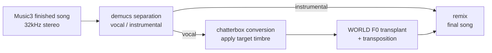

If you're wrestling with the caption to get the voice you want out of a generative music
model, that path won't get you there. What we found is simple: you cannot pick the voice
at generation time. You have to take the finished song, pull the vocal out, and swap it
in afterward.

Listen to two songs first. A 1994 Korean ballad and a 1986 Japanese city pop track, both
made by running MiniMax-Music3 on our own GPUs. Both are finished songs generated from
nothing but lyrics and a caption, with no human-sung sections or samples in them.

<strong>1994 Korean ballad</strong> 
<audio controls preload="none" src="/assets/audio/music3/voice-swap/ballad-1994-kr-full.mp3"></audio>

<strong>1986 Japanese city pop</strong> 
<audio controls preload="none" src="/assets/audio/music3/voice-swap/citypop-1986-jp-full.mp3"></audio>

One thing up front: the voice swapping covered in this post is not cloning a real
person's voice. Both the source voice and the target voice are synthetic, and we did
not reference any specific singer's voice or name. What we used for casting was a
handful of synthetic anchors we built in house.

## A Caption Cannot Move the Voice

Music3 takes lyrics and a structured caption and produces a finished 32kHz stereo song.
The caption clearly has a slot for gender and timbre, so the first thing we tried was
editing that slot.

We shook six axes: caption format and length, extreme timbre descriptions like elderly
man, young girl, or opera bass, five different lyric languages, nearby versus distant
seeds, diffusion steps from 30 to 200, flow-matching guidance from 1.7 to 4.0, and even
pushing the AR stage's CFG, which was hardcoded as a module constant, up to a runtime
range of 1.5 to 5.0. Raising the step count clearly improved audio quality. The voice
stayed the same.

What was actually fixed became clear once we measured the formants. F4, which reflects
vocal tract length, stayed within 6.2% variation across every condition. Even with AR
CFG pushed to 5.0, a male caption came out at 3048Hz and a female caption at 3061Hz,
essentially the same value. F0, pitch, moved fine with the caption, ranging from 110Hz
to 318Hz. **The same person sings lower and higher. Only the singer doesn't change.**
And since listeners judge gender and identity by vocal tract, not pitch, every result
sounds like the same person.

We also confirmed this isn't a flaw in our own pipeline. The official demo space runs
the same diffusers code, and the official reference audio, whose caption describes a
deep bass baritone, actually measures 228.9Hz for F0, right in the same range as our
own output.

We also found the structural reason. The open release only ships the decoder side; the
residual quantization encoder was never released. That means there's no path to
specify a voice with reference audio to begin with. The caption is the only
conditioning input, and since the caption can't move the vocal tract, there's simply
no way to choose a singer inside this model.

## So We Swap Only the Vocal

The model is good at composing and arranging. The one thing it can't do is casting. So
we let the model handle what it's good at and take care of the one thing it can't,
afterward.

<figcaption>A four-stage chain. The instrumental is left untouched; only the vocal path is swapped.</figcaption>

htdemucs handles separation, taking roughly ten seconds per song. Loss at this stage
turned out not to be an actual problem. Conversion is done by chatterbox, and this is
where identity actually comes from. We tried a different engine first, and even after
expanding the anchor set from ten to fifty five voices and throwing in amplification,
blending, and formant scaling, it still sounded like the same person to a human ear.
Identity only split apart once we switched engines.

The third stage is both the crux of this chain and its trap. The converter shifts
pitch on its own terms, anywhere from a few semitones to more than ten depending on
the anchor. Left as is, the vocal falls out of tune with the instrumental, so we
reapply the original vocal's F0 curve to put it back in place. WORLD handles that.

## Same Song, Three Voices

We cut the same segment out of one ballad and lined the versions up side by side. The
one on top is the model's original, and the two below are the same instrumental with
only the voice swapped.

<strong>Original (Music3 output as is)</strong> 
<audio controls preload="none" src="/assets/audio/music3/voice-swap/ballad-source.mp3"></audio>

<strong>Female casting</strong> 
<audio controls preload="none" src="/assets/audio/music3/voice-swap/ballad-female.mp3"></audio>

<strong>Male casting</strong> 
<audio controls preload="none" src="/assets/audio/music3/voice-swap/ballad-male.mp3"></audio>

The city pop track was split the same way.

<strong>City pop original / female / male</strong> 
<audio controls preload="none" src="/assets/audio/music3/voice-swap/citypop-source.mp3"></audio> 
<audio controls preload="none" src="/assets/audio/music3/voice-swap/citypop-female.mp3"></audio> 
<audio controls preload="none" src="/assets/audio/music3/voice-swap/citypop-male.mp3"></audio>

Measuring the median F0 of voiced segments in the resynthesized vocal stems, the
ballad comes out to 251.1Hz and 126.3Hz, and the city pop track to 242.6Hz and
123.4Hz. The gap between the two takes stays reliably close to twelve semitones.

## Transposition Has Almost No Freedom

This is where we tripped hard once. We made a male and a female take, and both came
out at the same pitch. We assumed a file had gotten overwritten and checked the
hashes first, but they were all different. The cause was the third stage. F0
transplant restores the original singer's pitch curve, so if both takes pull that
curve from the same source, they end up at the same pitch. The only remaining
difference is timbre, and since people read gender mainly by pitch, the two takes
don't come apart.

The fix is transposition, and that runs into a musical constraint. The instrumental
is locked to whatever key the model chose. Raise the vocal alone by a perfect fifth
and the melody falls outside the key. The only transpositions that line up exactly
with the instrumental are 0 and plus or minus 12. So we left the female take at 0
semitones on a female anchor, and for the male take we kept the model's own timbre
and dropped it by exactly one octave. An octave preserves the key, and since we're
not changing timbre, the quality ceiling stays high.

To avoid repeating this mistake, we added a gate on the vocal stem right before
mixing: if the gap between two takes is under 3 semitones, it fails. Since this axis
catches the mistake regardless of genre, we made it the hard gate and kept absolute
pitch range as a secondary check only. Making absolute pitch range a hard gate
misfires on hip hop, because rap is delivered at speech cadence and its F0 doesn't
climb as high as singing does.

## What Actually Determined the Outcome

When quality fell short, our hypothesis was resynthesis burden: the more the
converter pushes pitch off, the more you have to pull it back, and the more
artificial it sounds. We built a set that cut that burden from the six-semitone range
down to roughly a semitone, and played twelve matched pairs side by side, same song,
same timbre.

**Listeners did not tell the two arms apart.** Both were accepted in six pairs, both
rejected in two, and the low-burden arm won one pair while the high-burden arm won
three. The strongest counterexample is the arm transposed down an octave, exactly
matching the instrumental with less than half the burden, which was rejected in three
out of four songs. By the hypothesis, that arm should have won. It lost. We closed
this axis.

Testing each stage in isolation made the picture clear. The original passed 4 out of
4, and the arm that only analyzed and resynthesized without any conversion also
passed 4 out of 4. Resynthesis by itself introduces no audible damage. The current
chain, running the full conversion and transplant, also cleared all four songs at the
same grade as the original.

The axis that actually mattered was the fit between song and timbre. Acceptance ran
7/7 for jazz pop and 6/7 for ballad, against 3/7 for hip hop and trot. Timbre split
things too: some anchors survived seven out of eight songs, others made it through
only four. On hip hop, only one anchor made it through and the rest were wiped out.
31 out of 40 combinations were accepted, and the nine that failed didn't fail because
quality collapsed, they failed because that voice didn't fit that song.

## Judgment Stayed With Humans the Whole Way

The expensive lesson here was about metrics. We used three of them to measure whether
identity had split enough: speaker embedding cosine distance, formant F4, and formant
scaling ratio. All three disagreed with the ear. By embedding, fifty five voices split
into thirty two distinct speakers. Humans heard them as somewhere between one and four.
If we'd claimed diversity on this axis, we'd have been confidently wrong.

So now we split what code measures from what humans judge. Gender and the gap between
two takes are, by definition, a pitch axis, so code measures them and enforces the
gate. Whether the timbre sounds mangled, and whether this voice fits this song, is
judged by a human listening to it. When we build a listening set, we ask those two
questions separately too: is the quality acceptable, and does this voice fit this
song. Asking them as one question reads a taste signal as a quality defect and sends
you digging in the wrong direction.

## The Economics of Making This

Rendering one song in multiple voices only makes sense if a song is cheap. Putting the
same weights on the same single B200 and changing only the execution path took
throughput from 36.4 songs an hour to 463.2, a 12.7x gap, and the cost per song came
out to $0.007. VRAM stays fixed at 24.5GB regardless of song length, which makes
capacity planning simple.

Diffusion steps are cheaper than you'd expect. Raising them 2.7x from 30 to 80 only
pushes generation time up 1.36x, because diffusion is just one part of total cost.
There's not much reason to leave the default at 30.

One more thing worth mentioning is reproducibility. Results wobbled even with the
same seed and the same caption, so we had to design comparison experiments around
five seeds per condition. Turning on deterministic kernel settings made the same seed
produce matching hashes. It wasn't a property of the model, it was kernel
non-determinism. That cut the cost of comparison experiments by five times. For
experiments that measure a distribution itself, like hit rate, you still need to vary
the seed.

This is exactly the segment ThakiCloud sells through Metis. How you put a model on an
execution stack changes cost by an order of magnitude, more than which model you pick
does. The longer a single output runs, minutes at a time, and the more
post-processing chain gets attached, as with audio, the more directly that gap
decides whether a product is even viable.

## If You're Going to Use This

For the licenses across the four stages of the chain: separation and conversion are
MIT, F0 transplant is Modified BSD. The generation model runs its own license and
requires attribution of the model name on any commercial product screen. Every piece
of audio in this post was made with MiniMax-Music3. For what it's worth, there are
candidates that natively support timbre cloning and look like they could skip this
whole chain, but as far as we checked, we couldn't adopt them because the weights
carry non-commercial terms or the code is under a strong copyleft license. Judging by
code license alone is too late. What you actually run is the weights.

One last note on length. In this model, what determines song length is not the
requested duration but the syllable count of the lyrics. Request 300 seconds and get
a 105-second song if the lyrics are short; request 150 seconds and get 207 seconds if
the lyrics are long. That's why instrumental-only tracks come out short: with just one
directive line where the lyrics would go, there's no material to build length from.

Every number in this post is a measured value taken on our own B200 and H200, and
every accept/reject call on a voice is a human listening judgment.
