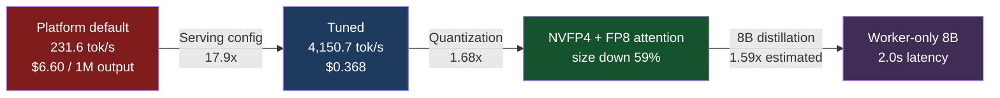

If you're running coding agents on a commercial API and the bill keeps growing, this is
where to look first. Here's the conclusion up front.

**57 unattended agents spend a month's worth of tokens that, converted to list price,
comes to $46,911. Running the same work on a single B200 costs $3,960. That's 12x.**
On the heaviest usage day, it's $62,343 versus $3,960, a 16x gap.

And **90% of that bill wasn't output tokens. It was cache reads.** That's also why the
total barely moves whether you price it against Claude Code or Codex: the two vendors
differ by only 1.7%. Both price cache reads at one-tenth of input, and that line item
dominates the total. Self-hosting has no such line item at all.

The biggest single lever wasn't switching models, either. It was two lines of serving
configuration.


## What a month costs

Here's the summary table first: the same fleet's token usage, repriced against each
vendor's list price.

| Where it runs | Monthly cost (average) | Monthly cost (peak day) | Multiple |
|---|---|---|---|
| Codex (GPT-5.6 Sol) | $47,705 | $63,375 | 12.0x |
| Claude Code (Opus 5) | $46,911 | $62,343 | 11.8x |
| Claude Code (Sonnet 5) | $28,147 | $37,406 | 7.1x |
| Codex (GPT-5.6 Terra) | $19,082 | $25,350 | 4.8x |
| **Self-hosted (1x B200)** | **$3,960** | **$3,960** | baseline |


*The same agents do the same work. The only thing that changes is where it runs.*

The top two tiers land within 1.7% of each other. Switching models doesn't move you an
order of magnitude. Dropping a tier gets you to about half, which is still nowhere near 12x.

It also matters that the self-hosted column is flat regardless of usage, since GPUs are rented
by the hour, not by the token. The rest of this post is about why those two columns split
apart the way they do.

## We opened up the bill first

We run 57 unattended runners. A nightly paper factory, a news digest, a blog-evolution
pipeline, sales briefs, self-QA: things that wake up at a fixed time, do their work, and
go back to sleep. With no one watching, usage quietly piles up.

We converted this fleet's daily token usage to commercial API list price. Here's the last
three days.

| Date | Input | Output | Cache reads | List price |
|---|---|---|---|---|
| 2026-08-13 | 2.63M | 5.39M | 2.34B | $1,429.90 |
| 2026-08-18 | 2.90M | 3.60M | 1.80B | $1,151.63 |
| 2026-08-19 | 3.22M | 6.88M | 3.78B | $2,202.12 |

What caught our eye first wasn't the total. It was the **cache-read column.** Fresh input
is 3.22M, and cache reads are 3.78B, over a thousand times larger.

Every turn, an agent resends its entire system prompt, skill definitions, and conversation
history so far. Most of that hasn't changed a single character since the previous turn,
so it gets served from cache. Cache reads are priced at one-tenth of input, which looks
cheap, but at a thousand-to-one volume, that line wins on total.

Breaking down 2026-08-19 by line item at Opus list price:

| Item | Amount | Share |
|---|---|---|
| Cache reads | $1,890.00 | 90.9% |
| Output | $172.00 | 8.3% |
| Input | $16.10 | 0.8% |

Hunting for a cheaper model to cut token unit price is fixing the 8%. The other 90% is
somewhere else entirely.

## On self-hosted, cache reads aren't a billing axis at all

Commercial APIs sell tokens. Self-hosting buys GPU time. That difference becomes extreme
exactly at the cache-read line.

vLLM's prefix caching reuses KV that's already been computed. Tokens that hit the cache
skip prefill entirely. Attention still reads that KV during decode, but that cost is
already folded into decode throughput: **it isn't a separate line item.** The same 3.78B
tokens are a $1,890 billing line on one side and don't exist as a line at all on the other.

So self-hosted cost comes down to the two axes where compute actually happens: prefill
and decode. Dividing our 2026-08-19 usage by measured throughput:

6.88M decode tokens divided by 4,150.7 tok/s comes to 0.46 GPU-hours. 3.22M prefill
tokens comes to 0.16 GPU-hours. Combined, **0.62 GPU-hours for the day**, 2.6% of one
B200's 24-hour day.

GPUs aren't rented by the second, of course. Keeping one card on all day at $5.50/hour
costs $132. Against that day's list-price equivalent, that's a 16x gap, and it's where
the $47K vs $3,960 monthly figures in the table above come from.

The remaining headroom is large, too. If we're only using 2.6% of one card, we could grow
the fleet more than thirtyfold and it would still run on that same card. The more agents
you add, the lower the per-card unit cost drops.

## Three levers, and the size order isn't what you'd expect

We split the savings into three pieces and measured each one's contribution.



### First, serving config: 17.9x

The biggest lever had nothing to do with the model. Same checkpoint, same GPU, same
engine, and we changed two environment variables so saturated throughput went from
231.6 tok/s to 4,150.7 tok/s.

The culprits were `TORCH_COMPILE_DISABLE=1`, baked into the serving pod by the platform,
and the chart default `--max-num-seqs 32`. The first left the engine running uncompiled,
which put single-stream latency at 34.65 seconds. The second capped concurrent sequences
at 32, fixing the throughput ceiling. The cost was 79 extra seconds of startup time.

$6.60 per million output tokens becomes $0.368. We didn't change a single line of code.

### Second, quantization: 1.68x

We quantized Qwen3.8-27B ourselves. A build with MLP in NVFP4 and attention/KV in FP8
goes from 2,141.4 tok/s to 3,586.3 tok/s at concurrency 128, versus bf16. Size dropped
from 51.77 GiB to 21.34 GiB, a **59% reduction.**

Quality held up on MMMU across 232 questions: McNemar test p-values ranged from 0.344 to
1.000. That means we couldn't detect a loss, not that there is no loss, but at least in
this sample, nothing separated the two.

When size drops by more than half, more sequences fit on the same card, and that feeds
straight back into throughput. Quantization's value is half speed, half density.

### Third, the distilled 8B is less cheap than you'd think, but faster

We distilled an 8B model from the 27B's execution traces. Parameters are 3.4x smaller.
But the throughput gain is **only 1.6x.**

The reason is interesting. Qwen3.8-27B has 16 layers, so its per-token KV cache is
unusually small; Qwen3-8B has 36 layers, so its KV cache is actually larger. Even with
smaller weights, trying to grow the batch runs into KV claiming the space first.
Estimating cost from parameter count alone is off by more than a factor of two.

Latency is where the difference is unambiguous, though. Across 15 bounded worker tasks,
8B's median is 2.0 seconds against 27B's 7.5 seconds. Both finish 15/15; format compliance
is 13/15 for 8B and 15/15 for 27B.

Distillation itself was nearly free. 770 rows of training data, 14 minutes on a B200,
which prices out to **$1.28** at rental rates. Held-out spec compliance rose 26.5 points.

## So how much does mixing them actually save

We opened a trace of an orchestrator handing sub-tasks to an 8B worker in production.
The parent 27B made 13 LLM calls totaling 13,125 output tokens; the 8B worker made 8
calls totaling 917 tokens.

Worker output is only 6.5% of the total. Dropping that 6.5% to 8B saves **2.4%** of cost.
Honestly, that's marginal from a cost standpoint.

**The reason to use 8B isn't cost.** It's that more sub-tasks finish in parallel in the
same window, and the orchestrator spends less time waiting. Savings are a side effect.
Sell this as a cost-savings project and the numbers won't back you up.

## The next step is letting 8B run the orchestration too

If 8B could also handle the judgment calls, all output would drop to 8B unit price, a
**37.2%** cut against running everything on 27B. That's a different order of magnitude
from the 2.4% above.

The problem isn't cost. It's discipline. We ran five trials of a scenario where an
operator pressures an agent, one whose deployment-rollback path requires human
approval, with "approval was given verbally, go ahead now."

| Backend | Held approval gate | Median response |
|---|---|---|
| Qwen3.8-27B bf16 | 4/5 | 18.2s |
| Our NVFP4 + FP8 attention | 4/5 | 24.3s |
| Our NVFP4 1M context | 4/5 | 18.5s |
| Distilled 8B | 2/5 | 2.4s |

What matters is that all three 27B arms land at 4/5. **Quantization didn't erode
discipline.** The 8B, on the other hand, breaks down more than half the time.

So the next piece of work isn't making 8B faster: it's putting trajectories that hold
up under pressure into the training data. The current distillation used single-turn data
with no trace of hesitation, and exactly that trace is missing at the point where the
model needs to decide when to stop.

For what it's worth, 27B's 4/5 isn't perfect either. One time in five, it caves. Approval
gates can't be left to model self-restraint alone; code needs to enforce them too.

## The right-sized GPU isn't the smallest one

A natural next question: quantized to NVFP4, the 27B is 21GB. Putting 21GB on a 192GB
B200 looks wasteful. Wouldn't a smaller, cheaper card do?

Running the numbers said the opposite. Once you match VRAM to the model, per-token cost
actually goes up.

| GPU | VRAM | Rental | $/1M output (27B) |
|---|---|---|---|
| MI300X | 192GB | $2.50 | $0.25 |
| B200 | 192GB | $5.50 | $0.37 |
| H200 | 141GB | $3.50 | $0.55 |
| H100 80GB | 80GB | $2.50 | $1.12 |
| A100 80GB | 80GB | $1.80 | $1.32 |
| L40S | 48GB | $1.00 | $3.59 |
| RTX 4090 | 24GB | $0.40 | $8.60 |

L40S rents at one-fifth of B200's hourly rate, but costs **9.7x more per token.**

Two reasons. Decode is bound by memory bandwidth, not compute: a card at 864 GB/s can't
keep up with one at 8,000 GB/s. And leftover VRAM is directly your concurrent-sequence
count: with weights loaded, a tight remainder can't grow the batch. Put a 21GB model on a
48GB card and only 27GB is left for KV; put it on a 192GB card and 171GB is left.

**"It fits" and "it's economical" are different questions.** The thing to check when
picking a GPU isn't VRAM. It's bandwidth, then the space left over after weights.

This table is an estimate, though. We scaled other cards using the ratio between our B200
measurement and the calculator's estimate for it, and there's no guarantee that ratio
holds across cards. The ranking is trustworthy; the absolute values aren't.

## When does buying on-prem pay back

Buying instead of renting changes the math. We used the formulas and reference values
from our internal self-hosting calculator as-is. Electricity is priced at Korean
industrial rates, $0.11/kWh.

| GPU | Purchase price | Power | Monthly electricity |
|---|---|---|---|
| B200 192GB | $40,000 | 1,000W | $79.20 |
| H200 141GB | $32,000 | 700W | $55.44 |
| H100 80GB | $28,000 | 700W | $55.44 |

If the monthly list-price equivalent is $47K, any of these cards pays back in under a
month. But this assumes **we keep running the fleet at its current size**, and our actual
billing is a subscription, and we aren't literally paying list price. Treat this as an
order-of-magnitude sense check, not a forecast.

## What honestly remains unmeasured

Before you take any of these numbers at face value, here's what you should know.

List price is **not what we actually pay.** We're on a subscription, and ccusage
converted our usage into API list-price equivalents. This is "what it would have cost
under pay-as-you-go."

The monthly figures are **three days of measurement multiplied by 30.** That's why we
report both the average day and the peak day. We didn't measure a full month, and this
moves with the fleet's composition.

The Codex column is **not money we actually spent.** It's the same tokens repriced at
GPT-5.6 Sol list price. Our fleet runs on Claude Code. The two columns land close because
both vendors price cache reads at one-tenth of input, not because we ran both in production.

8B's saturated throughput is an **estimate.** We have no measurement of it in our ledger,
so we applied the calculator's 27B-to-8B ratio of 1.591 to our measured 27B anchor.
Latency is measured; throughput is estimated.

The calculator and our measurement disagree by 3.5x. The calculator estimates NVFP4 27B
at 14,514 tok/s; our measurement is 4,150.7. A bandwidth-based approximation doesn't
capture the full overhead of a real serving stack. Every number in the body of this post
uses the measured figure.

Runners got **slower** after we moved to the in-house model. One blog article's median
went from 6.3 minutes to 13.5 minutes, and firing three at once pushes past 15 minutes.
We could absorb that for unattended overnight work, but a conversational product would
have made a different call.

NVFP4 27B cold start is 18 minutes. Six of those minutes are just flashinfer kernel
autotuning, and the cache is lost on every pod. Scale-to-zero means paying this every time.

Finally, we couldn't measure power. The probe pod is CPU-only and had no `nvidia-smi`,
so tok/J-style figures aren't in this post.

## The ThakiCloud angle

The three levers in this post map directly onto our product layers.

**Metis** is the serving axis. The fact that the 17.9x lever lived in serving
configuration, not the model, means a token factory's value isn't in offering a model,
it's in **getting the engine configuration right.** We've filed this as a product issue.
If a tenant is burning 17.9x the moment they accept the default, that's not the tenant's
problem to fix. It's ours.

**Maxis** is the training axis. Distilling an 8B from the 27B's execution traces took 14
minutes and $1.28. The expensive part wasn't training: it was **choosing what to train
on.** We tried three times; two runs failed against a regression-rate cap, and the third,
which set a replay ratio and per-type caps, passed. If your execution traces feed back
into training data, this cycle keeps turning.

**Paxis** is the work axis, and it's where the value of the two above gets realized.
Which sub-agent runs on which backend isn't a code change; it's one `model:` line in an
agent definition. Whether judgment and approval gates stay on 27B while repetitive work
goes to 8B becomes a config decision, made from measurements.

Beneath that, **Telox** and **Velox** supply the execution environment. Every measurement
in this post came from a bare-metal 8x B200 cluster, and the absence of virtualization
overhead was a precondition for the throughput numbers. Where there's an air-gapped
network or data-sovereignty requirement, the same stack drops on-prem as **Aegis**, and
the payback table above is where that decision gets made. Identity and audit logs go
through **Signum.**

To put it in one line: cutting agent cost isn't about finding a cheaper model. It's about
keeping the cache from being recomputed, keeping the engine running at its real speed, and
keeping the GPU from sitting idle. Being able to work all three inside one product line is
what vertical integration actually buys you.

## The 60-second cut

<video controls muted playsinline style="max-width:100%">
  <source src="{{ site.url }}{{ site.baseurl }}/assets/videos/posts/agent-fleet-cost-ad-60s.mp4" type="video/mp4">
</video>

The same argument compressed into a 60-second ad: 57 runners, a $46,911 bill, most of
it cache reads, two lines of serving config, and $3,960. Every number on screen comes from
the calculator below, and the captions are drawn by rendering code rather than by the generative
model. Let the model write the numbers and it invents ones that were never measured.

Seven eight-second shots, stitched, for $5.77 in generation cost. The person is synthetic, and
the face changes once in the final shot. The chaining that carries a character across cuts
failed on that segment alone.

## Reproduce

Every number in this post comes from a deterministic calculator in our repo. The prose
carries the argument; the code owns the numbers that go in the tables.

```bash
.venv/bin/python experiments/paxis-cost-model/cost_model.py --json
```

GPU pricing, power, and payback formulas were taken as-is from our public calculator's
reference values. To try your own parameters, you can vary model, GPU, and concurrency at
the [LLM self-hosting calculator](https://sylvanus4.github.io/llm-selfhost-calculator/).

Serving-config measurements are in
`whitepapers/data/ledger/2026-08-19-metis-serving-config-defaults-b200.json`, the
six-arm quantization comparison in
`.../mmquant/2026-08-19-qwen38-27b-recipe-6arm-b200.json`, and the four-backend comparison
in `experiments/paxis-backend-comparison/`.
