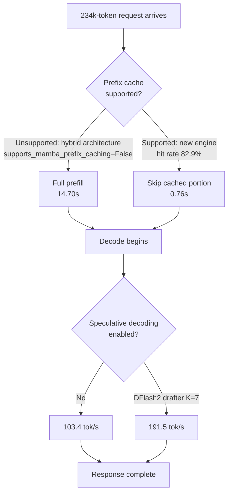

If you run an LLM service that ingests whole documents, try sending the same prompt twice
right now. If the second call isn't faster than the first, prefix caching isn't running,
and that single fact could be costing you 15 seconds on every request.

That was exactly our situation. Feeding in a 234,000-token document and asking a question
took **15.3 seconds** to the first character. On an engine-upgraded configuration, the same
question took **1.1 seconds**. This post covers where that gap came from, how we measured
it, and how to check your own endpoint in ten minutes.


*Most of a long prompt has already been computed. Whether the engine knows that is what
separates 15 seconds from 1.1.*

## Why 234,000 tokens

First, why we picked this length. The short prompts common in benchmarks simply don't
reveal this problem.

Counting the requests our unattended agents actually send, prompts run up toward 300,000
tokens. The skill list and system prompt alone already exceed 200,000 tokens, and file
contents and conversation history stack on top of that. At this length, the bottleneck
moves somewhere completely different.

With short prompts, a slow response usually means slow decode: the speed of generating
tokens one at a time is everything. But once a prompt crosses 200,000 tokens, the cost of
reading all of it before the answer even starts gets tacked on, and the shorter the answer,
the more that cost dominates total time. Ratios measured with an 80-token prompt say
nothing about this regime.

So we matched the measurement length to actual traffic. The same applies if you run this
check yourself: if you don't measure at the prompt lengths your service actually receives,
you'll end up optimizing the wrong thing.

## The symptom: 15.3 seconds, three times over

What felt off wasn't absolute slowness. A 234k-token prompt is naturally going to take a
while to prefill. What was strange was that **it didn't get faster on repeat**.

We ran three warmup calls with the same prompt, then five more measurements.

```
warmup 1: 15.266s
warmup 2: 15.266s
warmup 3: 15.397s
  take 1~5: 15.32s (median, spread 1.01)
```

If prefix caching were working, the second request should skip the front portion entirely.
Instead, it was perfectly flat. That flatness isn't "the cache is slow", it's "there is no
cache."

For comparison, here's the same trace on an endpoint where caching actually runs:

```
warmup 1: 16.274s
warmup 2:  1.301s
warmup 3:  1.284s
```

The first request is actually a bit slower, because populating the cache costs something.
And **from the second request on**, it's 12x faster. That's what normal behavior looks
like: a single step down, then flat. That flatness and the earlier flatness are entirely
different things.

## Root cause: nobody forgot a flag

We asked the engine directly. vLLM exposes prefix cache query and hit counts through
`/metrics`.

| Metric | Current endpoint | New endpoint |
|---|---|---|
| `prefix_cache_queries_total` | **0** | 8,286,381 |
| `prefix_cache_hits_total` | **0** | 6,866,496 |
| Hit rate | not measurable | **82.9%** |

Zero queries. The cache wasn't slow, the code path itself never ran. The startup log gave
the answer in one line: the engine came up with `enable_prefix_caching=False`, and we never
passed that flag.

If it's off, the engine turned itself off. The reason lay in the model architecture. Our
Qwen3.8-27B isn't a pure transformer, it's a **hybrid** model mixing attention with
Mamba-family linear attention. The startup log was already hinting at this.

```
Setting attention block size to 784 tokens to ensure that
attention page size is >= mamba page size.
```

Attention KV can be sliced into blocks and reused, but Mamba's state is a sequentially
accumulated value, and splicing it back in from the middle isn't simple. So vLLM makes this
capability something **each model class declares**. We checked it directly inside the
running pod.

```python
>>> ModelRegistry._try_inspect_model_cls("Qwen3NextForCausalLM")
supports_mamba_prefix_caching = False
is_hybrid = True
```

The same lookup on the new engine flips this value. In other words, this wasn't a
configuration mistake, it's a **feature gap between engine versions**. Adding
`--enable-prefix-caching` on the current version changes nothing, because you'd be asking
it to turn on a feature it doesn't support.

Why hybrid models are hard comes down to how the two layer types handle state. Attention
finishes each token by leaving behind its own key and value. The KV for the first 1,000
tokens stays exactly as it was no matter what comes after, so a later request sharing that
prefix can just point at the same blocks. That independence is what makes caching work in
the first place.

Mamba-family layers are the opposite. They consume tokens one at a time and continuously
update a fixed-size state. The state at token 1,000 is a single value compressed from
sequentially passing through the previous 999. Reusing it isn't a matter of pointing at a
KV block, you have to store the intermediate state in full and restore it at the exact
right point. The storage unit also has to line up with the attention block size. The line
in the startup log about "aligning the block to 784 tokens so attention page size is at
least mamba page size" is exactly that alignment work.

So this isn't impossible, it's something that has to be **implemented separately**. That's
why vLLM treats it as a per-model capability rather than a global switch, and support lands
at different times for different architectures.

This distinction matters. If it's "we forgot a flag," it's a one-line config fix. If it's
"the engine doesn't support it," it means an upgrade plan and regression testing. The two
conclusions demand entirely different responses.



## How we measured it

We're writing down the method first because our first attempt gave a completely wrong
answer.

Initially, we timestamped tokens as they arrived in the streaming response to compute
decode speed. The result came out to **460,000 tokens per second**. Physically impossible.
It turned out this endpoint doesn't stream deltas one at a time, it batches them. Sixty-
five deltas arrived clustered into **two timestamps**. When you measure a window by arrival
time, the denominator collapses toward zero and speed explodes.

So we changed the method. Ask the same prompt twice, once for **64 tokens** and once for
**320 tokens**, and divide the difference in elapsed time by the difference in token count.

```
decode speed = (320 - 64) / (t_320 - t_64)
```

This way, prefill time appears identically on both sides and cancels out automatically. It
doesn't matter how the server chunks the response. All you need is a wall clock. The
remaining intercept gives you prefill time, so you get both values from one pair of calls.

Here's roughly the code we used.

```python
def ask(base, model, doc, max_tokens):
    body = json.dumps({
        "model": model,
        "messages": [{"role": "user", "content": doc}],
        "max_tokens": max_tokens,
        "temperature": 0.0,
        "ignore_eos": True,          # length must be forced for the two points to compare
    }).encode()
    t0 = time.time()
    urllib.request.urlopen(request(base, body), timeout=1200).read()
    return time.time() - t0

t_short = median(ask(base, model, doc, 64)   for _ in range(5))
t_long  = median(ask(base, model, doc, 320)  for _ in range(5))

decode_tps = (320 - 64) / (t_long - t_short)
prefill_s  = t_short - 64 / decode_tps
```

`ignore_eos` is the key part. Without it, the model can finish its sentence before using
all 64 tokens, so output length diverges between the two points and the slope becomes
meaningless. We had the code check that output token counts were identical across every
repeat, and print a warning if even one differed.

We added one more gate before measuring. We check that `num_requests_running` is 0 on both
endpoints, and refuse to measure if either is handling another request. Measuring on top of
someone else's traffic means you're measuring the queue, not the model. On the same day, in
fact, a different endpoint gave 12 tokens per second and looked broken, the answer turned
out to be 45 concurrent requests.

## The numbers

234,000-token prompt, 3 warmups then 5 measurements, median, concurrency 1.

| | Current (v0.24.0) | New engine + drafter | Multiplier |
|---|---|---|---|
| Prefill (to first answer) | 14.70s | 0.76s | **19.3x** |
| Decode | 103.4 tok/s | 191.5 tok/s | 1.85x |
| Full 64-token answer | 15.32s | 1.09s | **14.0x** |
| Full 320-token answer | 17.80s | 2.43s | 7.3x |

Spread across repeats stayed between 1.00 and 1.10 for all four measurement points.


*The left panel shows response completion time by answer length; the right two panels break
out prefill and decode separately. Only the two bold circles are actual measurements, the
rest is the straight line connecting them.*

Here's the most important sentence in this post: **there is no single multiplier.** The
shorter the answer, the larger the share of total time taken up by prefill, so the
multiplier grows.

| Answer length | Current | New config | Multiplier |
|---|---|---|---|
| 64 tokens | 15.32s | 1.09s | 14.0x |
| 128 tokens | 15.94s | 1.43s | 11.2x |
| 256 tokens | 17.18s | 2.10s | 8.2x |
| 1,024 tokens | 24.60s | 6.11s | 4.0x |

That's why we lead with **"15.3 seconds down to 1.1"** instead of a ratio. What a user
actually experiences is wait time, not a ratio, and the ratio itself swings by a factor of
three depending on answer length.

## How much came from the drafter

The two endpoints in the table above don't differ only by engine version. Context ceiling
and the presence of a speculative decoding drafter differ too. So quoting that multiplier as
"the drafter's effect" would be wrong.

We decided to measure instead of assert. We stood up a third endpoint on the new engine with
everything the same except the drafter removed. With a middle arm in place, the two effects
separate.

| Configuration | Prefill | Decode |
|---|---|---|
| Current v0.24.0 (cache off) | 14.70s | 103.4 tok/s |
| New engine, cache only (no drafter) | **0.72s** | 103.9 tok/s |
| New engine + DFlash2 drafter | 0.76s | **191.5 tok/s** |

The two effects separate cleanly. Turning on the cache cuts prefill by 20.4x while
**decode stays unchanged** (103.4 vs 103.9 is within measurement noise). Adding the drafter
on top brings decode to 1.84x while **prefill stays unchanged**. Each touches only its own
segment.

Without this middle arm, we would have written "19.3x is the cache's share and 1.85x is the
drafter's share" as an **estimate**. Thirty minutes and one GPU turned that estimate into a
measurement, and it turned out to be correct. What matters more than being correct is that
we can now say so with evidence behind it.

The drafter used here is DFlash2, configured to propose 7 tokens at a time.

To measure the drafter in isolation, you need a short context and matched conditions
otherwise. On the same day, with an 80-token prompt, we measured **3.80x** on reasoning
tasks and **5.10x** on code generation. Prose generation only reached 2.35x.

The engine explains this spread too. vLLM reports the average acceptance length of
speculative decoding as a metric. It was 2.2 to 2.5 for prose and 5.3 to 5.6 for code. How
many tokens the drafter gets past a single verification pass directly becomes the
multiplier. Code has long stretches where the next token is obvious; free-form prose has
fewer of those.

There's a cost too. On short prompts, time to first token actually went up slightly, from
0.55s to 0.62s, because running the drafter adds cost to the first token. On long contexts,
the prefill savings dwarf this cost, but for services dominated by short requests, the math
changes.

## How to check your own endpoint

Three steps.

First, send the same prompt twice and see if the second call is faster. If it isn't, the
cache isn't running.

Second, check the query count from `/metrics`.

```bash
curl -s "$ENDPOINT/metrics" | grep prefix_cache
```

If `prefix_cache_queries_total` is 0, the feature itself is off. If there are queries but
the hit rate is low, that's a different problem, likely the front of your prompt is
changing on every request. Putting a timestamp or session ID near the start of the system
prompt will make the cache miss every single time.

Third, if it's off, look for `enable_prefix_caching` in the startup log. If it says `False`
and you never passed that, the engine turned itself off, and you need to check the
combination of model architecture and engine version. This is especially relevant if you're
running a hybrid family (Mamba, linear attention, GDN, and similar).

### Why the hit rate isn't 100%

Our new endpoint's hit rate was 82.9%. Not hitting 100% is normal. Prefix caching operates
in blocks, so the partial block at the tail end of a prompt always needs recomputation, and
the question text that varies per answer isn't cacheable either. If the last few hundred
tokens of 234k get recomputed every time, that's roughly the number you'd expect
arithmetically.

The problem case is when this number drops into **single digits**. In practice, that's
usually caused by one of three things.

First, putting a timestamp or session identifier at the very start of the prompt. Placing
"The current time is ..." on the first line of a system prompt changes the first block of
every request, and everything after it falls out of the cache. If you need that
information, move it to the **end** of the prompt instead.

Second, tool definitions whose order changes between requests. Some languages don't
guarantee iteration order when building JSON from a dictionary, so the bytes end up
different each time. Sorting before serialization fixes this.

Third, trimming conversation history from the front. Cutting from the front changes the
entire prefix, invalidating the cache completely. If you must trim, summarizing the middle
while preserving the prefix is more cache-friendly.

### Converting seconds to cost

The gap between 15.3 seconds and 1.1 seconds is GPU occupancy time. At $3.3 per hour for
one B200, serving 1,000 short-answer requests costs roughly 4.25 GPU-hours on the current
configuration and roughly 0.30 GPU-hours on the new one. That's the difference between $14
and $1.

What matters more than the absolute dollar figure is **how many requests the same card can
serve**. If a request occupies a card for 15 seconds, one card caps out at 240 requests per
hour; at 1.1 seconds, that becomes 3,200. For workloads that repeatedly reference long
documents, this gap can decide whether the service is even viable. It's a number worth
checking before considering a smaller model or buying more cards.

## Implications for ThakiCloud products

Our Metis product owns inference and the token factory, and this measurement bears directly
on what we should be giving tenants as a default.

The first thing to fix is **the default configuration tenants receive**. The value of a
managed platform is that customers shouldn't need to know about combinations like this, and
right now the default burns 15 seconds on every long prompt for hybrid models. The fact that
engine version and model architecture interact around feature support is information that
belongs at the catalog level, not something a customer discovers by digging through logs.

Second is **making the endpoint report what it's actually doing**. In this case, what
explained the 15.3 seconds wasn't a benchmark, it was the engine's `/metrics`. Prefix cache
hit rate and speculative decoding acceptance length are numbers that should surface directly
in the console. Observability's job is to make people check the serving configuration before
they start suspecting the model when an endpoint is slow.

Third is **execution economics on the Paxis side**. In agent workflows that repeatedly
reference long documents, prefill savings translate directly into how much work can get
processed. Where a request used to cost 15 seconds, spending 1.1 lets the same GPU carry far
more automation. This is exactly why we anchor our North Star on completed work rather than
token count.

## The upgrade wasn't free

Concluding "upgrade the engine and the cache turns on" is clean, but before pushing that
straight to production we checked one more thing: where the new combination breaks.

We ran a length ladder. Starting at 8,000 tokens and climbing to 64,000, 148,000, and
244,000, we checked at every step whether the response came back correctly and whether the
server process was still alive after the request finished. Everything up to 244,689 tokens
was fine, and speculative decoding's acceptance length stayed stable between 1.42 and 1.47.

It broke at 300,000 tokens. We got an HTTP 500, and the engine core died from an illegal
CUDA memory access. The pod restarted, but if this had happened in production, every request
attached to that endpoint at that moment would have gone down with it.

The operational rule this gave us is simple. **The context ceiling you advertise has to be
the value that actually survives, not the value you'd like to claim.** If you declare
support for 1 million tokens and turn on the drafter, a single request somewhere between
245,000 and 1 million can take down the whole endpoint. So we lowered this endpoint's
ceiling to 245,760, right above the last point the ladder confirmed as passing.

This work took 30 minutes, and those 30 minutes prevented an incident that could have taken
down an entire unattended pipeline. If you only check "does it work" when turning on a new
feature and never check "where does it break," that boundary ends up being found by a
customer instead.

## What's left

We haven't yet pinned down exactly which condition disabled the cache on the current
endpoint. The hybrid architecture's capability declaration is the leading explanation, but we
can't rule out rope scaling settings or the context ceiling playing a role too. We're
recording an observation here, not asserting a cause.

And every number in this post is **latency at concurrency 1**. Not saturated throughput.
Once batching fills up, the math for speculative decoding changes, and prefix caching also
looks different once multiple sessions are pulling in different documents at once. This
experiment didn't measure quality either. Only speed.

Still, one conclusion is clear. If you run a service that handles long documents, checking
whether the cache is even running is a much cheaper optimization than swapping the model.
