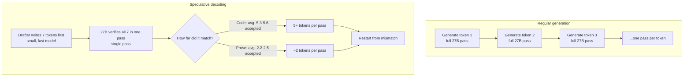

If you're serving a 27B-class model on your own GPUs, you've probably wondered how much
speed is left on the table without swapping the model itself. In our measurements, the
answer was **4.72x**.

Starting from the original Qwen3.8-27B weights, we did two things. First we quantized to
4-bit, then we attached a speculative decoding drafter. 97.1 tokens per second became
136.7, then became 458.5. One NVIDIA B200, the same prompt, one request at a time.



*Each stage was recorded separately and played back side by side. The two windows flow
together, but they were not run at the same time.*

*A visual metaphor for the article's key idea.*

## We changed one thing at a time

"We quantized it and added a drafter, and got 4.7x" is an easy sentence to write and it
tells you nothing. If you don't know how much each piece contributed, you don't know
which one to touch when one of them doesn't work out.

So we stood up three endpoints and turned them into a ladder. Each step differs from the
one before it in **exactly one way**.

| Step | What changed | Decode speed | vs. prior step | vs. original |
|---|---|---|---|---|
| ① Original | Qwen3.8-27B bf16 | 97.1 tok/s | | 1.00x |
| ② Quantized | Weights to NVFP4 4-bit | 136.7 tok/s | **1.41x** | 1.41x |
| ③ Drafter | Added DFlash2 speculative decoding | 458.5 tok/s | **3.35x** | **4.72x** |

Median values, three runs per cell. Prompts span four types: conversation, reasoning,
long-form, and code.

<!-- nlm-visual -->

*Infographic generated by NotebookLM from the sources.*

## Step 1: 4-bit quantization gets you 1.41x

The first step is shrinking the weights to 4-bit. We kept the engine and serving config
untouched and only swapped the model file.

Why this speeds things up becomes clear once you see where the bottleneck sits. Every time
the GPU generates a token, it has to read the entire model's weights from memory. A 27B
model in bf16 means reading about 54GB per token, and cutting to 4-bit brings that to less
than half. The computation didn't get faster; **there's just less to read**.

A natural question follows: if the amount to read fell to less than half, why only 1.41x?
Because only the weights shrink, the KV cache and activations stay the same size, and
converting 4-bit values back for actual computation carries its own cost. Still, 1.41x
without touching the model is cheap.

In the same experiment, time to first token also dropped, from 0.74 seconds to 0.56.

### Why NVFP4, and why B200

Not all 4-bit is the same. The format we used is NVFP4, and it matters because B200-
generation tensor cores **compute 4-bit floating point natively in hardware**.

Many of the 4-bit schemes common in earlier generations only store in 4-bit and convert
back to 16-bit right before computation. You save memory, but the arithmetic runs at full
precision anyway. Native support removes that conversion step. That means the same 4-bit
model can pay off differently depending on which card it runs on, which is why you can't
choose hardware and quantization format independently.

That's also why we build this recipe ourselves and put it in the catalog. Figuring out
which format pays off on which card isn't something the people using the model should have
to research every time.

## Step 2: the drafter gets you 3.35x

The second step is a different kind of change. The weights are untouched; what changes is
**how generation happens**.

A normal language model passes through the entire model once for every single token it
writes. Speculative decoding attaches a small, fast helper model to it. The helper writes
out the next seven tokens as a guess, and the big model **verifies all seven in a single
pass**. Whatever matches gets kept, and generation restarts from the first mismatch.

The core insight is that verification is cheaper than generation. Verifying seven tokens
doesn't cost much more than generating one. So in stretches where the helper guesses well,
a single pass yields several tokens. The helper model we used is DFlash2, configured to
propose seven tokens at a time.

This is where the character of the technique shows up. **How much speedup you get depends
heavily on the kind of work.**

Here's the picture. Regular generation on the left, speculative decoding on the right.

That verification is cheaper than generation is the whole idea in this diagram. A pass on
the right costs about the same as a pass on the left, but the left yields one token and the
right yields several. How many you get on average is the multiplier, and that value is
called the acceptance length.

DFlash2, the drafter we used, is a small model prepared separately. It shares the same
tokenizer as the big model and is built to mimic what the big model is likely to say. This
means you can't just attach any small model and expect results. The better it mimics, the
higher the acceptance length climbs; the worse it mimics, you pay the verification cost and
throw the guess away. Matching this pair well is the real difficulty in adopting
speculative decoding.

### How to set K

How many tokens to propose at once is a knob. We set it to 7.

Set it higher and you pass through more tokens in one shot when the guesses land. But when
they miss, you throw away more, and verification itself carries a bit more cost. Set it
lower and you're safer, but the ceiling on what you can gain drops. An acceptance length of
5.3 to 5.6 on code means roughly five out of seven are landing, so 7 wasn't an
excessively large value for this workload.

The catch is that this optimal value **differs by workload**. For prose-heavy traffic, the
acceptance length sits closer to 2.2, so proposing up to 7 could be wasted work. In an
earlier experiment where we tried a different, n-gram-based speculative method, we actually
saw the multiplier flip depending only on whether this same knob went up or down. Before
you decide whether to turn it on, it's faster to measure the acceptance length on your own
traffic first.

## 7.13x on code, 3.4x on conversation

Broken down by prompt type, the multiplier over the original looks like this.

| Prompt | ① Original | ② Quantized | ③ Drafter | vs. original |
|---|---|---|---|---|
| Code generation | 95.2 | 133.0 | 678.4 | **7.13x** |
| Reasoning (arithmetic) | 95.6 | 133.0 | 505.2 | **5.28x** |
| Conversation | 99.9 | 144.5 | 334.7 | 3.35x |
| Long-form prose | 102.0 | 148.0 | 346.0 | 3.39x |

*Left: the three steps broken down by task type. Right: the ladder averaged across all
four prompts. The gap between the two blue bars stays roughly the same everywhere, but the
orange bar swings widely by task.*

What stands out in this chart is that the relationship between the two blue bars is nearly
identical across all four tasks. The quantization step lands between 1.39x and 1.45x
regardless of task, because the benefit of reading less memory has nothing to do with the
content.

What splits is the drafter step. The engine tells you why directly. vLLM reports
**mean acceptance length** for speculative decoding, the count of tokens that passed
verification per check. It was 2.2 to 2.5 for prose and 5.3 to 5.6 for code. That lines up
exactly with the multiplier we observed.

This makes intuitive sense too. Code has long stretches where the next token is nearly
fixed. Once you've written a function signature, the indentation, brackets, and repeated
variable names that follow are things even a small model can guess well. Free-form prose,
by contrast, has a much wider set of plausible next words. The helper model misses more
often, and everything after a miss gets discarded.

So the value of this optimization comes down to **what your traffic actually generates**.
If you're running a coding assistant or a service that produces structured output, look at
the top of the table above. If you're running chat support or writing assistance, look at
the bottom.

## The two optimizations don't fight each other

There's a common worry when combining two techniques like this. If quantization has
already cut memory reads, is there still room for speculative decoding to dig into? The
suspicion is that both are attacking the same bottleneck and their gains overlap.

That suspicion is grounded in something real. We saw exactly this in an earlier experiment.
A simple n-gram-based speculative method actually **got slower** on top of a quantized
model. Once the baseline is already fast, whatever you lose when a guess fails becomes
relatively larger.

The reason this result came out differently is the quality of the guessing. The n-gram
method looks for repeated patterns in the text generated so far and guesses what comes
next. It works well on copy-and-edit tasks but misses often on free-form prose. A trained
drafter is trained to mimic what the big model is likely to choose next, so it lands even
where there's no repeating pattern to lean on. The same idea can produce opposite results
depending on how it's implemented.

The fact that each step of the ladder multiplied cleanly, 1.41x times 3.35x landing at
4.72x, is itself evidence that the two techniques aren't eating into each other.

## How we measured this

Worth writing down the measurement method, since multipliers like these are easy to shake
loose depending on how you measure.

The most important decision was **not running both arms at the same time**. In the video,
the two windows flow side by side, but they were actually recorded separately and later
overlaid at real speed. If two requests share the same GPU and the same queue, you end up
measuring contention, not the model. And that distortion isn't symmetric, the slower side
holds resources longer, so the faster side loses more.

So we ran each cell sequentially, logged the arrival time of every token, and later played
them back together. Because the recording is redrawn frame by frame into a video, the same
file comes out regardless of whether the laptop was busy or idle while rendering.

We also set a rule for which numbers to quote. We only use cells where **both arms produced
exactly the same number of tokens**. If response lengths differ, the multiplier gets shaken
by length rather than speed. The code and reasoning rows in the table above are
like-for-like because both arms hit exactly the 1,500-token cap.

Before measuring, we check that each endpoint isn't already busy with other requests. On
the same day, another endpoint was giving us 12 tokens per second and we thought it was
broken, the answer turned out to be 45 concurrent requests already in flight. We excluded
that endpoint from the comparison.

There's also a reproducibility check. The drafter arm appears in two separate recordings,
which gave us 458.5 and 457.0. A 0.3 percent difference.

### If you want to measure this yourself

You don't need special tooling. You need three things.

Send the same prompt to both arms, but **sequentially**. Sending them at the same time
means you're measuring contention.

Force the output length. Set `max_tokens` and don't let the model end its sentence early,
or the numbers between the two arms aren't comparable. If lengths differ, the shorter
answer will look faster than it actually is.

And repeat. We discarded the warmup run and measured three times each; if a cell shows high
variance, treat that value as something to investigate, not something to quote. In our
experiment, the run-to-run spread on the reasoning and code prompts was 0.0 to 0.2 tok/s.
That's tight enough to call a difference real rather than noise.

Acceptance length reads straight off vLLM's `/metrics`. If you turn on the drafter and this
value sits near 2, that's an early signal that this workload won't get the gains you're
hoping for.

## It's not free

Being straightforward about the tradeoffs.

Time to first token gets **slightly longer** with the drafter on, from 0.55 to 0.62
seconds. Running the helper model up front adds that cost. For a service where most
requests are short, this hit eats meaningfully into the gain.

And every number in this post is decoding speed at **one concurrent request**. This isn't
saturated throughput. Once the batch fills up, the math on speculative decoding changes.
When the GPU is already busy, there's no spare compute left for verification, and the same
drafter can turn into a net loss in that regime.

This experiment **didn't measure quality**. Only speed. Quantization can shift output by
design, and speculative decoding may or may not guarantee the same distribution as the
original model depending on the verification method. If you're evaluating adoption, a
quality regression test is required alongside any speed numbers.

## What this means for ThakiCloud's products

Our Metis product handles inference and the token factory. What this measurement means at
that layer is straightforward.

**If the same card can give you 4.7x, that's directly a unit cost.** The hourly cost of a
B200 is fixed, whether that card outputs 97 tokens per second or 458 determines how far
that cost splits across tokens. Before considering a smaller model or buying more cards,
it's much cheaper to first measure how much headroom is left in the model you're already
running.

**And this combination isn't something customers should have to assemble themselves.**
Building the quantized weights, serving the drafter alongside it, and matching engine
versions each carry their own failure points. The value of a managed platform is letting
customers pick this combination off a catalog without needing to know it exists. That's
why we build the quantized recipe ourselves and put it in the catalog.

**On the Paxis side, this converts not into throughput but into completed work.** In an
agent workflow that generates code, 7x means seven times as many tasks running in the same
window. And as we saw above, code generation is exactly where this optimization performs
best. Our traffic mix and the strength of this technique overlap.

## When this combination doesn't pay off

Three cases where you shouldn't expect these numbers.

**When concurrency is high and the GPU is already saturated**, the gain from speculative
decoding shrinks or disappears, because there's no spare compute left for verification. The
throughput of a fully-loaded batch isn't what this post measured, and that condition needs
its own separate measurement.

**When each request is very short**, the up-front cost of running the drafter eats into the
gain. Time to first token stretching from 0.55 to 0.62 seconds means the economics get tight
on a request that only generates twenty tokens.

**When output is mostly free-form prose**, acceptance length stays a bit above 2 and the
multiplier settles near 3x. That's not a small number, but if you go in expecting 7x, you'll
be disappointed.

On the other hand, a service that generates a lot of code or structured output, has long
generation lengths per request, and doesn't run at high concurrency, is exactly where this
combination performs best.

## Summary

Starting from the original weights, we took two steps and changed one thing at each. 4-bit
quantization got us 1.41x, a speculative decoding drafter on top got us 3.35x more,
combined 4.72x. On tasks like code generation where the next token is highly predictable,
the gap stretches to 7.13x; on free-form prose, it stays closer to 3.4x.

The point is that this came from tuning the serving layer alone, without changing the
model. If you're running your own model on your own GPUs, it's worth measuring how much is
left in your current setup.

<!-- nlm-visual -->

*Infographic generated by NotebookLM from the sources.*

## References

Canonical links for the model builds and vLLM features referenced above.

- Base model: [Qwen/Qwen3.8-27B](https://huggingface.co/Qwen/Qwen3.8-27B)
- NVFP4 build: [ThakiCloud/Qwen3.8-27B-NVFP4-FP8ATTN](https://huggingface.co/ThakiCloud/Qwen3.8-27B-NVFP4-FP8ATTN)
- Drafter: [z-lab/Qwen3.8-27B-DFlash2](https://huggingface.co/z-lab/Qwen3.8-27B-DFlash2)
- Speculative decoding: [vLLM Docs, Speculative Decoding](https://docs.vllm.ai/en/latest/features/speculative_decoding/)
- Acceptance metrics: [vLLM Docs, Per-Request Acceptance Metrics](https://docs.vllm.ai/en/latest/features/speculative_decoding/acceptance_metrics/)
- NVFP4 quantization: [vLLM Docs, ModelOpt (NVFP4)](https://docs.vllm.ai/en/latest/features/quantization/modelopt/)
- B200: [NVIDIA DGX B200](https://www.nvidia.com/en-us/data-center/dgx-b200/)
