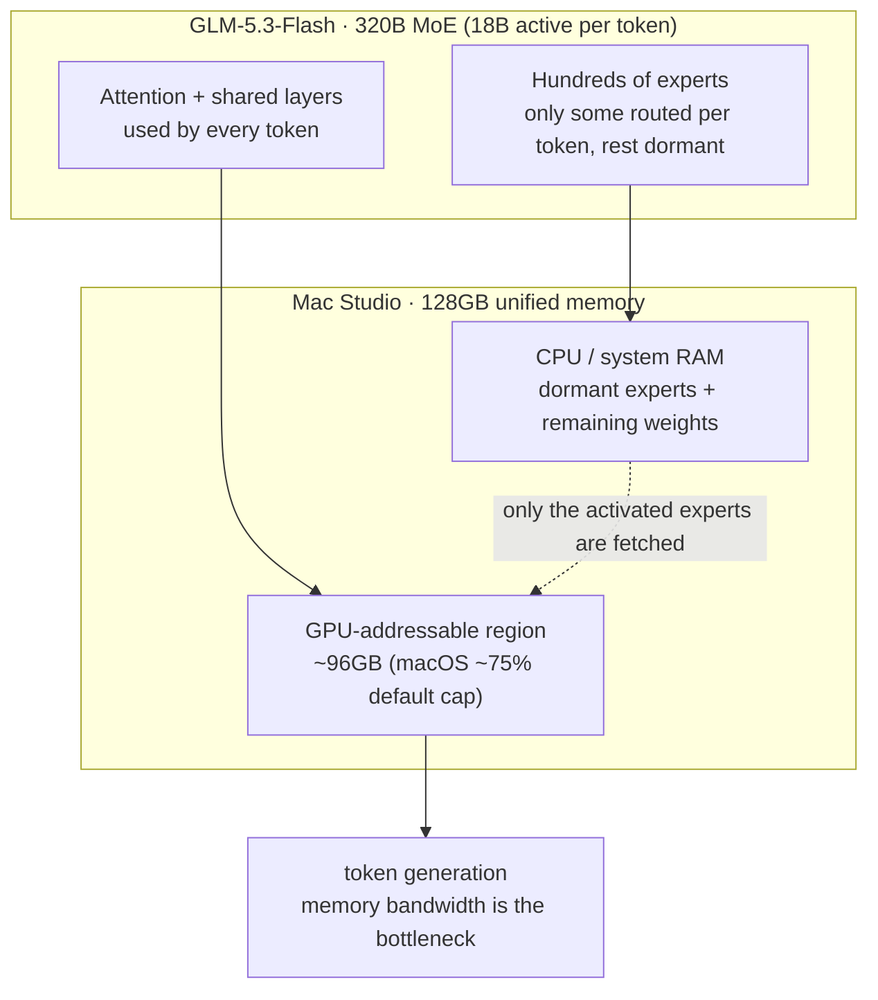

## Why Read This

The claim "a 320B model runs on a 128GB Mac Studio" has been circulating. If your team is weighing a frontier-grade coding model inside a closed network, or whether to run a frontier model on your own hardware instead of paying for cloud APIs, this post does the arithmetic behind that claim, namely whether "128GB" actually means the model gets 128GB.

Here is the conclusion up front. **It runs, but that 128GB is not 128GB the whole model uses.** The macOS GPU-memory cap puts the region the GPU can actually address near 96GB, so a 120GB 3-bit model keeps most of its expert weights on the CPU side and runs hierarchically. The cost is generation speed and 3-bit quantization quality.

## Overview

Z.ai released GLM-5.3-Flash on August 26, 2026, the first natively multimodal model in the GLM-5 series. It is a 320B-parameter MoE model that takes text as well as image and video and produces text, with a one-million-token context window. Almost immediately, a report that the model runs locally on 128GB of RAM via Unsloth's 3-bit GGUF quantization made the rounds, and that is the story most people shared.

What is missing from that story is the arithmetic of how "320B" and "128GB" actually meet. An MoE has a total parameter count and an active parameter count that differ, and macOS does not hand all of unified memory to the GPU. Reading both is what tells you what running a frontier model locally buys and what it costs.

*An abstraction of the MoE structure: a few active experts glow against a large dormant grid.*

## What GLM-5.3-Flash Is

The model has 320B total parameters, but 18B active per token. That is the basic MoE structure: of hundreds of expert layers, only some are routed into the computation per token while the rest sit dormant. So "320B model" is a statement about storage size, and "18B active" is a statement about compute. Mixing the two makes the local-running cost structure impossible to explain.

GLM-5.3-Flash is also the first natively multimodal model in the series. It takes image and video as input and produces text output, and the launch material emphasizes particular strength in coding and agentic tasks. Before the public release it ran at small scale under the name Ox Alpha, which drew attention, and was revealed as GLM-5.3-Flash at the official launch.

## The Real Math of "128GB Local"

This is where the core sits. Quantizing a 320B MoE to 3-bit gives a GGUF file of roughly 120GB, and the arithmetic that it "fits" in 128GB of unified memory holds. Unsloth's per-bit memory figures put 1-bit at about 93GB, 2-bit at about 100-115GB, 3-bit UD-IQ3_XXS at about 120GB, and 4-bit at about 162-210GB, which needs 256GB.

| Quantization | Model size (approx.) | 128GB Mac Studio |
|---|---|---|
| 1-bit | ~93GB | comfortable |
| 2-bit | 100-115GB | tight |
| 3-bit UD-IQ3_XXS | ~120GB | recommended, barely |
| 4-bit | 162-210GB | no (needs 256GB) |

But this table is missing a line. macOS does not expose all of unified memory to the GPU as an addressable region; by default it caps near 75 percent of total capacity. On a 128GB Mac Studio the region the GPU can actually use is close to 96GB. So a 120GB 3-bit model does not fit in 96GB on the GPU alone, and runs hierarchically: most expert weights stay on the CPU/system-RAM side while the active experts and attention move to the GPU.

This placement is possible because of the 18B-active MoE structure. The majority of experts that are not switched on per token can live in slow memory, and only the always-used attention and shared layers plus the active experts the token picked get lifted to the GPU. It is the same principle as the Qwen3.8-Flash-Next 4090 case covered earlier; GLM-5.3-Flash applies that structure to a larger 320B/18B scale. The bottleneck ends up moving from GPU VRAM capacity to memory bandwidth, and on a Mac where the CPU and GPU share the same chip, that bandwidth is a different beast than a desktop's PCIe offload.

## How to Read the Benchmarks

The launch benchmarks, listed on Z.ai's reported basis:

| Benchmark | GLM-5.3-Flash | Comparison (Z.ai reported) |
|---|---|---|
| Terminal-Bench 2.1 | 84.3 | Claude Opus 4.8 = 85.0 |
| Z.ai Code Bench v1.0 | 29.0 | Opus 4.8 max effort = 29.5 |
| DeepSWE v1.1 | 63.4 | large jump over GLM-5.2 |
| AutomationBench | 48.8 | large jump over GLM-5.2 |
| AA Intelligence Index v4.1.1 | 57 | (reference) |

That 84.3 on Terminal-Bench 2.1 sits within the margin of Claude Opus 4.8's 85.0 is worth reading as "on par with a frontier coding model." Three caveats attach.

First, these figures are on Z.ai's own reported basis and are not independently reproduced. Second, the comparisons concentrate on coding and terminal benchmarks, and the multimodal (image, video) capability is not in this table. Third, on the cloud API the model generates at about 48.7 tokens per second on Z.ai's basis, which they rate slow relative to a frontier API of comparable quality. A local 3-bit run layers quantization quality loss on top of that speed issue.

## Implications for ThakiCloud

The core this configuration gives ThakiCloud's ai-platform is that there is **one more serving profile**.

From the Metis inference view, a highly sparse MoE like GLM-5.3-Flash is not an "is it on the GPU or not" binary but is served by a hierarchical placement: attention and active experts on the GPU, dormant experts in slow memory. We have already confirmed this placement works in practice with the same-structure Qwen3.8-Flash-Next, and GLM-5.3-Flash extends that serving profile to a 320B/18B scale. A hierarchical quantization that keeps active experts at higher precision and pushes dormant experts to lower bits, as in low-bit NVFP4, is a natural path to maximize memory efficiency for this model structure.

From the Aegis on-prem view, the shape of the entry cost changes. In a closed network where you want a frontier coding or agentic model but the GPU budget does not exist, a 128GB unified-memory workstation becomes a realistic option as a "single-user to few-user local coding agent." The caveat, namely the cost (generation speed and 3-bit quality loss, single-user basis), must be stated in the contract. For multi-tenant production, a vLLM-based GPU server is still the right answer.

## Limits and Counterarguments

This post should not be read as "running 320B on a 128GB Mac gets you a frontier." Three things must hold, and without them that sentence does not.

First, the 3-bit quantization quality is not published by Z.ai or Unsloth. We have not measured how much coding or agentic performance drops at that bit. A "48.7 tok/s API" and a "3-bit local" run are different environments, and no source combines their quality gap into one.

Second, the macOS 75 percent GPU cap is a default and can change by environment. The 96GB figure is a calculation premised on that default, and on a real deployment machine, checking this limit before choosing the model bit is the right order.

Third, the benchmarks are on Z.ai's own reported basis. The gap between Terminal-Bench 84.3 and Opus 4.8's 85.0 is within the margin, but that is one coding/terminal benchmark, not a claim of "frontier parity" covering multimodal or general reasoning.

## Summary

The message GLM-5.3-Flash gives is not "the VRAM wall is dead," but that the MoE active/dormant structure plus low-bit quantization can pull a frontier model with 18B active down to a 128GB-class of RAM. And that 128GB is not the 96GB the OS actually gives the GPU, but the whole unified memory the file lands in.

The arithmetic goes like this. The GPU holds attention and active experts, the CPU RAM holds dormant experts, and the cost is generation speed and 3-bit quality.

What a team should decide is whether that exchange is a net win for its own workload. If you need a few-user local coding agent in a closed network and paying RAM capacity is better than paying API cost, GLM-5.3-Flash at 3-bit local is a valid option now. If you have multi-user or latency-sensitive first-token needs, GPU serving is the right choice. Before discussing adoption, the next step for this post is to measure 3-bit quality and real tokens-per-second once on our own evaluation set.

## References

- [Z.ai GLM-5.3-Flash official launch](https://z.ai/blog/glm-5.3-flash)
- [Unsloth GLM-5.3-Flash GGUF docs](https://unsloth.ai/docs/models/glm-5.3-flash)
- [CNET: Ox Alpha is GLM-5.3-Flash](https://www.cnet.com/tech/services-and-software/the-powerful-stealth-ai-model-ox-alpha-is-glm-5-3-flash-and-you-can-use-it-now/)
- [MarkTechPost: GLM-5.3-Flash release](https://www.marktechpost.com/2026/08/26/z-ai-releases-glm-5-3-flash-a-320b-a18b-natively-multimodal-moe-with-a-1m-token-context/)
- [Ollama library: glm-5.3-flash](https://ollama.com/library/glm-5.3-flash)
