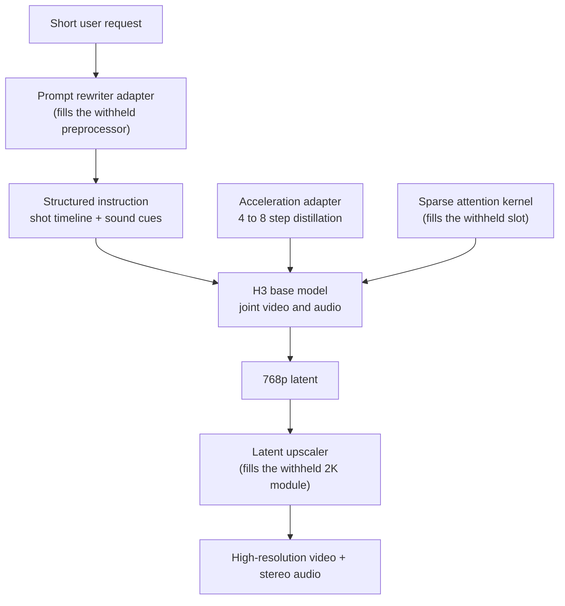

If you serve or fine-tune video generation models, the activity around one open-weight release is worth a look. A month after launch, the adapters stacked around it are not randomly distributed. The community filled in three places the vendor explicitly marked "to be released later." Along the way, the job of a small adapter changed.

*The adapter list reads less like a feature list and more like a map of what has not shipped yet.*

## In plain terms

Picture moving into a newly built apartment. The frame, walls, and windows are all done. But there is no intercom at the door, the finish work is missing, and the insulation cavities are empty. The builder left a note saying the design is complete and those parts will arrive later.

The residents did not wait. They installed their own intercoms, did their own finishing, and packed the cavities themselves. So the list of things residents built tells you exactly what the apartment was missing.

The model in this post is that apartment. And the small parts people used to bolt onto models like this were mostly **wallpaper**. They changed the look and the palette. That has shifted. People are now working on the **plumbing and the frame**. I will keep this comparison for the rest of the post.

*The whole stack in one picture. The three dashed slots are the modules that were never released, and community modules sit in them.*

## What we counted

MiniMax H3 is an open-weight video generation model published to Hugging Face on 28 July 2026. It packs text, images, video, and audio into a single sequence, and produces video together with stereo audio. We covered what it takes to host it in-house in an [earlier post](/tech-blog/en/llmops/minimax-h3-omni-modal-onprem-serving/).

This time we looked at what has accumulated **around** the model rather than the model itself. We opened fourteen adapter and derivative model cards directly. Community roundups list more than that, but this post only includes the ones whose cards we actually read. Items we could not confirm are listed later.

Once sorted by function, one thing became clear. Calling this pile "H3 LoRAs" is imprecise. What is mixed together are at least six technically distinct things.

## The three empty rooms the community filled

The first thing that stands out is where the adapters cluster. It matches the places the model card marks as withheld.

The card holds back three things explicitly. The preprocessing module that interprets input and turns it into a structured instruction was excluded because it depends on multiple hosted services. The module that feeds a low-resolution result back in to regenerate it at 2K was excluded for complexity. And the sparse attention introduced in the final training stage is not in the initial release, with a note that it will be published separately.

Put the community's output next to that list.

| What the vendor held back | What the community built | Built how |
|---|---|---|
| Input preprocessing module | Three prompt-rewriting adapters | An adapter on a separate language model |
| 2K regeneration module | Latent-space upscaler | A separately trained 3D convolutional network |
| Sparse attention | Sparse-linear-attention checkpoint | Distillation adapter co-designed with the kernel |

The prompt rewriter does not attach to H3 at all. It is an adapter on top of `Qwen3-VL-8B-Instruct`, and it turns a short request into a structured instruction carrying a shot timeline, physical and ambient sound, and non-diegetic music guidance. The card calls itself a "learned approximation" of the official service.

The latent upscaler is more practical. It scales the 24-channel latent directly to avoid decoding to pixels and re-encoding. The card justifies avoiding that round trip by pointing at H3's roughly 5-billion-parameter visual decoder. It trained on about 80,000 pairs, made up of 70,000 video pairs and 8,000 image pairs at 2K, and supports continuous scaling from 1.0x to 4.0x.

*The three parenthesized slots are all unreleased modules. Community modules sit exactly there.*

## From wallpaper to plumbing

The second finding is that the job of an adapter has changed. It moved in three directions.

### One, it learns the sampling trajectory

Alibaba's acceleration adapter is rank 64, alpha 64, and targets 8-step inference. The method is **parallel decoding distillation**. It trains the network to predict the effect of several denoising steps in a single evaluation.

What the adapter carries is different here. A normal adapter carries what to draw. An acceleration adapter carries a faster route to the same result. That is not wallpaper. That is plumbing.

So it is not a file you simply drop in. The configuration for lightx2v's sparse-attention build ships the adapter weights alongside a sparsity ratio of 0.85, a video flow shift of 6.0, and an audio flow shift of 3.0. Video and audio share a timestep grid but ride different trajectories. The adapter, the sampler, and the scheduler are one contract.

That combination cuts compute along two axes at once. Steps drop from 30 to 4, and 85 percent of attention is skipped. The card reports roughly 2.5x acceleration measured on an RTX 5090.

### Two, it changes the temporal structure

The RAVEN adapter goes further. H3 normally denoises a whole clip bidirectionally in one pass. With this adapter attached, generation itself changes: each chunk is produced conditioned on the chunk before it.

The published configuration is rank 128, alpha 128, 192 frames, 768 by 1376, 24 frames per second, and 4 steps. The card states it runs within a 24 GiB memory envelope.

A single adapter changed **how time is handled**, not how things look. That is not new wallpaper; that is a moved wall. The card is candid, though. It calls itself an initial preview and says the adapter is still undertrained, with limited texture detail.

### Three, it transplants representations from another model

This is the most experimental branch. The two TenStrip adapters were not trained on data. Attention weights from another model were grafted into H3, and the resulting difference was compressed into adapter form through singular value decomposition.

The numbers are the interesting part. On the Krea2 branch, rank 512 captures only 52 percent of the original delta, and rank 128 captures 24 percent. On the Wan2.2 branch, rank 512 captures 41.6 percent and rank 1024 reaches 69 percent.

There is a lesson in that. Adapters normally assume the change is far simpler than the full weight space. A delta produced by moving between two different models does not satisfy that assumption well. That is why the ranks climb to 512 and 1024.

Put plainly: **wallpaper can go on thin, but moving plumbing means opening the wall.**

## The style adapters are still instructive

The traditional branch has lessons too. The fal realism adapter was built from 176 hand-picked live-action clips. Slow-motion footage was retimed to natural speed and everything normalized to 24 frames per second.

The author then compared sixteen configurations, varying rank, steps, learning rate, and training resolution, under matched conditions. The winner was rank 32 at 1500 steps, and the author states that **training resolution mattered more than rank or step count**. High-frequency detail like skin texture and hair is simply gone at low resolution. We covered that experiment separately in an [earlier post](/tech-blog/en/llmops/minimax-h3-lora-recipe-not-weights/).

The camera-motion adapter tells the same story. Its author reports that push-in, pull-back, and handheld tracking work well while lateral pans are weaker, and attributes the gap to having fewer pan samples in training. Data composition decided the outcome, not model configuration.

## What you should not trust here

Stated plainly.

First, what we verified are the **claims written on fourteen model cards**. These are not numbers we measured. The 2.5x figure and the 41.6 percent figure are both authors reporting on their own work.

Second, we left out anything that was not on the cards. Community writeups circulate detailed figures for donor block counts, head counts, and which projection matrices most affect audio quality. We could not find those on the cards, so they are not in this post.

Third, several authors describe their own work as unstable. The physics adapter author writes that it is still in a training and testing phase, and that data and labeling issues keep it from being stable. The streaming adapter is a preview. The graft adapters are marked "all experimental," and one narrows its own scope to pure text-to-video use.

Fourth, do not read the physics adapter as "this model now understands physics." At the current level, the defensible reading is that it biases an existing tendency toward a particular distribution of motion.

## The condition that remains for Korean teams

Separate from the technology, there is something to check. This community license is dated 2 August 2026 and defines its applicable territory as worldwide excluding a list. That excluded list contains **the European Union, the United Kingdom, the Republic of Korea, and the United States**.

Being able to download weights and being able to freely run, modify, and distribute them in Korea are not the same statement. The license also documents a path: parties in excluded territories may contact the vendor to obtain a license.

Graft adapters carry an extra condition. Because they move weight characteristics from another model, the donor model's license travels with them. And this license defines model derivatives broadly enough to include distillation and transfer through intermediate representations. Most of the currently popular methods fall inside that definition.

We published a [separate audit](/tech-blog/en/llmops/open-video-model-license-territory-audit/) of the clauses Korean teams should read before benchmarks. Here we simply flag the condition. We have not put this model into a production service domestically.

## What this means for ThakiCloud

We do not read this as someone else's problem. The same decomposition happened in language model serving first, and our inference platform Metis runs on top of it.

First, **more adapters makes serving the bottleneck.** If each adapter needs its own full checkpoint, no amount of GPU is enough. Sharing one base and swapping only adapters is what makes the economics work. We ran a [separate experiment](/tech-blog/en/research/derivative-long-tail-lora-serving/) on multi-adapter serving and long-tail demand.

Second, **acceleration adapters do not reproduce from weights alone.** As shown above, the adapter, the scheduler, and the flow shift values are one bundle. That is why we record serving configuration in the catalog alongside the model. A number whose configuration you cannot name is a number you cannot reproduce, and a number you cannot reproduce is not something to promise a customer.

Third, **license status has to be a catalog field.** Choosing on a performance table alone gets you blocked right before deployment. Because we handle on-premises and sovereign deployments, that check belongs at the front.

Fourth, building adapters is our training platform Maxis's job. What these experiments say in chorus is that **the resolution and composition of the training data sets the ceiling**, more than rank does. Our internal rules landed on the same conclusion. Footage that is cropped or low-resolution does not get restored by training longer.

## Wrapping up

Skim the adapter list and it reads as "look how many already shipped." Open them one at a time and it reads differently.

The places where work clustered were the three modules the vendor did not release. And in the process, the job of a small adapter moved from changing the look to changing the sampling trajectory, the temporal structure, and which model's representation is in play. Wallpaper became plumbing.

If this direction holds, a video model looks less like one enormous checkpoint and more like a base you attach modules to as needed. That picture is already familiar from language models. What remains, for anyone in Korea, is that the license comes before the technology.

## Sources

- [MiniMaxAI/MiniMax-H3 model card and license](https://huggingface.co/MiniMaxAI/MiniMax-H3)
- [lightx2v/Minimax-h3-Turbo-SLA](https://huggingface.co/lightx2v/Minimax-h3-Turbo-SLA)
- [lightx2v/Minimax-h3-Turbo](https://huggingface.co/lightx2v/Minimax-h3-Turbo)
- [alibaba-pai/MiniMax-H3-Acc-LoRAs](https://huggingface.co/alibaba-pai/MiniMax-H3-Acc-LoRAs)
- [mvp-lab/MiniMax-H3-RAVEN-Streaming-LoRA](https://huggingface.co/mvp-lab/MiniMax-H3-RAVEN-Streaming-LoRA)
- [fal/MiniMax-H3-Realism-People-LoRA](https://huggingface.co/fal/MiniMax-H3-Realism-People-LoRA)
- [lovis93/studio-1939-old-animation-lora-minimax-h3](https://huggingface.co/lovis93/studio-1939-old-animation-lora-minimax-h3)
- [Jojocodex/minimax-h3-Camera-Motion-lora](https://huggingface.co/Jojocodex/minimax-h3-Camera-Motion-lora)
- [Jojocodex/minimax-h3-spatial-physics-lora](https://huggingface.co/Jojocodex/minimax-h3-spatial-physics-lora)
- [Jojocodex/minimax-h3-wushu-action-lora](https://huggingface.co/Jojocodex/minimax-h3-wushu-action-lora)
- [TenStrip/Krea2-H3-Style-Lora](https://huggingface.co/TenStrip/Krea2-H3-Style-Lora)
- [TenStrip/Wan2.2_H3_Motion_Lora](https://huggingface.co/TenStrip/Wan2.2_H3_Motion_Lora)
- [joeygambino/MiniMax-H3-x-Z-Image-native](https://huggingface.co/joeygambino/MiniMax-H3-x-Z-Image-native)
- [lightx2v/MiniMax-H3-Prompt-Rewriter-LoRA-8B](https://huggingface.co/lightx2v/MiniMax-H3-Prompt-Rewriter-LoRA-8B)
- [LBH-123-AI/Minimax_h3_latent_Upscaler](https://huggingface.co/LBH-123-AI/Minimax_h3_latent_Upscaler)
