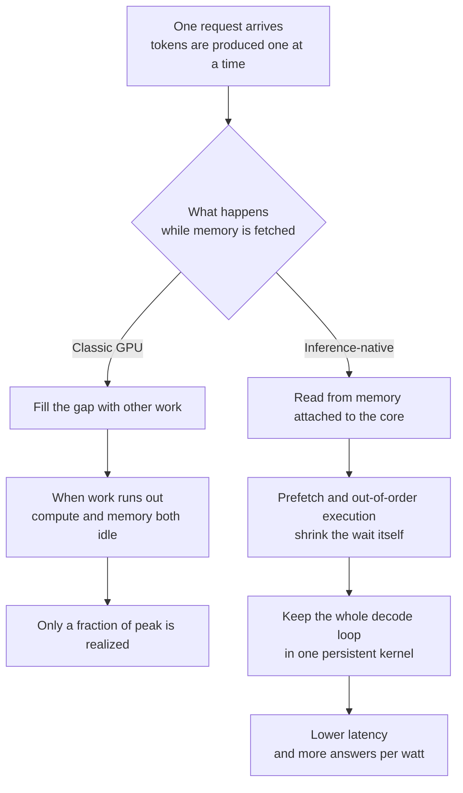

The contest in inference silicon has moved from raw compute speed to the choice of objective. A recently disclosed inference chip drops peak throughput from its goals entirely. It optimizes instead for how fast an answer comes back and how many answers a fixed amount of power can produce. If you own the latency or the unit cost of an inference service, it is worth understanding why this design ran in the opposite direction from a GPU.

*Pairing every core slice with its own memory stack is the starting point of this design.*

## In plain terms

Picture a cafeteria kitchen. When it serves 500 people at once, it is the most efficient kitchen in the world. The big pots, the long serving line, and the whole crew all run at the same time. A distant pantry does not matter much. One trip fills a cart, and while somebody walks over there, the rest of the crew keeps cooking.

Now imagine a single guest. That guest eats one spoonful, orders the next spoonful, then orders another. Suddenly the distance to the pantry is fatal. Every spoonful means a round trip, and the crew stands around waiting. The pots and the serving line have not changed, but the guest keeps waiting.

That is what happens on a GPU today. Large-scale training is the 500-person service, and one user holding a conversation is the guest ordering a spoonful at a time. So some people stopped enlarging the kitchen and instead **moved the pantry next to the counter**. That move is what this article is about.

<!-- nlm-visual -->

*Infographic generated by NotebookLM from the sources.*

## Where GPUs break down on decode

A GPU hides memory latency by time multiplexing. It interleaves many concurrent work groups, so while one waits on memory another runs. That only works if there is always more work available to schedule. In training and in large batch jobs, there is plenty, and the strategy works beautifully.

Decode is different. A single user request produces one token at a time, and each layer becomes a small operation that multiplies one matrix by one vector. There simply is not enough work to schedule, so the compute units idle and the memory bandwidth goes unused. The source analysis notes that on a configuration theoretically capable of 1,000 to 2,000 tokens per second, real serving frameworks land around 100 to 200 tokens per second. That is roughly a tenth of the theoretical number.

Put simply, it is not slow because bandwidth ran out. It is slow because **the waiting mechanism itself does not fit this workload**. The source frames interactive inference less as a GPU problem and more as the single-thread latency problem that CPU designers have wrestled with for decades.

*The same request handled two ways. The left path covers the wait with other work, and the right path removes the wait.*

## Three places the design changed

### The pantry moved next to the counter

The biggest change is memory. A conventional GPU routes every compute unit through one large shared cache on the way to memory. That is convenient because anything can reach anything, but the price is a round trip of hundreds of cycles when the data sits far away.

The new chip gives up that convenience. It splits the compute into 64 core slices and pairs each slice with a memory stack right beside it. The global shared cache is removed outright, leaving each core with a local cache of about 512KB. Shorter distance means less waiting, and less waiting means less to hide.

There is a bill for this. The hardware no longer decides on its own which weight shard or which cached state lands on which slice, so the compiler has to place them explicitly. Convenience was traded for performance, and the software got harder in exchange.

### The wait was shortened rather than covered

The execution model inverts too. Instead of launching many work groups to paper over latency, the design extracts as much instruction-level parallelism as it can from a single stream. Each core executes out of order and the hardware prefetches what it will need. The idea is the same one again. Do not hide the wait, remove it.

It goes one step further and keeps the entire decode loop resident as a single persistent kernel. That erases the cost of launching a fresh kernel per layer and synchronizing at every boundary. In the kitchen analogy, the crew stays at the counter instead of being summoned again for every spoonful.

### The compiler decides placement, and a model searches for it

This is the most interesting part. Since placement is no longer the hardware's job, someone has to make the call. The source describes a language model agent sitting in that seat instead of a traditional cost model. It proposes placements, tile sizes, pipeline stages, prefetch distances, and collective strategies, then measures them on a simulator and on real silicon and revises.

The reasoning is simple enough. Regions where a local cache and a prefetcher interact are hard to predict with a trustworthy formula. When prediction is hard, measuring is better, and a machine can measure far more often than a person.

The same approach shaped the chip itself. The company states that nine months elapsed from the first register-level design to the point of production, and that its own models assisted parts of that pipeline.

## Official numbers and speculation are not the same

The line here matters. What the company published officially and what the analyst reverse-engineered from public material carry different weight.

First, the officially disclosed side.

| Item | Published value |
|---|---|
| Peak performance per watt | 1.5x to 1.9x versus comparison systems |
| End-to-end latency | 1.7x to 3.6x lower |
| Highly interactive workloads | 2.1x to 4.1x higher performance |
| Models measured | GPT-OSS 120B, DeepSeek R1 670B, Kimi K2.5 1T |
| Benchmark | Public InferenceX |
| Design cycle | Nine months from first RTL to production |
| Deployment | Into its own infrastructure starting late 2026 |

*The headline claim is that one architecture improved throughput and latency together, where existing systems usually trade one for the other. A follow-on generation is already in development.*

On the structural side, the disclosed items include 64 core slices, six HBM4 stacks per compute die, and a 1.7GHz clock. Peak throughput is 13.4 PFLOP/s at MXFP4. The global cache is gone, and the compute die is split from a separate IO die.

The following, by contrast, are **the analyst's estimates**, and the source labels them as such. Fifteen to sixteen tensor units per slice, a 64 by 64 unit shape, and an adder-tree implementation all belong in this bucket. So do the 8 by 8 two-stage collective network and the details of the general interconnect. None of them should be quoted as settled fact.

## The ThakiCloud view: the objective comes before the chip

The lesson we take from this is not that anyone should go buy a chip. It is that **whatever you declare as the optimization target ends up governing real performance**.

We have measured the same effect ourselves. On a Metis serverless endpoint we held the checkpoint, the GPU, and the engine constant and changed only two serving settings. We reverted an environment variable that disabled compilation, and we raised the cap on concurrent sequences. The result was 18.8x on a single stream and 17.9x at saturation. Not a single card changed.

Put simply, **a large share of inference cost is locked in configuration and stated goals rather than in silicon**. A system that never declared latency as a target tends to have bad latency, and when nobody measures that, the blame quietly lands on the model.

When Paxis automates enterprise work, this difference is felt directly. An agent calls tools several times inside one request and waits for the previous result each time. Per-token latency multiplies into per-task waiting. That is why the metric we watch on Metis is not aggregate tokens per second but per-request latency and useful tokens per joule. It is the same reason the new chip changed its objective.

For customers who require on-premises or sovereign deployment, the argument is even more direct. In a closed-network build such as Aegis, you cannot simply add cards. How many useful answers come out of fixed power and fixed hardware decides whether adoption is possible at all.

## What you should not trust here

This article has limits of its own.

First, the performance figures come from comparison systems and a benchmark the vendor chose. Using a public benchmark helps, but how the comparison systems were configured for serving can move the result a great deal. Our own 18.8x measurement is exactly that hazard in miniature.

Second, much of the microarchitecture detail is estimated, as separated above. Sentences that describe structure and sentences that fix a number should not be read the same way.

Third, this is not a general-purpose accelerator. The design gave up convenience for one narrow target, so its conclusions do not transfer directly to training or to other workloads.

<!-- nlm-visual -->

*Infographic generated by NotebookLM from the sources.*

## Wrapping up

Compressed into one sentence: **declare response latency and useful tokens per joule as the objective instead of peak throughput, and everything from the memory hierarchy to the compiler has to be redesigned.**

Almost no organization can swap out its chips today. Changing the objective, though, is available right now. On the inference service you already run, try measuring per-request latency and useful tokens per joule before you measure tokens per second. In our case, the moment we changed the metric, more than a tenfold headroom turned out to be sitting in configuration with no hardware involved. Nobody knows how idle a cafeteria kitchen goes during a one-guest hour until somebody measures it.

Sources: [Redesigning the Inference Chip (zartbot)](https://zartbot.github.io/blog/arch/jalapeno/en.html), [OpenAI and Broadcom unveil LLM-optimized inference chip](https://openai.com/index/openai-broadcom-jalapeno-inference-chip/), [Jalapeño's first results](https://openai.com/index/jalapeno-first-results/).
