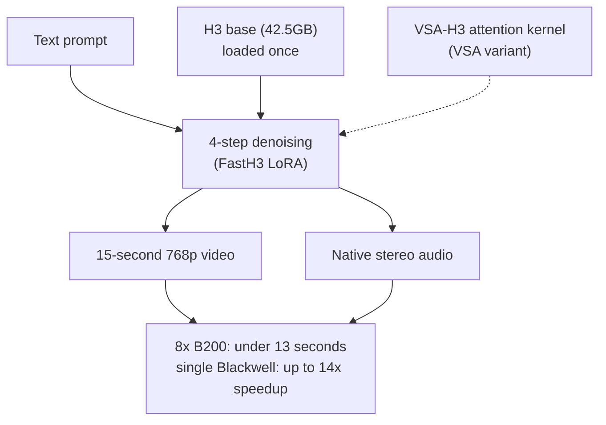

## Why Read This

If your team runs a GPU fleet and is weighing whether to put video generation on your serving stack, this post helps you decide whether to adopt FastH3, a distilled variant of MiniMax H3, and what to read first before you do.

The conclusion up front. **Four-step distillation moved video generation from batch rendering into the serving category. But the first variable is not speed, it is the license. Korea is an excluded region, and commercial use runs through a separate license path.**

## Overview

MiniMax H3 is the open-weight video generation model that landed on Hugging Face in late July. It produces video and stereo audio in a single sequence, up to 2K resolution and 15 seconds long at 24 FPS. It accepts text, images, video, and audio as input at once, with a maximum input bundle of 9 reference images, 3 video clips, and 3 audio tracks. The measured details of the model itself, the conditions for bringing it into your own infrastructure, and how to read its license were covered in [earlier posts](/tech-blog/en/llmops/minimax-h3-omni-modal-onprem-serving/) and [the license audit post](/tech-blog/en/llmops/open-video-model-license-territory-audit/).

Since the release, the adapter ecosystem around H3 has grown quickly. A [separate post](/tech-blog/en/llmops/h3-adapter-ecosystem-map-of-gaps/) counted and classified 14 of those adapters: style LoRAs, camera motion, physical simulation, prompt rewriters, upscalers. Acceleration adapters were among them, notably a community 8-step turbo path and a parallel-decoding distillation adapter that predicts the effect of several steps in one call. FastH3 Preview v1, open-sourced on August 27, goes one step further down that lineage. It does not stop at an acceleration adapter; it rewrites the inference trajectory itself into 4 steps. It was released jointly by FastVideo (Hao AI Lab), Nuva Lab, and NVIDIA's FastGen team. FastVideo is a unified framework for post-training and real-time inference of video diffusion models, and FastGen is a PyTorch-based open-source framework that unifies state-of-the-art diffusion distillation methods to turn multi-step diffusion models into few-step generators.

## What FastH3 Is

FastH3 is a text-to-video-and-audio (T2VA) generator distilled from H3. From a single text prompt it produces video and native stereo audio together. Dialogue, sound effects, and ambient tone are generated alongside the video. The H3 base model has this capability too; FastH3 re-prices how it gets generated.

The core is the denoising step count. The H3 base model runs the transformer forward pass dozens of times for a single video. FastH3 reworks that trajectory into 4 forward passes. The official materials call this recipe DataFree, because it compresses the trajectory without additional training data. One call learns to predict the effect of several steps, so the sampling trajectory arrives in 4.

Why is the step count the cost lever for video models? The cost of a video generation run is determined almost entirely by the number of forward passes. Each pass reads and writes the full spatiotemporal token sequence of the video, and the longer and higher-resolution the video, the heavier each pass gets. The pass count is the multiplier on that weight. Cut it to 4 and the total compute drops to a quarter of the base, and a 15-second clip enters the budget of an interactive response.

The name DataFree carries meaning. It means no new video corpus was used for the distillation. The trajectory to learn is extracted from the base model itself, not gathered from new data. That is why the gap between v0.2 (August 23) and v1 (August 27) could be four days. A distillation recipe with its own data pipeline attached could not move at that speed.

A sparse-attention variant ships with it. VSA, Video Sparse Attention, reads only the important parts of the frame sequence instead of the whole thing, and the FastH3 VSA-DataFree adapter carries both the distillation delta and the VSA gate tensors.

The release format is worth noting. FastH3 is not a standalone set of weights. It is a set of LoRA adapters that reconstruct the 4-step transformer on top of the H3 base, which alone is a 42.5GB minimum download. The base loads once; the adapters swap.

| Artifact | Contents | Notes |
|---|---|---|
| [FastH3-4-step-Preview-v1-LoRA](https://huggingface.co/FastVideo/FastH3-4-step-Preview-v1-LoRA) | Official 4-step LoRA | FastVideo launcher only |
| [FastH3-4-step-Preview-v1-VSA-DataFree](https://huggingface.co/FastVideo/FastH3-4-step-Preview-v1-VSA-DataFree) | VSA + DataFree distillation | Requires VSA-H3 kernel |
| [FastH3-4-step-Preview-v1-r16](https://huggingface.co/KyleNeverGivesUp/FastH3-4-step-Preview-v1-r16) | Community re-release | Rank-16 variant |
| [FastH3_GGUFs](https://huggingface.co/realrebelai/FastH3_GGUFs) | GGUF quantized builds | Low-VRAM direction |

## Reading the Benchmark Numbers

There are two headline numbers for FastH3. **A 15-second 768p video rendered in under 13 seconds on an 8x B200 GPU configuration**, and **up to a 14x speedup on a single Blackwell GPU**.

The two numbers were measured under different conditions. The 13-second figure is the 8x B200 one, and the 14x figure is a relative speedup on a single Blackwell GPU against the base model. The tweet line "realtime (15s in 13s), up to 14x speedup" puts them side by side, which makes them easy to read as one number.

Read separately, the two numbers answer different questions. The 14x is the answer to "how much faster on the same machine," a relative value measured by running the 4-step trajectory against the base model's dozens-of-steps trajectory on a single Blackwell GPU. The 13 seconds is the answer to "how long does one 15-second clip actually take," an absolute value under the 8x B200 condition. A speedup ratio and a wall clock sit side by side because the conditions differ. Read them together, and FastH3 is a version that fits inside the budget of a single serving request.

Every number in the diagram comes from the model card and the release blog. One more point: the 768p figure is not an H3 base 2K figure. The realtime condition holds at 768p resolution. On the API side, fal's H3 Max is reported to render a 5-second 768p clip in under 3 seconds, but that is a separately post-trained commercial variant and cannot be directly compared with these numbers.

The 13-second figure matters because it crosses a threshold. Generation time became shorter than the video length, and that is exactly the point where video generation moves from "rendering" to "serving."

## Installation and Execution Path

FastH3 installs alongside FastVideo. The official path is a uv-based environment setup, and running the model requires FastVideo's launcher. The LoRAs are not intended for generic PEFT loaders, and the VSA variant additionally requires FastVideo's VSA-H3 attention backend and kernel.

There is a specific reason the generic PEFT loaders cannot take it. The VSA variant's adapter carries not just the weight delta but also the gate tensors of the sparse-attention path, and it is designed assuming FastVideo's VSA-H3 kernel as the execution target. A loader that raises only the weights without knowing the kernel cannot complete the path. That is why the official path is the uv-based FastVideo environment plus the FastVideo launcher.

So this is not something you slot into an existing serving stack. You open a separate execution path, and that path depends on FastVideo. A community GGUF path exists for a low-VRAM direction, but that lowers the entry point; it does not inherit the 13-second benchmark conditions.

## License: Read It Before Running

FastH3 inherits the MiniMax H3 Community License (effective August 2, 2026) as is. The full walkthrough of the clauses is in [the license audit post](/tech-blog/en/llmops/open-video-model-license-territory-audit/); here I only note the conditions.

Excluded regions are the EU, the UK, Korea, and the US. Organizations with annual revenue above $20 million need separate prior written approval, and the license restricts not just the weights but also the use and distribution of their outputs. Disputes fall under the exclusive jurisdiction of Hong Kong courts.

For a multi-tenant platform there is one more clause to pick out. The license takes an obligation from the side that provides a hosting service for downstream users: build technical safeguards for those users, maintain them, and check them periodically. If the shape of the service is a serving platform where customers generate video on this model, that obligation attaches to the serving platform, not to the model users.

One more point. The license's distillation clause prohibits improving other AI models using outputs, globally. Since FastH3 is itself a distillation artifact, its relationship to that clause is worth asking about. The DataFree recipe is a distillation at the weights and trajectory level, not the output level, so there is room to read it as separate from the clause's target. But nowhere in the materials does it say whether this release went through a licensing agreement with MiniMax. We will not conclude that here. If you are putting this artifact on a commercial service, this is the first item on your legal review.

For teams in Korea, the practical path is a separate commercial license. The open weights are open for evaluation and development; the commercial deployment path is a different thing.

## Implications for ThakiCloud Products

ThakiCloud's ai-platform operates a bare-metal machine with 8 B200 GPUs. The conditions under which the 13-second figure was reproduced are exactly that configuration. This is not a statement that we have deployed it. It means the machines that can reproduce the figure are the ones we operate, so 13 seconds can be read as an adoption specification.

Two implications from a serving perspective. First, the cost lever for video generation has widened from quantization to step distillation. Where quantization, caching, and speculative decoding were the levers on the language-model side, the corresponding lever on video models is the denoising step, and FastH3 showed that a 4-step trajectory is possible on an open-weight model. Second, realtime numbers change the shape of the use cases. Live preview, video-in-video editing, interactive avatars, anything that used to be "render and wait" now enters the "serve and respond" category. That is the moment GPU-seconds become a serving cost instead of a batch cost.

Stated concretely, the shape of the cost table changes. In batch rendering you pay GPU-seconds per clip, and the user waits. In serving you pay GPU-seconds per request, and the user gets a response. The same 4-step trajectory is priced as render time in the former and as request latency in the latter. The 13-second figure is the first published absolute value showing that the second pricing is possible on open weights.

The license is a deployment gate. For a multi-tenant serving stack that offers video generation as a service, the commercial license path and the hosting obligations (technical safeguards for downstream users) are prerequisites.

## Limitations and Counterarguments

FastH3 is Preview v1. v0.2 came out on August 23, v1 on August 27, and the iteration is fast. That is a strength, but it also means the launcher and adapter contracts can still change. The 13-second figure is a 768p one, not the H3 base 2K. The execution path is locked to the FastVideo launcher and kernel, so it cannot be swapped with an existing inference engine. The 13-second and 14x figures are two numbers under different conditions, and they should not be mixed into one calculation.

Quality is the axis that is not verified yet. Cutting the steps to 4 is a bet that the trajectory arrives at the same destination with fewer calls, and the materials contain no quality comparison against the base. The model card's positioning is speed. The image quality of the 4-step trajectory is yours to judge after running it on your own fleet. That sits in the same posture as the [earlier post](/tech-blog/en/llmops/h3-adapter-ecosystem-map-of-gaps/), where the ecosystem's cards made their claims and the authors themselves noted the instabilities.

And a premise of this post. We did not download the weights and run them in this environment. Every number is from the model card and the release blog, so read this as an analysis of published materials, not a reproduction record. Whether the 13-second figure reproduces on an 8x B200 machine is a separate experiment.

## Summary

FastH3 is the first open-weight artifact to put "15 seconds in 13 seconds" into the T2VA category as a number. With generation time shorter than video length, video generation moved from batch rendering into serving.

The H3 adapter ecosystem grew by filling in modules the company did not publish, and FastH3 is the first of that lineage to land at the level of rewriting the inference trajectory. It is about the start of the season where the boundary between "an adapter" and "a new model" gets redrawn.

If you act on this post, the order is set. Read the license first. Korea is an excluded region, so the commercial path is a separate matter. Then, if you have an 8x B200 machine, treat the 13-second figure as a specification and build a reproduction experiment on your own fleet. Also confirm that the execution path is a separate system, the FastVideo launcher and kernel, not something swappable with your existing stack.

## Sources

- [FastH3 Preview release blog (Hao AI Lab)](https://haoailab.com/blogs/fasth3-preview/)
- [FastVideo/FastH3-4-step-Preview-v1-LoRA model card](https://huggingface.co/FastVideo/FastH3-4-step-Preview-v1-LoRA)
- [FastVideo/FastH3-4-step-Preview-v1-VSA-DataFree model card](https://huggingface.co/FastVideo/FastH3-4-step-Preview-v1-VSA-DataFree)
- [MiniMax H3 open-source announcement](https://www.minimax.io/news/minimax-h3-open-source)
- [MiniMaxAI/MiniMax-H3 model card](https://huggingface.co/MiniMaxAI/MiniMax-H3)
- [FastVideo GitHub](https://github.com/hao-ai-lab/fastvideo)
- [X post (aisearchio, RT hjguyhan)](https://x.com/hjguyhan/status/2093566601224462353)
