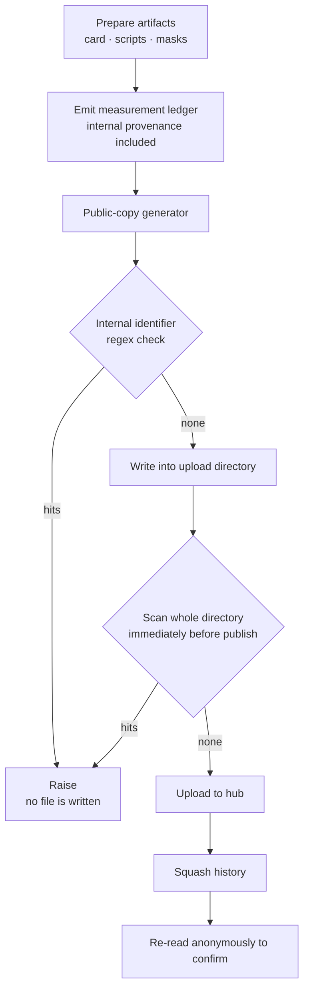

If you build artifacts internally — models, adapters, masks — and publish them to a public hub, take one thing from this post. **Release hygiene has to be gated on timing, not on file type.** However carefully you scan the card and the scripts, any file added after that scan ships unexamined.

## What walked out

We published six per-language vocabulary mask repositories to Hugging Face. No weights, just mask JSON, an apply script, and a card. A small surface, we thought.

Before publishing we scanned the cards and scripts, and they came back clean.

```bash
grep -rEi "<registry-host>|<cluster-prefix>|s3://|<namespace>|<internal-domain>" upload-*/*.md upload-*/*.py
# → 0 hits
```

Then the measurement finished and we **attached the ledger JSON to all six repositories.** Its environment block looked like this.

```json
{
  "base_model": "Qwen/Qwen3.8-27B (prod S3 global/models/..., 32 objects)",
  "engine": "inf-cr-dev.<internal-domain>/docker-io-proxy/vllm/vllm-openai:v0.28.0",
  "gpu": "B200 x1 (tkai-dev-compute-b200 / paper-exp)"
}
```

Three lines carrying an internal container registry host, a Kubernetes cluster context, a namespace, and an object-storage layout. Anyone cloning the repository learns our internal hostnames and cluster topology.

What matters more is that those three lines **contribute nothing to the science.** Reproduction needs the engine version, the GPU class, and the serving knobs — not which proxy the image came from. In plain terms, they were lines we could delete without losing anything.

## Why the scan passed

The scan was correct. The problem is that **files were added after it ran.**

```
① write card + scripts → ② grep scan (pass) → ③ upload
                                                ↓
                       ④ measurement done → ⑤ attach ledger → ⑥ re-upload   ← no scan
```

Step ② only protects step ③. Step ⑤ happened later and nothing re-scanned. That is not carelessness; it is that **the gate was attached to one point in the workflow** while files can enter at several.

A second factor compounded it. The ledger is not a hand-written document but a file **emitted by an aggregation script**. I never read it the way I read the card. Generated artifacts quietly fall out of review. And that generator was designed to capture as much experiment provenance as possible, where provenance means, by definition, "where did this run". Carrying internal detail was the file's **purpose**.

## Fixing the tree leaves the history

It is easy to think that correcting the ledger and re-uploading ends it. A Hugging Face repository is git, so earlier commits remain. One line retrieves the old content.

```bash
git log -p --all -- multiling-masks-*.json | grep -i "<internal-domain>"
```

This is not an exotic trap, and we still walk into it, because at publish time we forget that fixing the tree and fixing the history are two different jobs. It ended only after we squashed each of the six repositories into a single commit.

```python
from huggingface_hub import HfApi
HfApi().super_squash_history(repo_id=rid, repo_type="model",
                             commit_message="per-language script masks + measurement ledger")
```

## What to change

Three fixes, in order of importance.

### Split the public copy from the internal one

Deleting the ledger is not the answer. Provenance is exactly what you need to reproduce the work internally. So the original stays and a **separate generator emits a public copy.** The line between keep and drop is one question: is this needed to reproduce the result?

| Field | Internal ledger | Public ledger |
|---|---|---|
| Engine | includes internal registry path | `vllm/vllm-openai:v0.28.0` |
| GPU | cluster context, namespace | `NVIDIA B200 x1` |
| Base model | S3 prefix, object count | `Qwen/Qwen3.8-27B` |
| Measurements, serving knobs | all kept | **all kept** |

### Make the generator fail closed

The check lives inside the code that produces the public copy, and it raises rather than warns. If it does not pass, the file is never created.

```python
INTERNAL = re.compile(r"<registry>|<storage>|<cluster-prefix>|<namespace>|s3://", re.I)

blob = json.dumps(public_ledger, ensure_ascii=False, indent=2)
hits = INTERNAL.findall(blob)
if hits:
    raise SystemExit(f"internal identifiers remain: {sorted(set(hits))}")

for target in upload_dirs:
    (target / "ledger.json").write_text(blob, encoding="utf-8")
```

The ordering of those last two blocks is the point. The check comes **before** the write, so only a string that passed becomes a file. Put the check after and a bad file exists on disk for a moment, and in that moment another step picks it up.

### Gate on the moment, not on a file list

This is the important one. Writing down "cards and scripts" as the scan target means a hole opens every time a file appears that is not on the list. Scan **the whole upload directory immediately before publishing** instead.

```bash
grep -rlEi "<internal identifier patterns>" upload-*/ || echo "no internal infrastructure references"
```

`upload-*/` includes whatever lands in it. A ledger added later, a log added later, all face the same gate.



The last step is the easy one to skip. Fetch what you published **without a token**. An authenticated session and a stranger can see different things, and the stranger's view is the one you are checking.

## Checklist

When publishing artifacts to a public repository, work through these in order.

First, **has a human read the generated files?** Ledgers, config dumps, benchmark outputs — anything a script produced is the highest risk. Hand-written documents get read while being written; generated ones get read by nobody.

Second, **were files added after the scan?** If so, run it again. That is the direct cause of this incident.

Third, **did you stop at the tree?** If the repository is git, check the history too. Internal detail hides in file paths and commit messages, not only in file contents.

Fourth, **did you re-read it anonymously?** Fetch it back without credentials after publishing.

## From an operations view

ThakiCloud serves models through Metis, and publishing artifacts outward is becoming routine. The more checkpoints the model catalog holds, the blurrier the line between metadata that carries internal paths and cards that go outside. This incident argues that the line belongs in code rather than in someone's memory.

The same holds from the audit angle that Signum covers. What left, and when, has to stay traceable after the fact — and squashing git history erases part of that traceability yourself. So squashing is a last resort, and the gate that stops the leak in the first place comes first. We squashed this time because it had already shipped; next time the generator's exception stops it earlier.

## What you should not trust

A regex-based check catches **only the patterns it knows.** Add a cluster or change a hostname convention and the pattern needs updating; forget the update and it passes silently. This gate is a floor, not a ceiling.

Squashing does not unpublish anything either. If someone cloned in between, their copy still has it. Here the exposure window was short and the content was hostname-level, so we judged the risk low — but had it been credentials, the judgement would be entirely different. Squashing reduces exposure; it does not reverse it.

Finally, this is **a procedure derived from a single incident**: six repositories, three fields, one class of generated file. Other artifact shapes — large weights, training logs, dataset samples — can leak along axes this does not cover.

## Summary

Manage the scan target as a list and it breaks the moment a file appears outside the list. Scan the whole directory right before publishing, make the public-copy generator refuse to write when the check fails, and look at the history when the repository is git. Then fetch what you published anonymously and confirm.

The mask repositories are on the [ThakiCloud organization page](https://huggingface.co/ThakiCloud), and the measurement results for the masks themselves are in a [separate post](https://thakicloud.com/tech-blog/en/llmops/script-repertoire-masks/).
