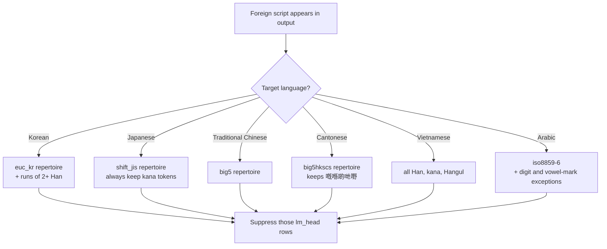

If you serve a multilingual LLM to Korean, Japanese, or Chinese users, take three things from this post. **A script-leakage filter must be designed per language, the right test is the legacy national encoding rather than a simplified-versus-traditional axis, and how effective it looks depends entirely on your sampling temperature.**

## Plain terms

Characters carry passports.

Korea, Japan, China, and Taiwan all write Han characters, but each shortened them differently during the twentieth century. Japan reduced `國` to `国`. China reduced it to `国` as well. Taiwan and Korea kept `國`. So asking "is `国` a Chinese character?" has no answer. It holds a Japanese passport and a Chinese one.

The method here is about where you get the passport list. Every country built an encoding standard to hold its own script, and that standard is effectively **the list of characters that country claims as its own**. Japan has Shift-JIS, Taiwan has Big5, Hong Kong has Big5-HKSCS, and the Arabic world has iso8859-6. Those lists become the passport desk.

## What we did

Last week we built a mask that reduces Han-character leakage in Korean output. It presses down the output-layer rows for tokens that spell Chinese words.

This time we asked whether that mask transfers, found that it does not, redesigned it per language, and then measured. Five languages, 300 paired prompts each, mask on versus mask off, at two temperatures.

## What came out

### The Korean mask inverts in Japanese

We ran it against twelve common Japanese words. **Eleven were cut.**

```
日本語 cut · 会議 cut · 時間 cut · 電話 cut · 勉強 cut · 経済 cut
国際 cut · 実際 cut · 学校 cut · 写真 cut · 広告 cut     (only 気持 survived)
```

The Korean mask treats "two or more Han characters in a row" as a Chinese word. That holds because Korean uses Han only as single-character glosses, as in `개항(開港)`. In Japanese, two Han characters in a row is not Chinese. It is **Japanese itself**.

In plain terms: what reads as a suspicious signal in Korean is the most ordinary sentence in Japanese.

### A simplified-traditional converter cannot find shinjitai

Reaching for the usual converter (OpenCC) to decide "is this simplified" misreads Japanese shinjitai.

| Character | Converter verdict | Reality |
|---|---|---|
| 国 学 会 写 独 当 来 | simplified, so cut | Japanese shinjitai *and* Chinese simplified |
| 実 気 広 経 歩 | unchanged, so kept | Japanese shinjitai |

Japan and China each simplified their characters and the results overlap heavily. Asking whether Shift-JIS contains the character separates them: `国`, `学`, and `会` pass while `这`, `们`, `说`, and `华` are caught.

### A Traditional Chinese mask deletes Cantonese

Big5 works well for Traditional Chinese, catching simplified-only forms and Japanese shinjitai in one pass. Applied to Cantonese it removes Cantonese's own writing: five of eleven Cantonese-specific characters (`嘅` `喺` `啲` `哋` `嘢`) fall outside Big5. The Hong Kong extension, Big5-HKSCS, brings all eleven inside.

### How far contamination actually fell

Three hundred prompts per language, paired on the same endpoint.

| Language | T=0 base → mask | T=1.0 base → mask | Verdict |
|---|---|---|---|
| Traditional Chinese | 8.0% → 0.0% | **40.0% → 1.3%** | significant (p < 0.001) |
| Cantonese | 2.3% → 0.3% | **20.3% → 0.7%** | significant (p < 0.001) |
| Japanese | 0.7% → 0.3% | **5.0% → 0.3%** | significant (p = 0.001) |
| Vietnamese | 0.0% → 0.0% | 2.0% → 0.0% | borderline (p = 0.04) |
| Arabic | 0.3% → 0.0% | 0.3% → 0.3% | **no effect** |

In plain terms: the mask worked in four languages, and in one there was nothing to fix.

### Skip temperature and half the answers disappear

This is the most important finding. **Had we measured only at T=0, four of the five would have looked like "no effect."** But that is not the mask failing. It is base contamination sitting at the floor, leaving nothing to measure.

Raising temperature to 1.0 raised base contamination itself: 5.0x for Traditional Chinese, 8.7x for Cantonese, 7.5x for Japanese. The 5x we observed in Korean reproduces in other languages.

Vietnamese is the clearest case. At T=0 there were **zero** contaminated generations out of 300, so nothing could be measured. At T=1.0 it was 2.0%, and the mask took it to zero.

### There was no cost

We also measured whether the mask damages capability, comparing base against each mask on 164 HumanEval items and 200 MMLU items.

| Axis | base | mask arms | minimum detectable delta |
|---|---|---|---|
| coding | 94.5% | 94.5 – 95.7% | 7.1pp |
| english | 80.5% | 80.5% across all arms | 11.1pp |

No regression. But these two axes never use the masked characters, so their power to catch a regression is structurally weak. We therefore ran a separate probe that demands expressions each language must be able to write and checks whether they survive. Across five languages and 30 items, **nothing broke because of the mask**.

## What to change

Move the test to legacy national encodings, and let the tier structure differ per language. Masks come in tiers to protect legitimate overlap, and the size of that overlap varies. Korean needs three tiers to preserve Hanja glosses. Vietnamese needs one, because modern Vietnamese orthography contains no Han characters at all.

And **check your serving temperature first.** Lowering it removes much of the contamination before any mask is involved. Conversely, if your service runs hot, the mask is worth proportionally more.

We published masks and an apply script for six languages. We did not upload weights. Only one tensor changes, so downloading the original and running the script beats copying 55.6GB, and it follows base-model updates.



Collapsing these branches into one always breaks a language. Replace the Japanese branch with the Traditional Chinese one and shinjitai disappears; replace the Cantonese branch with it and Cantonese loses its own characters.

## What you should not trust

**Arabic was a null.** Base contamination was 0.3% at both temperatures and the mask did not move it. That does not mean the mask is bad. It means this model does not mix Persian or Urdu orthography into Arabic on our 300 prompts. Another model, or Persian-adjacent topics, may differ.

**The metric shares its definition with the mask.** The characters we count as contamination come from the same repertoire test that selects the masked tokens. It does not go trivially to zero, but it is not an independent measurement either.

**Big5 contains some characters that look simplified.** `种`, `机`, `确`, `制`, and `价` are also rare traditional forms, so they sit inside Big5 and neither the mask nor the metric sees them. The Traditional Chinese numbers are the reduction in *Big5-visible* simplified contamination. Japanese has the same hole: `个` is common in Chinese but survives because Shift-JIS contains it.

**Vietnamese and one Cantonese figure are borderline.** They come from a single run, so a decision would need repeated measurement. We did not run repeats, so we do not know the run-to-run spread either.

**The prompts were not reviewed by native speakers.** A model composed them from templates and topics, so grammatical errors may be present.

Finally, this measurement suppressed the tokens at inference rather than editing the weights. On this 27B model the two agreed within 0.03pp, but they diverged on a smaller model we tried earlier.

## Repositories

[Korean](https://huggingface.co/ThakiCloud/Qwen3.8-27B-ko-cjk-suppressed) · [Japanese](https://huggingface.co/ThakiCloud/Qwen3.8-27B-ja-cjk-suppressed) · [Traditional Chinese](https://huggingface.co/ThakiCloud/Qwen3.8-27B-zhTW-cjk-suppressed) · [Cantonese](https://huggingface.co/ThakiCloud/Qwen3.8-27B-yue-cjk-suppressed) · [Vietnamese](https://huggingface.co/ThakiCloud/Qwen3.8-27B-vi-cjk-suppressed) · [Arabic](https://huggingface.co/ThakiCloud/Qwen3.8-27B-ar-script-suppressed)

Each repository carries the measurement ledger (`multiling-masks-20260901.json`). Prior work in the same direction: [smoothie-qwen](https://github.com/dnotitia/smoothie-qwen).

The measurement ran on a single B200 with vLLM 0.28.0 and took about 90 minutes end to end.
