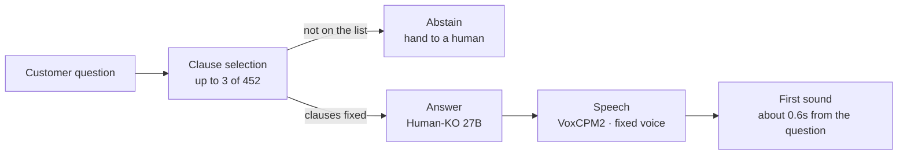

If you want your own model running inside your own company, this post is one concrete place to start. We took the Korean 27B weights we released two days ago, added 452 clauses of the Financial Supervisory Service's standard insurance terms across ten product lines, and built an insurance agent. We did no domain training. The model that drafts the answer and the synthesizer that produces the voice both ran on our own GPUs, and no request ever left the building.

<video controls playsinline preload="none" poster="{{ site.url }}{{ site.baseurl }}/assets/images/humanko-insurance-multiturn-poster.jpg" style="max-width:100%">
  <source src="{{ site.url }}{{ site.baseurl }}/assets/videos/posts/humanko-insurance-multiturn.mp4" type="video/mp4">
</video>
*We recommend turning the sound on. The spoken audio is Korean. This is a single take covering four turns: the agent answers a first question, the caller taps a suggested follow-up, a vague follow-up like "how many days does that take" gets resolved against the earlier turn, and a question outside the clauses gets a clean refusal. The voice you hear is not re-recorded. It is exactly what the browser received at that moment.*

## Why it has to be this answer

*A single turn frozen as a screenshot. Three grounding clauses sit above the answer, and below it are a replay button, three suggested follow-up questions, and that turn's own measurements: clause selection in 0.158 seconds, answer drafting in 0.321 seconds.*

What shows up on a screen and what goes out as a voice are different products. On a screen, eight bullet points get skimmed. A voice cannot be skimmed. While the agent reads a thousand characters, the caller has already hung up.

The third answer in the video above is "We will pay the claim within three days of receiving your documents." That is thirty-two characters in Korean. The number worth noticing is not the length, it is **three days**. The clause itself says "within three business days." When we let the agent read that phrase exactly as written, the speech synthesis broke down. The synthesizer cannot reliably read a digit glued to a unit. Once we rewrote the same content in native Korean number words instead of digits, it passed every time.

So instead of telling the model a numeral rule through the prompt, we chose a model whose default register is already short, polite prose, and layered the rule on top of that. Weigh that against the cost of one incident caused by a forgotten instruction, and the default beats the instruction here.

## Retrieval owns the clauses, not training

*In this diagram the policy terms sit outside the clause selection box, not inside the weights. When the terms are revised, only that box is rebuilt.*

In this demo, the model has never seen these clauses during training. Keeping it that way was the design choice.

Insurance terms get revised. Bake them into the weights and you have to retrain on every revision, and worse, you lose any way to trace an answer back to the clause it came from. In a regulated industry, an answer you cannot trace is not an answer. So we kept the clauses outside the model and let retrieval supply them. When the terms change, we only rebuild the index.

The source document is the Financial Supervisory Service's standard insurance terms, published as Appendix 15 of the Insurance Business Supervisory Regulation. We used the version posted on June 15, 2026, and pulled 452 clauses across ten product lines.

We hit one expensive trap here. The source is a Korean-language document, and running it through a standard text extractor **silently drops every table.** Premium tables and payout-condition tables disappear without a trace, and the surviving body text still reads as complete. We re-converted through a different path and recovered 193 of 199 tables. The remaining four sat outside any article heading, so we could not tell which clause they belonged to. We left them out rather than guess.

## Letting the model pick the clause is what split accuracy

We started the obvious way. We took the question as written and searched the clause text directly with it. It did not work well.

The reason is that customers and insurance terms use different words for the same thing. A customer asks, "When do I not get paid?" The clause is titled "Grounds for withholding benefit payment." So we tried having the model rewrite the search query instead, and it got worse. The model invented phrases the terms never use, like "payment refusal."

What actually worked was reversing the direction. Instead of having the model **generate** a search query, we showed it the full list of clause titles for that product and had it **choose** from that list.

*Every method that asks the model to write a query sits near 0.3. Only picking from a list reaches 1.000.*

Widening to the top five keeps the same order. Here is everything, including what we tried and threw away.

| Retrieval method | recall@1 | recall@5 |
|---|---|---|
| Full clause-text search | 0.286 | 0.571 |
| Title weighted 3x | 0.286 | 0.429 |
| Model rewrites the query | 0.000 | 0.429 |
| Add product filter | 0.286 | 0.714 |
| **Clause selection from a closed list** | **1.000** | **1.000** |

With only 7 test questions we were pinned at the ceiling and could not measure anything, so we grew the set to 32. That run came back at 0.812, and the cause turned out to be our own code, not the model. When the model correctly answered "no matching clause," our fallback search was silently overwriting that answer. Once we fixed it, we got 0.969.

## When there is no answer, it says so

The most expensive answer in insurance is a wrong one. So when nothing in the clause list matches, we told the agent to say "no matching clause" instead of forcing a pick.

We measure this path separately. Six of our 32 evaluation questions are deliberate traps, questions the terms are not supposed to answer, and the agent correctly declines on five of the six. On screen, a green refusal marker appears and the interface offers to connect a human representative.

The fallback bug mentioned above was breaking exactly this path. The model was declining correctly, but our code was overwriting that decision, so the metric made it look like the model could not refuse. If we had blamed the model the moment the number looked bad, we would have missed this.

## Fixing the voice

While we were building this demo, the voice changed from one answer to the next. It looks like a bug, but it is not. Give a speech model no reference voice, and it samples a new speaker on every call. Our own code was the one failing to pass that reference through.

Pinning a single reference voice fixed it. The video below asks the same three questions twice. The first half runs before we pinned the voice, the second half after. The screen is identical in both halves. Only the sound changes.

<video controls playsinline preload="none" poster="{{ site.url }}{{ site.baseurl }}/assets/images/humanko-insurance-voice-ab-poster.jpg" style="max-width:100%">
  <source src="{{ site.url }}{{ site.baseurl }}/assets/videos/posts/humanko-insurance-voice-ab.mp4" type="video/mp4">
</video>
*The spoken audio is Korean. In the first half, a different voice answers each question. In the second half, one voice answers all three.*

We even fumbled the measurement, because there was no simple way to eyeball this. Our first attempt measured pitch, and all six candidates landed between 100 and 109 hertz, so nothing separated. A second metric aimed at voice texture hit the same ceiling. Both metrics failed for the same reason: we measured **the same sentence** every time, and any voice reads the same sentence about the same way.

The condition that actually sounded different to a human listener was a set of different sentences. Once we changed the test to that, and measured with speaker embeddings instead of pitch, the gap showed up. Before pinning the voice, sample-to-sample similarity was 0.655. After pinning it, 0.928. The two ranges do not overlap.

*There is an empty band between the before and after sample-to-sample ranges. The second row crosses that band because it measures something else, similarity to the target voice.*

When a metric says "no difference," that can mean the thing genuinely does not differ, or it can mean the ruler cannot measure it. Here it was the second one.

## How fast is it

From the moment a question is sent to the first sound reaching the caller, we are in the 0.6-second range. The three answer turns captured in the first video above came in at 0.59, 0.63, and 0.66 seconds.

We give more than one number on purpose. Hitting the same path fifteen times from a separate script gives a median of 0.84 seconds. The difference is that the script opens a new connection on every request, while a browser reuses its connection. Both numbers are correct measurements of correct things, and the browser number is the one a real caller experiences.

The time splits into two parts. Picking the clause and drafting the answer takes about 0.5 seconds. The rest is the time for the first audio chunk of that sentence to arrive. Most of that second part is not synthesis at all, it is the round trip between the laptop and the GPU. Measured from inside the pod itself, the first chunk arrives in 31 milliseconds. That is the "first sound: 117 ms" you see on screen in the video, and once you count from the moment the question is sent, it becomes the 0.6-second figure above.

We got here after one large miss. Our first real measurement came back at 2.61 seconds. Both causes were our own code.

The first was a typing animation. The answer was already fully generated, but we were streaming it onto the screen one character at a time for effect, and the server was waiting for that animation to finish **before** it started synthesis. For a 54-character answer, that threw away 0.65 seconds doing nothing useful. The second was duplicate synthesis. The server was rendering a full audio file for replay, and the browser was separately requesting synthesis for live playback, and the two requests queued behind each other on the GPU, delaying playback by however long the queue took.

We fixed it by sending the finished sentence to the browser first, so it can start playing sound immediately, and by only generating the replay file when the caller actually presses the replay button. That change alone took the same script from 2.61 seconds down to 0.84 seconds. We changed no model and added no GPU.

*Measured with the same script both times. We did not use a bigger model or add a GPU. We changed the order.*

To be clear, this number is not call latency. Speech recognition and detecting that the caller has finished speaking both add time before this stage even starts. What we measured here runs from a typed question to first sound.

## What it can't do

We did no domain training for insurance. This demo stands entirely on retrieval plus an existing model. That cuts both ways: there is real room to improve with domain training, and it also means the current performance is not coming from training at all.

It is not connected to a phone network yet. The numbers above run from a typed question to first sound. A real call adds speech recognition and end-of-speech detection in front of that.

The evaluation set is 32 questions. At that size, a single question is worth 0.03 of the score, so 0.969 should not be read as a trend.

Synthesis is not identical run to run. So we pre-tested the sentences used in the demo. We synthesized the answer to each of seven questions five times, ran each result back through speech recognition, and compared it against the original text.

| Question | Start of the answer | Failures | Median similarity |
|---|---|---|---|
| How to file a claim | "Submit the claim form and accident certificate..." | 0/5 | 1.000 |
| Payment deadline | "Starting from the day we receive your documents..." | 0/5 | 1.000 |
| Missed premium | "After the due date..." | **5/5** | 0.836 |
| Changing beneficiary | "Yes, the beneficiary..." | 1/5 | 1.000 |
| Cancelling the contract | "Starting from the day you received the policy..." | 0/5 | 0.911 |
| Notification deadline | "Notify us of the accident immediately..." | 0/5 | 1.000 |
| Prompting a refusal | "What you're asking about..." | 0/5 | 1.000 |

The answer starting with "After the due date" failed all five times. We cannot call this a synthesis defect with certainty, though. If it were genuine non-determinism, the way it failed should vary run to run, but across ten repeats the speech recognizer read the same phrase back as the same wrong Korean word every single time. It is more likely that the recognizer has a structural blind spot for that particular Sino-Korean term. We could not tell which explanation was correct, so we withheld judgment and simply left it out of the demo.

The answer starting with "Yes, the beneficiary" turned the Korean word for "yes" into the word for "my" once out of five runs. That one is a genuine synthesis defect. The contract-cancellation answer passed the gate, but on one run the word for "withdraw" came out as the word for "process," a term with a completely different meaning, and that run barely cleared our similarity threshold. A threshold does not guarantee that meaning survives.

Four of the recovered clause tables are not yet attached to any clause.

## So sovereign AI is possible

No request in this demo ever left the building. The 27B that drafted answers and the synthesizer that produced the voice both sat on our own GPUs, and the clause index is a local file. There is no point in the path where we called an outside model company's API.

There is exactly one reason this is possible. The weights are open. Borrow someone else's API and every customer question and every clause of your own terms passes through someone else's server, every single time. Hold the weights yourself and that round trip disappears entirely.

Plenty of companies already talk about sovereign AI. Most of them are talking about it with a closed model. "We keep it inside our walls," said about a closed model, is a promise. The same sentence, said about open weights, is a fact you can go verify yourself. [Human-KO 27B is available to download right now](https://huggingface.co/ThakiCloud/Qwen3.8-27B-Human-KO).

To be honest about it, we have not proven this inside an air-gapped network. This demo ran on our own internal infrastructure, and that endpoint is reachable from the internet. But there is no reason it could not move. The model file, the clause index, and a server that runs to a few hundred lines are the whole thing, and none of it needs anything outside.

The only thing that has to change is what sits where the insurance terms sit here. For a securities firm it would be investment-solicitation rules, for a public agency it would be complaint-handling regulations, for a manufacturer it would be equipment manuals. The model stays the same. Only the index changes.

## Where this fits

This demo spans three layers. The conversation flow itself is the shape of workflow automation that Paxis handles. The 27B that drafts answers and the synthesizer that produces the voice run together on a single GPU on top of Metis. And insurance companies typically want this kept inside their own network, which is where Aegis sits.

The same structure runs unchanged for other companies. What changes is only what goes into the index in place of insurance terms.

## If you want your own model

The method in this post is not special. Take open weights, index documents your company already has, and build an evaluation set to check the answers. That is the whole thing. The hard part is not the model, it is the two steps after it: deciding which documents are the source of truth, and deciding what will judge whether an answer is correct.

If that is where you are stuck, we would like to work through it with you. If your company wants to build its own model and put it into a real service, or if your institution needs a domain agent running inside a closed network, get in touch. Once you know what goes where the insurance terms sit here, the rest of it is exactly what is written in this post.

Reach us at [info@thakicloud.co.kr](mailto:info@thakicloud.co.kr) or [thakicloud.co.kr](https://thakicloud.co.kr).

## References

- [Open weights for the Human-KO 27B](https://thakicloud.com/tech-blog/en/llmops/humanko-27b-release/)
- [Compared side by side against EXAONE 4.5](https://thakicloud.com/tech-blog/en/llmops/humanko-27b-vs-exaone/)
- [Companies that need their own model](https://thakicloud.com/tech-blog/en/llmops/humanko-who-needs-this/)
- [Han characters leaking into Korean output](https://thakicloud.com/tech-blog/en/llmops/humanko-cjk-vocab-prune/)
- Source document: Financial Supervisory Service, Insurance Business Supervisory Regulation, Appendix 15 (posted June 15, 2026)
