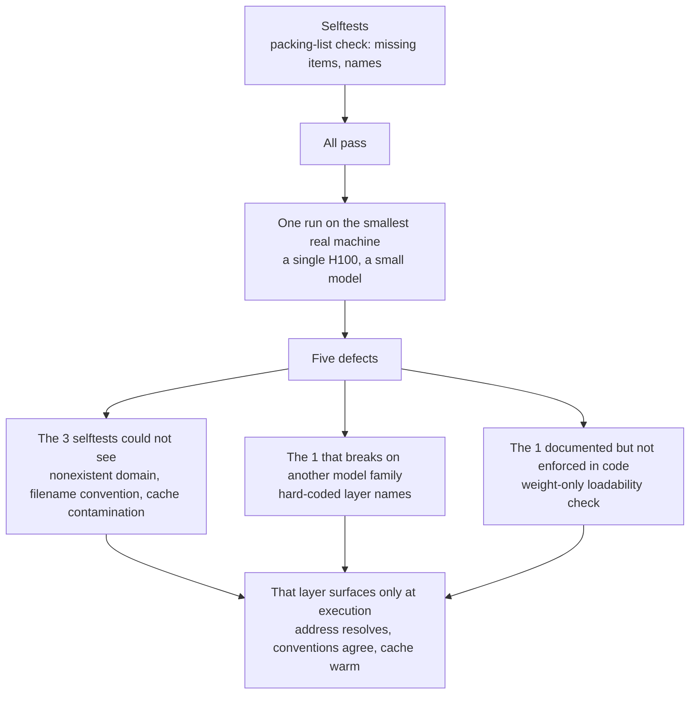

If you are preparing to move experiments onto new GPU hardware, it is easy to call it done
once the code is written and the tests pass. We were in exactly that state. Then we ran it
once on real hardware and found **five defects**. Three of them sat in a layer that no
amount of self-testing could reach.

*A visual metaphor for the article's key idea.*

## Plain terms

Picture packing for a move. Every box is labelled, and you checked the list twice. The list
is perfect. But nobody measured the new front door. The sofa does not fit.

A selftest checks the **packing list**. It confirms nothing is missing and every name is
right. Door width, elevator size, garage clearance: those you have to go and measure.
Three of our five were that front door.

## What we did

We built eight tools that measure training speed and inference throughput. Each got a
selftest, and all of them passed. Then we put them on the smallest real machine we had
(one H100) and ran a small model through once.

The goal was not a performance number. It was a simpler question: does this code run here?

## What came out

Five defects, and they split into two kinds.

**Three the selftests could not see**

First, one address we were about to hand the infrastructure team **did not exist**. We had
written `cdn-lfs.huggingface.co` as the model download host. It resolves to nothing. The
real host is `us.aws.cdn.hf.co`, and it varies by region. Had that gone out, they would have
opened a hole for a host nobody uses, and we would have landed in the worst debugging state
there is: the main site reachable, downloads silently failing, no visible cause.

Second, a result-file naming mismatch. The runner reads a fixed filename; we wrote a
different one. **The job succeeded and was reported as a failure.**

Third, a contaminated startup measurement. Comparing two configurations, the first paid for
a fresh model download while the second hit a warm cache. The result said "tuning makes
startup faster": the **opposite** of what we measured on other hardware.

**One that would have broken on a different model family**

We hard-coded the names of the layers to train. They matched the model family we had been
using. Other families name them differently, and training stops the moment you switch.

**One we wrote down and then ignored in our own code**

"Weights fitting in memory is not the same as being serviceable." That is the first line of
our own document. The check itself looked only at weight size. A one-trillion-parameter
model leaves 74 GB of headroom on that node, and our code called it **loadable**. That
headroom supports roughly one concurrent session.

We had, in effect, certified a bus as roadworthy because one passenger fit.

### One number we got along the way

We also captured a single-GPU training baseline, and it held a surprise.

| Sequence length | Tokens per second | Utilization |
|---|---|---|
| Short (2k) | 22,284 | 26.5% |
| Long (4k) | 21,331 | **28.4%** |

**Going longer lowers tokens per second while raising utilization.** Each token costs more
compute as sequences grow, because the attention term scales with length.

Put plainly: if you watch throughput alone, you conclude that long conversations are a loss.
In fact the hardware is working harder per token. Any service handling long chat histories
needs both numbers side by side.

## What to change

Running once on the smallest real machine is worth more than writing more selftests. Three
of these five are invisible to any number of them. Whether an address resolves, whether two
tools agree on a filename, whether a cache is warm. Those only surface at execution.

A small model takes a few minutes. Ours found five things in those minutes.

And when you do write selftests, **take the expected values from real measurements.** The
fifth defect only surfaced after we pinned measured numbers in as expectations. The first
version of that test passed it without complaint.

The same shape in one diagram: the selftests check the packing list, and only a run on the
smallest real machine exposes the door width.

## What this does not cover

These numbers come from a single GPU. We did not measure multiple GPUs, multiple nodes,
power draw, or training quality.

The 3.3x difference we saw on the inference side is **not quotable**. We tested two
concurrency levels with two repetitions each. It confirms only that the tool distinguishes
A from B.

We could not verify FSDP at all: the framework refuses to run it without an accelerator.

All figures here were measured directly on one H100 NVL and recorded in the ledger entry
`2026-09-04-scatterlab-b300-e11-baseline-1gpu-h100.json` plus two others.
