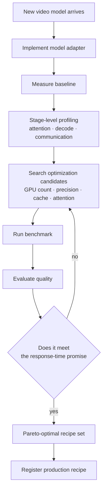

*How many workers you put on the order decides what the order costs.*

If you are planning to add video generation to a product, measure how many GPU seconds one second of video costs before you pick a model. We already confirmed 3.1x on the same card without touching a single model weight, and the axis nobody had measured was how many GPUs to attach. This post is the record of the execution layer we started building to fill that gap.

## In plain terms

Picture a custom furniture workshop. A customer orders a chair, and the shop cuts, sands, assembles, and finishes it. Put eight carpenters on that chair and it comes out faster. The customer is happy. The owner's ledger tells a different story. Eight people for two hours is sixteen labor hours. Two people for five hours is ten labor hours. The customer prefers the first shop and the ledger prefers the second.

Video generation has exactly this shape. GPUs are the carpenters and one clip is the chair. What we are building is not a better chair. It is the shop management system that decides how many carpenters go on each order and which tools they hold. This analogy carries through the rest of the post.

## Fast and cheap are two different numbers

LLM serving settled on tokens per second and tokens per GPU a while ago, because the same model produces wildly different token counts per card depending on the runtime and the precision you choose. Internally we call that layer the Token Factory.

Move the same question to video and one metric falls out: how many seconds of video can one GPU hour produce. Inverted, how many GPU seconds went into one second of video. The workshop example rewritten in that metric looks like this.

| Configuration | User wait | GPU seconds burned |
|---|---:|---:|
| 8 GPUs | 2 s | 16 |
| 2 GPUs | 5 s | 10 |

The top row wins on perceived speed and the bottom row wins on unit cost. Which one is correct depends on the service. An interactive editor takes the top row. A batch job grinding out thousands of clips overnight takes the bottom. So our runtime does not hunt for the lowest latency. It hunts for the execution plan that honors the requested response-time promise while burning the fewest GPUs.

One decision follows naturally. The user does not pick the GPU count. That is a value the runtime chooses per request. A five-second preview and a ten-second final delivery run the same model with a different number of carpenters.

## What we already measured is the single-GPU ladder

This plan did not start from a blank page. Last month we put a Wan2.2-family video model on our own GPUs and measured a ladder that stacks one execution change at a time. Conditions were fixed at 1280 by 720, 81 frames, 40 steps.

One caveat first. The two tables below come from different cards, so absolute times must not be compared across them. Comparisons hold only as ratios between rungs on the same card.

The ladder on a single H200. Median of three prompts, one warmup.

| Rung | Total | vs baseline |
|---|---:|---:|
| baseline | 1142.4 s | 1.000x |
| kernel stack only | 1064.5 s | 1.073x |
| kernel + cache | 701.4 s | 1.629x |
| sparse attention only | 562.6 s | 2.031x |
| sparse attention + cache | 368.4 s | 3.101x |

The ladder on a single B200. Median of five prompts.

| Rung | Total | Decode | vs baseline |
|---|---:|---:|---:|
| baseline | 527.8 s | 17.6 s | 1.000x |
| kernel fusion only | 458.6 s | 4.6 s | 1.151x |
| kernel + cache | 303.6 s | 4.6 s | 1.738x |

In plain speech: the model files stayed untouched and the time to produce the same clip fell to under a third. We did not hire more carpenters. We changed their tools.

## The cache policy transferred across hardware unchanged

The most encouraging result was not the speedup. It was portability. A diffusion model refines the same picture across forty steps, and adjacent steps share a lot of work that does not need recomputing. With the reuse threshold set to 0.30, fourteen of the forty steps were judged reusable. That count matched exactly what NVIDIA reported on their own hardware. Even the positions of the reused steps stayed nearly identical across prompts.

Moving the same operating point to image-to-video needed no retuning either. Reuse landed at fifteen of forty steps and the speedup came out at 3.879x. The binding between the conditioning image and the first frame of the output held to four decimal places. Baseline times for text-to-video and image-to-video were 1145.7 s and 1146.2 s, effectively identical.

In plain speech: one set of tools kept working across a different card and across a different job. That is the first evidence that told us a shared runtime, rather than a server per model, is worth building.

## We never mix runtime speedup with model speedup

This is where the field's most common exaggeration lives. Distilling a forty-step model down to four steps obviously makes it much faster. Fold that factor into your runtime optimization number, call the product "ten times faster," and nobody can tell which technique actually did the work. Nobody knows what has to be redone when the next model lands either.

So we always report three separate columns. Runtime speedup is counted only with the same model, the same weights, the same step count, the same resolution and length. Model speedup is what distillation or step reduction bought. Total is the product. The 3.101x above is entirely runtime speedup with no distillation mixed in.

## The VAE was not the bottleneck in our measurements

A common claim when designing video runtimes is that the decode stage is surprisingly heavy. We planned on that premise. Measurement said the opposite. On the B200 baseline, decode was 17.6 s out of 527.8 s, or 3.3 percent of the total, and after kernel fusion it dropped to 4.6 s, under one percent.

That result changed one line of the plan. We decided not to implement decode parallelism first. Instead we filed an experiment that hunts for a resolution and length where the decode share actually exceeds ten percent. If no such point shows up, decode parallelism comes out of the first architecture entirely. Measuring before building is cheaper than building and then ruling it out.

## So what we are building is an execution layer, not a model server

A structure that adds one new server per model does not survive contact with this field. Video foundation models still ship every few weeks. Text-to-video, image-to-video, reference video editing, and joint audio-video generation are converging into single models. Rebuilding the serving stack for each new arrival throws away the optimization knowledge every time.


*Models sit behind adapters, and the optimization knowledge stays in the runtime and the recipes.*

The core move is separating the model from the runtime. When a new video model appears, what we implement is one thin model adapter. Precision, attention backend, cache settings, and GPU placement stay with the shared runtime. The user never picks a tool. They supply a prompt, a duration, a resolution, and a quality tier.

Execution is handled as a bundle of settings we call an execution recipe. The same model can resolve to something like this for one request.

```yaml
model: video-model-a
gpu:
  count: 4
precision:
  weights: bf16
  communication: fp8
attention:
  backend: flash
  sparse: true
parallel:
  sequence_parallel: 4
cache:
  enabled: true
```

Another request does better on two GPUs with sparse attention off. There is more than one optimal configuration, and that is the premise of the design. None of these fields are exposed to the user. They see four tiers: quality, balanced, fast, and realtime. The realtime tier has a simple goal, which is to finish generating in less wall-clock time than the length of the clip it produces.

As long as a human picks the recipe by hand, this structure does not scale. The most important long-term component is therefore not a specific kernel. It is the auto tuner.



What comes out of the search is not one fastest setting. It is several recipes with different objectives. A realtime service takes the lowest-latency one, a general service takes the balance point, and bulk batch takes the one with the fewest GPU seconds. The same model resolves differently depending on the job.

## The biggest hole is what we have not measured

Everything above is what we know. Here is what we do not. Every rung in those ladders is a single-GPU measurement. The whole argument of this post is the economics of GPU count, and we have not yet measured the curve across one, two, four, and eight cards. So the first experiment is not a flashy optimization. It is that curve: how much latency falls as cards are added, how much GPU seconds per video second rises, and where the two cross.

The same reasoning explains why we are not implementing sparse attention first. On long clips the attention share grows and the payoff is large. On short sequences the routing cost can exceed the savings. Until the profiler names the bottleneck, no optimization has standing to claim priority.

One more lesson from the earlier round. Documentation frequently runs ahead of code. We only discovered that one optimization we intended to reproduce from a public repository had no published implementation after we had already submitted the job. Before you copy a reported speedup into your target sheet, confirm that the code which produced it is actually in your hands.

## What you should not trust yet

The honest boundaries. Those ladders were measured with three to five prompts and one sample per configuration. We have not yet met our own bar for a citable baseline, which is two warmups with five prompts and three repetitions. During the B200 run, six of the node's eight cards were serving other workloads. Absolute times therefore cannot be used for external comparison until we re-anchor. Trust only the ratios between rungs inside the same run.

There are quality boundaries too. Conditioning fidelity was measured as first-frame correlation, and the first frame is where the condition binds hardest, which makes it the last indicator to break. Mid-clip and final-frame fidelity were not measured in this sweep. Where the cliff sits when the cache is pushed harder also has to be re-checked per job type.

Finally, licensing. One candidate model is under license review for self-hosting. A different candidate does not have its weights in our internal registry at all. We do not put models like that on the production path before a formal license is secured, and that judgment is enforced by a deployment gate in code rather than by anyone's memory.

## What this means for Metis

ThakiCloud is not trying to build one more video generation service. Metis, our inference product, is the layer that deals with how many tokens a single GPU can produce reliably, and this work moves that question over to video. Just as the execution engine came to matter as much as the model in the LLM era, the same layer becomes necessary once video foundation models are commonplace. It is also the layer that decides cost once agents start calling video generation as one step in a workflow.

So the sentence we are trying to prove this quarter is a single one. A shared runtime actually holds across two or more video models with different architectures, and GPU seconds per video second come down meaningfully on top of it. If it does not hold, what we built is not a runtime but a bundle of optimizations for one specific model. The first experiment starts by measuring the GPU-count economics curve on B200. Results go on this blog as the numbers arrive.

For anyone adding video generation to a product, one sentence to take away: measure GPU seconds per video second before you pick a model. Lowering that number is usually a question of how you execute, not which model you swap in.

## Further reading

- Wan2.2 official repository: [github.com/Wan-Video/Wan2.2](https://github.com/Wan-Video/Wan2.2)
- Inference tuning is measurement: [the run where the optimal setting flipped on the same GPU](/tech-blog/en/llmops/inference-tuning-is-measurement/)
