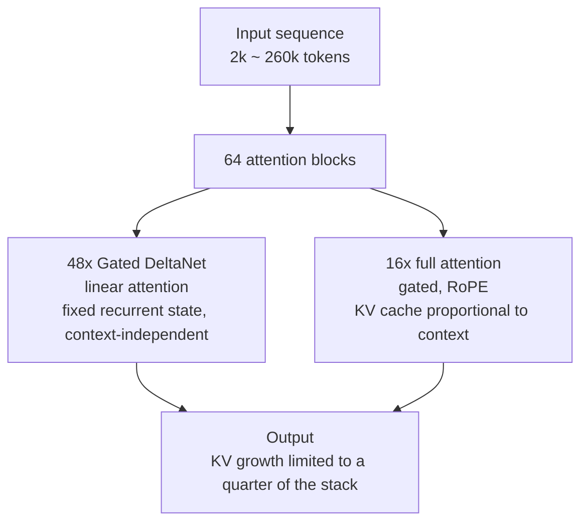
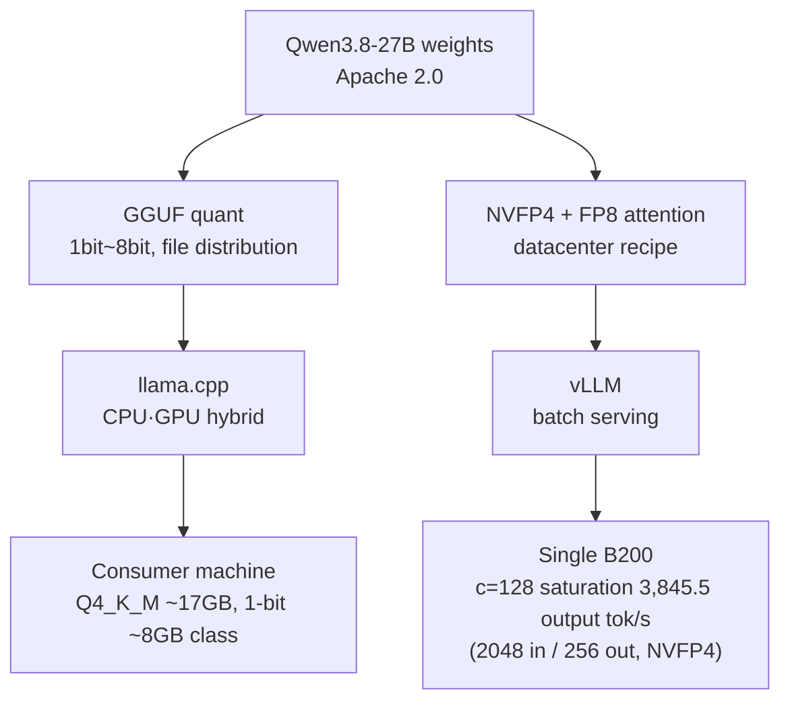

*An abstract rendering of the post's core concept: the same weights flowing down two serving routes, consumer machine (amber) and datacenter (blue).*

## Why read this

This is for engineers choosing a serving route for a 27B-class open model. The conclusion up front: the number behind Qwen3.8-27B's Unsloth GGUF, 10 million downloads and 3,700 likes in 24 days for the "most-liked GGUF of all time," is not an anomaly but a structural outcome. Forty-eight of this model's 64 attention layers are linear attention that does not scale with context, so the barrier for a 27B-class multimodal model to digest long context on a consumer machine has been lowered structurally. With both GGUF (llama.cpp) and NVFP4 (vLLM) serving routes first-class citizens on the same weights, route selection became an argument about workload character.

## What happened

On August 14, 2026, Alibaba's Tongyi Lab released Qwen3.8-27B under the Apache 2.0 license. Two days later, on August 15, Unsloth's GGUF quantization entered the third spot on the Hugging Face trending list, and by August 18 it had risen to second. Then on September 9, per Unsloth's announcement, the Qwen3.8-27B GGUF recorded 10 million downloads and 3,700 likes in 24 days, becoming the top-liked model in the GGUF category. Page snapshots on Hugging Face confirm a likes range between 3,500 and 3,700, matching the announced figures independently.

What deserves more attention than the download count itself is the object. The 10 million downloads were set by a dense 27.78B multimodal model. A GGUF that pulled a 27B-class model with a vision encoder (images plus video) down to consumer machines took the all-time most-likes crown of the GGUF category itself.

## Why Qwen3.8-27B pulls toward consumer machines

The core is the attention structure. Qwen3.8-27B is a dense multimodal model with 64 transformer blocks, of which only 16 are full gated attention and 48 are Gated DeltaNet linear attention. Full attention grows its KV cache linearly as context lengthens. Linear attention, in contrast, holds a fixed-size recurrent state. Whether the token count is 2,000 or 200,000, the state memory of those 48 layers stays the same size.

KV cache growth is owned by the 16 full-attention layers. A pure transformer of the same depth would grow KV in all 64 layers; in this structure, 48 of the 64 stay context-independent. Even when context moves from 260k tokens (native) to 1M (YaRN), the main variable in memory is the KV of those 16 layers. Pulling a 27B-class model into a consumer machine's memory takes two things working together: shrinking the weights (quantization) and capping context growth (KV structure). Qwen3.8-27B gets the latter from its architecture.

The remaining specs are local-friendly as well. A built-in vision encoder digests images and video directly, and a Multi-Token Prediction (MTP) draft head ships with it. The `reasoning_effort` parameter (xhigh, medium, low) adjusts reasoning depth, and native context is 262,144 tokens.

## What makes GGUF different

GGUF's unit of distribution is the file. Each quant level is one .gguf file, and llama.cpp runs it over a CPU and GPU hybrid memory. No serving infrastructure to stand up; receiving and running the file is the serving.

Qwen3.8-27B's quant menu comes out of Unsloth's Dynamic 3.0 technique, spanning 1-bit to 8-bit. The size picture: the bf16 original weights are 55.59 GB (a figure we measured in August), Q4_K_M lands around 17 GB (16.8 to 17.9 GB depending on the quant source), and a 1-bit quant runs in roughly 8 GB of RAM. The window where the same model compresses from 55 GB to 8 GB, about seven-fold, is where "running locally" opens.

Among Unsloth's claims, one to keep as a vendor figure: the 4-bit quant matches the full model on agentic coding benchmarks. There is no independent replication here; read it as a supplier announcement. Notably, bartowski ships the same GGUF separately. For major 27B-class models, quant-provider competition is already underway.

## When GGUF, when datacenter serving

The two routes run the same weights over different memory systems.

The GGUF route's strength is entry cost. If the model must stay on personal data (privacy), serving can live on the machine, and for interactive workloads that do not demand batch throughput, a CPU+GPU hybrid is enough. A 27B-class multimodal model arriving at Q4_K_M, 17 GB, means that on a machine with those conditions, "experimenting with a model" ends at the level of a file download.

Datacenter serving is the opposite: batch is king. Our measured figures for this model on a single B200 with NVFP4 and tuned serving settings are, at 256 output tokens over 2,048 input tokens, 138.8 tok/s at single stream (c=1), 3,845.5 tok/s at concurrency 128 (c=128), and 4,150.7 tok/s at 256 (c=256). The variant of the same recipe that keeps attention in FP8, delivering 1.675x saturation over bf16, is already documented on this blog. llama.cpp's single-stream token speed and vLLM's saturated throughput are not the same "speed." The former is the rate of one person conversing; the latter is the capacity for hundreds receiving at once.

Route selection by workload runs like this. Personal or small-scale conversation, privacy-sensitive data, experimentation and prototyping, edge deployment: GGUF. Multi-tenant serving, API traffic, saturated throughput as the product: the vLLM-class datacenter route. Between the two routes there is no "better side"; only "who receives that traffic" differs.

## Implications for ThakiCloud products

From the ThakiCloud ai-platform (Metis) perspective, this model is an occasion to look again at serving-recipe economics. In August we took the same Qwen3.8-27B and changed only the layer-wise precision allocation (keeping attention in FP8 instead of bf16), lifting saturation from 1.488x to 1.675x over bf16 while shrinking the checkpoint from 30.14 GB to 22.90 GB. The 10-million-download GGUF is a signal that that same recipe economics is starting to circulate outside the datacenter, as file-level distribution.

The arrival of hybrid-attention models changes KV-cache planning itself. The cache budget conventionally sized as "context length x concurrency x per-head KV size" must now reflect the fact that in this structure, only a quarter of the layers grow. Raising a serving endpoint's context ceiling becomes structurally cheaper than for a pure transformer. When Metis serverless serving accepts long-context workloads, the model-selection criteria gain one more entry: which layers grow the KV.

Treating both routes as first-class is also an operating breadth. In a structure where the same model ships as GGUF in a file and stands as NVFP4 on an endpoint, "how do we run the model" becomes a second decision, independent of the model choice. ThakiCloud sits in a position where the platform can make that second decision for you.

## Limitations and counterarguments

First, download and like milestones are not a production recommendation. The "most-liked GGUF of all time" is a measurement of community distribution speed. It is not evidence about the optimal serving route for a specific workload. What 10 million downloads signify is the model's appeal and the smoothness of its distribution.

Second, the throughput ceiling of the consumer-machine route stands. llama.cpp's single-stream speed is not a number on the same dimension as vLLM's saturated throughput. The moment the GGUF route ends with "it works locally," the concurrency, caching, and scaling that datacenter serving provides are gone. A bigger milestone does not raise that ceiling.

Third, this milestone does not answer how mature the vision route is in llama.cpp. When a multimodal model circulates as GGUF, the weights arrive, but the performance and compatibility of vision-encoder execution are a separate problem from text quantization. Whether the bulk of the 10 million downloads is text workloads, or downloads that ran the vision path too, cannot be separated by published figures.

Fourth, claims like 4-bit equals full model are vendor announcements. Until an independent benchmark attaches, keeping them as reference rather than as a basis for quant selection is the precise posture.

## Wrap-up

The question the Qwen3.8-27B GGUF milestone leaves is "who divides the two routes, and how." Hybrid attention pulled the 27B-class model down to consumer machines, and file-level distribution removed the barrier. With the same weights shipping as GGUF onto personal machines and as NVFP4 into datacenters, serving-route selection becomes a question about workload character. Personal conversation and privacy data answer with the file; API traffic in the hundreds of concurrency answers with the endpoint.

Next time you design serving for this model, one more line can be written: "One set of weights, two routes, and what separates the routes is the character of the traffic." The moment the serving-route meeting separates from the model-selection meeting, this milestone becomes a design practice.

## Sources

- [Unsloth tweet (Qwen3.8-27B GGUF milestone, 2026-09-09)](https://x.com/hjguyhan/status/2097477949356429756)
- [Hugging Face: unsloth/Qwen3.8-27B-GGUF](https://huggingface.co/unsloth/Qwen3.8-27B-GGUF)
- [Hugging Face: Qwen/Qwen3.8-27B](https://huggingface.co/Qwen/Qwen3.8-27B)
- [Unsloth Dynamic 3.0 GGUF docs](https://unsloth.ai/docs/basics/dynamic-3.0-ggufs)
- [This blog: The side that used 4 bits more did not win (Qwen3.8-27B NVFP4+FP8, 2026-08-19)](https://thakicloud.com/tech-blog/ko/research/qwen38-nvfp4-fp8attn/)
- [bartowski/Qwen3.8-27B-GGUF](https://huggingface.co/bartowski/Qwen3.8-27B-GGUF)
