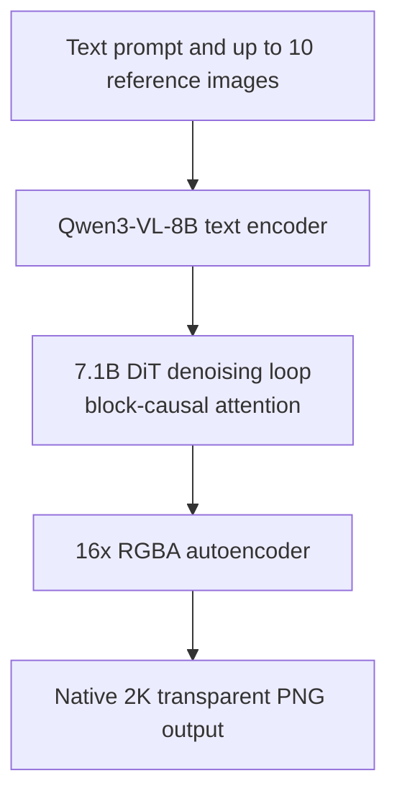
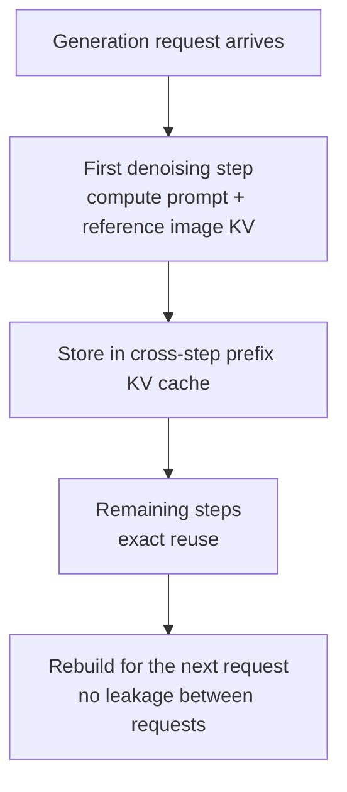

This post is for engineers who serve image generation models on a K8s platform, or who are preparing to. In one sentence, the takeaway: the five-engine day-0 support that Qwen-Image-2.1 shipped with on September 20 confirms that diffusion serving has converged on the same principles as LLM serving (exact prefix KV reuse, CUDA Graphs), and for platforms that serve both text and images, engine unification is now a realistic choice rather than a hypothesis.

*The core concept of the post, visualized: a generated image tile reusing the same prefix computation across denoising steps.*

## Who should read this

There are broadly two groups of people serving image models. One builds containers around diffusion-only runtimes (Diffusers, ComfyUI) and raises an endpoint. The other serves LLMs on a vLLM-class engine and wants images on the same operational system. This post addresses the second group's question, "does consolidating on one engine pay off," while giving the first group a concrete serving path for the latest model.

The core argument is two lines. First, the fact that Qwen-Image-2.1's DiT uses block-causal attention is an architecture choice, but it has a consequence: the KV computed in the first denoising step for the prompt and reference images can be reused exactly in later steps. Second, the fact that vLLM-Omni ships that reuse plus CUDA Graphs from day 0 is a signal that an "engine optimization standard" is forming for diffusion serving, the way continuous batching and prefix caching became standard for LLM serving.

## Overview

Alibaba's Qwen team released Qwen-Image-2.1 as open weights on September 20, 2026. Where the previous generation, Qwen-Image-2512, was a 20.4B single DiT under Apache 2.0, version 2.1 changes both structure and license. The DiT backbone shrinks to a 7.1B single stream (the official repository says 7B), the text encoder unifies on Qwen3-VL-8B, and the autoencoder handles 16x RGBA. Functionally, text-to-image generation and image-conditional generation (editing) are unified, with native 2K resolution (roughly 2048x2048), native RGBA transparent PNG output, and up to 10 reference images.

The serving ecosystem response is the real subject of this post. At release, five runtimes offered day-0 support: Diffusers, ComfyUI, vLLM-Omni, SGLang, and LightX2V. The vLLM project announced separately that "Qwen-Image-2.1 has day-0 support in vLLM-Omni," and the recipe page documents the serving configuration and cache behavior.

## What is Qwen-Image-2.1

The components, in a table:

| Component | Specification |
|---|---|
| DiT backbone | 7.1B single stream (block-causal attention) |
| Text encoder | Qwen3-VL-8B |
| Autoencoder | 16x RGBA (native transparency) |
| Output | Native 2K (roughly 2048x2048), aspect-ratio preserving |
| Editing | Up to 10 reference images, unified generation + conditional generation |
| Benchmark | Qwen-Image-Bench 60.28 (vendor-run) |
| License | Qwen Research License (non-commercial) |

Three things change versus the previous generation. Size drops to roughly a third on the DiT (20.4B to 7.1B). The encoder unifies on Qwen3-VL, so text instructions and conditioning images flow through the same path. And transparency becomes a native capability of the model rather than an output format. Because the RGBA alpha channel is generated directly, there is no chroma key or separate segmentation in post-processing, and layer-based workflows such as infographics, storyboards, and virtual try-on take the output as-is.

Vendor-run benchmarks (Qwen-Image-Bench) place it at 60.28, 0.46 points ahead of Nano Banana 2.0 (59.82), as cited in public materials. That gap is one decimal point, and the vendor measured it. Reading the absence of independent replication as a caveat is the accurate stance.

The license direction changed. Where v1's Apache 2.0 was commercially safe, 2.1 allows "research or evaluation purposes only" under the Qwen Research License. It is open weights, but not directly serviceable; commercial deployment requires a separate agreement.

## vLLM-Omni's day-0 support

vLLM-Omni is the vLLM project's extension that applies LLM serving technology to diffusion and multimodal generation models. Where text vLLM "stitches requests together" with token streaming and continuous batching, image serving refines a single latents through repeated denoising steps, so the unit of serving differs. A request is an N-step loop, and batch concurrency means the number of generation jobs in flight at once.

Putting images on the serving path, the operational unit differs from LLM in three ways. First, there is no token streaming; the completion signal is a whole image. Second, the memory peak sits in the latents and VAE rather than KV, so the per-request memory footprint is larger than the text counterpart. Third, image workloads are bursty. Generation requests arrive in batches, not as a continuous stream. These three points shape the endpoint. Bursts pair naturally with scale-to-zero waiting, and the different memory model argues for keeping images and text on separate endpoints. That vLLM-Omni absorbs this difference within the same engine lineage is the interesting part for platform operators.

The acceleration vLLM-Omni documents for Qwen-Image-2.1 comes in two parts: cross-step prefix KV cache reuse, and dedicated CUDA Graphs. The official description is "reducing redundant computation and kernel launch overhead," and the recipe page carries the cache-behavior detail.

The platform meaning of "day 0" is worth pinning down. The structure in which five runtimes support a model on release day means the model team treats serving compatibility as a release condition. In a typical release, runtime ports follow weeks to months later, and serving teams fill that gap with in-house engineering. Because serving-ecosystem speed defines operational risk, day-0 simultaneous support is information of the same grade as the model's quality spec.

## Serving architecture: the cross-step prefix KV cache

The model data flow is below.

The real story is the second diagram, the KV cache lifetime per request.

Block-causal attention is the precondition for this structure. If the KV for the "prefix" portion (prompt and reference images) stays exactly identical across denoising steps, the value computed in the first step can be reused as-is. According to the vLLM-Omni recipe, the cache activates automatically, caches the prompt and reference images after the first denoising step, and reuses them exactly (not approximately) in subsequent steps.

Three properties matter. First, it is exact. Unlike the approximate prefix reuse family in LLM serving, the attention pattern itself guarantees step-to-step invariance. Second, it is rebuilt per request. A new generation request recomputes the prefix KV, so prompt or reference-image information from an earlier request cannot leak into the next one. That is obvious why this matters for multi-tenant serving. Third, the gain scales with prefix length. Editing jobs with 10 references and a long prompt save a lot per step, while short-prompt single-image generation saves little. The design variable is not "there is a cache" but "how much, in which workload."

CUDA Graphs remove the kernel launch overhead of the step loop in the same spirit. The diffusion loop has few steps and heavy per-step compute, so it is not the call-count-explosion regime of LLM decoding, but kernel launch cost still accumulates under batch concurrency.

## ThakiCloud product implications

ThakiCloud already runs image model serving in its operational path. Metis serves the previous generation Qwen-Image-2512 (20.4B, Apache 2.0) on DOCKER_CUSTOM serverless endpoints, and weights are staged to SeaweedFS global/models through model-catalog ingest jobs. The pipeline "image model to engine container to scale-to-zero endpoint to catalog" is validated; when Qwen-Image-2.1 arrives, the open question is the engine, not the pipeline.

The judgment sits on measurements. On our B200, Z-Image-Turbo ran at 18.2 seconds per image while the external API took 116 (measured 2026-08-15). Generating 3,228 images as four parallel jobs finished in 4.1 hours; the same volume on the external API would take 104 hours. Image serving economics on our GPUs are already a different game from external APIs. How much more vLLM-Omni's cross-step KV cache and CUDA Graphs add on top, and how far the cache gain extends in 10-reference editing workloads, is only knowable by measurement, given that the gain scales with prefix length.

The bursty character of our current image workloads enters this comparison too. Batch generation is submitted as parallel jobs that return the GPU when done, and the serverless endpoint sits at scale-to-zero most of the time. So the engine comparison question is not "which is faster" but "where does the cost land when the same batch is served by two engines, and where does the tuning headroom differ." Just as the 18.2 seconds per image for Z-Image on B200 was a number for a specific serving configuration, the section that changes with an engine swap is exactly this one.

On engine unification, the LLM serving lesson transfers directly. Where platform defaults versus tuned settings differed by 18.8x single-stream and 17.9x at saturation on Metis serverless text endpoints (measured 2026-08-19), the image side is no exception: "it loads on day 0" and "it saturates under a tuned serving configuration" are different events. Day 0 is a starting point, not a destination.

The license is the most concrete constraint in this post. 2.1 is a non-commercial research license, so it cannot go to customer serving as-is. Commercial serving presupposes a separate agreement with Qwen, and until then the Apache 2.0 v1 (2512) is the safe point. For the platform, the natural design is to stage 2.1 in the catalog while gating the servable flag on license state.

Functionally, native transparent PNG and 10-reference editing reach the product surface. A model that outputs layers without post-processing creates a new kind of request in design and commerce workflows (cutouts, virtual try-on, storyboards). From the Paxis perspective, "edit instruction + reference images + output" becomes an atomic single-skill unit of agent work.

## Limitations and counterarguments

Benchmark numbers deserve conservative reading. 60.28 versus 59.82 is a vendor-measured Qwen-Image-Bench figure with a 0.46-point gap. There is no independent re-confirmation, and "on par with competing products" is the safe level of claim.

Day-0 support should not be over-read. It verifies that runtimes load the model and generate on release day; it is not production tuning. Our own text serving experience, where defaults versus tuning differed by an order of magnitude, is the same lesson. The "tuned default" for images does not exist yet.

Hardware requirements lack official figures. Community reports say it runs on an RTX 3090, but no official VRAM spec is confirmed for reference-count and resolution conditions. With the combined 7.1B DiT + 8B encoder parameters and the denoising memory peak, actual batch concurrency should not be assumed before measurement.

The cache gain carries a condition. Because it scales with prefix length, short-prompt generation without references gains little. That is why "cross-step KV cache" should not be read as "faster everywhere."

Finally, the license. Open-weight readability and "directly serviceable" are different things. Experiments are free for research, but serving sold to customers is a contract question. Remove that limitation and every implication in this post halves.

## Takeaway

Image generation model serving is no longer a separate domain; it is the domain where LLM serving principles have arrived at diffusion structures. Qwen-Image-2.1's block-causal attention enables exact cross-step prefix reuse, and vLLM-Omni ships that reuse with CUDA Graphs from day 0. The combination adds real weight to "run one engine" for platforms serving both text and images.

ThakiCloud's next moves are three. First, confirm the commercial licensing status for 2.1 and gate the catalog's servable flag on it. Second, plan the Qwen-Image-2.1 + vLLM-Omni comparison experiment on B200, measuring day-0 defaults versus tuned settings as separate arms to check for an order-of-magnitude configuration gap on the image side as well. Third, measure cache gain separately at 1 reference and 10 references, so the ledger records which workloads actually profit from cross-step KV caching.

## Sources

- Qwen-Image-2.1 official repository: <https://github.com/QwenLM/Qwen-Image-2.1>
- Hugging Face model card: <https://huggingface.co/Qwen/Qwen-Image-2.1>
- vLLM recipe (Qwen-Image-2.1 serving): <https://recipes.vllm.ai/Qwen/Qwen-Image-2.1>
- vLLM-Omni repository: <https://github.com/vllm-project/vllm-omni>
- vLLM project day-0 announcement: <https://x.com/vllm_project/status/2101665920565629318>
- Qwen-Image-2.1 release coverage: <https://mixed-news.com/en/qwen-image-2-1-transparent-rgba-7b-open-weights-research-licence/>
- Release analysis: <https://qwenimages.com/blog/qwen-image-2-1-release>
