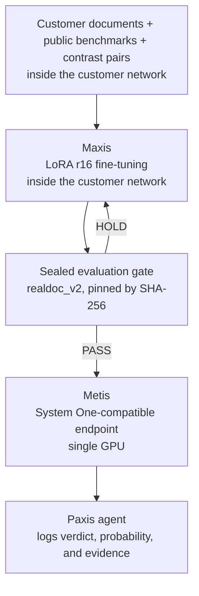
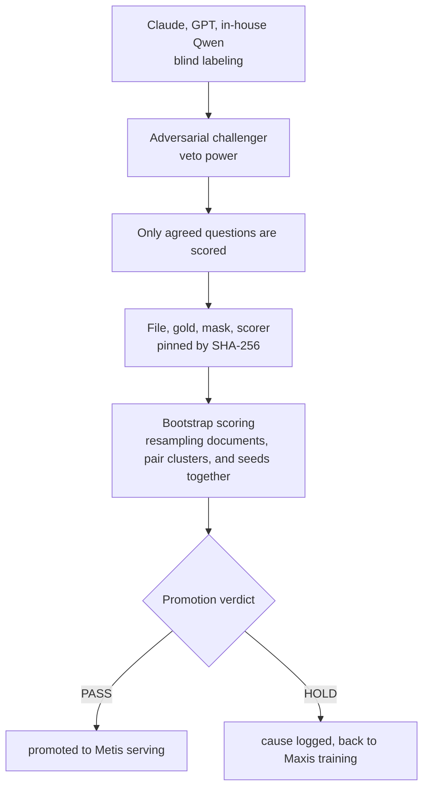

This post is for enterprise architects and product owners who need auditable decisions grounded in a regulation. The short version: a Korean decision model trained on a customer's own documents can be trained inside that customer's network with Maxis and served from a single GPU with Metis. The loop that makes this trustworthy runs through five stages, data, training, a sealed evaluation gate, serving, and an agent, and if any one of them is missing the other four cannot be trusted either.

How this model was trained in the first place, and what the contrast pairs actually changed, is covered in [Teaching a 4B Model to Judge Numbers in Korean Statutes](/tech-blog/en/research/k-decision-4b-numeric-contrast-pairs/). How accurately it performs, and where it wins or loses against TypeSafe Jev, is covered in the more recent post, [Why We Built a Korean Jev](/tech-blog/en/research/k-decision-jev-korean-comparison/). This post covers the pipeline that produces that model.

*A visual metaphor for the article's key idea.*

## The problem for enterprises that cannot send documents outside

Most enterprises in finance, insurance, public sector, and defense cannot send documents, whole or excerpted, to a cloud API outside their own network. Yet these same enterprises often need to process regulation-grounded decisions at volume: does a specific clause apply to this contract, does this claim exceed a stated cap, and similar judgments repeated across thousands of documents. Calling a large general-purpose model through a cloud API is not even a candidate under this constraint.

A second requirement sits on top of the first. Automated decisions have to be auditable. When someone later asks why a document was classified as exceeding a cap, a free-text explanation alone does not make it easy to recover how confident that judgment actually was. Satisfying both requirements at once, data that never leaves the network and a decision that is auditable, requires a loop that runs entirely inside the customer's network from training through serving, with every verdict logging a probability and its evidence together.

Attempts to satisfy this tend to fail on one of two axes. Using an external API as-is fails the data-export requirement. Deploying a free-text generation model on-prem as-is leaves the decision unauditable. This pipeline targets the space between those two failures: on-prem, and with the decision format itself designed around auditability from the start.

## The full pipeline

The loop starts with data and ends with an agent. Maxis performs training inside the customer's network, a sealed evaluation gate decides whether the model is promoted, Metis serves only what passes, and a Paxis agent logs the served result together with its reasoning in the audit trail.

*The full path from Maxis to Paxis, turning data into an auditable decision. A model that fails the gate goes back to training.*

What each stage means is covered below.

## Maxis: LoRA fine-tuning inside the customer's network

The training recipe is simple. LoRA at rank 16 on top of Qwen3.5-4B-Base, 2 epochs, learning rate 2e-5, batch size 4 with gradient accumulation 2, on a single GPU. In our own runs, one seed took about 67 minutes (4,014 seconds) on a single H100, and every result we report averages three seeds with a confidence interval attached. This scale is nowhere near as expensive as training a large model from scratch, and it runs on a single GPU inside the customer's own infrastructure. So far we trained on our own H100 cluster; moving the same recipe into a Maxis training job inside the customer network is the product path.

Training data is layered. At the base sit public benchmarks, KoBEST and KLUE converted into typed decisions, plus a small ThakiCloud synthetic policy-question set. On top of that, AI Hub (한국지능정보사회진흥원) statute and administrative-document datasets are added for training only and are not redistributed. The last layer is 6,000 program-generated contrast pairs, drawn from six numeric families, unit conversion (원 and 만원), day arithmetic, fractions, cap exceedance, reduction denominators, and interest-rate arithmetic, whose gold answers are computed by the code that generates each pair, not labeled by a person or another model.

If an actual customer runs this pipeline, what changes sits near that last layer. The public benchmarks and the contrast-pair generator stay as they are; the customer's own documents are added to, or swapped into, the training data. Labels are designed to be computed by code wherever possible, and judgments that code cannot compute are labeled by consensus across multiple models. One compliance requirement attaches here specifically. For a regulated customer's data, the models used for labeling must be restricted to in-house models. The moment labeling calls an overseas cloud API, part of the data has effectively left the network, even if training itself stays on-prem.

This constraint looks like it adds friction, but it actually simplifies the pipeline. Once labeling is restricted to code computation or in-house model consensus, no stage needs to be individually audited for whether data leaked out; the pipeline never has an exit path to begin with. Guaranteeing auditability structurally at design time, rather than verifying it after the fact, is the safer approach for a regulated industry.

| Axis | Value |
|---|---|
| Base model | Qwen3.5-4B-Base + LoRA rank 16 |
| Training config | 2 epochs, lr 2e-5, batch 4 x grad-accum 2, 1 GPU |
| Training time (measured) | ~67 minutes per seed (4,014s) on a single H100 |
| Repetition unit | 3 seeds, every result reported with a confidence interval |
| Adapter size | ~130MB (LoRA + pointer head) |

## The sealed evaluation gate: this product's trust mechanism

A finished training run does not go straight to serving. It has to pass the sealed evaluation set realdoc_v2 first: 115 excerpts copied verbatim from real statutes, spanning 76 statutes across 25 domains, with 322 questions actually scored. Before any scoring happens, the evaluation file, the gold answers, the mask, and the scorer are all pinned by SHA-256 hash. This seal is used exactly once per promotion decision; design experiments run on a separate development set instead.

The gate internally runs from labeling through a promotion verdict.

*How labeling and scoring split inside the gate. A HOLD verdict is not quietly discarded; it is logged with a cause and feeds the next training round.*

This gate is the product's trust mechanism for a simple reason. When a customer asks whether this model can be placed in their decision layer, the answer has to come from whether the gate was passed, not from a training log. The reason the gate opens exactly once follows from the same logic. Peeking at a sealed set repeatedly and tweaking the design each time turns that set from independent evidence into an extension of the training data.

In the actual promotion run, the num2 arm raised accuracy from 79.0 percent (base) to 92.7 percent. Across three seeds, the difference is +13.8 percentage points with a confidence interval of [10.2, 17.6]. Against a control arm trained on the same amount of additional data, it still leads significantly by +4.8 points, CI [2.1, 7.7]. How the confidence interval is computed matters as much as the number itself. Treating the two halves of a contrast pair as independent samples, or ignoring variance across training seeds, makes the confidence interval look tighter than it is and leads to overclaiming. This gate resamples documents, contrast-pair clusters, and training seeds together to compute its confidence intervals.

The gate leaves the weaknesses it finds in place rather than hiding them. Interest-rate arithmetic still sits around 51 percent accuracy despite more than 1,000 training examples covering it, meaning the model has not learned the compound operation of multiplying an amount by a rate and dividing by days. On the synthetic out-of-distribution set, `noul` moved up 1.4 points, but non-inferiority within 1 point has not yet been established. The gate does not smooth these over; they stay on the promotion record.

## Metis: light serving, several adapters on one GPU

A model that passes the gate is served by the `kev.serve` server, which is the unit that goes onto a Metis endpoint. It exposes a System One-compatible API, so code written against Jev's direct API can point at it by changing only the URL. Serving fits on a single GPU. The LoRA adapter plus pointer head weigh about 130MB, so keeping a separate adapter per task is cheap to store and ship. Today the server loads one adapter per process, though; hosting several adapters on one loaded base model is not implemented yet.

We measured serving latency, on a bare H100 running `kev.serve` directly rather than on Metis. With bf16 on one H100 and the 115 sealed statute requests sent one at a time, warm latency was p50 115 ms and p95 189 ms (fp32: p50 358 ms), each request carrying one excerpt and about three questions. That is a little above the 100 ms p50 we set as a target. These are single-stream numbers with no concurrent requests; for high-volume deployments, concurrency and queuing can only be settled after a saturation sweep, which is the next measurement in this pipeline.

## Paxis: the last step that makes a decision auditable

A served probability is not yet a product on its own. Auditable automation is only complete once a Paxis agent consumes that probability inside a specific workflow and logs the verdict, its probability, and the document excerpt it was based on, together, in the audit trail. When an agent needs human approval at a given step, the approver can be shown the probability and its evidence instead of a free-text explanation. This design also matches what Aegis requires for a fully air-gapped deployment. For customers, typically in public sector or defense, who must deploy on a physically isolated network, the fact that every stage from training through serving and audit logging never leaves that network is a precondition of the product, not an added feature.

This last stage also clarifies the division of labor between the decision model and the agent. The decision model's job is only to produce a verdict and a probability; the agent's policy decides when to act on that verdict automatically and when to route it to a human. A high-confidence verdict can move forward automatically, while a verdict that lands in an ambiguous probability band routes to a human for approval. Splitting responsibility this way means the scope of automation can be adjusted by changing the approval policy alone, without retraining the decision model.

## Limits

This pipeline has clear limits worth stating. First, the gold labels for the sealed evaluation set were not validated by a human; they come from a blind consensus across three model families, Claude, GPT, and in-house Qwen, with veto power held by an adversarial challenger. Any bias shared across those three could be baked directly into the gate. Second, some operations, interest-rate arithmetic among them, resist learning even with abundant training data; workflows that depend on such an operation are safer with a human review step left in place rather than fully automated on this model. Third, `noul` non-inferiority on the synthetic out-of-distribution set has not been established yet, which means the model's behavior on genuinely new question styles it never saw in training is not yet fully guaranteed. Fourth, serving latency was measured only as a single stream, and its p50 is 15 ms above the 100 ms target; whether this configuration fits a high-throughput workload has to wait for a concurrency sweep.

## How a customer starts this loop

A customer starting this pipeline follows roughly three stages. First, bring the documents that need decisions and define which question type, `choice`, `noul`, or `score`, applies to each one. The most important work at this stage is not choosing a model but splitting each question into a clean type. A question left vague, such as "does this clause apply", stays ambiguous no matter how much training data is added later.

Second, Maxis trains on top of the public benchmarks and the contrast-pair generator with the customer's documents added, and runs the sealed evaluation gate once. If the verdict is HOLD, the cause is narrowed down to a specific question type or numeric family before it feeds the next training round. Adding more data without narrowing the cause first is less efficient than the gain from the nature of contrast-pair data itself, as the earlier comparison against a control arm already showed.

Third, only the model that passes the gate is loaded onto a Metis endpoint, and a Paxis agent wires that verdict into the workflow. None of these three stages requires a document to leave the customer's network. And the rule that a model failing the gate never reaches serving is the only reason this loop keeps its trust.
