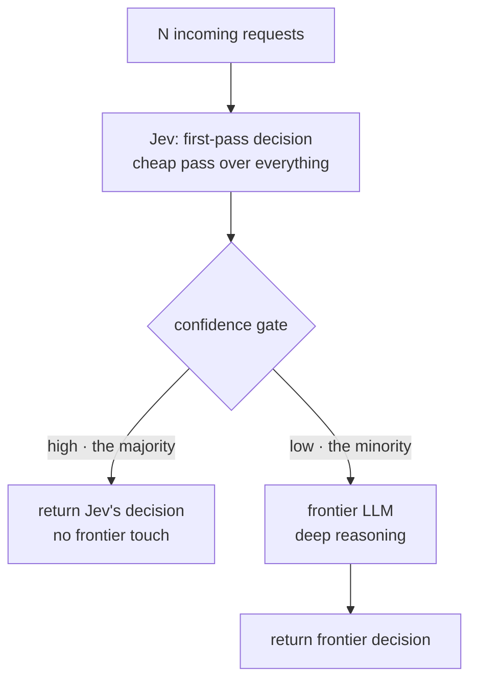

*The thin front layer absorbs most of the traffic; the thick back layer lets only a few through.*

## Why read this

If you serve LLM inference, manage its cost, or design the model routing for the Metis token factory, this post is for you. The conclusion first: most structured decisions can be handled by the cheapest model alone, and you can cut cost sharply while holding quality by escalating only the low-confidence minority to a frontier LLM. This post uses an independent benchmark's numbers to pin down where that claim holds and where it falls apart.

## Overview

A recent viral thread is worth introducing. A Stanford team paired the decision model Jev with Claude Code to sort 75 billion data points every 11 minutes. Jev runs a cheap first pass over everything, and Claude steps in only on the hard cases. Faster, cheaper, and far less compute is the pitch.

That "75 billion in 11 minutes" figure is the team's own report; we cite it as a widely circulated claim, not as something we re-measured. The important part is the **structure** behind the number, not the number itself. A cascade: filter everything with a cheap model first, then pass a small minority to an expensive one. That structure holds even without Jev, and can be built without Jev at all. Jev is just the most extreme example of it.

## What Jev is

Jev is a "System One" decision model from TypeSafe. Unlike a general-purpose LLM that emits free text, Jev returns **typed decisions**. For tasks like classification, routing, validation, and intent detection, it outputs structured verdicts: "this is spam", "grade 3", "approved".

That design maps directly onto inference cost. In the independent benchmark that ayautomate put together, Jev was compared against four LLMs on 791 labeled decisions. A few measured numbers:

- Latency: Jev's median is around 432ms; the general LLMs are around 1.4s. The vendor's "193.6x faster" is a self-test, and the independent measurement lands on a more modest ratio.
- Cost: per 1,000 documents, Jev is about $0.22, the LLMs $1.31-$3.08. Roughly 83-93% savings.
- Accuracy: on the same structured tasks, Jev is **measurably lower** than the top general LLMs. The vendor does not even claim the accuracy win.

That last item is the core of this post. Jev is fast and cheap, but it is not smart. So "run everything on Jev" would cut quality. The right answer is to run Jev over everything but escalate to the expensive model only when confidence drops.

## The confidence-gated cascade: how the pattern works

The structure is simple once drawn.



It works in three steps.

1. Run the cheap model over everything. Jev emits a typed decision for each request, plus a confidence score for that decision.
2. Split on the confidence score against a threshold. Above it, return Jev's decision as-is. Below it, pass only that request to a frontier LLM.
3. The frontier LLM does deep reasoning on the small minority and returns the result.

The decisive knob here is the **threshold**. Set it low and most requests flow to the frontier, so cost rises. Set it high and Jev pushes more wrong decisions through, so quality drops. The threshold must be set by **calibration**, how well Jev's confidence actually matches real probability. On a miscalibrated model, confidence is just "I feel sure", not a probability, and there is no basis for the threshold. That is why the vendor treats calibration as a measured metric.

In pseudocode, the whole flow is:

```python
def route(req):
    d, conf = jev.decide(req)          # typed decision + confidence
    if conf >= THRESHOLD:
        return d                        # the majority: cheap model done
    return frontier_llm.decide(req)     # the minority: expensive model
```

Three lines is the entire cascade. Two models, one confidence-based branch.

## A concrete example in Claude Code

The cascade is not limited to inference serving; it also enters developer-tool context management. fast-jev-compaction, introduced by explainx, is an experiment that replaces Claude Code's `/compact`.

The usual `/compact` summarizes a long conversation into a distilled form using a frontier LLM. It is expensive. This plugin instead has Jev score each individual tool call: "this call is no longer needed", "this one is still worth keeping in context". It then removes only the calls judged unneeded. It turns summarization, a generation task, into deletion, a structured decision. A direct use of what Jev is good at: typed judgments.

## ThakiCloud product implications

This structure is already inside two of ThakiCloud's products.

**Metis (ai-platform) lens.** Metis is the token factory, and one of its core functions is model routing. When a request arrives, it decides which model to send it to based on complexity, token volume, and cost target. A cascade is one form of that routing: a cheap model takes everything first, and only the low-confidence ones are promoted. Metis can tune the promotion threshold per workload and watches the promotion rate as an observability metric. You do not need the specific model Jev; any "cheap model good at structured decisions" sets up the same cascade. The 83-93% savings the independent benchmark reports become a number Metis applies directly to lower its inference unit cost.

**Paxis lens.** Paxis is the Agent-Native Cloud running on top of Metis. The loop where an agent calls a tool, judges the result, and decides the next action is, in essence, a cascade repeated. Paxis's cost-aware routing asks, at each step, "is this judgment good enough for a cheap model, or does it need an expensive one?" Applying the cascade to every turn of an agent loop drops the agent's total inference cost by a wide margin. Cheap serving is what makes agent economics work; that is the sentence that connects Paxis and Metis.

## Limitations and counter-arguments

The weak spot is accuracy. If Jev is lower than the top LLM, then the cascade loses quality exactly on the cases where "Jev is wrong and the frontier is not called". A low threshold raises the frontier promotion rate and shrinks the savings; a high threshold lets Jev's errors through to the user.

The second weakness is calibration. If confidence does not match real probability, there is no basis for the threshold, and the cascade degrades into "whatever Jev says goes". The third is scope. Jev is strong on **well-defined structured decisions**: classification, routing, validation. On open generation, novel reasoning, and context-heavy judgment, the cascade's gain shrinks and the frontier should take over directly. The vendor headline "run everything on Jev" reads as overreach beyond that scope.

Finally, the savings numbers this post cites combine ayautomate's independent benchmark with vendor measurements. The vendor headline ("193.6x, 444.6x") is a self-test, much larger than the independent one. On real workloads the numbers are more likely to converge toward the independent measurement than the vendor headline.

## Wrap-up

A cascade is not a feature of a specific model; it is a pattern for treating inference cost as structure. A cheap decision model runs a first pass over everything, and the frontier LLM only picks up the low-confidence minority. The 83-93% savings in the independent benchmark show how large the gain is on well-defined structured decisions.

From the ThakiCloud perspective, two things follow. Applying the cascade to Metis's model routing lowers inference unit cost, and hooking a cascade into every turn of a Paxis agent loop lowers the agent's total cost. The threshold must be set by calibration, and this structure is not a fit for open generation or context-dependent reasoning. The next experiment we would recommend is measuring the share of structured decisions in the workloads we serve. The higher that share, the bigger the cascade's gain; the lower it, the more sensible it is to just run the frontier.

## Sources

- ayautomate, "Jev vs GPT and Claude: Independent Benchmark (2026)": https://www.ayautomate.com/blog/jev-vs-llm-benchmark
- explainx, "fast-jev-compaction: a Jev-powered Claude Code compaction plugin": https://www.explainx.ai/blog/fast-jev-compaction-claude-code-plugin-2026
- explainx, "Jev speed/cost claims fact-check (2026)": https://www.explainx.ai/blog/jev-speed-cost-claims-fact-check-2026
- kiosa (@thegreatest_sv), Stanford team Jev+Claude Code thread: https://x.com/thegreatest_sv/status/2103503039579500633
