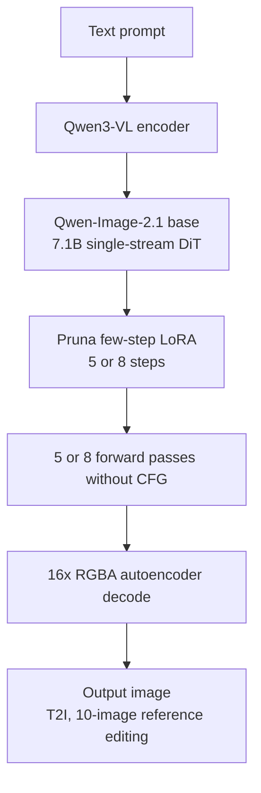

## Why You Should Read This

Engineers serving image generation models or running batch generation should read this post. The conclusion up front: when PrunaAI open-sourced few-step LoRA adapters for Qwen-Image-2.1, step count, the second lever of image serving cost, became an off-the-shelf part that touches neither the engine nor the weights, and it composes independently with engine levers such as vLLM-Omni's cross-step KV cache and CUDA Graphs, which we covered in a previous post.


*It visualizes the path by which the 50-step baseline is compressed down to 5 or 8 steps.*

## Overview

When the Qwen team released Qwen-Image-2.1 on September 20 and vLLM-Omni served it with day-0 support, diffusion serving converged on the same principles as LLM serving: exact cross-step KV reuse for block-wise causal attention, and CUDA Graphs. [A previous post](/tech-blog/en/llmops/qwen-image-2-1-vllm-omni-day0/) analyzed that engine side against our own B200 measurements.

This post covers a different axis of the same model: step count. Around September 23, PrunaAI open-sourced Pruna-Qwen-Image-2.1, a set of LoRA adapters that tunes the base model to run in 5 or 8 steps, claiming generation up to 6.3x faster without CFG (classifier-free guidance).

PrunaAI is a model-efficiency company that has built its core technology around reducing the step count of diffusion models. [A post from last year analyzing Pruna's efficiency curation](/tech-blog/en/research/prunaai-awesome-ai-efficiency-comprehensive-analysis-en/) traced their technical direction. This open-sourcing is that direction applied to Qwen-Image-2.1, the current top-tier open image model.

## What Pruna-Qwen-Image-2.1 Is

There are two adapters: a 5-step version and an 8-step version. Both are in LoRA form and are loaded on top of the Qwen-Image-2.1 base pipeline. The description posted on Civitai is precise: the base pipeline, the text encoder, and the VAE stay as they are, and only the DiT's forward passes drop to 5 or 8.

This form carries three implications.

First, it does not change the base weights. If quantization (4-bit, 8-bit) changes the "size" of the model by reducing precision, the few-step LoRA changes the computation "path" by reducing the number of passes. Given the same base model, there is room to freely combine a quantized build with a few-step build. (The actual quality interaction when combined is a separate verification target.)

Second, it removes CFG. A standard pipeline runs a conditional and an unconditional forward at each step to compute the guidance vector. Fifty steps means 100 network function evaluations (NFE). With CFG removed, there is one per step: 8 steps means 8 NFE, 5 steps means 5 NFE. In NFE terms the theoretical maximum is roughly 12.5x (8 steps) or 20x (5 steps). Pruna's headline, "up to 6.3x," is more conservative than the NFE arithmetic because the wall clock also includes VAE decoding, the text encoder, and non-uniform per-step costs. The 6.3x matches 50/8 = 6.25, which suggests the headline is measured on a step-count basis rather than NFE.

Third, it applies to both T2I and image editing. Qwen-Image-2.1's 10-image reference editing also runs in few-step. That the editing workflow shares the same acceleration as T2I matters practically in pipelines where batch generation and iterative editing are mixed.



## How to Use It

This is the diffusers path. Load the base pipeline, mount the Pruna adapter, set the steps to 5 or 8, and turn guidance off.

```python
from diffusers import QwenImagePipeline

pipe = QwenImagePipeline.from_pretrained("Qwen/Qwen-Image-2.1", torch_dtype=torch.bfloat16)
pipe.load_lora_weights("PrunaAI/Pruna-Qwen-Image-2.1")
pipe.to("cuda")

# 8 steps, CFG disabled (true_cfg_scale=1.0)
image = pipe(
    prompt="a photo of a red panda in a snowy forest",
    num_inference_steps=8,
    true_cfg_scale=1.0,
    lora_scale=1.0,
).images[0]
```

Per the model card's usage section, it behaves identically in inference providers such as ComfyUI. The ComfyUI wiki documents the Pruna 5-step and 8-step LoRA integration on September 23, covering multi-reference editing as well. Pruna's hosted API (docs.api.pruna.ai) serves the same adapter and supports custom LoRA loading, prompt enhancement, and negative prompts.

Where to start, 5 steps or 8, is decided by the workload. In workflows where reference editing (10 images) carries the quality, even 5 steps keeps a relatively thick safety margin. In pure T2I, where quality is carried by the base prompt alone, 8 steps is the conservative starting point. Pruna published both versions so that users can pick the trade-off at the workload level.

We did not perform our own re-measurement in this post. The 6.3x figure is Pruna's claim, and our re-measurement on a B200 basis will be a separate experiment.

## ThakiCloud Product Implications

**ai-platform lens.** ThakiCloud's image generation pipeline runs on B200. Z-Image-Turbo measures at 18.2 seconds per image, the Qwen-Image family sits in the registry, and character generation and batch image work run continuously. What a few-step LoRA means for this pipeline is the following.

Cost scales with NFE. In batch generation (4-8 images per call), cutting the steps from 50 to 8 brings the DiT pass cost down to 1/6.25 in theory. VAE decoding and the text encoder are fixed costs, so the overall wall-clock reduction lands lower than that, but it approaches the ratio in large batches where the DiT dominates.

The low adoption cost is what matters. There is no engine change. Whether you serve with vLLM-Omni or run diffusers, you do not re-pull base weights or alter the serving spec; loading a single LoRA file is all it takes. This is a clean separation from the cross-step KV cache lever in the previous post. The KV cache reuses computation between steps within the same generation, while the few-step LoRA reduces the number of steps of the generation itself. The engine lever acts on per-call cost and the step lever on pass count, so using them together multiplies the effect.

The larger the batch, the heavier this lever becomes. In a batch of 4-8 images per call, cutting steps from 50 to 8 drops the DiT pass cost by 1/6.25 per image in theory. VAE decoding and the text encoder are fixed, so the overall reduction is smaller, but as batch size grows the DiT share rises and the realized savings approach the theoretical ratio. In an environment with a measured 18.2 seconds per image on Z-Image-Turbo, stacking a few-step adapter onto the Qwen-Image family is a path to a lower time bracket without changing the engine.

A quality gate comes first. Under ThakiCloud's training-data quality discipline, in a pipeline that feeds generated images back as training input, the quality of few-step output must be validated for "usability," not "consistency." Without measuring the quality gap between 5 steps and 8 steps, the conservative placement is to keep 8 steps as the default and apply 5 steps only to high-resolution, long-running batches.

The license needs verification. Whether the Pruna adapters carry the same license as the base model (an Apache-2.0 family) and are usable in commercial services is a question the model card has to answer.

**Paxis lens.** Where a few-step LoRA reaches agent workflows is "cost prediction." An agent on Paxis that calls an image generation tool will budget tokens and plan execution differently if it knows the cost and time per call. At 8 steps, generation moves below the Z-Image time bracket, which opens up workflows where an agent generates more candidates in one pass and selects from them.

## Limitations and Counterarguments

The "up to" trap. The 6.3x matches the 50/8 step-count ratio. The model card does not show a measured wall-clock speedup for the 5-step version, and the gap between the NFE arithmetic (20x) and the headline (6.3x) is entirely attributable to Pruna's measurement basis. So our own re-measurement should record wall-clock time, with the DiT pass time and the fixed VAE/encoder time kept separate. Only then can we tell whether "6.3x" holds on our hardware, or whether it lands around 3x in environments where the VAE share is large.

The price of removing CFG. Losing the negative prompt means rigidity in style control: you must steer "not this feel, but that feel" with the prompt alone. In workflows where reference editing (10 images) carries the quality, this constraint is small; in pure T2I it needs measured verification.

Base dependency. If Qwen-Image-2.1 moves to a 2.2, this adapter becomes a re-distillation target. A few-step LoRA is a part tuned to the current base, and it is invalidated the moment the base moves.

Pruna's commercial model. The open-sourced adapter is simultaneously provided as a hosted API, which suggests the adapter is itself the funnel for the commercial service. The open-source choice holds only if self-serving wins the cost comparison against the Pruna API.

LoRA stacking. The interaction of stacking a style LoRA, a subject LoRA, and the few-step LoRA is unverified. They act on the same DiT weights, so stacking order and scale can affect quality.

## Takeaways

If you serve Qwen-Image-2.1 or run batch generation, there is something to try right now. Load the 8-step adapter and run an A/B against your existing 50-step baseline with the same prompt set. Measure the wall clock, look at the quality with your own eyes, and only then widen out to 5 steps. That is the order.

If you are designing an agent platform, reflect that step count is now a first-order variable in the cost model. Keep the NFE-proportional DiT cost, the fixed VAE and encoder costs, and the effect of CFG presence on per-step cost separated in your model.

ThakiCloud's next two experiments are our own B200 re-measurement of the 8-step and 5-step adapters, and their combined effect with vLLM-Omni's cross-step KV cache. The two are independent levers, so whether the composed synergy is positive must be settled by measurement.

One line to close: the step-count lever is now an off-the-shelf part, and what remains is measuring how far to cut.

## Sources

- [PrunaAI/Pruna-Qwen-Image-2.1 (Hugging Face model card)](https://huggingface.co/PrunaAI/Pruna-Qwen-Image-2.1)
- [QwenLM/Qwen-Image-2.1 (GitHub)](https://github.com/QwenLM/Qwen-Image-2.1)
- [Civitai: Pruna Qwen Image 2.1](https://civitai.com/models/2962344/turbo-few-step-lora-adapters-pruna-qwen-image-21)
- [ComfyUI Wiki: Pruna 5-Step and 8-Step Qwen-Image 2.1 LoRAs](https://comfyui-wiki.com/en/news/2026-09-23-pruna-qwen-image-2-1)
- [Pruna AI announcement (LinkedIn)](https://www.linkedin.com/posts/pruna-ai_today-we-open-source-pruna-qwen-image-21-activity-7508918316690972672-A3tz)
- [Pruna API documentation: Qwen-Image](https://docs.api.pruna.ai/guides/models/qwen-image)
- [Previous post: vLLM-Omni's day-0 support for Qwen-Image-2.1](/tech-blog/en/llmops/qwen-image-2-1-vllm-omni-day0/)
- [Previous post: PrunaAI efficiency curation analysis](/tech-blog/en/research/prunaai-awesome-ai-efficiency-comprehensive-analysis-en/)
