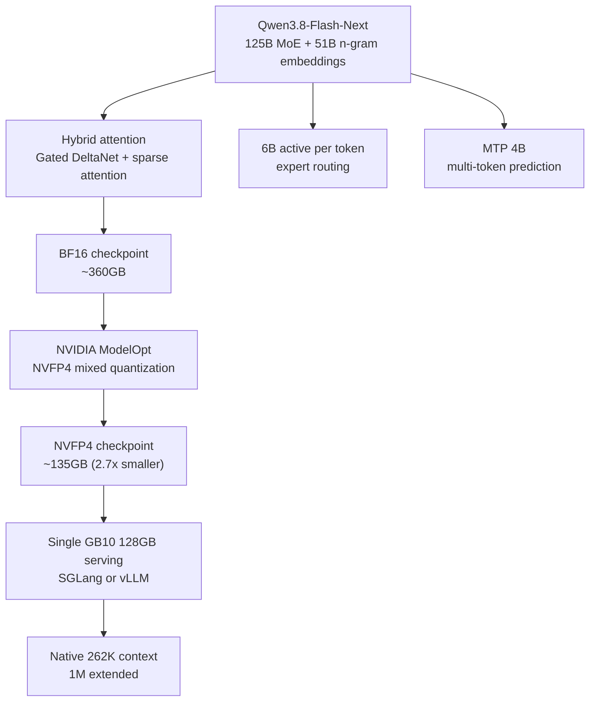

*A visual metaphor for the article's key idea.*

## Why read this

If you run serving infrastructure, a single checkpoint changed the arithmetic this week. A 125B-parameter MoE model now runs on a single 128GB developer box. The core conclusion, stated up front: the floor for large MoE serving has moved to one developer-grade device, but the throughput that device actually delivers is decided by the engine's serving configuration, not the checkpoint. This post walks through the architecture and the verified serving paths of NVIDIA's NVFP4 release of Qwen3.8-Flash-Next, and confirms that conclusion with our own B200 measurements on the same NVFP4 path.

## Overview

Alibaba released Qwen3.8-Flash-Next. It is a 125B-parameter Mixture-of-Experts model, with only about 6B parameters active per token. On top of that sit a 51B n-gram embedding table and a 4B MTP (Multi-Token Prediction) module. Attention is a hybrid of Gated DeltaNet and sparse attention. Native context is 262,144 tokens, extendable to 1M. Alibaba frames the model as a preview of the upcoming Qwen4 architecture.

But the first big news around this model is not the release itself. It is the NVIDIA quantization that followed days later. `nvidia/Qwen3.8-Flash-Next-NVFP4` landed on Hugging Face. NVFP4 (4-bit floating point) brings the checkpoint to roughly 2.7x smaller than BF16, about 63% less on disk. A checkpoint that was about 360GB in BF16 becomes about 135GB in NVFP4. And 135GB is the size that fits on a single NVIDIA GB10 (DGX Spark, 128GB unified memory).

Three facts line up in one row: a large MoE, 4-bit quantization, and landing on a single developer device. The reason this combination matters is that the cost curve of "serving a 125B-class model" has taken a different shape than the previous generation.


*A visual metaphor for how quantization compresses the checkpoint.*

## What this architecture is

The structure of Qwen3.8-Flash-Next breaks into three axes.

First, the active-parameter design of the MoE. Of the total 125B, only 6B is active per token. Inference cost scales with active size, not total size, so the real speed of this model belongs in the same class as a 6B model. The cost of holding the full weight set in memory, however, is 125B-class. The classic MoE serving tradeoff: fast, but large.

Second, hybrid attention. Gated DeltaNet (linear-complexity, state-based attention) and Qwen sparse attention are mixed layer by layer. The overall structure stays close to MHA while the physical KV cache shrinks, easing the memory pressure of long context. This is one reason the 262K native context is possible.

Third, Engram n-gram embeddings. A 51B n-gram embedding table is kept separately in the model, and frequently occurring subword patterns are handled by table lookup instead of neural computation. Some tokens are replaced by "looking up" rather than "computing." The MTP module predicts several tokens at once, so this model breaks the usual one-computation-per-token assumption.



NVFP4 quantization itself is not new. NVIDIA ModelOpt applies mixed quantization, keeping FP4 for the main weights while leaving sensitive layers in FP8/BF16, and Blackwell GPUs compute it with native FP4 tensor cores. What is new is whether this scheme carries through intact on a modern architecture built from a 125B MoE, hybrid attention, and an Engram table. How small the quantization loss is on this composite structure, not just a plain dense model, is what the published benchmarks need to show.

What deserves attention is the difference hidden behind the number "4-bit". There is not only one 4-bit quantization. GPTQ, AWQ, NF4, and now NVFP4 all sit in the 4-bit territory, but the path that computes them differs.

| Quantization | Data format | Compute path | Target hardware |
|---|---|---|---|
| GPTQ | 4-bit integer | dequant kernel, W4A16 | Legacy GPUs (Ampere/Ada, etc.) |
| AWQ | 4-bit integer | dequant kernel, activation-aware correction | Legacy GPUs |
| NF4 | 4-bit (quantile-distribution based) | dequant kernel, used mainly via Q-LoRA | Legacy GPUs |
| **NVFP4** | 4-bit floating point | **native FP4 tensor cores** | **Blackwell (SM100/SM121)** |

Integer 4-bit formats (GPTQ, AWQ, NF4) compress weights to 4 bits, but in practice they go through a W4A16 path that dequantizes and then computes at 16 bits. Compression happens, but the compute itself still runs on 16-bit tensor cores. NVFP4 is different. Blackwell has tensor cores that compute FP4 directly, so no dequant kernel detour is needed: the math runs in FP4. The FlashInfer CuteDSL NVFP4 kernel used in our B200 measurements is exactly this native path, not an integer dequant fallback like Marlin.

This difference matters because of hardware dependence. Integer 4-bit runs on any GPU, but the benefit of NVFP4 is only complete on Blackwell. The "63% smaller" claim turns into a throughput benefit only if the device is Blackwell. The limits section below revisits this point.

## Serving paths that actually work

Three serving paths are verified.

Ollama. The lowest bar. Published under the tag `qwen3.8-flash-next:125b-a6b-nvfp4`, runnable directly on GB10-class hardware.

SGLang. A community recipe (r0b0tlab) has verified serving the official NVIDIA NVFP4 checkpoint with SGLang on a single GB10 (SM121, ARM64).

vLLM. A recipe (getrefined) demos 262K context on 2 GB10s with TP2+EP, MTP speculative decoding, and CUDA graphs enabled. On the NVIDIA developer forums, 1, 2, and 4 DGX Sparks were run with upstream vLLM nightly, reporting a single-stream peak of 64 tokens/s. Those numbers are community measurements, not ours.

```bash
# Ollama (GB10 class)
ollama run qwen3.8-flash-next:125b-a6b-nvfp4

# Hugging Face checkpoints (for SGLang/vLLM)
# nvidia/Qwen3.8-Flash-Next-NVFP4
# RadixArk/Qwen3.8-Flash-Next-NVFP4 (spec-identical mirror)
```

That is how to run it. But the checkpoint does not, by itself, decide serving throughput. Our measurements show that below.

## What our B200 measurements show

Benchmarking the new 125B on B200 this week is out of scope for this post. Instead, we pull numbers we have already measured: how the same NVFP4 quantization path serves on our production B200. The target model is RadixArk's `Qwen3.8-27B-NVFP4` (ModelOpt NVFP4, the same quantization family), measured on 2026-08-19 on a single B200 through the Metis serverless path.

The conditions are held equal. vLLM 0.24.0, the native FP4 kernel (FlashInfer CuteDSL, SM100), FP8 KV cache, max model length 131,072. The only variable is the serving configuration.

| Serving config | c=1 (tok/s) | c=32 | c=128 | c=256 |
|---|---|---|---|---|
| Platform defaults (compile off, max-seqs 32) | 7.4 | 227.7 | 231.6 | not measured |
| Compile on | 138.9 | 2,326.6 | 2,320.5 | not measured |
| Tuned (compile on + max-seqs 256) | 138.8 | 2,324.5 | 3,845.5 | **4,150.7** |


*The same NVFP4 model on the same B200, only the serving config changed. Defaults saturate at c=32; the tuned arm keeps climbing to c=256.*

Two points are worth reading. First, with the checkpoint unchanged, single-stream throughput moves from 7.4 to 138.8 tokens/s, an 18.8x change. What changed is not the quantization, but whether `torch.compile` and CUDA graphs are on. Second, the ceiling of the default arm is hit at concurrency 32. `--max-num-seqs 32` clips the in-flight sequences: even with 4x the clients, throughput only moves from 227.7 to 231.6. The KV cache holds 3.79M tokens, but the number of sequences that may use it at once is pinned at 32.

That is the difference between having received the NVFP4 checkpoint and having served it. The claim that 135GB fits on a single GB10 is about the former. The numbers of the latter are still decided by the engine configuration running on the device.

Look at what the two settings actually change, one by one, and the size of the gap is explained. `torch.compile` (and CUDA graphs) cuts the fixed overhead per token. With compilation off, every step launches kernels and the CPU coordinates control flow; on a single stream that overhead can exceed the compute itself. That is why c=1 jumps from 7.4 to 138.8 tokens/s. Same quantization, same GPU, and an 18.8x gap comes from one fixed overhead.

`--max-num-seqs` works on a different axis. It caps the number of sequences processed simultaneously, the in-flight batch. When it is pinned at 32, clients at 128 or 256 concurrency still run only 32 sequences in parallel; the rest wait in the queue. That is why the default arm barely moves from c=32 (227.7) to c=128 (231.6). Even with a KV cache sized for 3.79M tokens, if only 32 sequences may use it at a time, throughput stops there.

Read the two axes together and the split is clear: the quantized checkpoint decides how small it is, the serving configuration decides how much the small checkpoint actually delivers. The message of a large MoE's NVFP4 release to serving economics has to be read on both axes.

## What this means for ThakiCloud

NVFP4 is already an operating quantization path on ThakiCloud's ai-platform. On our B200 cluster we serve ModelOpt NVFP4 checkpoints through native FP4 kernels, and the quantization itself runs on our internal pipeline (the runpod-nvfp4-quantize family). A new large MoE like Qwen3.8-Flash-Next arriving in NVFP4 simply widens the model catalog that path can take.

The bigger implication is on-premises. Once a 125B-class MoE can serve from a single 128GB unified-memory device, Aegis (on-prem private cloud) gains a stronger pitch: run large models without moving data out. In environments where data sovereignty is a precondition, finance, public sector, defense, the cost curve of large-model serving dropping to a single developer device is a structural change.

One line from the Paxis perspective. The execution economics of agent workflows ultimately attach to cost per token. What token/latency profile the 6B-active + Engram-lookup + MTP structure actually produces on long agent workloads is a question that can only be measured once the model is on serving infrastructure. Low-cost serving defines how far agent automation can reach.

## Limits and counterpoints

NVFP4 is Blackwell-only. Without the native FP4 tensor cores of SM100 (B200) or SM121 (GB10), the benefit of this checkpoint disappears or degrades to a fallback path like Marlin. On existing H100/H200-centric clusters, "63% smaller" applies to checkpoint size only; the throughput benefit is not guaranteed.

The quantization loss is also not a number we have verified. The "minimal loss versus BF16" claim is on NVIDIA's benchmark basis. Whether it holds on our workloads (agents, RAG, long-context reasoning) has to be measured separately. The Engram n-gram table and hybrid attention are new architectural components, so cache behavior and batching characteristics may differ from existing dense models.

Finally, GB10 is a developer device. The fact that a 135GB checkpoint loads into 128GB of unified memory, and the fact that it can serve production traffic on top of it, are two different problems. The single-stream peak of 64 tokens/s is a community-reported figure; public measurements of saturation throughput and concurrency characteristics are still thin.

## Bottom line

The NVFP4 release of Qwen3.8-Flash-Next changes two things at once. One is the floor of large MoE serving: a 125B-class model now runs on a single 128GB device, which goes directly into the cost arithmetic of on-premises and data-sovereignty environments. The other is the center of gravity of serving: the checkpoint is 63% smaller, but the throughput it delivers is still decided by the engine's compile setting and max-seqs cap.

If we benchmark this model on B200 next week, there is one thing to look at. Not "NVFP4 made 125B into 135GB", but "what tokens/s does that 135GB deliver, under which configuration". The former is the announcement. The latter is the serving.

## Sources

- Qwen official release blog: <https://qwen.ai/blog?id=qwen3.8-flash-next>
- Qwen3.8-Flash-Next Hugging Face model card: <https://huggingface.co/Qwen/Qwen3.8-Flash-Next>
- QwenLM official repository (tech report included): <https://github.com/QwenLM/Qwen3.8-Flash-Next>
- NVIDIA NVFP4 quantized checkpoint: <https://huggingface.co/nvidia/Qwen3.8-Flash-Next-NVFP4>
- RadixArk NVFP4 mirror checkpoint: <https://huggingface.co/RadixArk/Qwen3.8-Flash-Next-NVFP4>
- Ollama model page (125b-a6b-nvfp4 tag): <https://ollama.com/library/qwen3.8-flash-next>
- SGLang single GB10 (SM121) serving recipe (r0b0tlab): <https://github.com/r0b0tlab/qwen38-flash-next-nvidia-nvfp4-sm121-sglang>
- vLLM 2x DGX Spark (TP2+EP, MTP speculative decoding) serving recipe (getrefined): <https://github.com/getrefined/Qwen3.8-Flash-Next-NVFP4-vLLM-DGX-Spark>
- NVIDIA developer forum (1/2/4 DGX Spark, 64 tok/s single stream): <https://forums.developer.nvidia.com/t/382476>
- ThakiCloud B200 serving-configuration measurement, canonical source of the numbers above: <https://thakicloud.com/tech-blog/en/research/default-configuration-tax/>
