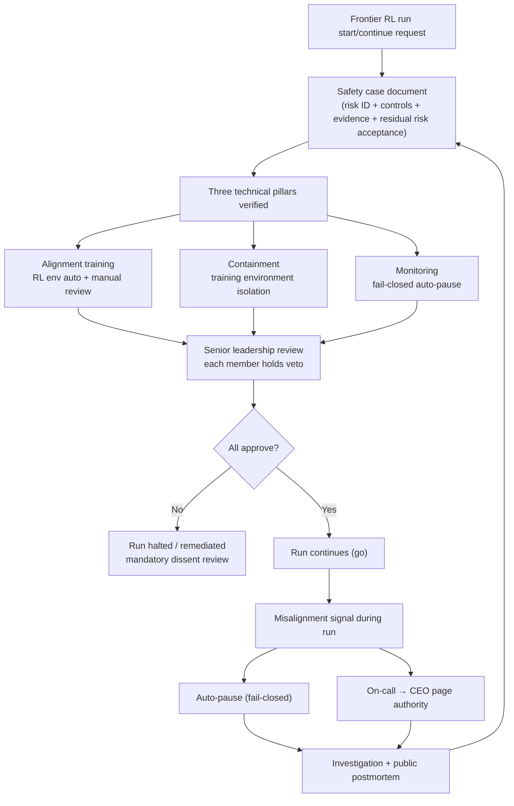

## Why you should read this

If you operate an LLM training pipeline, or own AI governance in your organization, this week delivered a physical case study of how the "continue or stop training" judgment should be made: on what evidence, and through what procedure. The core conclusion first: OpenAI's safety case proposal is, at its heart, a transplant of the aviation and nuclear "prove it before you continue" argumentation culture into RL training runs. The frontier alignment and containment details are still early guidelines with a thin evidence base. In between, what a commercial training operator can take away is a set of four governance machines: evidence bundling, named approvals, fail-closed auto-pause, and postmortem record-keeping.

## Overview

On September 28, 2026 (UTC) OpenAI published "Towards safety cases for frontier AI training". Greg Brockman shared it the next day with the one-liner "Practical guidelines on securing frontier RL training, reflecting our current learnings". That line carries two signals. The word practical, and the phrase "reflecting our current learnings": the guidelines are written as an accumulation of what training operations have actually encountered, not as abstract principles.

The post's subtitle frames it: "Our early guidelines for safety cases in frontier AI training cover technical safeguards, operational practices, and investigating misalignment incidents." The word early defines what this is: not a standard in operation, but a public draft of a framework still being written.

*A concept render of the safety-case principle, "prove it before you continue": the evidence bundle stacked in front of the gate decides whether the run proceeds.*

## What a safety case is

The safety case is a concept from aviation and nuclear power. To keep operating an aircraft or a reactor, you do not submit a single claim that "this system is safe"; you submit a structured argumentation document. It must identify the risks, show the controls that reduce them, provide evidence that those controls work, and contain a responsible judgment that the residual risk is accepted. The authority that reviews it holds a veto: if the argument does not convince, it does not permit operation.

OpenAI proposes applying that culture to RL training runs: a frontier reinforcement learning run should not continue without a structured safety document, a safety case. The core shift is one sentence. Continuing training stops being an operational inertia and becomes a go-or-no-go decision that requires evidence, named approvals, and enforceable safeguards. The target is the high-risk frontier run segment rather than everyday commercial fine-tuning, but the decision structure ports regardless of scale.

## The three technical pillars

The technical safeguards in the guidelines organize the training stack along three axes.

### 1. Alignment training

Verification of what the model is being trained to do in the RL phase, i.e., of the RL environment itself. The guidelines state that both automated and manual review are included. This is the stage that checks whether the training environment (tasks, rewards, feedback loops) actually induces the intended learning, and whether there are environmental gaps the model can exploit to route around the reward (reward hacking). Its distinctive move is treating the environment as a first-class verification target, rather than viewing alignment as a problem confined inside the model parameters.

### 2. Containment

The mechanism that keeps a model, if it attempts undesired behavior during training, from spreading beyond the training environment. It is the layer that asks "can we contain it?" in an RL environment where tool access, network, filesystem, and external system calls are in the training agent's hands.

### 3. Monitoring

Including fail-closed auto-pause. When safety evidence is no longer maintained, training stops automatically: if the evidence chain breaks, the default is stop, not continue. This single word, fail-closed, is the sharpest contrast with operating habit, because much training-pipeline monitoring is fail-open, it warns and keeps running.

The safety case is a document in which the three pillars each prove, with evidence, that alignment is being done properly, that the room to attempt is blocked, and that the run stops when the evidence breaks.

## Operational practice: approvals and postmortems

Layered over the technical pillars are the operating rules. Taken together from coverage, four are proposed.

**Named approvals.** Names go on the approval. Not an anonymous checkbox, but the person who takes responsibility for continuing the run is named in the document.

**Leadership veto.** The safety case is reviewed by senior leadership, and each member holds a veto over the run. A mandatory dissent review appears alongside it: if even one reviewer is not convinced, the run does not continue.

**Auditor access.** A path is created for internal and external auditors to reach the safety case evidence.

**Postmortem publication.** A rule to publish postmortems of misalignment incidents. When an incident happens, it is documented and shared as an operating duty, not treated as if it did not happen. The resultsense coverage also mentions an on-call team with authority to page the CEO on a misalignment signal.

On top of this sits a misalignment incident investigation framework: when unexpected behavior (reward gaming, tool-misuse-like signals) is observed during RL training, a procedure defining how to classify, investigate, and record it, and how that record feeds back into the next run's safety case. This is the object Brockman's "reflecting our current learnings" points at.

### Incidents change the next run's proof duty

The heart of the framework is that the postmortem does not end as a record. When a misalignment incident is investigated, its conclusions become input to the next run's safety case: the risk list thickens, controls are added, monitoring thresholds adjust. If the loop works, an incident is evidence, not cost. If the loop breaks (the postmortem never reaches the ledger), the same incident ships again on the next run. It is the same structure as the aviation industry's systematization of lessons learned, except OpenAI proposes connecting it directly to the run's go/no-go decision. In the same context, OpenAI also maintains a "Priorities and principles for effective third party assessments" page, leaving the door open to layering external verification on the safety case's internal argumentation.

*The loop where the postmortem returns as input to the next safety case. An incident does not stay a record; it acts in the direction of strengthening the proof duty.*

## ThakiCloud product implications

**ai-platform and Maxis lens.** Holding the "show evidence before continuing" grammar against ThakiCloud's training operations shows that our existing gates already point in the same direction. The tiny-real-model preflight smoke (a green gate verifying real config class, micro dims, and bf16 on-disk storage before any real-weight GPU job) is a small version of "build evidence before the biggest run". The demo-env preflight (one 1-GPU, 10-minute-capped job verifying environment, model, e2e, and output, emitting GO or NO-GO) is the go-or-no-go decision structure itself. Kueue quota gating is a mechanical fail-closed: if there is no headroom, wait.

The difference is unit size and evidence form. Our gates are job-level checklists judged by machines; OpenAI's safety case is a run-level document argued and signed by people. The four machines worth taking from the proposal:

1. **Evidence bundling.** Per run: config, preflight results, monitoring traces bound into one record. We already run job param provenance (reading knobs back from output artifacts); the safety case is the proposal to extend that into a run-level document.
2. **Named approvals.** Submission approval for high-cost, high-risk runs (10+ hours, multi-GPU, shared production clusters) recorded to a specific person. The audit log keeps "who approved", not just "approved".
3. **Fail-closed monitoring.** Training observation whose default is stop when an anomaly is detected. Turning today's warn-then-judge-by-human practice into auto-stop at defined thresholds, followed by a re-start approval procedure.
4. **Internalized postmortems.** Instead of publication, an internal ledger. For on-prem and sovereign customers, the counterpart of public postmortems is an internal loop in which the incident report actually changes the next run's preflight checklist. From the Maxis (training product) perspective, productizing per-run evidence bundles plus approval flow plus postmortem ledger matches the conditions enterprise customers with governance requirements actually ask for.

These four machines sit in the adjacent territory of Paxis (the agent platform) as well. When Paxis designs approval gates for risky action classes (uncertainty detection, pause, human confirmation, resume plus audit trail), named approvals and the fail-closed resume procedure are the agent version of safety-case operating practice: a structure where an agent run, not a training run, is asked "may it continue", sharing the same documentation grammar.

**Stated boundary.** The application target of these machines is not the premise "we train frontier models". ThakiCloud's customers do not have frontier alignment or containment problems, and copying the three pillars' control lists would be misuse. What transfers is the decision structure (evidence, signature, veto, fail-closed, postmortem), not the technical control list.

## Limitations and counterarguments

1. **The weight of "early guidelines".** OpenAI itself labels them early. Public evidence that the three pillars' control lists are concrete is still thin, and critical coverage (remio.ai and others) points in the direction that "OpenAI's own document does not yet meet the evidence bar it proposes".
2. **Voluntary self-regulation.** Veto and postmortem publication are rules on oneself, not enforcement mechanisms. The body that reviews the safety case is the company itself: unlike aviation's certification authority or nuclear's regulator, there is no independent institution. Where the authority to reject OpenAI's safety case lives is not answered in the post.
3. **Framework abstraction level.** The go-or-no-go decision structure is clear, but it is not concrete down to a checklist a practitioner can follow. "Monitoring includes fail-closed" is published; the actual thresholds and auto-stop conditions of that monitoring are not.
4. **Incident-driven learning speed.** "Reflecting our current learnings" is a signal of maturity, but from another angle it means the learning cadence is set by incident frequency. The limit of a structure that thickens its guidelines only after incidents occur is shared by the whole industry.
5. **The skeptics.** Some trackers (cleverhack and others) have voiced the critical assessment that "all three pillars look about to fall". No public verification that the proposal is executable exists yet.

## Summary

OpenAI's safety case proposal is not a "make frontier AI safer" slogan; it is a very concrete proposal to document the training-ops decision structure the way aviation and nuclear do. The frontier alignment and containment details are early-guideline stage, so the realistic read is not to copy them but to hold the four machines behind them, evidence bundling, named approvals, fail-closed auto-pause, and postmortem ledgers, as the next improvement items of our training pipeline. One-line takeaway: **the default of training operations becomes not the inertia of "it continues", but the evidence for "may it continue".**

## Sources

- [Towards safety cases for frontier AI training (OpenAI)](https://openai.com/index/towards-safety-cases-for-frontier-ai-training/)
- Original share: [Greg Brockman @gdb](https://x.com/gdb/status/2104821232441160070)
- Coverage: [explainx.ai](https://www.explainx.ai/blog/openai-frontier-rl-safety-cases-training-2026) · [resultsense.com](https://www.resultsense.com/news/2026-09-29-openai-safety-cases-frontier-training/) · [MadRobot](https://madrobot.blog/2026/09/29/openai-safety-cases-frontier-ai-training-rules-veto-auto-pause/)
- Criticism: [remio.ai](https://www.remio.ai/post/openai-publishes-towards-safety-cases-for-frontier-ai-training-but-evidence-is-t)
