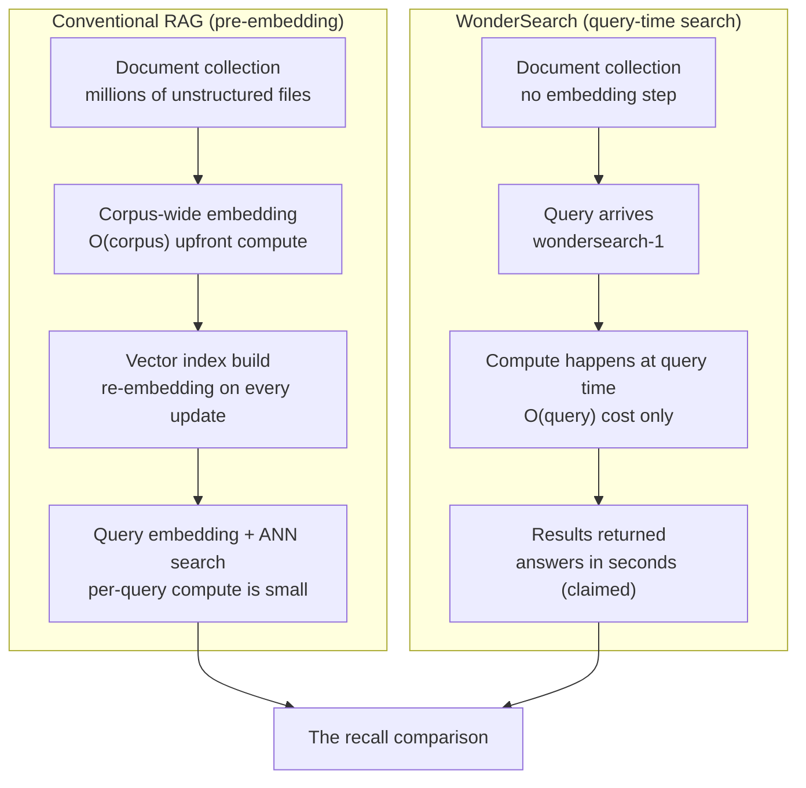

## Who Should Read This

If you design RAG pipelines or own the cost of your search infrastructure, this week forces one more pass at a question you already asked: do you embed the whole corpus, or do you compute when the query arrives? The core conclusion up front: WonderSearch is a product that moves RAG ingestion cost from an O(corpus) upfront spend to an O(query) spend, and its "comparable or better recall" claim is, as of writing, a claim awaiting verification rather than a measured number. This post separates what was actually announced, what follows from the cost structure, and how a platform like ours should read the shift.

## Overview

Polygres is a managed PostgreSQL service that layers graph traversal, vector similarity, full-text search, and hybrid retrieval on top of Postgres. Its parent Evokoa publishes pgGraph (graph) and pgContext (AI search) as open source, and the company has grown on a Y Combinator F26 batch and Founders Inc backing. The founders are Dalton Prescott Ng (CEO), Damien Lim (CTO), and Dale Everett Ng (COO).

At the end of September 2026, the company launched WonderSearch. The one-liner from Dale Everett's launch post is the whole product: "Search millions of unstructured documents without pre-embedding the corpus," with comparable or better retrieval recall than embedding-based search. The launch bullets are four: no corpus-wide embedding step, no vector index to maintain, more compute only when needed, and pay per search instead of for embeddings you may never use. Per the FAQ replies, the model doing the searching is called wondersearch-1, and the pitch line is "from raw data to useful answers in seconds."

*A concept piece: light (the query) finding and ordering the part of a document mountain that matters.*

## What WonderSearch Is

Polygres' overall positioning is "make the Postgres you already use into a context window for AI." No separate vector database or dedicated search cluster; graph, text, and hybrid retrieval all live on the existing relational DB. WonderSearch reads as that same axis extended to unstructured document search.

WonderSearch ships as a standalone search service. The official domain wondersearch.ai connects directly to an app console (app.wondersearch.ai). Where Polygres' existing pgContext AI Search centered on structured Postgres tables, WonderSearch targets the unstructured documents themselves: PDFs, document files, web pages stored as a raw corpus, searchable without pre-embedding.

The disclosed scope has edges. English only, for now. Text only. Text PDFs work; scanned or image PDFs do not yet. Multimodal search, multilingual support, and database connectors are marked "coming," and a WonderSearch-specific price list has not been published. The FAQ's "Preview pricing may change" reads as: the product, including its pricing model, is not finished.

Polygres proper has published pricing. The free Nano tier gives 500 MiB of storage, 100k AI Context vectors, and 100k graph units; Basic starts at $16/month plus $2 per GiB of storage, $3 per 100k vectors, and $1 per 100k graph units. Enterprise is quote-based.

## How the Cost Model Flips

A conventional RAG pipeline splits into three stages: document collection, corpus-wide embedding, and vector index construction. Two of those stages finish before a single query arrives. Embedding a million documents means one full pass of compute over the corpus, plus storage for the resulting vectors. When documents change, the changed sections must be re-embedded; when the embedding model changes, the entire corpus must be re-embedded.

In that structure, cost is paid proportional to corpus size, independent of query volume. In real operation, most corpora are not read evenly. Enterprise document sets tend to have a small number of documents queried repeatedly and a large majority never touched. Pre-embedding is a prepayment for "documents nobody will ever read."

WonderSearch flips the point where cost lands. The launch bullet "pay per search instead of embeddings you may never use" is a design statement moving cost from O(corpus) to O(query). Keep the corpus in raw form and let computation happen only when a query arrives, and the upfront embedding spend disappears, along with the re-embedding maintenance that model upgrades and corpus churn would otherwise create.

*Left: the corpus is fully embedded before any query. Right: computation is deferred to query time.*

The difference in where cost lands, in one table:

| Item | Pre-embedding RAG | WonderSearch (launch claim) |
|---|---|---|
| Ingestion cost | O(corpus), upfront | None |
| Update cost | Re-embed changed sections | Raw text replacement (mechanism undisclosed) |
| Query cost | Embedding + ANN | Query-time compute |
| Billing | Infra fixed-cost centric | Per search (preview) |
| Recall | Pure vector baseline | "Comparable or better" (no published numbers) |

Note how many rows in that table carry no number. That is the current state of the product.

Put in concrete terms, the gap is easier to feel. The following is a simple illustration with a typical embedding API price, not a figure from the launch material. A million documents at 500 tokens each is 500 million input tokens. At $0.02 per input token, one full corpus pass costs $10,000 [estimate]. If the corpus refreshes monthly, that spend recurs monthly; if the embedding model is upgraded, the 500 million tokens are bought again from scratch. A query-time model removes the upfront spend, but moves computation onto every query over the raw corpus. Which side is cheaper depends on the corpus churn rate and the query distribution.

## What "No Vector Index" Might Mean

The question to ask is what "no vector index to maintain" technically implies. The public materials do not state the mechanism. Two possibilities remain open.

The first: embeddings on the query side only. Documents stay raw; when a query arrives, the query is embedded or transformed, and scoring runs over the raw corpus. "No vector index" then means no index dataset to maintain, and per-query compute grows.

The second: no embeddings at all. This fits the hybrid structure pgContext has published (semantic similarity, text signals, graph relationships combined). Layering graph context and BM25-style text signals on top of a raw corpus could beat pure vector retrieval exactly where vectors are weak: entities, identifiers, exact matches. Hybrid retrieval beating pure vector recall is a well-known result in the RAG literature.

Either way, "comparable or better recall" is a testable claim, and it currently exists only as a mention of "early internal benchmarks." The one place published benchmark numbers exist is pgContext, not WonderSearch. The GloVe 1.18M-word corpus benchmark on Polygres' home page shows Recall@10 median of 91% at 2.44 ms versus pgvector's 75% at 2.56 ms. That is evidence the same team's hybrid engine can beat a vector-only extension on both accuracy and speed, but it is not a measurement of wondersearch-1.

The Show HN entry "Instant GraphRAG over any Postgres database" is the same story in a different layer: virtualizing a GraphRAG layer over any Postgres, with an in-memory graph compressed roughly 30-34x. That is the company's GraphRAG technology, not a document tied directly to the WonderSearch launch.

## What This Means for ThakiCloud

ThakiCloud's ai-platform runs customer RAG and search workloads on Kubernetes. The cost model WonderSearch proposes raises two questions for platform operations.

The first is GPU cost allocation for ingestion batches. Corpus-wide embedding is a typical batch workload: one large job on the Kueue queue, then done. But re-embedding (model swaps, corpus churn) makes the batches accumulate. Switching to a query-time search model removes those batches and grows the per-query compute of online serving. From the Metis serving side, where the batch and online cost curves intersect becomes a per-workload design decision.

The second is the on-prem fit of Postgres-native search. Splitting the retrieval layer of a RAG stack into a separate vector database (or a dedicated search cluster) adds one more system to operate in on-prem and sovereign environments. That is exactly the position Polygres takes with "the Postgres you already use." On ai-platform's on-prem deployments, reducing the number of systems in the retrieval layer is a direct lever on operational complexity and customer cost.

From the Paxis angle, the agent's search call frequency enters as a variable. Agent workflows do not search a corpus a few times a day like a human does; they query the corpus multiple times per task. Under a per-query pricing structure, that call frequency drives the cost model. Once search cost moves inside the agent loop, serving-cost optimization (prompt caching, routing) extends into agent economics. Low-cost serving creates agent economics: the point where ai-platform and Paxis meet.

## Limitations and Counterarguments

Three days after launch, the product's limits are clear.

First, the mechanism is undisclosed. What exactly "without embeddings" means, what the query-time compute's latency profile looks like, and which index or scoring scheme is used are not in any public technical material. The benchmarks carry the qualifier "internal." When quoting the launch claims, the distinction between announcement and measurement must be preserved.

Second, scope restrictions. English text only, no scanned PDFs, multimodal and multilingual marked "coming." For Korean-document-centric enterprise environments, this is not a retrieval layer you can use today. When multilingual support lands, and at what quality, is a separate verification item.

Third, the scaling question for query-time compute. An O(query) cost model only holds if per-query compute stays bounded. Whether second-scale answers over a multi-million-document corpus survived the "early internal benchmarks," and what tail latency looks like at high QPS, is not public. The mirror scenario is open too: this model may win on archive-style corpora with low query volume and lose on hot workloads where per-query cost climbs.

Fourth, pricing is unpublished. The claim that per-search pricing beats the total cost of "embedding upfront plus running a vector DB" only holds if the comparison side's total (embedding API, storage, index operation, re-embedding batches) is published alongside.

## Conclusion

What WonderSearch proposes is not a new algorithm but a move of the cost curve. The corpus-wide embedding spend that RAG search pays upfront is re-attached to the query, conditionally, in exchange for query-time compute and scope limits (English text). For search infrastructure design, the stance to take now is two-fold. If your corpus is dominated by documents nobody reads (most enterprise archives are), this direction is close to the right cost design. If search sits on a hot path, wait for measured per-query numbers before deciding. "Comparable or better recall" is still a claim. The moment that claim turns into a public benchmark, the limitations section of this post will need to be rewritten.

## Sources

- Dale Everett, WonderSearch launch post (including FAQ): [LinkedIn](https://www.linkedin.com/posts/dale-everett_today-were-launching-wondersearch-by-polygres-activity-7510378617156100097-BBs0)
- Polygres official site: [polygres.com](https://polygres.com/)
- Polygres pricing: [polygres.com/pricing](https://polygres.com/pricing)
- Polygres team: [polygres.com/team](https://polygres.com/team)
- pgContext AI Search: [polygres.com/pgcontext](https://polygres.com/pgcontext)
- WonderSearch console: [wondersearch.ai](https://www.wondersearch.ai/)
- Show HN: Instant GraphRAG over any Postgres database: [news.ycombinator.com](https://news.ycombinator.com/item?id=48824102)
- Launch summary: [agihunt.info](https://agihunt.info/en/p/1a0e8ac7755ad71bd1e396d8657)
