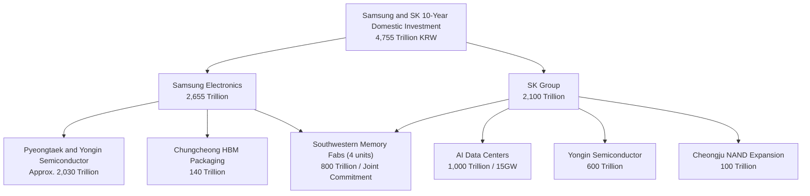

On June 29, 2026, a single set of figures was unveiled at the Presidential Guesthouse in Seoul. Samsung Electronics and SK hynix announced plans to invest a combined 4,755 trillion KRW domestically over the next ten years. President Lee Jae-myung presided over the event, flanked by Samsung Chairman Lee Jae-yong and SK Group Chairman Chey Tae-won. Yet in overseas media and on social platforms, the same announcement was circulating under the figure "$880 billion." Some outlets reported "1.3 trillion dollars." Others said "520 billion dollars."

One announcement, wildly divergent numbers. This analysis traces each figure to its primary source, identifies the genuine architecture of the announcement, and explains what it means for operators of AI infrastructure like ThakiCloud.

## The "$880 Billion" Figure Is Not an Official Number

The bottom line first: neither Samsung, SK Group, nor the Korean government has ever officially cited "$880 billion." Every confirmed primary report in the Korean press uses Korean won amounts only and provides no dollar conversion.

The $880 billion figure originates from Bloomberg, which converted a subset of the total investment, specifically a portion covering data centers and selected semiconductor items estimated at a minimum of 1,350 trillion KRW, at an exchange rate of approximately 1 USD to 1,534 KRW. That is a secondary estimate, not an official announcement. The "1.3 trillion dollar" figure covers a different, broader aggregation. The "520 billion dollar" figure isolates only the Southwestern fab commitment and applies yet another exchange rate. In short, each dollar headline reflects a different scope and a different rate.

The picture is clearest in Korean won. The verified total is 4,755 trillion KRW: Samsung's 2,655 trillion KRW plus SK Group's 2,100 trillion KRW. This figure is consistent across multiple independent primary reports including Financial News, Aju Economy, Newsis, and MBC. Applying the current exchange rate of 1 USD to 1,380 KRW, the full 4,755 trillion KRW is equivalent to approximately 3.4 trillion USD. The Bloomberg-derived $880 billion represents only a portion of that total, calculated at a higher exchange rate.

> Citation principle: when referencing figures from this announcement, always state the Korean won original and the exchange rate applied. A dollar headline stripped of context can make the same announcement appear to vary by a factor of four.

To calibrate the scale, comparing 4,755 trillion KRW against Korea's annual government budget of approximately 728 trillion KRW, the combined ten-year plan equals roughly 6.5 times the national annual budget. That said, this is a cumulative plan extending over a decade. The two companies' current combined annual capital expenditure runs at roughly 70 trillion KRW, with Samsung DS at approximately 41 trillion and SK hynix at approximately 29 trillion.

## The True Architecture of the Announcement: The 800 Trillion KRW Southwestern Memory Fabs

Within the 4,755 trillion KRW total, the most concrete commitment is the Southwestern (Honam) memory fab cluster. Samsung and SK hynix will each invest 400 trillion KRW, totaling 800 trillion KRW, to build four new memory fab facilities, two per company. Samsung Chairman Lee Jae-yong specifically named Gwangju as a candidate site for the new complex. The remaining components break down as follows.

Two figures in this structure are commonly conflated and deserve clarification. SK Group's "1,000 trillion KRW" refers to SKT's plan to build AI data centers totaling 15 GW of capacity nationwide by 2035. The separate "100 trillion KRW" refers to SK hynix's NAND flash capacity expansion at its Cheongju facility. These are not competing figures; they describe entirely different projects. Cross-checking against industry benchmarks, where 1 GW of data center capacity typically costs between 1 billion and 3 billion USD to construct, a 15 GW target at 1,000 trillion KRW is broadly consistent.

## Why Now and Why This Scale: The HBM Supercycle

The driver behind these figures converges on one product category: HBM, or High Bandwidth Memory. HBM is the stacked, high-value memory integrated into AI accelerators, priced at five to seven times the cost of conventional DRAM. The global HBM market is forecast to grow from approximately 35 billion USD in 2025 to between 54.6 billion and 58 billion USD in 2026, a growth rate of more than 58 percent.

Demand originates primarily from hyperscaler capital expenditure. Amazon, Microsoft, Google, Meta, and Oracle collectively exceeded 600 billion USD in AI infrastructure capex for 2026, with memory now accounting for roughly 30 percent of that spending, up from approximately 8 percent in 2023 and 2024, a nearly fourfold increase. NVIDIA's Blackwell and Rubin product cycles have generated hundreds of billions of dollars in order backlogs, and all three HBM suppliers, SK hynix, Micron, and Samsung, report their 2026 production is effectively sold out.

The critical insight is that this bottleneck is a capacity constraint, not a capital constraint. The industry cannot produce enough HBM not because investment is lacking but because fab capacity is insufficient. This is precisely why both companies are moving simultaneously toward large-scale expansion. SK hynix posted an operating margin of 47 percent in Q3 2025, and that profitability is being recycled directly into Yongin and Cheongju capacity, creating a self-reinforcing expansion cycle.

## The Policy Architecture: The Semiconductor Special Act

Korea has historically supported its semiconductor industry through tax credits rather than direct cash subsidies, unlike the United States and Europe. The K-Chips Act, passed in February 2025, raised the investment tax credit rate for large enterprises from 15 to 20 percent and extended R&D credits through 2031. The combined tax benefit for the two companies is estimated at approximately 6 trillion KRW.

The Semiconductor Special Act, passed in January 2026, adds a further layer of support by establishing a legal basis for central and local government to directly fund industrial infrastructure including power, water, and road access. Implementation is scheduled for Q3 2026. Whether the 800 trillion KRW Southwestern fabs actually come online will depend critically on timely delivery of power and water infrastructure under this special act. SK hynix CEO Kwak No-jung explicitly called for application of the special act to the Yongin cluster and improvement of regional living conditions at the announcement event, underscoring the infrastructure dependency.

## Global Competition: Three HBM Suppliers Expanding Simultaneously

| Company | Position | Recent Investment | HBM Status |
|---|---|---|---|
| SK hynix | Memory market leader | Yongin 600 trillion KRW and others | Approximately 57% HBM share, priority HBM4 supply |
| Samsung Electronics | Memory challenger | Pyeongtaek and Yongin approx. 2,030 trillion KRW | Approximately 35% HBM share, 50% capacity increase in 2026 |
| Micron | Memory third place | Approx. 20 billion USD in FY26 | 2026 HBM sold out, HBM4 volume production in Q2 |
| TSMC | Foundry | 165 billion USD in Arizona | CoWoS packaging sold out through 2026 |

All three HBM suppliers are effectively sold out for 2026. The competitive inflection point is 2027 and 2028. If Korean fab capacity coming online in those years is insufficient, incremental HBM4 and HBM5 demand may shift toward Micron. On the foundry side, TSMC is committing 165 billion USD to Arizona alone, with CoWoS packaging capacity sold out through 2026. Intel has effectively withdrawn from HBM competition amid its foundry restructuring.

## Power Is the Real Bottleneck: Location Competition for Data Centers

Beginning in Q1 2026, the primary constraint for AI infrastructure shifted from chip supply to power availability. In the United States, approximately 7 GW of data center projects have been delayed or cancelled due to power shortages. Paradoxically, this development increases the attractiveness of sites in Korea's Southwestern region and the Middle East, where power and land can be secured.

SK's plan to build 15 GW of AI data center capacity nationwide by 2035 at a cost of 1,000 trillion KRW is not simply a real estate play. When a memory manufacturer directly builds the data centers to which it sells HBM, it creates its own end-demand and improves its negotiating position within a supply chain where NVIDIA and hyperscalers currently set specifications. Samsung is moving in the same vertical integration direction with its AI data center in Haenam and its AI server substrate factory in Sejong.

## ThakiCloud Perspective: More Hardware Raises the Value of the Software Layer

The strategic significance of this announcement is that Korea is vertically integrating AI infrastructure at a national scale, and that trajectory connects directly to ThakiCloud's ai-platform business.

First, as domestic AI data center capacity expands toward 15 GW, the demand for multi-tenant infrastructure to train and serve models on top of that hardware grows in parallel. ThakiCloud targets exactly this layer with GPU scheduling built on Kubernetes and Kueue, and model serving via vLLM. As fabs and data centers supply the hardware, a control plane capable of safely isolating and running multiple customers' workloads becomes essential.

Second, sovereign AI and on-premises requirements intensify. National critical infrastructure and public sector organizations frequently cannot operate models on external clouds and must run them within their own data centers, a requirement that grows stricter in regulated and security-sensitive environments. ThakiCloud's self-hosting capability, multi-tenant isolation, and cost-efficient serving are precise fits for this demand.

Third, and perhaps most consequentially, as HBM and high-performance GPUs become more abundant, the competitive axis shifts from "how much did you procure" to "how efficiently do you operate it." GPU lifecycle management and queuing systems that keep expensive accelerators utilized, not idle, ultimately determine unit economics. The 4,755 trillion KRW investment creates hardware. Raising the utilization rate of that hardware is the job of the scheduler and the serving engine. That is where ThakiCloud's value proposition sits.

## Risks and Counterarguments: Caution Is Warranted

Treating this announcement as an unqualified positive signal carries real risks. The counterarguments deserve direct acknowledgment.

The 4,755 trillion KRW is a ten-year cumulative plan, not a verified annual execution commitment. Government-sponsored announcements carry inherent upward bias, and the Yongin 622 trillion KRW cluster announced in 2024 has already experienced schedule delays. There is invariably a gap between announcement and execution.

If the HBM supercycle turns, today's capacity expansion becomes tomorrow's oversupply. Memory is historically among the most cyclical industries. If AI capex proves to be overinvestment, as some analysts argue, the fabs scheduled to come online in 2027 and 2028 could coincide with a demand slowdown.

Power and water infrastructure that fails to arrive on schedule will delay even an 800 trillion KRW fab. Given that power constraints are the primary reason for global data center delays, this is not an abstract concern.

Finally, the day after the announcement, on June 30, SK hynix surpassed Samsung Electronics to become the largest company on the KOSPI by market capitalization. Some observers drew parallels to the Cisco-Microsoft market cap reversal at the peak of the 2000 dot-com bubble, citing it as a potential top signal. Most analysts chose to reserve judgment, citing the need to track earnings and macro conditions, but the warning that valuations may be running ahead of fundamentals cannot be dismissed.

## Summary

The verified number from the June 29, 2026 announcement is 4,755 trillion KRW. The figure "$880 billion," derived by Bloomberg at 1 USD to 1,380 KRW basis, represents only a portion of that total calculated at a higher exchange rate, making it a secondary estimate rather than an official figure. The structural pillars of the announcement are the 800 trillion KRW Southwestern memory fabs and SK Group's 15 GW AI data center program. The force driving all of it is the HBM supercycle. Whether the plan translates into capacity depends above all on the speed of power and water infrastructure delivery.

While Korea constructs AI hardware at national scale, the value of the software layer that operates that hardware efficiently grows alongside it. ThakiCloud is positioned at exactly that intersection, with Kubernetes and Kueue-based serving and sovereign infrastructure as its core offering.

## Sources

- Financial News, Samsung and SK 4,755 Trillion KRW Southwestern Fab Four Units (2026-06-29): [https://www.fnnews.com/news/202606291837098645](https://www.fnnews.com/news/202606291837098645)
- Newsis, Samsung and SK 800 Trillion KRW Honam Semiconductor Hub (2026-06-29): [https://www.newsis.com/view/NISX20260629_0003687807](https://www.newsis.com/view/NISX20260629_0003687807)
- Aju Economy, SKT 15GW AI Data Centers (2026-06-29): [https://www.ajunews.com/view/20260629171803513](https://www.ajunews.com/view/20260629171803513)
- Hankyung, Yongin 600 Trillion and Cheongju 100 Trillion (2026-06-29): [https://www.hankyung.com/article/2026062943107](https://www.hankyung.com/article/2026062943107)
- CNBC, South Korea Samsung SK Hynix mega-projects (2026-06-29): [https://www.cnbc.com/2026/06/29/samsung-sk-hynix-reported-1point3-reported-trillion-spending-plans.html](https://www.cnbc.com/2026/06/29/samsung-sk-hynix-reported-1point3-reported-trillion-spending-plans.html)
- SK hynix, 2026 Market Outlook (HBM Supercycle): [https://news.skhynix.com/2026-market-outlook-focus-on-the-hbm-led-memory-supercycle/](https://news.skhynix.com/2026-market-outlook-focus-on-the-hbm-led-memory-supercycle/)
- TrendForce, Micron CapEx $20B and 2026 HBM booked (2025-12-18): [https://www.trendforce.com/news/2025/12/18/news-micron-hikes-capex-to-20b-with-2026-hbm-supply-fully-booked-hbm4-ramps-2q26/](https://www.trendforce.com/news/2025/12/18/news-micron-hikes-capex-to-20b-with-2026-hbm-supply-fully-booked-hbm4-ramps-2q26/)
- Korea Policy Briefing, Semiconductor Special Act Passed by National Assembly (2026-01-30): [https://www.korea.kr/briefing/pressReleaseView.do?newsId=156742072](https://www.korea.kr/briefing/pressReleaseView.do?newsId=156742072)
