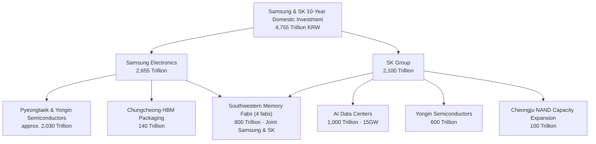

On June 29, 2026, a landmark figure emerged at the Cheongwadae State Guest House. Samsung Electronics and SK hynix announced plans to invest a combined 4,755 trillion KRW domestically over the next 10 years. The declaration was made in person by Samsung Chairman Lee Jae-yong and SK Group Chairman Chey Tae-won at the "Republic of Korea Great Leap, Three National Mega-Projects Public Briefing" presided over by President Lee Jae-myung.

This post calmly unpacks what was announced that day: what will be built, where, and at what scale; the industrial trends and policies behind the numbers; and what it all means for operators of AI infrastructure.

## What Was Announced

The announcement was not a standalone corporate IR event. It was a declaration of a national mega-project, which President Lee framed as a "Korean-style AI industrial revolution." Two groups are investing: Samsung Group pledged 2,655 trillion KRW and SK Group pledged 2,100 trillion KRW in domestic investment over 10 years, for a combined total of 4,755 trillion KRW, roughly 6.5 times the government's annual budget of approximately 728 trillion KRW.

Chairman Lee Jae-yong named Gwangju as a candidate site for the new semiconductor complex, stating: "We are considering Gwangju as a candidate site where incentive support is expected." Chairman Chey Tae-won emphasized his intention to transform Korea "from a country that consumes AI into a country that exports it." SK hynix CEO Kwak Noh-jung specifically requested the application of the Semiconductor Special Act to the Yongin cluster and improvements to regional living conditions.

One important context: 4,755 trillion KRW represents a cumulative planned figure spread over more than 10 years, not a near-term commitment. The two companies' current combined annual capital expenditure runs at roughly 70 trillion KRW (Samsung DS approximately 41 trillion, SK hynix approximately 29 trillion). Announcement scale and annual execution pace should be read separately.

> USD conversion note: International media reported this announcement using figures ranging from "$880 billion," "$1.3 trillion," and "$520 billion." The discrepancies stem from different scope definitions and exchange rates applied. The most reliable reference is the Korean won original. For those who require a conversion, 4,755 trillion KRW at 1 USD = 1,380 KRW implies approximately $3.44 trillion.

## Investment Structure: 800 Trillion KRW Southwestern Fabs and 15GW Data Centers

Within the 4,755 trillion KRW total, the most binding commitment is the southwestern (Honam) memory fab plan. Samsung and SK will each contribute 400 trillion KRW, 800 trillion KRW in total, to build four new memory fabs (two per company). Samsung is considering Gwangju as its site. The remaining components break down as follows.

The most notable item on the SK side is the AI data center plan. Led by SKT, the group intends to spend 1,000 trillion KRW by 2035 to build 15GW of AI data centers nationwide. Given that typical capex for a 1GW data center runs roughly $1 to $3 billion, a 1,000 trillion KRW figure for 15GW is broadly consistent. In addition, SK hynix will separately invest 100 trillion KRW in expanding NAND flash capacity at its Cheongju facility. Samsung has allocated approximately 2,030 trillion KRW to Pyeongtaek and Yongin semiconductor operations and 140 trillion KRW to HBM packaging in the Chungcheong region.

## Why Now, Why This Scale: The HBM Supercycle

The driving force behind these enormous numbers converges on a single technology: HBM, or High Bandwidth Memory. HBM is a high-value memory stacked directly onto AI accelerators, commanding a unit price five to seven times that of conventional DRAM. The global HBM market is forecast to grow from approximately $35 billion in 2025 to $54.6 to $58 billion in 2026, a jump of more than 58%.

The root of that demand lies in hyperscaler spending. Amazon, Microsoft, Google, Meta, and Oracle together exceeded $600 billion in AI infrastructure capex in 2026, with memory's share of that spending rising to approximately 30%, roughly four times the 8% share seen in 2023 to 2024. Backlog from NVIDIA Blackwell and Rubin demand alone has reached hundreds of billions of dollars, and the 2026 production output of the three HBM suppliers, SK hynix, Micron, and Samsung, is effectively sold out.

The critical insight is that the bottleneck is capacity, not capital. The constraint is not a lack of money to build; it is a lack of fabs to build in. That is why both companies are moving toward large-scale expansion simultaneously. SK hynix posted an operating margin of 47% in Q3 2025, and that profitability is now being recycled into Yongin and Cheongju facilities, creating a virtuous cycle.

## Policy Backing: The Semiconductor Special Act

Korea has historically supported its semiconductor industry through tax credits rather than direct cash subsidies as seen in the United States or Europe. The K-Chips Act passed in February 2025 raised the facility investment tax credit rate for large corporations from 15% to 20% and extended R&D credits through 2031. The combined tax benefit for the two companies is estimated at approximately 6 trillion KRW.

Layered on top is the Semiconductor Special Act, passed in January 2026. This legislation creates a legal basis for the state and local governments to directly support the construction of critical industrial infrastructure including power, water, and roads. Implementation is scheduled for Q3 2026. For the 800 trillion KRW Honam fabs to actually come online, the timely delivery of power and water infrastructure under this Special Act will be the decisive variable. CEO Kwak Noh-jung's direct request at the announcement for the Special Act to be applied to the Yongin cluster reflects exactly this concern.

## Global Competition: Three HBM Suppliers Expanding Simultaneously

| Company | Position | Recent Investment | HBM Status |
|---|---|---|---|
| SK hynix | Memory No. 1 | Yongin 600 trillion KRW, etc. | HBM share approx. 57%, HBM4 priority supply |
| Samsung Electronics | Memory challenger | Pyeongtaek & Yongin approx. 2,030 trillion KRW | HBM share approx. 35%, 50% capacity expansion in 2026 |
| Micron | Memory No. 3 | FY26 approx. $20 billion | 2026 HBM fully booked, HBM4 mass production in Q2 |
| TSMC | Foundry | Arizona $165 billion | CoWoS packaging sold out through 2026 |

All three HBM suppliers have their 2026 output sold out. The real question is 2027 to 2028. If sufficient Korean fab capacity is not online by then, the incremental demand for HBM4 and HBM5 could shift to Micron. On the foundry side, TSMC is committing $165 billion to Arizona alone, filling its CoWoS packaging capacity through 2026, while Intel has effectively withdrawn from HBM competition through its foundry restructuring.

## Power as the Real Bottleneck: Data Center Location Competition

Since Q1 2026, the primary bottleneck for AI infrastructure has shifted from chips to power. In the United States, approximately 7GW of data center projects have been delayed or cancelled due to power constraints. Paradoxically, this makes Korea's southwestern region and parts of the Middle East, where power and land remain available, increasingly attractive.

SK's plan to build 15GW of AI data centers nationwide for 1,000 trillion KRW by 2035 is not simply a real estate bet. When a memory manufacturer directly builds the data centers that will consume its HBM output, it can create its own demand and recover bargaining power in a supply chain where NVIDIA and hyperscalers currently set the terms. Samsung is moving in the same direction of vertical integration, with AI data center projects in Haenam and an AI server substrate factory in Sejong.

## Market Reaction

Immediately following the announcement, Samsung Electronics shares closed at 323,000 KRW after volatile trading, and on June 30 SK hynix reclaimed the top position in KOSPI market capitalization from Samsung Electronics. Some analysts drew parallels to the Cisco-Microsoft reversal during the 2000 dot-com bubble and raised concerns about a market peak. However, the majority of analysts withheld judgment on simple overheating, noting that "actual earnings and the macro environment need more observation." There is also a view that the valuation reversal is excessive, given that Samsung's 2026 operating profit estimate (361 trillion KRW) remains higher than SK hynix's (262 trillion KRW).

## ThakiCloud Perspective: The More Hardware Scales, the More the Software Layer Matters

The essence of this announcement is that Korea is vertically integrating AI infrastructure at the national level, and that connects directly to ThakiCloud's ai-platform business.

As domestic AI data centers expand to 15GW, the demand for multi-tenant infrastructure to train and serve models on top of that hardware grows with it. ThakiCloud targets exactly this layer with Kubernetes and Kueue-based GPU scheduling and vLLM serving. When fabs and data centers supply the hardware, a control plane is needed to safely isolate and run multiple customers' workloads on top of it.

The nature of the demand also works in our favor. National critical industries and public sector entities frequently need to operate models inside their own data centers rather than relying on external clouds, especially in security-sensitive environments. ThakiCloud's self-hosting, multi-tenant isolation, and cost-efficient serving align precisely with this sovereign AI demand.

And the most important shift is this: as HBM and high-performance GPUs proliferate, the axis of competition moves from "how much did you buy" to "how efficiently can you run it." GPU lifecycle management and queuing that prevents expensive accelerators from sitting idle ultimately determines cost. The software layer that runs the hardware created by 4,755 trillion KRW efficiently, that is exactly where ThakiCloud's value lies.

## Caveats and Counterarguments: Too Early for Pure Optimism

Reading this announcement as unambiguously positive would be a mistake. The counterarguments deserve an honest look.

First, 4,755 trillion KRW is a 10-year cumulative "plan," not an annualized figure with verified execution. The government event context may introduce upward bias, and the Yongin 622 trillion KRW cluster announced in 2024 has already experienced schedule delays. There is always a gap between announcement and execution.

Second, if the HBM supercycle reverses, today's expansion becomes tomorrow's oversupply. Memory is historically a sharply cyclical industry. If AI capex proves to be overinvestment as some analysts contend, the fabs coming online in 2027 to 2028 could coincide with a period of softening demand.

Third, if power and water infrastructure is not delivered on schedule, even an 800 trillion KRW fab investment will be delayed. Power is the leading cause of global data center delays, making this a concrete rather than abstract risk.

Finally, the valuation reversal has prompted warnings that market prices are running ahead of fundamentals. Announcement scale does not guarantee earnings.

## Summary

The framework of the June 29, 2026 announcement is clear. Samsung and SK will invest 4,755 trillion KRW domestically over 10 years, anchored by 800 trillion KRW in southwestern memory fabs and SK's 15GW AI data centers. The HBM supercycle is the engine driving all of it, and success will depend on the speed of power and water infrastructure delivery.

As Korea builds AI hardware at national scale, the value of the software layer that runs that hardware efficiently grows alongside it. ThakiCloud is positioning itself at exactly that intersection, with K8s- and Kueue-based serving and sovereign infrastructure.

## Sources

- Financial News, Southwestern Fabs Samsung & SK 4,755 Trillion (2026-06-29): [https://www.fnnews.com/news/202606291837098645](https://www.fnnews.com/news/202606291837098645)
- Newsis, Samsung & SK 800 Trillion Honam Semiconductor Hub (2026-06-29): [https://www.newsis.com/view/NISX20260629_0003687807](https://www.newsis.com/view/NISX20260629_0003687807)
- Aju News, SKT 15GW AI Data Centers (2026-06-29): [https://www.ajunews.com/view/20260629171803513](https://www.ajunews.com/view/20260629171803513)
- Hankyung, Yongin 600 Trillion & Cheongju 100 Trillion (2026-06-29): [https://www.hankyung.com/article/2026062943107](https://www.hankyung.com/article/2026062943107)
- CNBC, South Korea Samsung SK Hynix mega-projects (2026-06-29): [https://www.cnbc.com/2026/06/29/samsung-sk-hynix-reported-1point3-reported-trillion-spending-plans.html](https://www.cnbc.com/2026/06/29/samsung-sk-hynix-reported-1point3-reported-trillion-spending-plans.html)
- SK hynix, 2026 Market Outlook (HBM Supercycle): [https://news.skhynix.com/2026-market-outlook-focus-on-the-hbm-led-memory-supercycle/](https://news.skhynix.com/2026-market-outlook-focus-on-the-hbm-led-memory-supercycle/)
- TrendForce, Micron CapEx $20B & 2026 HBM booked (2025-12-18): [https://www.trendforce.com/news/2025/12/18/news-micron-hikes-capex-to-20b-with-2026-hbm-supply-fully-booked-hbm4-ramps-2q26/](https://www.trendforce.com/news/2025/12/18/news-micron-hikes-capex-to-20b-with-2026-hbm-supply-fully-booked-hbm4-ramps-2q26/)
- Policy Briefing, Semiconductor Special Act Passed by National Assembly (2026-01-30): [https://www.korea.kr/briefing/pressReleaseView.do?newsId=156742072](https://www.korea.kr/briefing/pressReleaseView.do?newsId=156742072)
