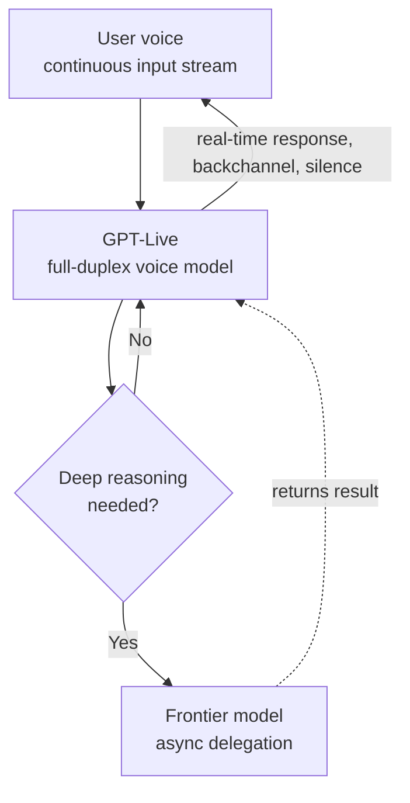

Anyone who has used a voice assistant knows the awkward rhythm: it waits until you finish speaking, then after a brief pause delivers its answer all at once. GPT-Live, released by OpenAI on July 8, 2026, is an attempt to change that rhythm. This piece is written for developers and AI teams interested in voice interfaces and real-time inference infrastructure. We look at what GPT-Live actually changed at the technical level, and what this kind of full-duplex voice demands from serving infrastructure and agent design.

## Overview: A Generational Shift in the Default Voice Experience

GPT-Live is a new generation of voice model that replaces ChatGPT's default voice experience. At its core is a full-duplex structure. Where the previous voice mode was half-duplex, meaning it listened and then spoke, GPT-Live can listen and speak at the same time. While the user is talking, it signals that it is listening with backchannels like "mm" or "yeah," takes part in quick back-and-forth exchanges, and waits quietly when the other person needs a moment to think. OpenAI describes this experience as much closer to talking with an actual person.

The rollout comes in two variants. GPT-Live-1 is the default for Go, Plus, and Pro users, while GPT-Live-1 mini is the default for free users. Both models have begun rolling out gradually to users worldwide across ChatGPT on iOS, Android, and the web.

## What Actually Changed Technically

The biggest change is in how the system handles the timing of conversation. Half-duplex voice systems rely on end-of-turn detection: once the system judges that the user has stopped talking, it starts generating a response. This approach is simple to implement, but it cannot express the overlap, interruption, and backchanneling that happen naturally in conversation.

Full-duplex confronts this constraint head-on. To keep receiving an input audio stream while generating output audio at the same time, the model and its serving layer must process bidirectional streams simultaneously at low latency. Even while the user keeps talking, the model has to decide in real time when to backchannel, when to interject, and when to stay silent. This is not simply a matter of speech-synthesis quality; it is a matter of modeling the timing of conversation itself.

Another notable design choice is delegation. GPT-Live is introduced as the smartest voice model to date, yet questions that need web search, deeper reasoning, or complex tasks are quietly delegated to the latest frontier model behind the scenes. Once the result is ready, it is brought back into the flow of conversation. In other words, this is a layered architecture in which a fast, lightweight voice model handles the real-time feel of the conversation while heavier reasoning is processed asynchronously by a separate model.

This kind of layering is a common pattern in real-time system design: separate the path that needs low latency from the path that needs high accuracy, and run the latter asynchronously to preserve the responsiveness of the front end. GPT-Live can be read as an application of this pattern to voice conversation.

## Implications for ThakiCloud's Products

GPT-Live itself is a closed OpenAI product, but the requirements its architecture raises connect directly to the infrastructure we operate.

From the ai-platform perspective, full-duplex voice is a demanding case of real-time streaming inference. ThakiCloud's ai-platform serves a range of models on top of K8s and Kueue-based GPU scheduling, and unlike batch inference, voice conversation demands low and consistent latency. Handling bidirectional audio streams at the same time requires the serving layer to keep streaming input and output and session state stable, and GPU resources have to be managed not just for throughput but for tail latency as well. This low-latency serving requirement matters especially in on-premise and sovereign environments. For customers who cannot send data outside their own infrastructure and want to self-host a voice interface, a serving stack that can handle real-time streaming is a precondition.

From an agent perspective, this connects to Paxis. Paxis is the Agent-Native Cloud control plane that runs on top of ai-platform, executing skills in isolated sandboxes and routing every action through policy gates and audit logs. GPT-Live's delegation structure, where a lightweight front end hands heavy reasoning to the back, follows the same principle as layering in agent design. As voice becomes a new input surface for agents, we need a flow that interprets what the user meant, selects the right skill, executes it in isolation, and returns the result to the conversation. Paxis's skill harness, MCP connectors, and policy gates can handle exactly this back end of a voice agent pipeline: real-time voice owns the front end, while agent execution backed by policy and audit owns the back end.

## Limitations and Counterpoints

Full-duplex does not automatically guarantee a better experience. Listening and speaking at the same time increases naturalness, but it also opens up more room for things to go wrong. The system might misread a brief pause as the end of a turn and interrupt, or backchannel so much that it actually disrupts the conversation. Modeling natural timing is a far more subtle problem than speech-synthesis quality, and judgment should be withheld until it is validated by real user reactions.

The delegation structure has its own shadow side. If the front-end voice model misjudges when to hand off to the frontier model, a simple question could get an excessive delay, or a hard question could get a shallow answer. The accuracy of this routing decision determines the overall experience, and that is something a vendor announcement cannot confirm; it only shows up in real use.

Finally, the architectural interpretation in this piece is based on OpenAI's public statements and early reporting, and the internal implementation details have not been disclosed. The direction toward full duplex and delegation is clear, but specific latency figures or model structures have not been independently verified by us and should be treated as estimates.

In short, GPT-Live is a release that shows voice interfaces moving from a "tool that takes commands" toward a "conversation partner." And what actually carries that shift is not flashy voice quality but the infrastructure that serves bidirectional streams at low latency and safely delegates heavy reasoning. That back end, on both the real-time serving side and the agent execution side, is exactly what we are building toward.

## Sources

- [Introducing GPT-Live · OpenAI](https://openai.com/index/introducing-gpt-live/)
- [OpenAI releases new voice models for more natural live conversations · TechCrunch](https://techcrunch.com/2026/07/08/openai-releases-new-voice-models-for-more-natural-live-conversations/)
- [OpenAI Introduces GPT-Live to Make ChatGPT Voice Feel Like a Real Conversation · MacRumors](https://www.macrumors.com/2026/07/08/openai-gpt-live-voice/)
