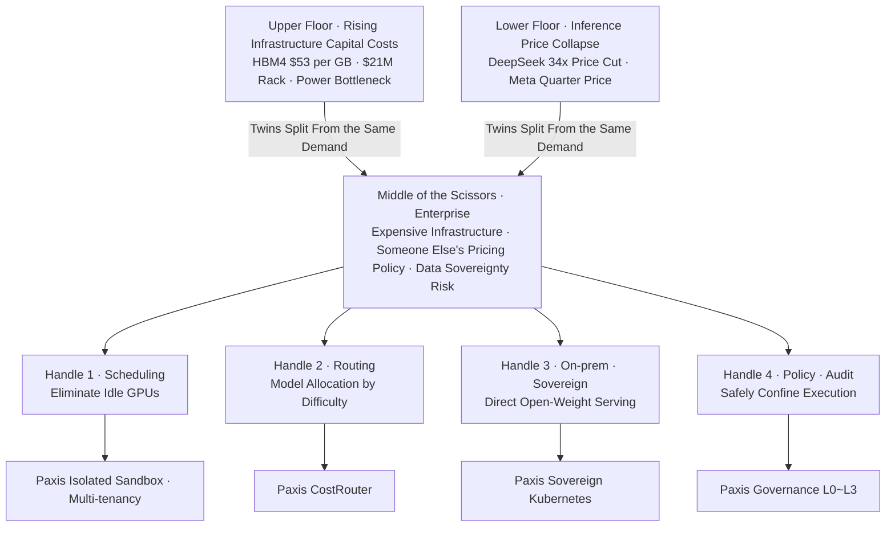

## On the Same Day, Two Numbers Walked Away From Each Other

This morning's news carried two numbers moving in exactly opposite directions, side by side. One jumped upward. The average selling price of an Nvidia Rubin Ultra rack was reported at 21 million dollars, more than five times the 4 million dollars of the previous generation, Blackwell Ultra. The other sank to the floor. DeepSeek made a permanent 75 percent cut to its V4-Pro pricing, putting up a price tag that is 34 times cheaper than OpenAI and 29 times cheaper than Anthropic on an output-token basis.

On one side, the hardware that runs AI is soaring in price. On the other, the price of the answers that hardware produces is collapsing. What looks at first like a contradiction is actually one single event. The story running through today's digest is not about how smart any particular model has become, but about the fact that the upper and lower floors of the AI economy are pulling apart in opposite directions. Caught between the two diverging blades is, in the end, the enterprise that actually wants to use this technology.

## Upper Floor: The Hardware Keeps Getting More Expensive

This is not only a story about rack prices. The entire upper floor is raising its prices. Bernstein projected that HBM4 and LPDDR5X memory unit prices will climb to 53 dollars per gigabyte by 2027. Since more than half of a rack's cost is concentrated in GPUs and HBM, a rise in memory prices drags the entire price tag of a single server up with it. And yet Samsung Electronics, SK hynix, and Micron are not slowing their expansion pace, they are accelerating it. The calculation behind this is that a new fab takes at least three years to actually deliver volume, so a meaningful supply increase will not be possible until after 2028. Micron has committed to pouring 250 billion dollars into the United States through 2035, and SK hynix has moved to list American Depositary Shares in the United States at an IPO price of 149 dollars, a listing worth roughly 40 trillion won, the largest US listing ever by a foreign company. Today's investment is not a signal that prices are about to turn down, it is a bet placed in advance to secure a position for the AI-driven demand that will continue for years to come. That said, the same day's news also carried a report that the US Secretary of Commerce, at a New York fab event, publicly pressured Korean companies to expand production inside the United States. Deciding how to split capital and manpower between large domestic investments and demands for US investment has become a new homework assignment for the three memory makers.

Prices are not the only thing getting more expensive, complexity is too. Samsung Electronics said it is developing 2.xD packaging that combines HBM, logic, and silicon photonics into one. Getting past bandwidth bottlenecks requires precisely fusing different chips together, and the more that happens, the more the entire supply chain becomes hostage to foundry and advanced packaging capacity. It is a structure where difficulty and cost both climb together as performance rises. Nvidia says performance gains improve total cost of ownership, but with half of a rack's cost concentrated in GPUs and HBM, the actual speed of return on investment has emerged as the real variable that determines whether this cycle can sustain itself.

There is one more, heavier wall standing here: power. As Joongang Ilbo and Josea Ilbo both pointed out, the axis of AI competition has already shifted from securing semiconductors to operating data centers. The government has set a target of attracting over 550 trillion won in AI data center investment by 2029 and over 1,000 trillion won by 2035, and within that, the SK Group is taking on 81 percent of an 18.4 gigawatt target. The problem is that Seoul and Gyeonggi account for 78.7 percent of related power contracts, while the key sites there are already close to saturation. Grid interconnection and substation expansion permitting demand a longer lead time than simply buying GPUs. Liquid cooling such as immersion cooling can cut cooling power consumption by more than 90 percent, but a labor shortage is cited as another bottleneck, since it is not easy to retain the highly skilled operations staff needed to run such facilities around the clock for three to five years or more. That is why former Bitcoin mining companies, which already hold large-scale transmission rights, are being repriced as AI infrastructure suppliers. As firms like Core Scientific, IREN, and TeraWulf sign long-term power contracts with hyperscalers, the market has begun revaluing them not on mining profitability but on the power capacity they hold, measured in megawatts. The truly scarce resource on the upper floor now is not the chip, it is electricity.

## Lower Floor: The Price of an Answer Keeps Getting Cheaper

The same day, on the lower floor, exactly the opposite force was at work. DeepSeek's price cut was not a one-off promotion but a permanent policy, and its impact showed up in the numbers. On developer platforms like Vercel and OpenRouter, the traffic share of Chinese models jumped into double digits within a short period, and a real startup like Lindy switched its entire service from Anthropic to DeepSeek. Price-sensitive customers are already on the move.

Meta's moves make this trend even clearer. Meta, which had been building out its ecosystem by releasing Llama as open source, jumped into the paid API business for the first time with Muse Spark 1.1, and came out with a startling price roughly a quarter of what competitors charge. Zuckerberg said he was confident the pricing would be attractive. On top of that, Meta plans to start mass-producing its own AI chips from September to reduce its reliance on Nvidia, and is even moving to sell off idle compute externally in order to recoup infrastructure spending that could reach up to 145 billion dollars this year. Following Google's TPU and Amazon's Trainium, Meta's custom silicon now joins the picture, a phase in which Big Tech companies print their own chips and resell whatever compute is left over. The greater the cost pressure on the upper floor, the fiercer the price war on the lower floor to push that pressure onto someone else.

Domestic news shows that this scissors motion is not just a Silicon Valley story. Ha Jung-woo said Ulsan has a strong chance at industrial AI transformation given how much manufacturing data it has accumulated, ITCEN Core partnered with KB Kookmin Bank, and SK AX rolled out a full-stack transformation aimed at manufacturing sites. LG has begun developing a world model that understands the laws of physics, and Alipay placed its bet for the agent era on payment, trust, and openness. This means manufacturing, finance, and the public sector are each starting to push AI into real-world work. The problem is that the moment they adopt AI, they get caught right between the two blades just described. Infrastructure capital costs press down from above while model costs and sovereignty risk press up from below, both at once.

## Why Are These Two the Same Force

The two directions that looked like a contradiction actually branch from the same root. As AI demand explodes, the scarcity of semiconductors and power upstream pushes prices up. At the same time, competition among model providers trying to capture that demand collapses margins downstream. In other words, the rising capital costs above and the falling selling prices below are twins born from the same demand. That is why this structure resembles a pair of scissors. The two blades move in opposite directions, but they are bound to a single pivot.

The spot where enterprises stand is exactly in the middle of that scissors. If they build infrastructure themselves, they have to absorb the soaring costs of the upper floor. If they use models only through external APIs, they have to entrust themselves to someone else's pricing policy and to data sovereignty risk. On top of that, DeepSeek is a Chinese model and Meta has turned to a closed, paid model. In sectors like finance and the public sector, where network segregation and data sovereignty regulations are strict, it is difficult to simply take that cheap price and use it as is. The fact that a price is cheap and the fact that it can be used safely are entirely different problems.

## The Handles to Grip in the Middle of the Scissors

There is a common objection worth addressing here. Since DeepSeek is 34 times cheaper and Meta came out with a quarter of the price, why not just pick the cheapest external API and use it. Looking only at the price, that is a fair point. But the cheap price comes with strings attached. DeepSeek is a Chinese model, Meta has turned from open source to a closed, paid model, and the prices of both can rise again at any time depending on the provider's circumstances. Handing your entire cost structure over to someone else's pricing policy is not savings, it is a new form of dependency. Real savings are only complete once you bring that cheap price under your own control.

So what variables can enterprises actually control between these two diverging blades. The news has left hints. The core lesson from the AI data center article was that GPUs you have secured mean nothing if you cannot keep them running. In other words, the first handle for absorbing upper-floor costs is scheduling that eliminates idle time. The lesson from the DeepSeek case was routing, splitting work between cheap and expensive models according to task difficulty. The second handle is allocation, choosing the right model for each task. The lesson from Meta's move to paid pricing and the spread of Chinese models was that to absorb cheap pricing within data sovereignty, you need to serve open-weight models directly on your own infrastructure. The third handle is on-premises and sovereign deployment. And just as the AI security red-teaming guide published by the Ministry of Science and ICT and KISA designated prompt injection and agent permission abuse as standard threats, the fourth handle is policy and auditing that safely confines execution.

Paxis, the Agent-Native Cloud built by ThakiCloud, was designed to let organizations grip all four of these handles with one hand. CostRouter, which picks the right model for each task, splits workloads between DeepSeek-style low-cost models and high-performance models, turning the lower floor's price collapse back into cost savings. Isolated sandbox execution and multi-tenancy reduce idle time on secured GPUs, absorbing the upper floor's capital costs. A sovereign, on-premises Kubernetes foundation lets open-weight models be served directly within domestic regulation, capturing cheap pricing and data sovereignty at the same time. And governance that treats Skills, Tools, Policies, and Audit Logs as first-class resources and divides autonomy into levels from L0 to L3 embeds the policy gates and audit logs that the red-teaming guide demands, right into the product from the start.

## The Wider the Scissors Open, the More the Handles Matter

Today's two numbers are likely to keep drifting further apart. Memory supply will stay tight through 2028, and the power bottleneck requires years of permitting, so the upper floor will not come down easily. Conversely, the wave of custom chips and ultra-cheap models keeps pulling the lower floor down. The more this happens, the more the outcome is decided not by the two blades themselves, but by the handle gripping the space between them. That is why, when reading the two numbers of rack price and inference price, you also have to read the scheduling, routing, sovereignty, and safety that sit in between. Today's news did not ask which model won. Instead, it asked about the cost of running that model and the way that cost is managed. To stand steady in the middle of the scissors, you first have to check where your handles are.

## References

- [Nvidia Rubin Ultra Rack Expected to Sell for $21 Million](https://tech.ifeng.com/c/8uco339RORc) · Ifeng
- [Bernstein Projects Nvidia Vera Rubin Rack at $9.1 Million as HBM4 Price Surge Squeezes Costs](https://www.weeklypost.kr/news/articleView.html?idxno=11422) · Weekly Post
- ["40 Trillion Won Jackpot": SK hynix Surpasses Even Alibaba in a Record-Breaking Listing](https://www.hankyung.com/article/2026071072846) · Hankyung
- [Micron Expands US Semiconductor Investment to $250 Billion, Breaks Ground on New York Fab](https://www.thelec.net/news/articleView.html?idxno=12157) · TheElec
- [Samsung Electronics: "Developing 2.xD Packaging That Combines HBM, Logic, and Silicon Photonics"](http://inews24.com/view/1984212) · iNews24
- [DeepSeek Makes Its 75% Price Cut Permanent as the AI Price War Intensifies](https://thenextweb.com/news/deepseek-v4-pro-75-percent-price-cut-permanent) · TheNextWeb
- [Meta Prices Muse Spark 1.1 API at $1.25/$4.25 per Million Tokens](https://aiweekly.co/alerts/meta-prices-muse-spark-11-api-at-125425-per-m-tokens) · AI Weekly
- [Meta's New AI Chips Will Begin Production in September](https://techcrunch.com/2026/07/09/metas-new-ai-chips-will-begin-production-in-september/) · TechCrunch
- [Startup Lindy Ditched Claude Entirely for DeepSeek, Saving Millions of Dollars](https://the-decoder.com/ai-startup-lindy-ditched-claude-entirely-for-deepseek-saving-millions-as-cost-pressure-mounts-on-anthropic/) · The Decoder
- [Ministry of Science and ICT, KISA Publish "AI Security Red-Teaming Guide"](https://www.digitaltoday.co.kr/news/articleView.html?idxno=682799) · Digital Today
