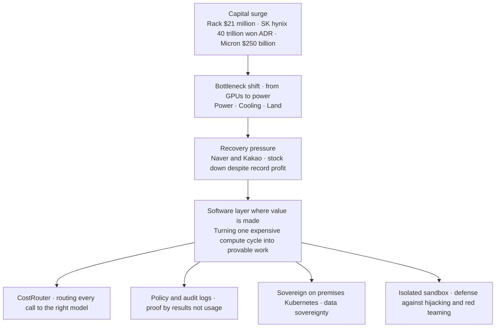

Picture a single invoice. The line item is one server rack, and the price is 21 million dollars, about 31.6 billion won in our currency. That is the expected unit price for Nvidia's next generation Rubin Ultra rack, reported today by Global Economic. Just one generation earlier, a Blackwell rack cost 3 to 4 million dollars, so this is a jump of five to seven times. The largest item on this bill is not the compute chip but memory. The HBM4e loaded into a single rack alone comes to 82,944 gigabytes, and at 18.49 dollars per gigabyte, the memory component alone tops 1.53 million dollars. An amount that used to approach the price of an entire previous generation server rack is now the price of a single part. The story running through today's digest starts here. The unit of AI competition has shifted from performance benchmarks to money and power.

## The Unit of Money Has Changed

Even the scale of the numbers feels unfamiliar now. SK hynix has fixed the offering price of its American Depositary Receipts for its Nasdaq listing at 149 dollars per share. At a total of 26.5 billion dollars, about 40 trillion won, that surpasses Alibaba's 25 billion dollars from 2014 and stands as the largest US listing by a foreign company on record. A company whose market capitalization has already crossed 1 trillion dollars is now raising dollars directly to pour into extreme ultraviolet equipment at its Yongin and Cheongju fabs and into overseas advanced packaging. Micron has enlarged its plan again, saying it will invest 250 billion dollars, about 376 trillion won, in the United States alone by 2035. Meta has offered a capital expenditure guidance of 115 to 135 billion dollars for this year alone.

Look at where this money is flowing and the direction is unmistakable. All of it heads toward memory expansion, data center construction, and securing semiconductors. Investment banks like Bank of America and Morgan Stanley read this price surge as both the basis for higher valuations at Korean memory companies and, at the same time, a downside risk that could squeeze Big Tech capital expenditure. Rising prices are an opportunity for the sellers, but a burden for whoever has to pay that price and still run a service. Once the structure where memory fills half the rack price becomes fixed, a GPU cloud operator's margin direction can swing on nothing more than when it chooses to adopt the next generation rack.

It is also notable that the competitive front does not stop at a single chip. Samsung Electronics said it is developing 2.xD heterogeneous integration that packages HBM, logic, and silicon photonics together, and it has also stepped into the on device inference market with Gaia, its accelerator for AI PCs. Gaia is built around processing in memory to cut data movement and raise power efficiency. That means the race to make computation faster has effectively become the same race as saving power. This trend leaves GPU cloud operators with homework of their own. They now have to prepare multi vendor hardware that spans NPUs and processing in memory, not just Nvidia alone.

## The Bottleneck Moved from GPUs to Power

A more interesting signal is where the bottleneck has moved to. The story reported by Joseilbo is symbolic. Companies that used to mine coins are transforming into AI infrastructure companies, and it turns out their real asset was never the mining rigs, it was the power. According to a CoinShares report, the share of AI and high performance computing in listed mining companies' revenue is expected to rise from around 30 percent now to as much as 70 percent by year end, and related contracts signed over the past year alone already exceed 70 billion dollars. TeraWulf signed a 20 year long term lease with Anthropic to expand to 401 megawatts by early 2028, and IREN added an Oklahoma site to grow its power pipeline to 4.5 gigawatts. Whoever secured cheap power contracts and substation facilities first has become the winner.

Korea is no different. Citing a Nomura forecast, JoongAng Ilbo reported that global AI data center investment will grow from 723 trillion won in 2025 to 5,241 trillion won in 2030, an average annual growth rate of 48 percent. On the 29th of last month, the government announced three mega projects, saying it would put 550 trillion won into 8.4 gigawatts of data centers in the first stage and exceed a total of 18.4 gigawatts and a cumulative 1,000 trillion won by 2035. SK is teaming up with AWS to open 5 gigawatts by 2029 and grow that to 15 gigawatts by 2035, while KT has declared it will spend 5 trillion won over five years to build demand based facilities in 25 locations nationwide. News that SK Telecom is staking its own bet on a 5 gigawatt class data center sits in the same context. The bottlenecks they all share converge on one thing, power, cooling, and land. In a reality where delays in grid interconnection with KEPCO and substation permitting are cited as the biggest constraint on expansion, the lesson from the United States, that whoever secures power first gains a structural advantage, carries over directly to Korea as well.

As the scale competition reorganizes around large conglomerate consortiums, it is not that smaller operators are left with no path at all. LG Uplus is building a facility in Paju that will supply 200 megawatts, and LG CNS is preparing a modular small scale data center that packs 576 GPUs into a single container. There is also an approach like KT's edge strategy, attaching facilities close to industrial sites to cut latency. For an operator that cannot compete head on for hyperscale land, the more realistic choice is to raise density in niches like modular builds, edge deployment, and diversified power contracts.

## But Is That Money Actually Coming Back as Results?

Asking the question from the opposite direction here is what gives us an honest picture. Is this record breaking capital actually being recovered as results? Today's news actually sends the opposite signal. Naver is expected to post its best ever second quarter with revenue of 3.3562 trillion won and operating profit of 570.1 billion won, yet its share price has fallen from a new high of 304,000 won on June 1 to 184,400 won on July 9, in just over a month. Kakao's cumulative GPT in Kakao users have reached 11 million, but brokerages uniformly lowered their target prices, citing insufficient evidence of monetization. The reason these companies cannot smile even after record breaking results is simple. The market is no longer asking about investment, it is asking about recovery.

Big Tech's response is even more blunt. Meta has abandoned its open source line and released its first paid model, Muse Spark 1.1, priced at 4.25 dollars per million output tokens, about 25 percent of the top tier models from OpenAI and Anthropic. Zuckerberg is even weighing a computing rental business that lends out data centers and GPUs externally, and has set up a separate internal organization called Meta Compute for it. Having signed a computing rental deal worth up to 21 billion dollars with CoreWeave back in April, Meta is now saying it wants to become a computing supplier like CoreWeave itself. It is a declaration that, having poured in hundreds of billions of dollars, it now intends to make money from that spend. On the other side, DeepSeek is absorbing a substantial share of developer traffic by leading with a price of 0.87 dollars per million output tokens, 34 times cheaper than OpenAI. The figure that Chinese open source models' share once spiked to 46 percent in OpenRouter statistics shows that this trend is not a matter of taste but a matter of cost. This is the backdrop for the assessment that the axis of competition has shifted from who builds the better model to who actually makes money.

Naver's case reveals this time lag in numbers. Its AI Factory project with Nvidia is meant to grow from 55 megawatts through 200 megawatts by 2028 to an eventual 1 gigawatt, aiming for 20 trillion won in annual revenue over the long term, yet depreciation expenses from GPU investment have squeezed its short term operating margin. That means the structure of building infrastructure first and recovering later is not an exception even at a major platform. This is exactly why investors demand evidence in the form of contracts and revenue, not just usage.

## The Layer That Turns Expensive Compute into Provable Work

To sum up, capital is pouring into semiconductors and power, and the companies running services on top of it are under pressure to prove recovery. If that is the case, the place where real value gets made is not underneath the hardware but above it, in the software layer that turns every expensive compute cycle into results without waste. This is exactly why ThakiCloud designed Paxis as an agent native cloud.

CostRouter, which selects a model per task, turns the options opened up by DeepSeek's and Meta's low cost APIs directly into a weapon. Route token sensitive workloads like email classification or document summarization to a cheap model, and deploy an expensive model only for the segments that need sophisticated reasoning, and you get the same result at a lower cost. In an era when the price of a single rack is exploding, the path to protecting cost is not cheaper hardware, it is the software discipline of routing every call to the right sized model.

Policy gates and audit logs are also an answer to the proof pressure that Naver and Kakao are experiencing. Paxis treats Skills, Tools, Policies, and Audit Logs as first class resources, and manages an agent's degree of autonomy across levels from L0 to L3. When a record is left of what authority an agent used to do what work, you can speak about performance based on the work actually done rather than on usage alone. When policy divides which tasks require human approval and which can be fully delegated, you can hand over evidence instead of raw numbers when faced with the question of recovery. Alipay building a trust layer by accumulating 300 million agent payments through delegated authentication and transaction tracing follows the same grammar.

The question of sovereignty overlaps here as well. One reporter's notebook pointed out that at an event proclaiming sovereign AI, the word that actually stood out most clearly was Nvidia. The government says it will use 5 trillion won in excess tax revenue to secure 10,000 Nvidia Vera Rubin GPUs and raise the share of domestic semiconductors to half by 2030, but the standard for whether sovereignty covers only data and models, or extends to computing and semiconductors as well, is still blurry. This gap becomes a window of positioning for an operator that has actually run a sovereign stack, on premises Kubernetes where data never leaves, in practice. While large operators claim to be sovereign even as they become deeply embedded in the Nvidia ecosystem, whoever builds up real references in computing localization and data sovereignty can get ahead before the standard is finalized.

Security is the last link in this chain of trust. The AI security red teaming guide published this week by the Ministry of Science and ICT and KISA defines eight major threats, including prompt injection and agent hijacking, and divides risk into five levels. Hijacking, where an agent is swayed by malicious instructions hidden in an external document or web page, can be met head on with a structure that confines every execution inside an isolated sandbox. At a moment when red teaming track records are hardening into a requirement in finance and public procurement, an architecture that quantitatively proves its level of isolation is both a regulatory response and, in itself, a competitive edge in procurement.

Let us return to the invoice we started with. In an era when a single rack carries a price tag of 21 million dollars, the most expensive waste is running the wrong model on the wrong task on top of that rack and then being unable to explain what was actually done. Capital and power have already become the battleground. The next battleground is the layer above them that turns every cycle into provable work, and that is exactly the spot ThakiCloud is aiming for.

## References

- [Nvidia's Rubin Ultra rack expected to sell for 21 million dollars](https://tech.ifeng.com/c/8uco339RORc) · ifeng
- [SK hynix's "40 trillion won jackpot" surpasses even Alibaba, an all time record](https://www.hankyung.com/article/2026071072846) · Korea Economic Daily
- [Micron expands US semiconductor investment to 250 billion dollars, breaks ground on New York fab](https://www.thelec.net/news/articleView.html?idxno=12157) · TheLec
- [Meta projects 2026 capex at 115 to 135 billion dollars as data center spending expands](https://www.datacenterdynamics.com/en/news/meta-estimates-2026-capex-to-be-between-115-135bn/) · Data Center Dynamics
- [AI data centers draw 1,000 trillion won in regional investment, the remaining question is demand](https://www.mt.co.kr/tech/2026/07/01/2026070110330467488) · Money Today
- [Deputy Prime Minister for Science and ICT: "550 trillion won into AIDC by 2029, over 1,000 trillion won by 2035"](https://www.fnnews.com/news/202606291445337094) · Financial News
- [Bitcoin miners are becoming AI companies and selling their BTC to fund the transition](https://www.coindesk.com/markets/2026/03/27/bitcoin-miners-are-becoming-ai-companies-and-selling-their-btc-to-fund-the-transition) · CoinDesk
- [TeraWulf announces Anthropic lease at Justified Data Campus](https://investors.terawulf.com/news-events/press-releases/detail/142/terawulf-announces-anthropic-lease-at-justified-data-campus-and-sale-of-majority-interest-in-abernathy-joint-venture-to-fluidstack) · TeraWulf
- [Ads and commerce carried Naver and Kakao's second quarter results again](https://zdnet.co.kr/view/?no=20260708165303) · ZDNet Korea
- [Government to invest 5 trillion won in excess tax revenue to develop "sovereign AI"](https://www.hankyung.com/article/2026070228011) · Korea Economic Daily
