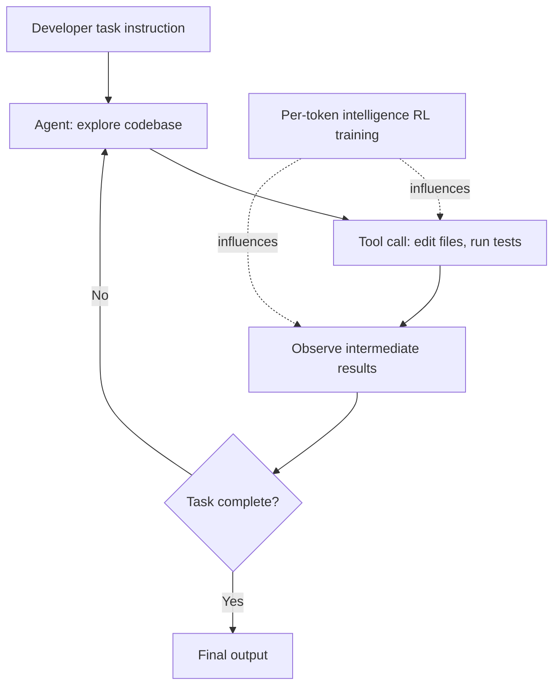

Any team that has built with coding agents knows the wall. Hand an agent one long task, and the model reads files, calls tools, and reasons again and again, dozens of times over. Tokens pile up fast in this process, and the better the model, the more painfully that cost bites. Until now, "the smartest coding model" and "the model you can actually run all day" have been two different stories. SpaceXAI's newly announced Grok 4.5 is aimed squarely at closing that gap.

*An abstract depiction of a model designed from the ground up for coding and agentic work.*

## Overview

Grok 4.5 is a model that SpaceXAI says it trained from scratch for coding and autonomous agents. Rather than positioning it as a consumer chatbot, the company frames it as a tool for development and knowledge work, aimed at large codebases, tool use, and long-running tasks. Elon Musk introduced the model as "Opus-class, but faster, more token-efficient, and cheaper." The Opus referenced here is Anthropic's top model tier until recently.

What makes this announcement more than just another model launch is its pricing and training approach. Grok 4.5 is priced at $2 per million input tokens and $6 per million output tokens. Offering frontier-level performance at this price point shakes the long-standing assumption that "smart models are too expensive to run as agents for long stretches." From ThakiCloud's perspective, this shift is not someone else's problem. Cheap agentic intelligence directly changes the economics of any platform that runs agents around the clock.

## What Was Announced

Here is a summary of the disclosed facts. Grok 4.5 is SpaceXAI's first model trained specifically for coding and agentic work, and the company claims it outperforms peer models on engineering and knowledge-work tasks. Training took place alongside the code editor Cursor, in the context of SpaceXAI having acquired Cursor and then refining the model within that usage environment. In fact, Grok 4.5 is available across all Cursor plans from launch, and it is also offered through Grok Build and the SpaceXAI console. As of the announcement, however, it is not yet available in the EU.

The training infrastructure was also disclosed. The company trained this model across tens of thousands of NVIDIA GB300 GPUs, and stated that it invested heavily in reinforcement learning (RL) for per-token intelligence. SpaceXAI explains that this investment is precisely what created the token-efficiency gap versus Opus 4.8. In other words, the model was trained to handle the same task using fewer tokens, which directly translates into lower real-world costs.

## What "Training Specifically for Coding and Agents" Means

The phrase "trained for coding and agents" is easy to dismiss as marketing copy, but it carries a concrete design direction. General-purpose conversational models are optimized to answer naturally across a broad range of topics. Agentic models, by contrast, live or die on their ability to call tools across many steps, observe intermediate results, revise plans, and carry a long task through to completion. That ability cannot be learned from single-response quality alone; reinforcement learning that feeds the success or failure of an entire trajectory back as a reward signal plays a major role.

The "per-token intelligence" SpaceXAI emphasizes should be read in this context. The structural reason token consumption explodes when an agent works on a long task is that the model tends to think more verbosely than necessary before reaching the same conclusion, or repeats unnecessary tool calls. Training the model to pack more judgment into each token lets it complete the same task in a shorter trajectory. Training inside Cursor, a real coding environment, ties into this as well. Using real-world tool-call patterns as a training signal can push an agent toward handling tools more efficiently.

## What the Pricing Changes

Offering frontier-level performance at $2 per million input tokens and $6 per million output tokens changes the profit-and-loss math of running agents. In workflows where an agent burns through millions of tokens all day moving across a codebase, the per-token price directly determines the service's margin. If performance is comparable, the cheaper model wins. Several analyses point out that Grok 4.5 is dramatically cheaper than Fable 5 or GPT 5.5, and that if the benchmark gap is not large, price alone could decide which model gets chosen.

This matters because cheap agentic intelligence reopens workflows that had previously been shelved due to cost. Tasks that consume large amounts of tokens, such as automated code review, large-scale refactoring, or always-on monitoring agents, benefit the most from a lower per-token price. That said, this math comes with a caveat. A low API price is also the cost of depending on a cloud vendor. Data leaves your environment, and pricing policy and availability are dictated by the vendor's decisions. The fact that Grok 4.5 is not yet available in the EU shows that this dependency risk is real, not theoretical.

## ThakiCloud's Perspective

The arrival of cheap agentic models touches both of ThakiCloud's products.

From Paxis's perspective, a low-cost, high-performance agentic model like Grok 4.5 reinforces the premise of the Agent-Native Cloud. Paxis is the agent control plane that runs on top of ai-platform, treating skills, tools, policies, and audit logs as first-class resources. In a structure where agents carry out long tasks across dozens of steps, you need a layer that routes that behavior through policy gates and records it in audit logs, regardless of which model is doing the work. As models get cheaper, agents get run more often and for longer, and the value of orchestration and governance grows accordingly. Cheap intelligence does not reduce the need for an agent platform; it increases it.

From the ai-platform perspective, the trade-off with self-hosting becomes sharper. A low API price is attractive, but for organizations with data sovereignty requirements, regulatory obligations, or on-premise needs, that dependency becomes an obstacle. ThakiCloud's ai-platform serves open-weight models on its own K8s and Kueue-based infrastructure, allowing agentic workflows to run without data ever leaving the environment. The combination Grok 4.5 demonstrates, per-token intelligence paired with efficient serving, poses the same challenge to the self-hosting camp. In other words, to compete with cheap cloud APIs, on-premise deployments must also achieve token efficiency and low serving costs at the same time. This is precisely the direction we are pursuing: making low serving cost our competitive edge.

## Limitations and Counterpoints

A few things need to be held in reserve when evaluating this announcement. First, much of the performance claim rests on the company's own statements. Phrases like "Opus-class" or "outperforms peers" are safer treated as marketing until independently benchmarked. How the model actually stacks up in real coding and agentic work will vary widely depending on each user's workload.

Second, price competitiveness does not automatically mean it is the best choice. A cheap rate comes bundled with vendor lock-in, data movement, and availability risk. Regional and regulatory constraints, like unavailability in the EU, are real, and such constraints can become decisive obstacles in domains like domestic public sector or finance where data sovereignty matters. Deciding on adoption based on performance and price alone risks running into regulatory and governance requirements later and having to walk it back.

Finally, the facts in this piece are drawn from a synthesis of public reporting and company statements. Detailed benchmark figures and precise training specifics should be verified directly from primary sources, and the picture may change as independent evaluations accumulate over time.

## Sources

- [Axios, "Scoop: SpaceXAI launches new model, Grok 4.5"](https://www.axios.com/2026/07/08/spacexai-grok-new-model)
- [TechCrunch, "SpaceXAI releases Grok 4.5, which Elon describes as an 'Opus-class model'"](https://techcrunch.com/2026/07/08/spacexai-releases-grok-4-5-which-elon-describes-as-an-opus-class-model/)
- [The Decoder, "Grok 4.5 is so cheap compared to Fable 5 and GPT 5.5 that benchmark gaps may not matter much"](https://the-decoder.com/grok-4-5-is-so-cheap-compared-to-fable-5-and-gpt-5-5-that-benchmark-gaps-may-not-matter-much/)
