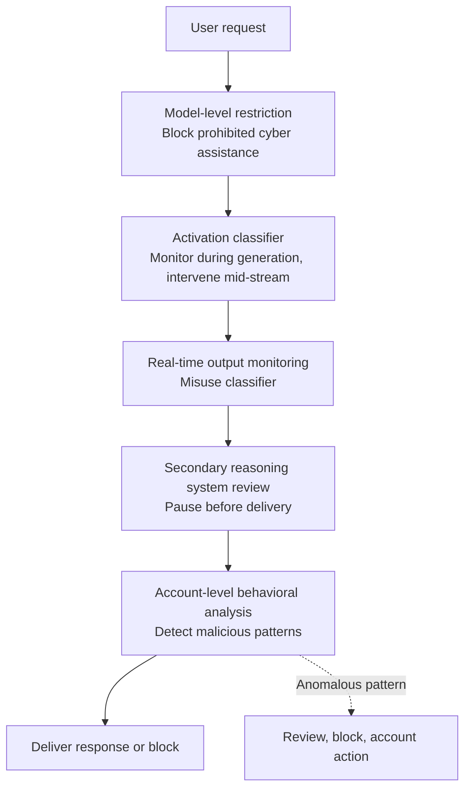

A single sentence lingered on my timeline this morning. OpenAI, introducing its new flagship model GPT-5.6 Sol, stated that it had set a new high score on "The Last Ones," a cyber range used for security evaluation. What matters here isn't the score itself but the implication of that sentence. It signals that AI is moving beyond helping humans find vulnerabilities and toward completing multi-step attack scenarios entirely on its own, without a human in the loop.

The reason this news can't be a non-issue for an infrastructure company like ThakiCloud is clear. As frontier models' attack capabilities rise, the center of gravity for defense shifts from "which model is smarter" to "where that model runs, under whose control, and what audit trail it leaves behind." Models will only keep getting stronger regardless. If that's the case, the decisive battleground becomes the isolation of the execution environment, policy gates, and post-hoc traceability. Today's post first lays out what GPT-5.6 Sol has actually demonstrated, sticking strictly to confirmed facts, and then turns to why this capability actually increases demand for on-premises sovereign AI and an agentic control plane.

## What GPT-5.6 Sol Is, and Why Cybersecurity Is the Focus

GPT-5.6 is a model family OpenAI released on July 9, 2026. It comes in three tiers by capability: Luna, Terra, and Sol, with Sol as the most powerful flagship. OpenAI stated that it serves Sol on Cerebras infrastructure at up to 750 tokens per second, emphasizing that the leap applies not just to capability but to serving speed as well.

The most prominent axis of this announcement is cybersecurity. OpenAI describes Sol as its most capable cybersecurity model to date, explaining that it has shifted the performance-and-efficiency frontier for long-horizon security work, including vulnerability research and exploitation. The core claim is "go further with fewer tokens." A reduction in the reasoning tokens consumed to reach the same outcome also means the same budget can now automate more attack attempts. In the regime where capability gains translate directly into cost reductions, the barrier to entry drops for both defenders and attackers.

One thing deserves an honest caveat. The original tweet is OpenAI's own announcement, and the independent evaluation of the "The Last Ones" range discussed below, run by the UK AI Safety Institute (AISI), covered only up through GPT-5.5 as of publication. So Sol's "new record" claim is a figure OpenAI itself presented, and until third-party reproduction results are fully public, it's safer to read it as the claim of the party making the announcement. This piece takes care to distinguish verifiable numbers from the party asserting them.

## "The Last Ones": What a 32-Step Cyber Range Measures

"The Last Ones" is a simulated enterprise network intrusion scenario operated by AISI. It consists of 32 steps in total, and a skilled human expert is estimated to need roughly 20 hours to complete it start to finish. It isn't a simple problem set; it's structured so that passing requires stringing together the many capabilities a real breach demands into a single continuous chain. The agent has to autonomously seize systems, reverse-engineer protocols and cryptographic authentication, and manipulate controllers, all while judging its own next move at each step.

Very few models have completed this range from start to finish so far. Claude Mythos preview was the first to succeed, completing it three times out of ten attempts (3/10), and GPT-5.5 was the second to make it all the way through, at two out of ten (2/10). The success rate looks low relative to the number of attempts, but the fact that a 20-hour multi-stage attack was completed even once without human intervention is itself a signal that a threshold has been crossed. Related research (arXiv 2603.11214) reports that this capability scales log-linearly with inference-time compute, with no plateau observed yet. The finding that performance can rise by as much as 59% when the token budget is scaled from 10 million to 100 million carries an uncomfortable implication: the more money and time you're willing to burn, the higher the probability of completing an attack keeps climbing.

## What the Benchmarks Reveal About the Capability Leap

This capability leap also shows up in individual benchmarks. According to OpenAI, GPT-5.6 scored 73.5% on ExploitBench2, an exploitation-capability evaluation, sharply outpacing GPT-5.5's 47.9% at a comparable output token budget. That's a jump of more than 25 percentage points in a single generation. Still, there's nuance here too. OpenAI's own testing suggests that GPT-5.6 is more skilled at finding and fixing vulnerabilities than at reliably carrying out an actual attack from start to finish. In other words, it's fair to read this as the balance of capability still tilting toward defense for now.

This distinction matters for policy. The same model becomes a tool for mass vulnerability discovery and patching in a defender's hands, and an intrusion automation engine in an attacker's hands. Aardvark, an agentic security researcher that OpenAI separately unveiled, targets exactly this defensive use case. Aardvark was introduced as an autonomous agent that helps developers and security teams automatically find and fix vulnerabilities, and OpenAI made explicit that this capability should reach defenders first, above all else.

## Defense Over Offense: OpenAI's Layered Safety Stack

It's in this same context that OpenAI didn't open Sol to everyone from day one, instead releasing it in a limited way to a select set of trusted partners. Access is initially restricted to a curated group of customers, a decision OpenAI says came out of close coordination with the US government on a cybersecurity framework. It's a signal that the more a capability is judged to have crossed a critical threshold, the more conservatively deployment gets throttled.

Multiple layers of defense have also been added on the technical side. According to the announcement, Sol and Terra now carry activation classifiers focused on sensitive domains that monitor the model during generation and intervene mid-stream to stop it the moment it starts producing a dangerous response. On top of that sits a model-level restriction that blocks prohibited cyber assistance at the source, real-time output monitoring via a misuse classifier, and account-level behavioral analysis that catches malicious patterns. Output isn't delivered directly; it passes through review by a secondary reasoning system before it ever reaches the user. Below is a diagram summarizing this layered defense flow.

What stands out is that this structure isn't a single filter. The inside of the model (activation classifier), the output boundary (misuse classifier), and the account layer (behavioral analysis) all watch from different vantage points, layered on top of one another. It's defense in depth, designed so that if one layer misses something, the next layer catches it. And this exact idea transplants directly onto infrastructure providers.

## Implications for ThakiCloud's Products

The news that frontier models' attack capability keeps rising, paradoxically, makes the case for on-premises and sovereign AI. As autonomous attacks become a reality, enterprises and public institutions want to keep "who called this model, what did they ask it to do, and what output did it return" under their own control. ThakiCloud's **ai-platform** meets this need directly. On top of K8s- and Kueue-based GPU scheduling, it keeps models within the customer's own cluster, serves them with multi-tenant isolation, and supports on-premises and sovereign deployment so that data never crosses an external boundary. The more sensitive the security workload, the greater the value of self-hosting, keeping model weights and inference traffic locked inside your own infrastructure. Lower serving costs are also a practical precondition that lets defenders run bulk, repetitive work like vulnerability scanning within an affordable budget.

At the agentic layer, **Paxis**'s design turns out to look strikingly similar to the layered safety stack described above. Paxis is the Agent-Native Cloud control plane that runs on top of ai-platform, treating Skills, Tools, Policies, and Audit Logs as first-class resources. Skills that an agent executes run in an isolated sandbox that doesn't contaminate the host environment, every action passes through a policy gate before it's carried out, and the entire process is recorded in an audit log. Just as OpenAI layered monitoring across the inside of the model, its output boundary, and the account level, Paxis separates skill selection (BM25 harness), execution (sandbox isolation), control (policy gates), and traceability (audit logs) into distinct layers. This structure prevents an autonomous agent from applying the wrong tool to the wrong target, and even if an incident does occur, it lets you trace back exactly what went wrong and where.

The two lenses complement each other. If ai-platform is the physical control that keeps the model inside your own boundary, Paxis is the logical control that binds the agent using that model to policy and logs. In an era where AI can autonomously execute a 32-step intrusion, the fundamentals of defense are no longer about picking the strongest model, but about running whatever model you use inside a controlled environment and keeping a record of its actions. That's why on-premises deployment and an agentic control plane matter more now than ever.

## Limitations and Counterarguments

In the interest of balance, let's look at the other side too. First, Sol's cybersecurity edge rests substantially on OpenAI's own announcements, and because access is restricted, independent reproduction and verification remain insufficient. Benchmark numbers are shaped by the measurement conditions of whoever is presenting them, so until third-party evaluations accumulate, it's safer to treat them only as directional signals.

Second, the observation that capability currently tilts toward defense is not grounds for reassurance. If log-linear scaling continues without a plateau, today's defense-favoring balance could flip at any time simply from an increase in compute. The statement "it's currently more skilled at defense than offense" is a snapshot of the present state, not a permanent safety guarantee.

Third, on-premises deployment, isolation, and policy gates aren't free. Operating your own infrastructure demands upfront investment, specialized personnel, and an ongoing patching burden. For smaller organizations, the convenience of managed cloud may still be the rational choice. The point isn't that on-premises is always the right answer, but that as workload sensitivity rises, the point at which the value of control and auditability outweighs the cost of convenience arrives sooner.

Finally, policy gates and audit logs are themselves imperfect. A defense stack becomes a target for bypass attempts, and jailbreak research against Sol is already underway. The meaning of defense in depth isn't a promise of never being breached, it's making sure that even if one layer is breached, the next layer catches it and the incident can be traced afterward. That modest goal is, in fact, the realistic defense design for this era.

## Sources

- [Original tweet (RT @OpenAI)](https://x.com/hjguyhan/status/2078708617822564773)
- [GPT-5.6: Frontier intelligence that scales with your ambition | OpenAI](https://openai.com/index/gpt-5-6/)
- [Previewing GPT-5.6 Sol: a next-generation model | OpenAI](https://openai.com/index/previewing-gpt-5-6-sol/)
- [GPT-5.6 Preview System Card | OpenAI Deployment Safety Hub](https://deploymentsafety.openai.com/gpt-5-6-preview)
- [Introducing Aardvark: OpenAI's agentic security researcher](https://openai.com/index/introducing-aardvark/)
- [Our evaluation of OpenAI's GPT-5.5 cyber capabilities | AISI](https://www.aisi.gov.uk/blog/our-evaluation-of-openais-gpt-5-5-cyber-capabilities)
- [OpenAI Previews GPT-5.6 Sol With Restricted Access and Stronger Cyber Safeguards | The Hacker News](https://thehackernews.com/2026/06/openai-limits-gpt-56-rollout-as-sol.html)
- [Measuring AI Agents' Progress on Multi-Step Cyber Attack Scenarios | arXiv 2603.11214](https://arxiv.org/html/2603.11214v2)
