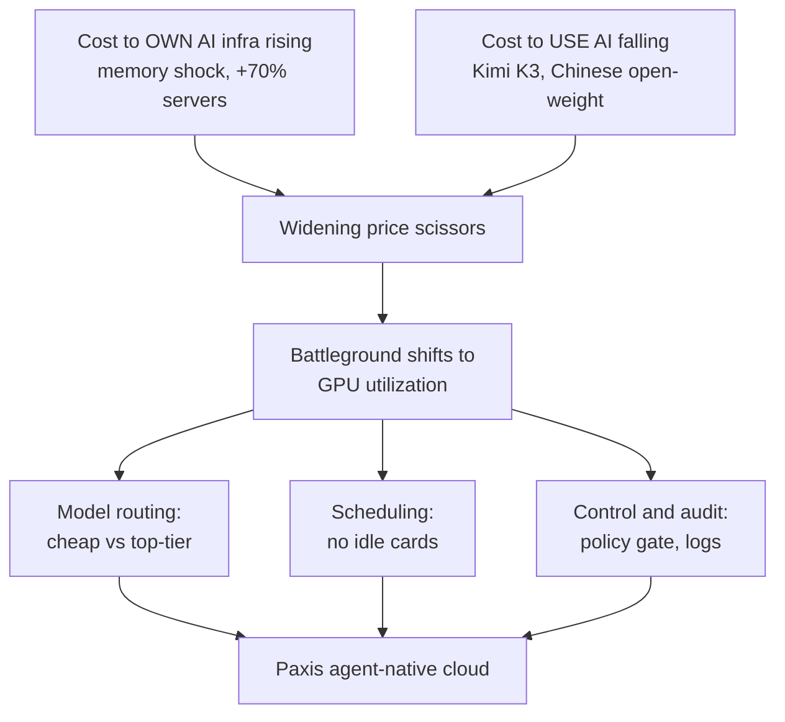

Scanning the news this morning, one thing caught my eye. Two price tags, moving in exactly opposite directions on the same date, sat side by side. On one side, the cost of buying the equipment to run AI was climbing to an all time high. On the other, the cost of running AI once was collapsing to an all time low. Normally, when input costs rise, sale prices rise too. But right now, the price of raw materials and the price of the finished product have turned their backs on each other and are pulling apart. That widening gap is the whole story of today's piece.

## The Cost of Ownership Climbs to an All Time High

Let's start with the side that's rising. Digital Daily's "AI Stackflation" series reports that the memory shock has reached beyond the large cloud providers, all the way into AI startups' server rooms. The cost of new server procurement for question answering AI company 42Maru jumped about 70 percent from before. A 4TB SSD quote that was 1.3 million won two weeks ago came in at 2.8 million won this week, more than double. Samsung Electronics and SK Hynix have notified major customers like Google and Microsoft that server DRAM contract prices will rise 60 to 70 percent, and they are now supplying only 70 percent of ordered volumes. Quote validity periods have shrunk from several months to one or two weeks, so companies are either locking in volume ahead of further price hikes or postponing procurement that isn't urgent.

As prices rose, the companies with the lightest load moved first. Search summarization service Liner switched cloud providers entirely, citing the cloud cost volatility that memory pricing had shaken loose. The heavier a company's own server room, the more directly it takes this shock; the more a company's workload sits on rented infrastructure, the faster it can move. This is the moment when the price of ownership turns into rigidity.

It isn't just equipment prices going up. The wallets of the big players who fund the whole board are closing too. UBS projects that capital expenditure growth among the four major hyperscalers, including Microsoft and Amazon, will fall sharply from 76 percent in 2026 to 25 percent in 2027 and 6 percent in 2028. In Bank of America's July fund manager survey, 82 percent of respondents named semiconductors the most crowded trade in the market right now, the highest reading the survey has ever recorded. Power shortages and regulatory risk have also become real, real enough that New York State has imposed a one year moratorium on new data center construction. The era of indiscriminate capacity expansion is over, and the question is shifting from "should we build" to "how much will it earn." The decision to own infrastructure has never been this expensive or this heavy.

## The Cost of Use Collapses to an All Time Low

Now let's look at the other price tag. Korea Economic Daily called this situation the "paradox of the semiconductor crash." The Philadelphia Semiconductor Index surged 89 percent in the second quarter, then fell 15 percent in July, and a memory ETF listed in April spiked 166 percent in three months before dropping more than 20 percent. While the raw material market was swinging this wildly, the price of actually using AI was quietly breaking through the floor.

The trigger was Kimi K3, the open weight model that China's Moonshot AI released this week. It carries 2.8 trillion parameters in a mixture of experts architecture, activating only a portion of its 896 expert networks to save on compute. It supports a 1 million token context window and is compatible with the OpenAI SDK, which lowers the switching bar for existing developers. What really catches the eye is the price. The cost of processing a single task is $0.94, roughly half of Anthropic Opus 4.8's $1.80. DeepSeek V4 Flash drops as low as $0.02, and GLM 5.2 comes in at $0.37.

This isn't the breakthrough of a single model, it's the whole trend tilting. According to Newsis, Chinese open weight models such as Tencent, Xiaomi, DeepSeek, MiniMax, and Zhipu AI swept the top five spots in weekly token usage on OpenRouter, the AI model brokerage platform. As of the last week of June, Chinese models' share stood at 48 percent, far ahead of the US share of 20 percent, a complete reversal of the picture from a year ago, when the US led 74 percent to China's 20 percent. Mozilla CTO Raffi Krikorian explained that, depending on the nature of the workload, costs can be cut to as little as 1/50 of top tier models. APIs for models like DeepSeek and Qwen run 10 to 150 times cheaper than top tier US models. Companies are moving to a two tier approach, handing routine work to cheap open weight models and reserving top tier models only for the hardest tasks.

Still, a low price doesn't mean it can be thrown at anything. Behind the attractive pricing of Chinese origin models lies the shadow of data sovereignty and security review, and public sector and financial institutions can't reach for them so easily. Once Kimi K3's full weights are released on July 27, companies will be able to download the model and serve it directly on their own infrastructure. Holding both the appeal of price and the safety of control ultimately leads to the path of running open weight models on your own cluster. That's why cheaper models don't kill on premises demand, they fuel it.

## When the Scissors Widen, the Battleground Shifts

Lay the two price tags on top of each other and the picture comes into focus. It's a pair of scissors, the cost of owning equipment opening upward, the cost of using AI opening downward. I want to flag a common misreading here, the conclusion that because models have become common and cheap, infrastructure no longer matters. It's the opposite. The cheaper the finished product gets, the more the cost ratio of the equipment that produces it determines the entire margin.

Investor Gavin Baker, quoted by Korea Economic Daily, gets right to this point. He views the spread of low cost models as, if anything, "the most powerful bull case for AI infrastructure." When tokens get cheaper, people use more tokens. It's not that people use less in proportion to the price drop, they use far more precisely because it's cheaper. The paradox Jevons observed with coal is repeating itself now on top of GPUs. If that's the case, the battleground shifts away from "who has the better model" and toward "how many tokens can you squeeze out of the GPUs you already have," in other words, utilization.

Here is one diagram summarizing how the widening of these two price tags shifts the battleground.

Digital Daily's "AI for Everyone" story shows this problem at national scale. As the government deploys 512 Nvidia B200 GPUs for a nationwide AI chatbot, it has fallen into a dilemma over whether to split the work across two or three providers or concentrate it in one. Splitting means each service can't withstand peak traffic; concentrating means losing ecosystem diversity. What's interesting is that the government plans to adjust leased capacity every month, after the fact, based on monthly active users and token usage. Where the number of cards is fixed, the ability to dynamically reallocate resources in line with usage ends up deciding who wins and who loses. Whether it's 512 cards or 50,000, the essence is the same.

## So What Do You Need to Have in Place

As the scissors widen, what's left to differentiate on narrows to three things. Routing that automatically sends each task to the right priced model, scheduling that fills workloads without leaving cards idle, and control and logging that let every one of those executions be traced back later. This is exactly why I want to bring up ThakiCloud's agent native cloud, Paxis, here. Paxis treats Skills, Tools, Policies, and Audit Logs as first class resources, and it builds the two tier approach, splitting work between cheap open weight models and top tier models, directly into the product through a CostRouter that handles per task model selection. The two tier strategy the companies above have adopted is exactly this feature's use case.

Scheduling runs on Kueue over sovereign on premises Kubernetes, which means it handles exactly the same class of problem as the usage based reallocation the "AI for Everyone" case faces. Control is handled by policy gates, audit logs, and isolated sandbox execution. This is where it connects to today's policy news. The revised AI Basic Act, taking effect July 21, actually requires labeling for generative AI and management standards for high impact AI, and public procurement gives benefits such as relaxed contract requirements to certified products. It's the same logic behind the National Assembly Research Service's advice to redefine sovereign AI, not by where the model originates, but by "sovereign control." The US Department of Commerce cutting off overseas access to Anthropic's models for three days last June, then restoring it three weeks later, already showed how fragile a service built on someone else's API can be. The ability to run execution inside your own cluster, filter it through policy, and prove it with logs is regulatory compliance and control itself, at the same time.

To sum up: ownership gets more expensive, and models get more commonplace. What creates value in between isn't getting your hands on a good model, it's the density of operations, routing commoditized models cheaply, scheduling them without gaps, and controlling them in an auditable way. The two price tags moving in opposite directions this morning were, in the end, asking the same question. How well are you running what you already have.

## References

This article was written by synthesizing the news below.

- News1, ["Adopt After Testing K-NPU": FuriosaAI Accelerates 'Full Stack Proof of Concept Strategy' in Europe](https://www.news1.kr/industry/sb-founded/6226804)
- Digital Daily, [[AI Stackflation Part 5] Memory Shock Reaches AI Companies Too... "Server Purchase Costs Up 70%"](https://www.ddaily.co.kr/page/view/2026071617390023984)
- Korea Economic Daily, ["The Cheaper It Gets, the More We Use It": The Paradox of the Semiconductor Crash Shaken by 'Value for Money AI'](https://www.hankyung.com/article/202607192100i)
- WikiTree, [Etched Valued at $20 Billion Before Shipping a Single Chip, as Jane Street and Sequoia Both Place Bets](https://www.wikitree.co.kr/articles/1147129)
- Global Economic, [AI Investment Shifts from 'Expansion' to 'Selection'... Hyperscaler CAPEX Slowdown Ripples Through Semiconductors](https://www.g-enews.com/view.php?ud=2026071906435432182bd56fbc3c_1)
- Digital Daily, [[AI for Everyone Part 4, Final] GPU Distribution Dilemma... "Spread Across Multiple Providers vs. Focus and Concentration"](https://www.ddaily.co.kr/page/view/2026071613325666245)
- ZDNet Korea, [SpaceX Negotiates Multi Billion Dollar AI Computing Supply Deal with the US Pentagon](https://zdnet.co.kr/view/?no=20260719071015)
- ZDNet Korea, [China's Moonshot Unveils New AI 'Kimi K3', Closing In Right Behind OpenAI and Anthropic](https://zdnet.co.kr/view/?no=20260718173700)
- ZDNet Korea, [ZTE Unveils AI Agent Smartphone 'NaviX Ultra'](https://zdnet.co.kr/view/?no=20260719003653)
- iNews24, ["What's the Real Living Review for This Apartment": Naver's Conversational Search AI Tab Upgrades Personalized Information](http://www.inews24.com/view/1986464)
- The Biz, [[Weekly Bank Issue] "AI Is the Future": 'AX' Spreads Across the Banking Sector](http://www.the-biz.co.kr/news/articleView.html?idxno=724547)
- News1, ["We'll Give You a Discount on Gemini": Korea's Three Telecom Carriers Compete to Attract Users in the Era of AI as a Necessity](https://www.news1.kr/it-science/cc-newmedia/6230746)
- Yonhap News, [[AI Basic Act] Part 1: Revised Act Takes Effect on the 21st... Korea's AI Legal Framework Is Ready](https://www.yna.co.kr/view/AKR20260717029400017?input=1195m)
- Newsis, [After Semiconductors, AI Too Becomes a Strategic Asset... Research Service Advises "Sovereign AI Strategy Needs a Rewrite"](https://www.newsis.com/view/NISX20260714_0003709278)
- Newsis, [China Sweeps Top 5 in Weekly AI Platform Usage, Shaking Up Expensive US AI](https://www.newsis.com/view/NISX20260719_0003713825)
- ZDNet Korea, [US Databricks Raises New Funding, Valuation Reaches $188 Billion](https://zdnet.co.kr/view/?no=20260718234826)
- ZDNet Korea, ["Refining Generative AI Security": Monitorapp Upgrades AI Security Solutions](https://zdnet.co.kr/view/?no=20260718202637)
