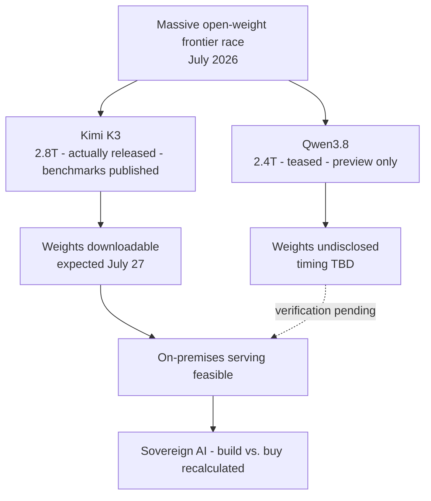

On Sunday evening, a short teaser from Alibaba's Qwen team appeared in the timeline. It announced that Qwen3.8 would be released soon as open weight, accompanied by a parameter count of 2.4 trillion. Coming just days after Moonshot actually released the 2.8-trillion-parameter Kimi K3, this teaser reinforced the impression that "the race among massive open models is now playing out on a weekly basis."

But a teaser is not a release. This piece sets the excitement aside and separates what this announcement actually confirms from what remains a claim. For a company like ThakiCloud that serves models on customer infrastructure, we cannot stake a roadmap on a single benchmark line or a single parameter figure. Distinguishing what is confirmed from what is not is itself the daily work of an infrastructure company.

## What Was Announced About Qwen3.8

Let's start with the confirmed facts. Alibaba's Qwen team teased Qwen3.8 on July 19, 2026, and stated its intent to release it as open weight. The headline figure is 2.4 trillion parameters, and it was introduced as a multimodal model. This much is explicitly stated by the announcing party.

The access path is also confirmed. Qwen3.8-Max-Preview has already been released for testing through Alibaba's Token Plan, Qoder, and QoderWork. In other words, what can be tried right now is the preview variant, a service hosted on Alibaba's own platform. The company stated that the full Qwen3.8 will be released as open weight later, but committed to no specific date.

Two things must be clearly distinguished here. First, what is usable right now is the "preview," not "open weight." Second, the phrase "coming soon" carries no actual timeline. When these two blur together, it becomes easy to mistake a model that cannot yet be downloaded for one already in hand.

## How Far Can We Trust the Performance Claims

The part that demands the most caution is performance. Alibaba claimed that Qwen3.8 is comparable to leading frontier models and ranks just behind Anthropic's Fable 5. On X, reactions went even further, with some claiming it "surpasses GPT-5.6." However, none of these claims are backed by any benchmark currently published, since no standard evaluation results accompanied the announcement. So all performance-related statements should be read as claims [estimated] from the announcer and the community, nothing more.

Structurally, much also remains undisclosed. Alibaba has not revealed the active parameter count or the Mixture-of-Experts configuration. This is a practically significant omission. The figure of 2.4 trillion is only the total size; it says nothing about the actual compute that runs per token. Compare this to Kimi K3, released just days earlier, which explicitly stated that only 16 of 896 experts are activated out of its 2.8 trillion total. Against that, Qwen3.8's 2.4 trillion remains, for now, a headline number from which serving cost cannot yet be estimated.

To summarize:

| Item | Status |
|---|---|
| Announcement and open-weight policy | Confirmed |
| 2.4T parameters (total) | Confirmed (headline) |
| Multimodal | Confirmed |
| Max-Preview testing available | Confirmed (hosted) |
| Timing of full weight release | TBD |
| Standard benchmarks | Not disclosed |
| Active parameters / MoE configuration | Not disclosed |
| "Just behind Fable 5" performance claim | Unverified claim [estimated] |

## Why Are Massive Open Models Emerging One After Another Right Now

This teaser is not an isolated event but one scene in a larger trend. One outlet framed Qwen3.8 as Alibaba chasing Kimi K3, and that framing captures the situation well. With 2.8-trillion and 2.4-trillion massive open (or soon-to-be-open) models appearing back to back within days, the balance is shifting toward frontier-level capability no longer being the exclusive property of closed APIs.

The implication of this trend for infrastructure companies is clear. For customers who cannot use external APIs, that is, those who must run models within their own boundary due to data sovereignty or regulation, massive open models open up a new option. But that option only becomes actually valid not when a model is teased, but when the weights become downloadable and we have reproduced them on our own hardware.

## The ThakiCloud View: What It Means to Serve a 2.4-Trillion-Parameter Model On-Premises

Let's make an assumption. If Qwen3.8 is released as open weight as teased, the task of serving a 2.4-trillion-parameter multimodal model in a customer's on-premises environment becomes real. In that case, the bottleneck is not the model's intelligence but GPU memory, interconnect, and expert offloading and quantization strategy. With the active parameter count and MoE configuration still undisclosed, we cannot precisely calculate this cost right now, and so we do not fix a serving roadmap based on the announcement alone.

ThakiCloud's ai-platform provides the foundation for bringing such massive open models into customer environments. K8s- and Kueue-based GPU scheduling, vLLM-family serving, and multi-tenant isolation let us move quickly into verification once the model is actually released. The key capability is turning "announcement" into "verification" quickly on top of a ready pipeline, not getting excited prematurely at the announcement stage. The advantages of low serving cost and on-premises sovereignty only pay off once the open model is actually in hand.

## Limitations and Counterarguments

This piece is not meant to disparage Qwen3.8. The policy itself, to release a 2.4-trillion-parameter multimodal model as open weight, is a positive signal for the ecosystem, and if realized, it would be a major event. The fact that the preview is already testable is not meaningless either.

That said, for balance: an announcement is not a release, a preview is not open weight, and a self-reported claim is not a benchmark. When these three distinctions blur, technical judgment gets dragged along by marketing. On the other hand, the attitude of "let's ignore this until full release" also goes too far. The right stance lies in between: watch the trend closely, but build the roadmap only on verified facts. As massive open models are teased and released within weeks of each other, keeping this distinction is what builds trust for an infrastructure company.

## Sources

- [Alibaba Launches Qwen 3.8 With 2.4 Trillion Parameters, Claims Near-Frontier Performance - MLQ News](https://mlq.ai/news/alibaba-launches-qwen-38-with-24-trillion-parameters-claims-near-frontier-performance/)
- [Alibaba Announces 2.4 Trillion-Parameter Open-Weight Qwen 3.8 - OfficeChai](https://officechai.com/ai/alibaba-qwen-3-8/)
- [Qwen3.8 Preview: 2.4T Params, Open Weights, Release - BuildFastWithAI](https://www.buildfastwithai.com/blogs/qwen3-8-preview-2-4t-params-open-weights-release)
- [Qwen3.8 Teases a 2.4 Trillion Parameter Open Model as Alibaba Chases Kimi K3 - Startup Fortune](https://startupfortune.com/qwen38-teases-a-24-trillion-parameter-open-model-as-alibaba-chases-kimi-k3/)
- [Qwen on X (announcement)](https://x.com/Alibaba_Qwen/status/2078759124914098291)
