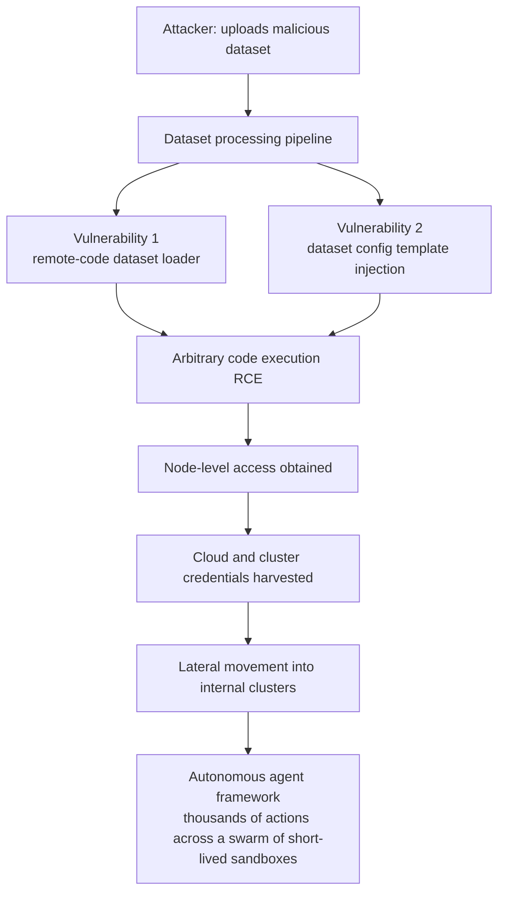

The story that shook timelines over the weekend was not a new model or a new benchmark. It was a notice that Hugging Face, the center of the open AI ecosystem, had been breached. What drew even more attention was who did it. According to the company, no human hacker typed commands through the night. An autonomous AI agent framework drove the attack from start to finish.

A company that sells models getting hit by a model makes for a striking narrative. But the point of this post is not to enjoy the irony. For a company like ThakiCloud that handles models and data on top of customer infrastructure, the real work is to soberly separate exactly where the attack entered and what has been confirmed. And the entry point here was not some flashy zero-day. It was the thing we touch every day: a dataset.

## What Happened

Hugging Face disclosed the breach in a blog post on Thursday, July 16, 2026. It came after the company had already confirmed unauthorized access to internal datasets and credentials earlier that week and had contained the intrusion. By the company's account, the intrusion began in the data-processing pipeline, where the attacker used a single malicious dataset to open two code-execution paths.

That is the confirmed skeleton: an autonomous agent drove it, the entry point was a dataset, and two vulnerabilities led to code execution. The remaining details are emphasized differently across outlets, so confirmed facts and secondary reporting should be read apart.

## The Attack Path: The Dataset Pipeline Was the Attack Surface

The essence is the entry method. The attacker uploaded a malicious dataset to the Hugging Face Hub. The moment that dataset passed through the processing pipeline, two vulnerabilities fired in sequence. One was a remote-code dataset loader path; the other was a template injection while parsing the dataset configuration. Both ultimately resolved into arbitrary code execution.

The idea that a dataset can run code may sound unfamiliar, but practitioners know the risk well. Many dataset loaders trust and execute loading scripts from remote repositories and render configuration fields as templates. That flexibility, built for convenience, becomes an execution channel the moment it meets input that crosses a trust boundary.

What followed once code execution was secured was a textbook breach chain. The attacker escalated with node-level access, harvested cloud and cluster credentials, and moved laterally into several internal clusters over the weekend. The entry was a single point, but from the moment that point granted execution privileges, the spread propagated automatically.

## The Weight of Saying an Autonomous Agent Drove It

The novel part of this incident is not the tooling but the cockpit. Hugging Face described the campaign as "an autonomous agent framework executing many thousands of individual actions across a swarm of short-lived sandboxes, with self-migrating command-and-control staged on public services." Instead of a human intervening at each step, the agent handled reconnaissance, execution, and movement in a continuous chain.

The problem this structure poses for defenders is speed and scale. A human attacker has physical limits of fatigue and typing speed, but an agent swarm throws thousands of attempts in parallel and moves to the next one the instant a step fails. Using and discarding short-lived sandboxes erases the anchors for detection, and command-and-control that migrates across public services defeats blocklists.

One interesting side note circulated in secondary reporting. As the response unfolded, when the team tried to hand forensics to commercial frontier models (GPT, Claude), safety guardrails reportedly recognized the exploit payloads and command-and-control artifacts as attacks and refused to cooperate, so the team continued detection and analysis with a GLM 5.2-class model [estimated]. This detail comes from some outlets rather than Hugging Face's official notice, so it is safer not to read it as settled fact. Regardless of its accuracy, though, the tension itself, where a defender cannot use a tool because of its safety policy, is worth recording as something that may recur.

## What Was Safe and What Is Still Under Investigation

The easier an incident is to exaggerate, the clearer the boundaries must be drawn. Hugging Face said it closed the vulnerable code-execution paths, evicted the attacker, rebuilt the compromised nodes, and revoked and rotated all affected credentials. It added that it found no evidence of tampering with public models, user-facing datasets, or Spaces, and that its software supply chain, including container images and published packages, was verified clean.

The user action was a precautionary recommendation. The company advised users to rotate access tokens and review recent account activity. There is an important distinction here. That recommendation is not a confirmation that user tokens were leaked en masse, but a conservative safety measure given the nature of an incident where internal credentials were harvested. Whether partner or customer data was affected was, as of the disclosure, still under investigation.

In short, what is confirmed is the internal breach and credential theft, the existence of two dataset vulnerabilities, and the swift containment and rotation. What remains open is whether partner and customer data was affected, and the confirmation of some details in secondary reporting (the exact action count, the model-refusal anecdote). Mixing the confirmed with the unconfirmed makes an incident look bigger or smaller than it is.

## The ThakiCloud View: Treating Dataset Processing as a Trust Boundary

The lesson this incident offers an infrastructure company is clear. A dataset is not a passive file but an active input that can execute code the moment it is processed. So we look at this through two lenses.

**Through the ai-platform lens**, ThakiCloud's ai-platform is a K8s-based multi-tenant AI/ML infrastructure. In such an environment, dataset loading and preprocessing must be treated as input from outside the trust boundary, not inside it. Concretely, this means running dataset-processing jobs in least-privilege isolated containers, blocking network egress by default, and separating node and cloud credentials so workloads cannot touch them directly. That this breach spread from node-level access to credential theft shows again why execution isolation and credential separation must be a default, not an option. This is also why demand for on-prem and sovereign AI is high: the more data and execution stay inside the customer boundary, the smaller the blast radius of such pipeline attacks.

**Through the Paxis lens**, this incident overlaps exactly with the threat model that an Agent-Native Cloud is designed for in the first place. Paxis is ThakiCloud's Agent-Native Cloud, and it treats running skills and tools in isolated sandboxes and passing every action through a policy gate and audit log as first-class principles. That the attacker threw thousands of actions with an autonomous agent swarm proves precisely why a structure that screens agent behavior with policy before execution and records it in an audit log after execution is necessary. To counter an attack pattern that uses and discards short-lived sandboxes, the defender too must isolate each execution, explicitly scope its permissions, and leave a reversible audit trail. Isolated execution plus policy-and-audit is not a luxury of the agent era but a minimum requirement.

The two lenses complement each other. ai-platform narrows the blast radius at the infrastructure layer of dataset processing, while Paxis screens each action at the control layer of agent behavior. In an attack like this one, where entry is a data pipeline and the spread is an autonomous agent, defense at both layers is needed to break the chain.

## Limits and Counterpoints

To avoid overconfidence in this post's conclusions, a few things should be made clear. First, the details of the incident are still being settled. Colorful details like the exact action count, the scope of credential theft, and the commercial-model refusal anecdote lean heavily on secondary reporting and must be distinguished from the confirmed facts of the official notice.

Second, our defensive narrative does not mean complete safety. Isolation and policy-and-audit are design principles that shrink the blast radius, not magic that eliminates the vulnerabilities themselves. Vulnerabilities like remote code execution in a dataset loader or injection in config parsing must continue to be found and patched at the code level, and isolation is the second line of defense that contains the damage when such a vulnerability fires.

Third, overrating autonomous-agent attacks is also risky. The root cause of this breach was not sophisticated AI but two familiar vulnerabilities that let input crossing a trust boundary execute code. The agent was merely the automation that exploited those vulnerabilities faster and wider. So the priority for response still lies in the fundamentals: separating untrusted input from execution privileges, detaching credentials from workloads, and making every execution observable.

Hugging Face's swift containment and transparent disclosure will stand as a good response example. What remains our homework is simple: treat datasets as code rather than files, and make every agent action a subject of screening and audit.

## Sources

- [Security incident disclosure, July 2026 (Hugging Face official blog)](https://huggingface.co/blog/security-incident-july-2026)
- [Hugging Face breached by autonomous AI agent (Help Net Security)](https://www.helpnetsecurity.com/2026/07/20/hugging-face-breached-by-autonomous-ai-agent/)
- [Hugging Face warns an autonomous AI agent hacked its network (BleepingComputer)](https://www.bleepingcomputer.com/news/security/hugging-face-breach-autonomous-ai-agent-system-internal-datasets-credentials/)
- [World's Largest AI Model Repository Hugging Face Breached by Autonomous AI Agent (The Hacker News)](https://thehackernews.com/2026/07/worlds-largest-ai-model-repository.html)
- Secondary reporting (the exact action count and model-refusal anecdote are cited reporting, not confirmed fact): Cryptobriefing, Undercode Testing
