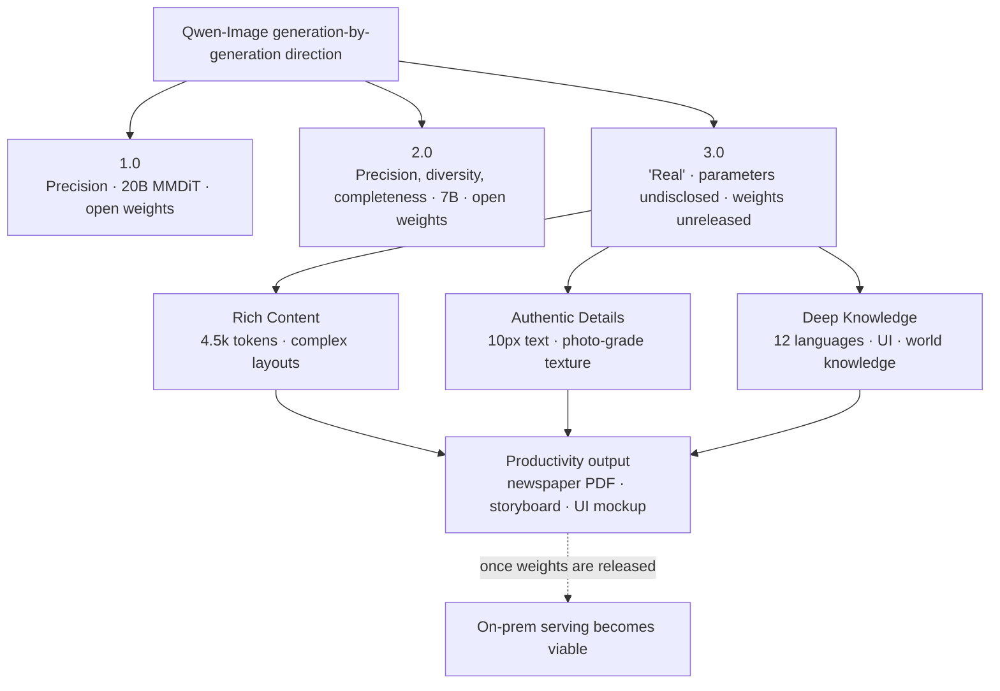

On Tuesday morning, the Qwen team's blog posted the announcement of the third generation of its image generation model. The name is Qwen-Image-3.0, and once again the team compressed the keyword it has attached to each generation into a single phrase. If 1.0 was "precision" and 2.0 was "precision, diversity, completeness, aesthetics, authenticity," the core of 3.0 is a single word: "Real" (实).

But an announcement is not a release. This article sets aside the flash of the demos to separate what has actually been confirmed in this announcement from what remains out of reach. When you're the one serving an image generation model on customer infrastructure, you can't lock in a roadmap based on a handful of demos and a capability blurb. Distinguishing what's confirmed from what isn't is, itself, the day-to-day work of an infrastructure company.

## What Qwen-Image-3.0 Actually Announced

Let's start with the confirmed facts. On July 21, 2026, the Qwen team announced Qwen-Image-3.0 and framed its direction around three pillars.

The first is "Rich Content." The model accepts input prompts up to 4.5k tokens, allowing it to render information-dense layouts in a single pass, such as newspapers, storyboards, or exam sheets. The most striking example in the announcement was a 3x3 grid image. Each cell was a different infographic (a tunnel safety comic, a spatial geometry lecture, a physics projectile-motion diagram, a cell/DNA structure comparison), and the entire grid was generated in a single pass from one 3.7k-token prompt. The team emphasized that this wasn't multiple images stitched together but a single generation. On top of that, the announcement also showed a "screen within a screen within a screen" nested render: a VSCode window containing Qwen Chat, which in turn contains a WeChat screen, which in turn contains a poster.

The second is "Authentic Details." The model can render text as small as 10px legibly, and depicts pores, hair, and skin texture close to photographic realism. Examples included an academic paper page dense with LaTeX equations, an actual newspaper page, adding handwritten annotations during an editing task, and restoring a damaged traditional painting.

The third is "Deep Knowledge." The model natively renders 12 languages and draws on world knowledge to generate over 100 art styles and a variety of UI interfaces. The announcement included examples of accurately rendered Japanese, Korean, and Spanish text, along with a claim that the model stays connected to the internet to reflect up-to-date information. As an example of generating a specific IP character on request, the announcement showed Qi Baishi and Van Gogh introducing Qwen-Image-3.0 in a livestream scene.

The access path is also confirmed. Every action button in the announcement post links to the text-to-image feature inside Qwen Chat. In other words, what you can actually try right now is a service hosted on Alibaba's platform, and this is preview-grade availability.

## What Hasn't Been Released Yet

This is where things need to be read carefully. This announcement is missing, wholesale, the information you'd need to check first before actually adopting an image generation model.

There are no weights. The announcement is a showcase of capabilities, and it doesn't link to a downloadable checkpoint on Hugging Face or ModelScope. Even a third-party community generator site marks 3.0 as "access pending." Parameter count, model architecture, and license are also not specified in the announcement. Compare this to how 1.0 was known to be a 20B-parameter MMDiT and 2.0 was known to have shrunk parameters down to 7B, both disclosed at the time. With 3.0, there's no clue yet as to the architecture.

There are no standard benchmarks either. Capabilities like 4.5k-token input or 10px text rendering are presented only through hand-picked demos, with no accompanying reproducible evaluation table like DPG or GenEval. So claims like "better than the previous generation" or "usable as a productivity tool" should be read as the presenter's assertions rather than verified numbers [unverified]. Demos are generally the best-looking results cherry-picked from many attempts, so failure rate and consistency need to be checked separately.

Here's a summary.

| Item | Status |
|---|---|
| Announcement / third-generation model | Confirmed |
| 4.5k-token input / complex layouts | Confirmed (demo) |
| 10px text / 12-language rendering | Confirmed (demo) |
| Usable via Qwen Chat | Confirmed (hosted) |
| Open weights (HF/ModelScope) | Not released |
| Parameters / architecture / license | Not disclosed |
| Standard benchmarks | Not released |
| "Productivity tool"-level performance | Unverified claim [unverified] |

## Image Generation's Shift from 'Pretty Pictures' to 'Productivity Tool'

A phrase that recurs throughout the announcement is the move from "good-looking" to "useful." This framing captures well what this generation is aiming at. Rather than producing one artistic image, it's targeting output you can drop straight into work: a newspaper page as a PDF, a short-drama storyboard, a complex UI mockup.

This direction has two implications for an infrastructure company. The first is serving. If image generation models become tools that reliably produce documents, infographics, and UI mockups, demand emerges for running these models within a customer's own boundary. Customers who can't send design assets or internal documents to an external API are a prime example. The second is utilization. The ability to accurately render dense text and UI opens the door to automating the production of infographics and mockups that people currently build by hand.

But that option only becomes real, not when a model is announced, but when its weights become downloadable and we've reproduced it on our own hardware. Right now, 3.0 is still at the stage before that.

## ThakiCloud's Perspective: What It Means to Serve an Image Model On-Prem

Let's run a hypothetical. If Qwen-Image-3.0 is eventually released with open weights, like the generations before it, then serving a diffusion-family image generation model in a customer's on-prem environment becomes a real task. In that case, the bottleneck isn't the model's expressive power but GPU memory, batch processing efficiency, and the serving configuration that balances latency and throughput. Right now, with parameter count and architecture undisclosed, we can't calculate that cost precisely, and that's exactly why we don't lock in a serving roadmap based on the announcement alone.

ThakiCloud's ai-platform provides the foundation for putting a model like this into a customer's environment. K8s- and Kueue-based GPU scheduling, along with multi-tenant isolation, let us move quickly into validation once a model is actually released. Image generation workloads have different load characteristics from language models, so tuning batch size and GPU allocation to those characteristics is what determines serving cost. Low serving cost and on-prem sovereignty are real strengths, but they only pay off once the open model is actually in hand.

There's also an angle on utilization. The ability to accurately render documents, infographics, and UI mockups makes this one more tool an agent can use. From the perspective of ThakiCloud's Agent-Native Cloud, Paxis, a generation capability like this becomes a target to wrap as a skill and run through isolated execution, passing policy gates and audit logs. But again, this angle only becomes relevant once the model is actually in hand.

## Limitations and Counterpoints

This article isn't meant to talk down Qwen-Image-3.0. The direction of rendering a complex 4.5k-token layout in a single pass, and drawing legible 10px text, would meaningfully raise the practicality of image generation if it holds up. The fact that it's already available to try in Qwen Chat is not without meaning either.

That said, for balance, it's worth stating plainly: an announcement is not a release, a demo is not a benchmark, and hosted availability is not open weights. When these three distinctions blur, technical judgment gets pulled along by marketing. The ability to generate a specific real person on request, or to faithfully simulate an actual UI, also raises separate concerns around copyright, likeness, and brand impersonation that need their own review. On the other hand, an attitude of "let's tune out until it's fully released" goes too far in the other direction. The right posture sits between the two: watch the trend, but build the roadmap only on verified facts. As announcements and releases keep coming in quick succession, holding that distinction is what builds trust for an infrastructure company.

## Sources

- [Qwen-Image-3.0: Rich Content, Authentic Details, Deep Knowledge - Qwen Team Blog](https://qwen.ai/blog?id=qwen-image-3.0)
- [Qwen Image 3 Generator (third-party, marked access pending)](https://qwenimage3.com/)
- [Qwen-Image GitHub (reference for prior-generation open weights)](https://github.com/QwenLM/Qwen-Image)
