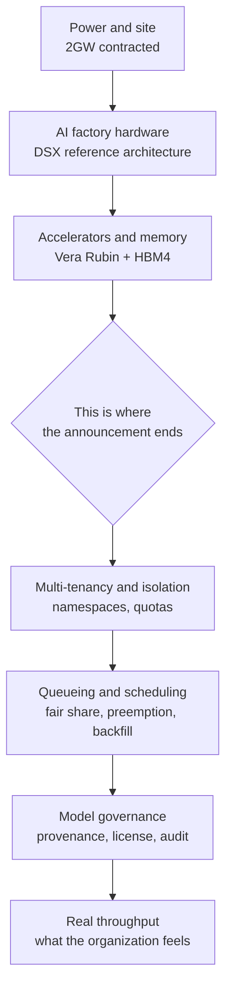

*A depiction of gigawatt-scale power funneling into one computational facility.*

## Why This Is Worth Reading

This piece is written for the platform engineers and technical decision makers who have to procure GPU clusters or run AI services in on-premises and sovereign environments. If you are drafting infrastructure plans for 2027 and beyond right now, this is for you.

Let me give you the conclusion first. Even when a 2-gigawatt AI factory begins operating in 2027, your organization's GPU queue will not shorten on that fact alone. When supply grows, the bottleneck does not disappear. It moves upstairs. The problem shifts from acquiring hardware to dividing the hardware you already have fairly and densely across the whole organization. Only the teams that built that layer in advance will convert the added supply into actual throughput.

## The Announced Facts, and Only Those

On July 24 and 25, 2026, SK Group and NVIDIA announced an expansion of their strategic partnership. Restricting ourselves strictly to what was disclosed:

First, the combined value of the two agreements exceeds 500 billion dollars. This figure is not a lump sum of cash committed by one company at one moment. It is the multi-year total covering both AI factory construction and memory supply. The announcement itself frames it as a combined value across two agreements, so reading it as a single capital expenditure line overstates the scale.

Second, SK Telecom will build an AI factory of up to 2 gigawatts in Korea. It will use NVIDIA's DSX platform, and the first phase targets operation sometime in 2027. Note the distinction: 2 gigawatts is the ceiling at completion, and what comes online in 2027 is the first phase.

Third, the DSX AI factory platform is based on NVIDIA's forthcoming Vera Rubin accelerated computing architecture. It bundles accelerated computing hardware, networking, software, and partner technologies into a single stack, with stated design goals of maximizing energy efficiency and lowering the cost per unit of output.

Fourth, SK hynix and NVIDIA signed a separate long-term agreement to co-develop next-generation AI memory. High bandwidth memory including HBM4 is the target, and the companies framed it as serving demand that stretches from large language model training through agentic AI and physical AI.

Fifth, both companies stated a shared goal of improving access to large-scale AI infrastructure across the Asia-Pacific region and establishing Korea as a hub for AI innovation.

That is the verified record. Everything below is interpretation from an infrastructure operator's point of view, and any figure not present in the announcement is marked as an estimate.

## What 2 Gigawatts Actually Means

The fact that the announcement is denominated in power rather than machines tells you something about this era. Data centers used to be counted in servers or racks. Now they are counted in contracted power, because as compute density rises the ceiling is set not by how many chips you can fit but by how much electricity you can pull in and reject as heat.

For a sense of scale, consider a comparison. A single APR1400 reactor, the standard large unit in Korea, has a capacity of roughly 1.4 gigawatts. Two gigawatts therefore means consuming, continuously and at one site, roughly what one and a half such reactors produce. This is a rough conversion offered for intuition only, since contracted power and average load behave differently in practice.

Converting to racks makes it more concrete. If you assume around 130 kilowatts for a single latest-generation high-density AI rack, then on pure IT load excluding cooling and ancillary systems you are looking at a facility that could house racks in the tens of thousands. This calculation is an estimate resting on published rack power figures, and the real number varies substantially with power usage effectiveness, distribution design, and the phasing of buildout.

For anyone who has run infrastructure, though, there is a more important point. Gigawatt-class new load is not a purchasing problem, it is a grid interconnection problem. Site acquisition, transmission capacity, substation equipment, and permitting all have to resolve in sequence before the first rack gets power. That is part of why a 2027 date reads as conservative.

## How DSX and HBM4 Change the Character of Procurement

Two technical points deserve attention.

The first is the full-stack reference architecture carrying the DSX name. It signals that the data center is shifting in character from a building you fill with servers to a factory you stamp out from a validated blueprint. When one vendor delivers compute, networking, storage, power, cooling, and the software above them as a bundle, the time spent on design and validation drops sharply. The tradeoff is that your entire stack becomes tied to one vendor's roadmap. Entering that exchange knowingly and entering it blindly produce very different outcomes a few years later.

The second is the memory co-development. Any team that has served a large mixture-of-experts model knows that the ceiling on real throughput is set by memory bandwidth rather than raw compute. Every generated token requires reading active parameters out of memory, so in low-batch regimes bandwidth translates directly into latency. A memory company and a GPU company aligning roadmaps in advance means the effective throughput of the next generation of accelerators becomes more predictable than it is today.

The diagram below separates the layers this announcement fills from the layers that remain empty.

*The announcement fills the three lower layers. The four above them remain each organization's own work.*

## What Shifts in Korea's AI Infrastructure Landscape

Until now, the most common bottleneck for Korean companies running AI workloads has been sheer volume. When and how many GPUs you could get determined project timelines, which made procurement itself the strategy.

That premise starts to wobble after 2027. Once large-scale accelerated compute sits inside the domestic region, the option of training and serving without moving data across borders widens considerably. In domains such as public sector, healthcare, and defense, where data export is simply not permitted, this difference is decisive. Sovereign AI stops being a political slogan and becomes a procurable product.

Overlaying this announcement on other recent moves makes the direction clearer. Japan has bound government and industry together around robotics AI at a scale of trillions of won, pivoting toward the physical AI front. In Korea, national-scale GPU resources have been allocated to independent foundation model programs and security-focused AI competitions, and the center of gravity in evaluation has shifted from raw benchmark performance to field applicability in public services, healthcare, manufacturing, and defense. The 2-gigawatt announcement lands on top of that current of countries pulling models and compute inside their own borders. Compute supply has become a line item in national industrial policy.

There is a common misreading here. An AI factory is a facility that supplies raw material. It is not the platform your organization uses. Once power, racks, and accelerators are ready, an entirely different problem begins the moment several teams share one cluster. Who gets how much, whether an urgent inference workload may evict a long-running training job, where an evicted job resumes from, and by what rule idle capacity gets filled all have to be decided in advance. Without those rules, idle GPUs and long queues appear in the same cluster simultaneously. Multiplying supply tenfold does not make that go away.

## What This Means for ThakiCloud's Products

Reading this announcement confirmed something for us: the two products we are building aim precisely at the upper four layers of that diagram.

Our ai-platform is the infrastructure layer that operates AI and machine learning workloads on Kubernetes. It uses Kueue to handle queueing and quotas, enforcing organization-level fair sharing, preemption, and backfill as rules rather than conventions. It manages inference throughput through vLLM-based serving, and multi-tenant isolation lets many teams and many customers share one cluster safely. Because it was designed for on-premises and sovereign environments from the start, the large-scale accelerated compute arriving in the domestic region can be placed directly underneath it. What an AI factory increases is the numerator. What this layer touches is the efficiency that turns that numerator into throughput.

Paxis is the agent-native cloud control plane that runs above it. It treats skills, tools, policies, and audit logs as first-class resources. Large supply implies large usage, and large usage without exception becomes a governance problem. That is why you need a model catalog that vets where a model came from and what license it carries, a policy gate that admits agent execution according to autonomy tier, and audit logs that record what ran when. As compute becomes abundant, the ability to control it becomes the differentiator.

The two lenses complement each other. You need a cheap and plentiful serving base before running agents continuously makes economic sense, and you need control over agent execution before you can sell that abundant compute into regulated industries.

## Limits and Counterarguments

To avoid reading this announcement only optimistically, here is the other side.

An announcement is not a groundbreaking. The disclosed material includes items at the letter-of-intent stage, and what comes online in 2027 is the first phase of up to 2 gigawatts. When the full scale materializes is not yet confirmed information.

The 500 billion dollar figure also needs careful handling. It is a multi-year total across two agreements, and it aggregates transactions of different character, such as memory supply contracts. Converting it into data center construction capital expenditure and citing it as domestic investment would overstate the case.

Most of the schedule risk sits in power and land rather than semiconductors. Grid interconnection, transmission capacity, and permitting are not items technology can compress.

The strongest counterargument goes like this: if supply rises, unit prices fall, and then much of the operational worry gets solved with money. There is merit in that. What the past decade of cloud history showed, however, is that falling unit prices grew demand even faster, and cost management and resource allocation became harder problems as a result. The cheaper it gets, the more teams put more workloads on it, and at that moment you are back to the question of who is using how much.

## Wrapping Up

Three things are settled by this announcement. An AI factory of up to 2 gigawatts is coming to Korea, its first phase switches on in 2027, and the accelerators and memory layered on top are bound into a single roadmap. The scale is large, but the nature of it is raw material supply.

Which brings us back to the conclusion stated at the top. Supply can grow without the bottleneck disappearing, because it moves upstairs. What you should be preparing between now and 2027 is not a GPU purchase agreement but the way your organization divides those GPUs.

Concretely, I would check three things. First, verify that per-team quotas, priorities, and preemption policy live in the cluster as code rather than in a document. Second, actually test that an evicted training job resumes from a checkpoint rather than from scratch. Third, ask whether you can produce a list of the provenance and license of every model you are currently serving. If you cannot answer those three immediately, the queue will very likely still be there on the day the 2 gigawatts come online.

## Sources

- NVIDIA Newsroom, [SK Group and NVIDIA Expand Strategic Partnership Across AI Factories and Next-Generation Memory](https://nvidianews.nvidia.com/news/sk-group-and-nvidia-expand-strategic-partnership-across-ai-factories-and-next-generation-memory)
- GlobeNewswire, [SK Group and NVIDIA Expand Strategic Partnership Across AI Factories and Next-Generation Memory](https://www.globenewswire.com/news-release/2026/07/25/3333161/0/en/SK-Group-and-NVIDIA-Expand-Strategic-Partnership-Across-AI-Factories-and-Next-Generation-Memory.html)
- SK hynix Newsroom, [SK Group and NVIDIA Expand Strategic Partnership Across AI Factories and Next-Generation Memory](https://news.skhynix.com/en/skhynix-nvidia-partnership-2026/)
- Tom's Hardware, [Nvidia and SK Group enter $500 billion AI partnership](https://www.tomshardware.com/tech-industry/artificial-intelligence/nvidia-and-sk-group-enter-usd500-billion-ai-partnership-plan-to-supercharge-ai-infrastructure-with-next-gen-memory-and-massive-ai-factories)
- StockTitan, [SK Telecom Plans 2-Gigawatt AI Factory to Come Online in 2027](https://www.stocktitan.net/news/NVDA/sk-group-and-nvidia-expand-strategic-partnership-across-ai-factories-flao3olat3l2.html)
