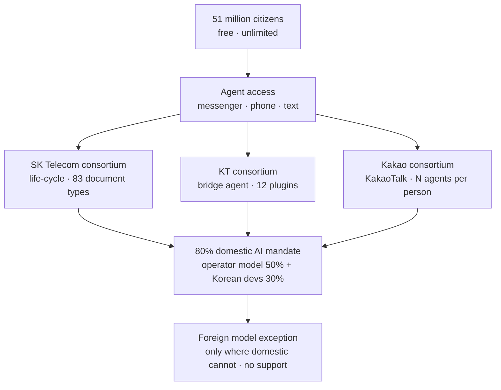

*The post's core concept rendered as an image. Many requests converging into a single utility network.*

## Why Read This

This post is for CTOs and technical decision-makers at Korean enterprises and public institutions planning AI infrastructure investment, and for the teams that operate the agent execution layer. One takeaway is enough: the headline of this week's Korean news was "free AI for all citizens," but the real story was the **80% domestic mandate**. The demand-side market has been restructured by regulation, and the battlefield is moving from model capability to the execution layer where agent actions can be proven.

## Free, Unlimited, 51 Million

South Korea's government will provide free, unlimited generative AI services to roughly 51 million citizens. The program is called "모두의 AI" at home and "AI for All" abroad, led by the Ministry of Science and ICT. A beta service is scheduled to start at the end of September, with a full launch by the end of the year. Citizens do not install anything. Agents arrive through the messengers they already use, by phone, by text.

What the agents handle is not Q&A. It is real work connected to government systems: medical appointments, apartment searches, tax guidance, learning content for children. Small and medium businesses use it to check tax calculations and eligibility for support programs. Industry media call this "execution-type AI." An AI that answers and an AI that does work are not a difference of degree; they are a difference of species. From next year, the cost of running this for the whole nation comes out of the government budget.

## Three Different Reads by Three Consortiums

SK Telecom, KT, and Kakao each lead a consortium and have announced service plans. Same policy, but the shape each one drew is different.

SK Telecom's plan is life-cycle based. 7.8 million young people, 6.5 million small-business owners, 22 million workers, 11 million digitally under-served: a different agent for each segment, connected to "Government24" and "PASS," issuing 83 kinds of administrative documents. It also includes agents that come in by phone and text. The read of a citizen's secretary.

KT takes a different direction. A "two-way bridge agent" integrates all domestic services in plugin form, with 12 services to be developed first. It describes the operation as running on a "token factory" base. The phrase "token factory" entered domestic discourse less than a month ago; this time it comes out as the name of the service operation's skeleton. It is an expression of inference production.

Kakao's read is the most conservative and, at the same time, the most aggressive. No separate app to install: in familiar channels like KakaoTalk and phone, it uses the consortium's domestic models, Kakao's Kanana and LG AI Research's K-EXAONE. It supports "one person, N agents," composing multiple agents per person, and will first develop four specialized areas: employment, finance, health and medical, and life care. LG Uplus handles the joint planning and operation of the phone-based service. A messenger's distribution power that is close to 100% penetration in Korea is a variable that model quality cannot compensate.

Two numbers sit behind the three plans. The government will support the consortiums with a total of 512 Nvidia B200 GPUs, and this year's government AI spending budget is about 10 trillion won, roughly triple the previous year.

## The Real Story: The 80% Mandate

The word "free" caught the media's eye. What changed the market structure was a different clause. At least 80% of the AI provided under this program must be domestic. Of that, at least 50% must come from the operator's own domestic foundation model, and the remaining 30% from other Korean developers. Foreign models are allowed only "where domestic technology cannot meet the requirement," and government support does not attach to that portion.

This is not support; it is a directive. Where earlier policies gave money, this policy gives demand. On top of the demand base of 51 million users, a protected market for domestic foundation models is drawn in law. For model developers it is a demand guarantee; for the carriers it is the obligation to have their own foundation model. The "operator's own 50%" clause makes that obligation arithmetically concrete.

Of course, the mandate carries a safety valve: the exception clause for "where domestic cannot meet it." If domestic models keep up, this clause stays closed. If they cannot, it opens year by year, and the protected market shrinks by that much. This policy is ultimately a contract that says "domestic AI must be able to keep up." It is not a shield. It is a deadline.

*The structure of AI for All. Three consortiums approach the same policy with different reads, and the 80% domestic mandate props up the demand below.*

## Production Is Done; Now It Is Execution

Connect this news to the story from a month ago. On July 26, SK Group and NVIDIA announced a $500 billion partnership, and SK Telecom said it would run a 2-gigawatt AI factory from 2027. In early September, this blog's topic was "the token factory is built; who digs the switchboard." The production side of Korea's AI infrastructure was already a decided question. This week's news is the next stage.

The question shifts from "where do the GPUs go" to "where do 51 million people's actions get processed." A medical appointment, an administrative document, a small-business tax calculation composed from several agents: none of these are inferences that end at the model layer. They are requests that pass through tools, systems, and audit. The 80% mandate protects the models. But what citizens actually touch is the execution layer: which agent, with which tool, under which authority, how it executed, and whether that can be proven.

This is the shape of problem that ThakiCloud handles. ThakiCloud's ai-platform serves models in customer environments such as Kubernetes and GPU clusters, and Paxis treats agent skills, tools, policies, and audit logs as first-class resources. Decompose the 83 administrative documents and the plugin integration this program talks about, and every one of them is a "skill + tool + policy + audit" four-piece problem. The domestic market for the execution layer does not start at the three consortiums. It starts where the enterprises and public institutions connected to this service begin to ask: can you prove the agent did this properly?

ThakiCloud is not a participating party in this program. This paragraph is not a contract introduction; it is an analysis of market structure. The policy is a demand guarantee for domestic models and, at the same time, a restructuring of the market for the execution layer that uses them.

## Limits and Counterarguments

Four counterarguments to this policy.

First, mandate does not substitute for capability. If the quality of domestic models falls short of the level that can be provided to citizens, the safety valve of the exception clause opens. The "80%" in the plan document and the "80%" in the service actually delivered can be different numbers. The standard that measures that gap is citizen experience, not policy intent.

Second, someone pays the inference bill. "Free" is from the citizen's viewpoint. From the system's viewpoint, every request is a cost that must be computed. "Unlimited for 51 million" is an expression that does not exist in economics; it exists only in budget. Whether provision at this scale is sustainable on a 10-trillion-won budget is a question of token economics, and one that will be answered over the next three to five years.

Third, the mandate does not solve personal information. The moment an agent connected to government systems handles medical, tax, and housing data, "80% domestic" is a condition on model origin, not a condition on data protection. Where the data flows, where it is stored, and who can see the audit logs are problems this clause does not reach.

Fourth, 512 B200s are a seed, not the whole [estimate]. The inference load of 51 million is expected to be handled mostly by the carriers' existing infrastructure and commercial cloud. The GPUs the government supports are a signal that "the state participates" and a portion for domestic model training and fine-tuning, not a pool that carries the entire service.

## Summary

This week, Korea gave AI the name "utility." Like water and electricity: for all citizens, through national infrastructure, free. The headline was "free," but the real story was "80% domestic." Demand has been restructured by regulation, and a protected market for domestic foundation models has been drawn.

What this change gives Korean enterprises and public institutions is concrete. The window in which "just use foreign AI" was the default is beginning to close. And the next battlefield is not the model card but the execution layer. In public infrastructure, "can it be done cheaply" is already a question the budget answered. The remaining question is "can it be proven that it was done properly." The side that answers that question receives the first demand of the domestic AI market from 2027 onward.

## Sources

- [Korea Times: Korea to Provide Free AI Agents for All Citizens Through Messenger, Texts](https://www.koreatimes.co.kr/business/tech-science/20260904/korea-to-provide-free-ai-agents-for-all-citizens-through-messenger-texts) (2026-09-04)
- [Korea Times: Korean Firms Unveil Plans for Govt-Led AI Project](https://www.koreatimes.co.kr/business/tech-science/20260904/korean-firms-unveil-plans-for-govt-led-ai-project) (2026-09-04)
- [Sify: South Korea Made Generative AI a Citizens' Right](https://www.sify.com/ai-analytics/south-korea-made-generative-ai-a-citizens-right-should-the-rest-of-the-world-follow/)
- [Future Party: South Korea Institutes an "AI for All" Policy](https://www.futureparty.com/p/south-korea-institutes-an-ai-for-all-policy)
- [Forklog: South Korea to Provide Citizens with Free AI Access](https://forklog.com/en/south-korea-to-provide-citizens-with-free-ai-access/)
- [Geekspin: South Korea Makes AI Credits Free for Every Citizen](https://geekspin.co/south-korea-makes-ai-credits-free-for-every-citizen/)
- Korean industry media (etnews, The Daily Economy, CIO News), consortium plans and GPU/budget figures
